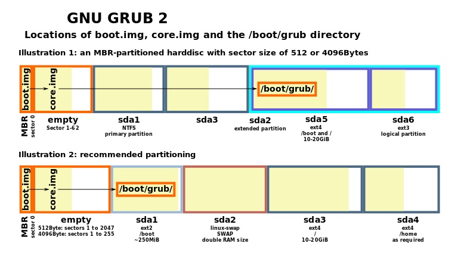
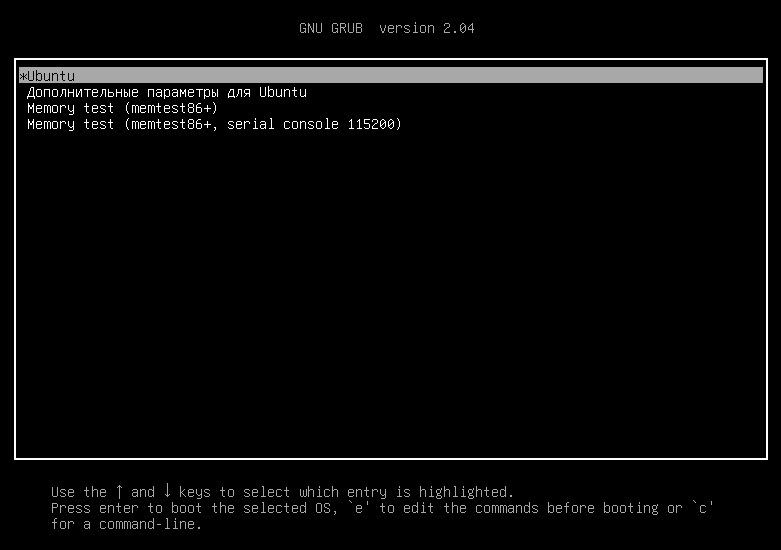

title: Linux bases

# Linux базовые понятия

## 1. Последовательность запуска системы.

Литература

- [1. Losst ПРОЦЕСС ЗАГРУЗКИ LINUX](https://losst.ru/protsess-zagruzki-linux)
- [2. Последовательность загрузки Linux](http://www.quizful.net/post/linux-boot-sequence)
- [3. Как Linux работает с отдельным разделом / boot?](https://qastack.ru/unix/111237/how-does-linux-deal-with-a-separate-boot-partition)
- [4. Общее представление о initrd (Initial RAM disk)](http://www.opennet.ru/base/sys/initrd_intro.txt.html)
- [5. GRUB (GRand Unified Bootloader)](https://ru.bmstu.wiki/GRUB_(GRand_Unified_Bootloader))
- [6. The Story Behind ‘init’ and ‘systemd’](https://www.tecmint.com/systemd-replaces-init-in-linux/)
- [7. https://www.thegeekstuff.com/2011/02/linux-boot-process/](https://www.thegeekstuff.com/2011/02/linux-boot-process/)

Статей на эту тему много попробую разложить эту тему для себя по "полочкам"...

Итак...

Последовательность загрузки Linux:
```bash
"1 этап: Включение компьютера"
"2 этап: Загрузчик"
"3 этап: Ядро"
"4 этап: Запуск сервисов"
```

### 1 этап: Включение компьютера
```bash

При запуске компьютера управаление передается BIOS
"BIOS"  (Basic Input-Output System) - по сути первоначальная стадия загрузки компьютера.
Для нас интересен факт того, что в BIOS происходит выбор устройства, 
с которого производится дальнейшая загрузка системы.

Далее BIOS обращается к загрузочному устройству (чаще всего) HDD, на котором обращается на MBR.
"MBR" - (Master Boot Record) - первый сектор загружаемого устройства хранения данных. 
И загружает и исполняет загрузчик операционной системы (boot loader), 
находящийся в MBR, передавая ему управление.
```

### 2 этап: Загрузчик
```bash
сейчас загрузчиком системы Linux является "GRUB2" (GRand Unified Bootloader).
Вот про него тут и пойдет речь...

Как правило загрузчик сам по себе сложен и не вмещается целиком в MBR, 
п.э. в MBR находится загрузчик "stage1" (boot.img), который загружает 
программу второго этапа загрузки "stage2".

В некоторых случаях "stage1" загрузчика GRUB производит загрузку stage1.5, 
код которого находится в первых тридцати килобайтах устройства хранения данных 
следующих сразу за MBR, и уже stage1.5 производит загрузку stage2(boot.img).
```



```bash
boot.img - имеет точный размер 446 байт и записывается в MBR (сектор 0). 
core.img - записывается в пустые сектора между MBR и первым разделом, если он доступен. 
Каталог /boot/grub - может находиться в отдельном разделе или в корневом разделе.

Когда stage2 получает управление, на экран выводится 
(псевдо)графическое меню для выбора пользователем ОС для загрузки. 
```



```bash
Как только параметры загрузки были выбраны, GRUB загружает выбранное ядро 
в память и передаёт управление ядру, которое уже само продолжает загрузку системы.
```

### 3 этап: Ядро
```bash
Ядро лежит в папке /boot под названием vmlinuz. «vm» в начале говорит о том, 
что ядро будет размещено в виртуальной памяти. 

Запускается ядро, которое запускает initrd  (Initial RAM disk).
initrd - это начальный RAM диск для загрузки Linux, который содержит минимальный 
"джентельменский" набор драйверов, который необходим уже для полноценной загрузки ОС.
initrd представляет собой сжатый tar файл, который распаковывается в RAM 
и монтируется ядром как первоначальная корневая система.
С него загружаются необходимые драйвера, например контроллера или RAID контроллера, 
сетевых карт и пр. драйверов, без которых невозможна дальнейшая загрузка системы.

В Linux Kernel HOWTO (руководстве о сборке ядра) пишут, что initrd призван решить проблему 
"курицы и яйца" для модульного ядра: для монтирования файловой системы необходим 
модуль для работы с диском и файловой системой, а для чтения модуля необходима файловая система, 
с которой этот модуль читается...

После загрузки минимального набора необходимых драйверов образ initrd 
размонтируется и освобождается из памяти. 
После чего ядро, имея необхолдимые загруженные драйвера монтирует 
уже настоящую корневую файловую систему.
После этого ядро запускает процесс init (его pid в системе всегда равен "1") 
и передает ему управление.
init - по сути является системой инициализации и управления сервисами(службами).
```

### 4 этап: Запуск сервисов

!!! warning "Важно"
			По сути дальнейшее управление передается процессу /sbin/init,
			но систем инициализации как минимум больше чем две...
			Как быть? Решается это просто: файл init меняется, 
			на символическую ссылку /sbin/init -> /lib/systemd/systemd
			и в дальнейшем в качестве системы инициализации уже работает
			systemd.

Рассмотрим системы инициализации и управления сервисами(службами)

#### "System V" vs "Systemd"

Литература

- [Losst СИСТЕМЫ ИНИЦИАЛИЗАЦИИ LINUX](https://losst.ru/sistemy-initsializatsii-linux)
- [Википендия systemd](https://ru.wikipedia.org/wiki/Systemd)
- [wiki Debian Systemd](https://wiki.debian.org/ru/Systemd)
- [wiki ArchLinux systemd](https://wiki.archlinux.org/title/Systemd_(%D0%A0%D1%83%D1%81%D1%81%D0%BA%D0%B8%D0%B9))

##### System V

```bash
"System V", она же SysV, она же init.d - init

Основные возможности SysV:
- Написание файлов запуска служб на bash;
- Последовательный запуск служб;
- Сортировка порядка запуска с помощью номеров в именах файлов;
- Команды для запуска, остановки и проверки состояния служб.
- Никакой параллельной загрузки, системы зависимостей, 
  запуска по требованию и автоматического запуска здесь не было и в помине.

Уровни запуска (runlevel)
Linux системах существует семь возможных значений для уровня запуска от 0 до 6 включительно:

0 Останов системы
1 Однопользовательский режим
2 Определяется пользователем, как правило это многопользовательский режим 
  без поддержки сети и графической оболочки
3 Многопользовательский режим без графической оболочки
4 Определяется пользователем, как правило, не используется
5 Многопользовательский режим с графической оболочкой
6 Перезагрузка 

Основываясь на текущем уровне запуска, init запускает скрипты находящиеся в поддиректориях 
/etc/rc.d/, для каждого уровня запуска существует своя поддиректория, 
от /etc/rc.d/rc0.d до /etc/rc.d/rc6.d.

Run level 0 – /etc/rc.d/rc0.d/
Run level 1 – /etc/rc.d/rc1.d/
Run level 2 – /etc/rc.d/rc2.d/
Run level 3 – /etc/rc.d/rc3.d/
Run level 4 – /etc/rc.d/rc4.d/
Run level 5 – /etc/rc.d/rc5.d/
Run level 6 – /etc/rc.d/rc6.d/


Внутри /etc/rc.d/rc*.d/ директорий, можно увидеть программы начинающиеся на "S" и "K".
Программы начинающиеся на "S" стартуют во время загрузки уровня.
Программы начинающиеся на "K" отключаются при выходе из уровня.
Последовательность загрузки и останова происходят последовательно согласно номерам, 
следующим за "S" и "K".

В действительности же запуск скриптов каждого уровня запуска выполняется скриптом /etc/rc,
который вызывается на каждом уровне запуска с параметром равным текущему уровню. 
Вызов же /etc/rc параметром прописан в /etc/inittab, для каждого из возможных уровней запуска.

Уровень запуска по умолчанию определяется записью в /etc/inittab:
  id:3:initdefault:

Означает уровень запуска /etc/rc.d/rc3.d
``` 

<details><summary>Пример директории /etc/rc.d/rc3.d</summary>
<p>

```bash
ls -la /etc/rc.d/rc3.d
total 320
drwxr-xr-x  2 root root 4096 Apr  4  2017 .
drwxr-xr-x 10 root root 4096 Feb  3  2017 ..
lrwxrwxrwx  1 root root   17 Dec 10  2009 K01dnsmasq -> ../init.d/dnsmasq
lrwxrwxrwx  1 root root   24 Dec 10  2009 K02avahi-dnsconfd -> ../init.d/avahi-dnsconfd
lrwxrwxrwx  1 root root   24 Dec 10  2009 K02NetworkManager -> ../init.d/NetworkManager
lrwxrwxrwx  1 root root   17 Dec 10  2009 K02oddjobd -> ../init.d/oddjobd
lrwxrwxrwx  1 root root   16 Dec 10  2009 K05conman -> ../init.d/conman
lrwxrwxrwx  1 root root   14 Dec 10  2009 K05innd -> ../init.d/innd
lrwxrwxrwx  1 root root   19 Dec 10  2009 K10dc_server -> ../init.d/dc_server
lrwxrwxrwx  1 root root   16 Dec 10  2009 K10psacct -> ../init.d/psacct
lrwxrwxrwx  1 root root   14 Dec 10  2009 K10tcsd -> ../init.d/tcsd
lrwxrwxrwx  1 root root   19 Dec 10  2009 K12dc_client -> ../init.d/dc_client
lrwxrwxrwx  1 root root   22 Sep 26  2014 K14zabbix-agent -> ../init.d/zabbix-agent
lrwxrwxrwx  1 root root   15 Dec 11  2009 K15pptpd -> ../init.d/pptpd
lrwxrwxrwx  1 root root   18 Feb  6  2017 K15svnserve -> ../init.d/svnserve
lrwxrwxrwx  1 root root   13 Dec 10  2009 K20nfs -> ../init.d/nfs
lrwxrwxrwx  1 root root   15 Dec 10  2009 K20rwhod -> ../init.d/rwhod
lrwxrwxrwx  1 root root   14 Dec 10  2009 K24irda -> ../init.d/irda
lrwxrwxrwx  1 root root   17 Sep 16  2014 K30postfix -> ../init.d/postfix
lrwxrwxrwx  1 root root   17 Jun 25  2012 K30proftpd -> ../init.d/proftpd
lrwxrwxrwx  1 root root   18 Dec 10  2009 K30sendmail -> ../init.d/sendmail
lrwxrwxrwx  1 root root   21 Sep 16  2014 K35cyrus-imapd -> ../init.d/cyrus-imapd
lrwxrwxrwx  1 root root   15 Jan 16  2017 K35dhcpd -> ../init.d/dhcpd
lrwxrwxrwx  1 root root   18 Oct 22  2015 K35dhcrelay -> ../init.d/dhcrelay
lrwxrwxrwx  1 root root   13 Dec 10  2009 K35smb -> ../init.d/smb
lrwxrwxrwx  1 root root   17 Dec 10  2009 K35winbind -> ../init.d/winbind
lrwxrwxrwx  1 root root   16 Dec 10  2009 K50ibmasm -> ../init.d/ibmasm
lrwxrwxrwx  1 root root   20 Dec 10  2009 K50netconsole -> ../init.d/netconsole
lrwxrwxrwx  1 root root   15 Dec 10  2009 K50snmpd -> ../init.d/snmpd
lrwxrwxrwx  1 root root   19 Dec 10  2009 K50snmptrapd -> ../init.d/snmptrapd
lrwxrwxrwx  1 root root   13 Dec 10  2009 K50tux -> ../init.d/tux
lrwxrwxrwx  1 root root   16 Dec 10  2009 K50vsftpd -> ../init.d/vsftpd
lrwxrwxrwx  1 root root   20 Dec 10  2009 K69rpcsvcgssd -> ../init.d/rpcsvcgssd
lrwxrwxrwx  1 root root   16 Dec 10  2009 K73ypbind -> ../init.d/ypbind
lrwxrwxrwx  1 root root   14 Apr  4  2017 K74ipmi -> ../init.d/ipmi
lrwxrwxrwx  1 root root   14 Dec 10  2009 K74nscd -> ../init.d/nscd
lrwxrwxrwx  1 root root   15 Dec 10  2009 K85mdmpd -> ../init.d/mdmpd
lrwxrwxrwx  1 root root   20 Dec 10  2009 K87multipathd -> ../init.d/multipathd
lrwxrwxrwx  1 root root   15 Dec 10  2009 K87named -> ../init.d/named
lrwxrwxrwx  1 root root   24 Dec 10  2009 K88wpa_supplicant -> ../init.d/wpa_supplicant
lrwxrwxrwx  1 root root   14 Dec 10  2009 K89dund -> ../init.d/dund
lrwxrwxrwx  1 root root   18 Dec 10  2009 K89netplugd -> ../init.d/netplugd
lrwxrwxrwx  1 root root   14 Dec 10  2009 K89pand -> ../init.d/pand
lrwxrwxrwx  1 root root   15 Dec 10  2009 K89rdisc -> ../init.d/rdisc
lrwxrwxrwx  1 root root   19 Dec 10  2009 K90bluetooth -> ../init.d/bluetooth
lrwxrwxrwx  1 root root   19 Dec 10  2009 K92ip6tables -> ../init.d/ip6tables
lrwxrwxrwx  1 root root   25 Dec 10  2009 K99readahead_later -> ../init.d/readahead_later
lrwxrwxrwx  1 root root   23 Dec 10  2009 S00microcode_ctl -> ../init.d/microcode_ctl
lrwxrwxrwx  1 root root   22 Dec 10  2009 S02lvm2-monitor -> ../init.d/lvm2-monitor
lrwxrwxrwx  1 root root   25 Dec 10  2009 S04readahead_early -> ../init.d/readahead_early
lrwxrwxrwx  1 root root   15 Dec 10  2009 S05kudzu -> ../init.d/kudzu
lrwxrwxrwx  1 root root   18 Dec 10  2009 S06cpuspeed -> ../init.d/cpuspeed
lrwxrwxrwx  1 root root   18 Mar 16  2015 S08iptables -> ../init.d/iptables
lrwxrwxrwx  1 root root   18 Dec 10  2009 S08mcstrans -> ../init.d/mcstrans
lrwxrwxrwx  1 root root   17 Feb  3  2017 S10network -> ../init.d/network
lrwxrwxrwx  1 root root   16 Dec 10  2009 S11auditd -> ../init.d/auditd
lrwxrwxrwx  1 root root   21 Dec 10  2009 S12restorecond -> ../init.d/restorecond
lrwxrwxrwx  1 root root   16 Dec 10  2009 S12syslog -> ../init.d/syslog
lrwxrwxrwx  1 root root   20 Dec 10  2009 S13irqbalance -> ../init.d/irqbalance
lrwxrwxrwx  1 root root   17 Dec 10  2009 S13portmap -> ../init.d/portmap
lrwxrwxrwx  1 root root   17 Dec 10  2009 S14nfslock -> ../init.d/nfslock
lrwxrwxrwx  1 root root   19 Dec 10  2009 S15mdmonitor -> ../init.d/mdmonitor
lrwxrwxrwx  1 root root   19 Dec 10  2009 S18rpcidmapd -> ../init.d/rpcidmapd
lrwxrwxrwx  1 root root   17 Dec 10  2009 S19rpcgssd -> ../init.d/rpcgssd
lrwxrwxrwx  1 root root   20 Dec 10  2009 S22messagebus -> ../init.d/messagebus
lrwxrwxrwx  1 root root   15 Feb  3  2017 S25netfs -> ../init.d/netfs
lrwxrwxrwx  1 root root   15 Dec 10  2009 S25pcscd -> ../init.d/pcscd
lrwxrwxrwx  1 root root   15 Dec 10  2009 S26acpid -> ../init.d/acpid
lrwxrwxrwx  1 root root   14 Dec 10  2009 S26apmd -> ../init.d/apmd
lrwxrwxrwx  1 root root   19 Dec 10  2009 S26haldaemon -> ../init.d/haldaemon
lrwxrwxrwx  1 root root   14 Dec 10  2009 S26hidd -> ../init.d/hidd
lrwxrwxrwx  1 root root   20 Dec 10  2009 S26lm_sensors -> ../init.d/lm_sensors
lrwxrwxrwx  1 root root   16 Dec 10  2009 S28autofs -> ../init.d/autofs
lrwxrwxrwx  1 root root   14 Dec 10  2009 S55sshd -> ../init.d/sshd
lrwxrwxrwx  1 root root   14 Dec 10  2009 S56cups -> ../init.d/cups
lrwxrwxrwx  1 root root   20 Dec 10  2009 S56rawdevices -> ../init.d/rawdevices
lrwxrwxrwx  1 root root   16 Dec 10  2009 S56xinetd -> ../init.d/xinetd
lrwxrwxrwx  1 root root   14 Sep 16  2014 S58ntpd -> ../init.d/ntpd
lrwxrwxrwx  1 root root   16 Dec 10  2009 S64mysqld -> ../init.d/mysqld
lrwxrwxrwx  1 root root   20 Mar  4  2015 S65stargazerd -> ../init.d/stargazerd
lrwxrwxrwx  1 root root   27 Feb  1  2017 S66stg_auth_watchdog -> ../init.d/stg_auth_watchdog
lrwxrwxrwx  1 root root   14 Feb  7  2017 S85atop -> ../init.d/atop
lrwxrwxrwx  1 root root   13 Dec 10  2009 S85gpm -> ../init.d/gpm
lrwxrwxrwx  1 root root   15 Dec 10  2009 S85httpd -> ../init.d/httpd
lrwxrwxrwx  1 root root   23 Sep 26  2014 S85zabbix-server -> ../init.d/zabbix-server
lrwxrwxrwx  1 root root   17 Dec 10  2009 S88radiusd -> ../init.d/radiusd
lrwxrwxrwx  1 root root   15 Dec 10  2009 S90crond -> ../init.d/crond
lrwxrwxrwx  1 root root   15 Apr  4  2017 S90squid -> ../init.d/squid
lrwxrwxrwx  1 root root   13 Dec 10  2009 S90xfs -> ../init.d/xfs
lrwxrwxrwx  1 root root   17 Dec 10  2009 S95anacron -> ../init.d/anacron
lrwxrwxrwx  1 root root   13 Dec 10  2009 S95atd -> ../init.d/atd
lrwxrwxrwx  1 root root   19 Dec 10  2009 S95saslauthd -> ../init.d/saslauthd
lrwxrwxrwx  1 root root   22 Dec 10  2009 S97yum-updatesd -> ../init.d/yum-updatesd
lrwxrwxrwx  1 root root   22 Dec 10  2009 S98avahi-daemon -> ../init.d/avahi-daemon
lrwxrwxrwx  1 root root   19 Dec 10  2009 S99firstboot -> ../init.d/firstboot
lrwxrwxrwx  1 root root   11 Feb  3  2017 S99local -> ../rc.local
lrwxrwxrwx  1 root root   16 Dec 10  2009 S99smartd -> ../init.d/smartd
```
</p>
</details>

```bash
Основний инструмент для работы с сервисами в "System V" 
это программа "service"

Синтаксис "service" такой:

"service <servicename> <action>"

где,
<servicename> - название сервиса
<action> - действия (start, stop, restart, reload и пр...)

Пример использования:
"service httpd restart" - перезапускает сервис httpd (apache2)
```

##### Systemd

```bash


"Systemd" (System Management Daemon) - это новая система инициализации Linux. 
Она была введена по умолчанию в Fedora 15, а сейчас используется почти 
во всех популярных Linux дистрибутивах. 
Это не только инициализирующий процесс, поддерживающий огромное количество возможностей, 
но и набор инструментов для управления службами и этими возможностями из системы. 
Основная цель - иметь полный контроль над всеми процессами во время их запуска 
и на протяжении всего выполнения.

Systemd очень сильно отличается от всех существующих систем инициализации, 
тем как она работает с сервисами, и даже конфигурационными файлами сервисов. 
Совместимости со скриптами SysV нет, их нужно преобразовать в linux systemd unit файлы.

Вот ее основные особенности:
- Понятный, простой и эффективный дизайн;
- Параллельная загрузка служб на основе зависимостей;
- Поддерживается завершение дополнительных процессов;
- Поддерживается собственный журнал с помощью journald;
- Поддерживается планирование заданий с помощью таймеров Systemd;
- Поддерживается управление сетью с помощью networkd;
- Для управления DNS используется systemd-resolved;
- Хранение журналов в бинарных файлах;
- Сохранение состояния сервисов linux systemd для возможного восстановления;
- Улучшенная интеграция с Gnome;
- Запуск сервисов по требованию;

Архитектура:
Подсистема оперирует специально оформленными файлами конфигурации — модулями (unit). 
Каждый модуль отвечает за отдельно взятую службу, точку монтирования, подключаемое устройство, 
файл подкачки, виртуальную машину и тому подобные ресурсы. 
Существуют специальные типы модулей, которые не несут функциональной нагрузки, 
но позволяют задействовать дополнительные возможности systemd, 
к ним относятся модули типа target, slice, automount и ряд других. 

systemd поддерживает следующие типы модулей:
".target"— позволяет группировать модули, воплощая концепцию уровней запуска;
".service" — отвечает за запуск сервисов (служб), 
          также поддерживает вызов интерпретаторов для исполнения пользовательских скриптов;
".mount" — отвечает за монтирование файловых систем;
".automount" — позволяет отложить монтирование файловых систем до фактического обращения к точке монтирования;
".swap" — отвечает за подключение файла или устройства подкачки;
".timer" — позволяет запускать модули по расписанию;
".socket" — предоставляет службам поддержку механизма сокет-активации;
".slice" — отвечает за создание контейнера cgroups;
".device" — позволяет реагировать на подключение устройств;
".path" — управляет иерархией файловой системы.

По сравнению с традиционной системой инициализации в стиле System V, 
systemd даёт преимущества в следующем:

- контроль состояния службы, реакция на изменения состояния;
- сокет-активные и шина-активные службы, которые иногда приводят 
  к лучшему распараллеливанию взаимозависимых служб;
- использование "cgroups" для отслеживания служебных процессов, 
  вместо идентификаторов процессов (PID), это означает, 
  что демоны не будут потеряны даже после разветвления в другие процессы.

Помимо простого запуска и контроля служб, systemd предлагает некоторые другие удобные функции, 
для использования которых ранее системным администраторам 
приходилось прибегать к помощи дополнительных программ-демонов. 
Среди таких функций:

- сокет-активация служб (заменяет inetd);
- запуск сервисов по расписанию (заменяет cron)[12];
- работа с аппаратным сторожевым таймером (заменяет watchdog);
- смена корня (заменяет chroot);
- автомонтирование томов и сетевых ресурсов (заменяет mount и fstab);
- journalctl — служба журналирования;
- systemd-analyze — анализ скорости запуска служб;
- systemd-boot — UEFI загрузчик(замена grub).
```

```bash
Основний инструмент для работы с сервисами в "Systemd" 
это программа "systemctl"

Синтаксис "systemctl" такой:

"systemctl <action> <servicename>"

где,
<action> - действия (start, stop, restart, reload, enable, disable)
<servicename> - название сервиса

Пример использования:
"systemctl restart httpd" - перезапускает сервис httpd (apache2)
```

!!!warning "Информация"
			Как правило "system V" поддерживается в новых системах 
			наряду с "systemd", но является "depreceted".


Для работы systemd в системе для процесса init прописана символическая ссылка на systemd.
```bash
ls -la /sbin/init
lrwxrwxrwx 1 root root 20 Mar 18 15:59 /sbin/init -> /lib/systemd/systemd
```

## 2. Сигналы POSIX

- [Citforum Программирование для Linux", журнал Linux Format](http://citforum.ru/programming/unix/signals/)

Сигналы в Linux - это одно средство взаимодействия между процессами.
Главное отличие от других средств взаимодействия между процессами заключается в том, что их обработка программой происходит сразу же после их поступления.
Сигнал прерывает нормальный порядок выполнения инструкций в программе и передает управление специальной функции – обработчику сигнала.

Сигналы:
```bash
"SIGHUP (номер 1)" изначально был предназначен для того, 
чтобы информировать программу о потере связи с управляющим терминалом 
(терминалы часто подключались к системе с помощью модемов, так что название сигнала происходит от hung up – повесить трубку). 
Сигнал SIGHUP посылается приложению так же и в том случае, если процесс-лидер сессии завершил свою работу. 
Многие программы-демоны, у которых нет лидера сессии, так же обрабатывают этот сигнал. 
В ответ на получение SIGHUP демон обычно перезапускается (или просто повторно читает файл конфигурации). 
По умолчанию программа, получившая этот сигнал, завершается.

"SIGINT (номер 2)" обычно посылается процессу, 
если пользователь терминала дал команду прервать процесс (обычно эта команда – сочетание клавиш Ctrl-C) .

"SIGABRT (номер 6)" посылается программе в результате вызова функции abort(3). 
В результате программа завершается с сохранением на диске образа памяти.

"SIGKILL (номер 9)" завершает работу программы. 
Программа не может ни обработать, ни игнорировать этот сигнал.

"SIGSEGV (номер 11)" посылается процессу, который пытается обратиться к не принадлежащей ему области памяти. 
Если обработчик сигнала не установлен, программа завершается с сохранением на диске образа памяти.

"SIGTERM (номер 15)" вызывает «вежливое» завершение программы. 
Получив этот сигнал, программа может выполнить необходимые перед завершением операции (например, высвободить занятые ресурсы). 
Получение SIGTERM свидетельствует не об ошибке в программе, а о желании ОС или пользователя завершить ее.

"SIGCHLD (номер 17)" посылается процессу в том случае, если его дочерний процесс завершился или был приостановлен. 
Родительский процесс также получит этот сигнал, если он установил режим отслеживания сигналов дочернего процесса 
и дочерний процесс получил какой-либо сигнал. 
о умолчанию сигнал SIGCHLD игнорируется.

"SIGCONT (номер 18)" возобновляет выполнение процесса, остановленного сигналом SIGSTOP.

"SIGSTOP (номер 19)" приостанавливает выполнение процесса. 
Как и SIGKILL, этот сигнал не возможно перехватить или игнорировать.

"SIGTSTP (номер 20)" приостанавливает процесс по команде пользователя (обычно эта команда – сочетание клавиш Ctrl-Z).

"SIGIO/SIGPOLL (в Linux обе константы обозначают один сигнал – номер 29)" сообщает процессу, что на одном из дескрипторов, 
открытых асинхронно, появились данные. По умолчанию этот сигнал, как ни странно, завершает работу программы.
```

### Программа для работы с сигналами в Unix
```bash
"kill"
формат

kill -s <signal> pid
kill -<signal> pid
```
- [apache Останов и перезапуск](https://uneex.ru/static/Apache_2.0_Doc/stopping.html)

<details><summary>Пример для httpd</summary>
<p>

```bash
# поиск pid основного процесса https
# номер основного процесса тут 7877 
ps -ef | grep http
apache    4068  7877  0 Aug13 ?        00:00:04 /usr/sbin/httpd
root      7877     1  0 Jul22 ?        00:00:00 /usr/sbin/httpd
apache   12414  7877  0 00:23 ?        00:00:00 /usr/sbin/httpd
root     13183 12296  0 00:24 pts/1    00:00:00 grep http
apache   15995  7877  0 Aug13 ?        00:00:02 /usr/sbin/httpd
apache   19306  7877  0 Aug14 ?        00:00:00 /usr/sbin/httpd
apache   22057  7877  0 Aug13 ?        00:00:03 /usr/sbin/httpd
apache   25024  7877  0 Aug14 ?        00:00:02 /usr/sbin/httpd

# команда -k graceful - посылает сигнал SIGHUP, по которому "мягко перезапускается httpd
apachectl -k graceful

# по факту основной процесс остался 7877, а дочернии все обновились
ps -ef | grep http
root      7877     1  0 Jul22 ?        00:00:00 /usr/sbin/httpd
apache   14236  7877  0 00:25 ?        00:00:00 /usr/sbin/httpd
apache   14237  7877  0 00:25 ?        00:00:00 /usr/sbin/httpd
apache   14238  7877  0 00:25 ?        00:00:00 /usr/sbin/httpd
apache   14239  7877  0 00:25 ?        00:00:00 /usr/sbin/httpd
apache   14240  7877  0 00:25 ?        00:00:00 /usr/sbin/httpd
apache   14241  7877  0 00:25 ?        00:00:00 /usr/sbin/httpd
apache   14265  7877  0 00:25 ?        00:00:00 /usr/sbin/httpd
apache   14266  7877  0 00:25 ?        00:00:00 /usr/sbin/httpd
root     14269 12296  0 00:25 pts/1    00:00:00 grep http

# через команду kill посылает сигнал SIGHUP, по которому "мягко перезапускается httpd
kill -SIGHUP 7877

# по факту основной процесс остался 7877, а дочернии все обновились
ps -ef | grep http
root      7877     1  0 Jul22 ?        00:00:00 /usr/sbin/httpd
apache   14683  7877  0 00:26 ?        00:00:00 /usr/sbin/httpd
apache   14684  7877  0 00:26 ?        00:00:00 /usr/sbin/httpd
apache   14685  7877  0 00:26 ?        00:00:00 /usr/sbin/httpd
apache   14686  7877  0 00:26 ?        00:00:00 /usr/sbin/httpd
apache   14687  7877  0 00:26 ?        00:00:00 /usr/sbin/httpd
apache   14688  7877  0 00:26 ?        00:00:00 /usr/sbin/httpd
apache   14689  7877  0 00:26 ?        00:00:00 /usr/sbin/httpd
apache   14690  7877  0 00:26 ?        00:00:00 /usr/sbin/httpd
root     14741 12296  0 00:26 pts/1    00:00:00 grep http

# через команду kill посылает сигнал SIGHUP, но уже чз цифровой параметр, по которому "мягко перезапускается httpd
kill -1 7877

# по факту основной процесс остался 7877, а дочернии все обновились
ps -ef | grep http
root      7877     1  0 Jul22 ?        00:00:00 /usr/sbin/httpd
apache   15154  7877  0 00:26 ?        00:00:00 /usr/sbin/httpd
apache   15155  7877  0 00:26 ?        00:00:00 /usr/sbin/httpd
apache   15156  7877  0 00:26 ?        00:00:00 /usr/sbin/httpd
apache   15157  7877  0 00:26 ?        00:00:00 /usr/sbin/httpd
apache   15158  7877  0 00:26 ?        00:00:00 /usr/sbin/httpd
apache   15159  7877  0 00:26 ?        00:00:00 /usr/sbin/httpd
apache   15160  7877  0 00:26 ?        00:00:00 /usr/sbin/httpd
apache   15161  7877  0 00:26 ?        00:00:00 /usr/sbin/httpd
root     15195 12296  0 00:26 pts/1    00:00:00 grep http

# через команду kill посылает сигнал SIGTERM, но уже чз цифровой параметр, по которому httpd завершается
kill -15 7877

# как видим нет процесса httpd 
ps -ef | grep http
root     15947 12296  0 00:27 pts/1    00:00:00 grep http

# стартуем сервис httpd заново
service httpd start
Starting httpd:                                            [  OK  ]

# как видим сервис http запустился вместе с дочерними процессами
ps -ef | grep http
root     16845     1  0 00:28 ?        00:00:00 /usr/sbin/httpd
apache   16847 16845  0 00:28 ?        00:00:00 /usr/sbin/httpd
apache   16848 16845  0 00:28 ?        00:00:00 /usr/sbin/httpd
apache   16849 16845  0 00:28 ?        00:00:00 /usr/sbin/httpd
apache   16850 16845  0 00:28 ?        00:00:00 /usr/sbin/httpd
apache   16851 16845  0 00:28 ?        00:00:00 /usr/sbin/httpd
apache   16852 16845  0 00:28 ?        00:00:00 /usr/sbin/httpd
apache   16853 16845  0 00:28 ?        00:00:00 /usr/sbin/httpd
apache   16854 16845  0 00:28 ?        00:00:00 /usr/sbin/httpd
root     16896 12296  0 00:29 pts/1    00:00:00 grep http

```
</p>
</details>


## 3. Файловая система

### 3.1.  Типы файлов

- [Виды файлов в Linux: «всё есть файл»](https://otus.ru/nest/post/1285/)

!!!warning "Важно"
			Один из основных Unix консептов - что "всё есть файл"...

Основываясь на этом универсальном консепте рассмотрю основные виды файлов в Unix.
Преимущество такой концепции заключается в том, что отпадает необходимость в реализации отдельного набора API для каждого устройства, 
в результате чего с ним способны работать все стандартные программы.

```bash
Основные типы файлов Unix:
1. "обыкновенные" (для хранения информации)
2. "специальные" (для туннелей и устройств)
3. "директории"
```

#### 3.1.1 "обыкновенные" (для хранения информации)
```bash
1. "обыкновенные" (для хранения информации):
- "текстовые файлы"
- "файлы изображений, архивов, библиотек"
- "исполняемые"

Обыкновенные файлы в ls начинаются с "-" - в REG-EXP это соответственно "^-" 
Пример обыкновенных файлов:
ls -la /var/log | grep "^-"
-rw-r--r--  1 root root      280 Aug 13 06:25 alternatives.log
-rw-r--r--  1 root root     3771 Aug 12 03:26 alternatives.log.1
-rw-r--r--  1 root root      154 Jul  2 00:01 alternatives.log.2.gz
-rw-r--r--  1 root root     1759 Feb 23 06:56 alternatives.log.3.gz
-rw-r-----  1 root adm    377256 Aug 15 03:17 auth.log
-rw-r-----  1 root adm   5298283 Aug 15 00:00 auth.log.1
-rw-r-----  1 root adm   1501004 Aug  8 00:00 auth.log.2.gz
-rw-r-----  1 root adm   1377849 Aug  1 00:00 auth.log.3.gz
-rw-r-----  1 root adm   1568911 Jul 25 00:00 auth.log.4.gz
---cut---

Пример типа обыкновенного файла.
file /var/log/alternatives.log
/var/log/alternatives.log: ASCII text

Однако для исполняиемых и пр. будет другим: 
file /usr/lib/libdiscover.so.2.0.1
/usr/lib/libdiscover.so.2.0.1: ELF 64-bit LSB shared object, x86-64, version 1 (SYSV),
dynamically linked, BuildID[sha1]=dc4cfc96cd4585890abc0d6014eb40550149a0ee, stripped

```

#### 3.1.2. "специальные" (для туннелей и устройств)

```bash
Файлы этого типа обеспечивают обмен информацией с ядром, 
работу с устройствами либо общение между утилитами. 

С учётом своего назначения они делятся на несколько видов:
```

##### Блочные
```bash
"блочные" - файлы устройств, обеспечивающие буферный доступ к аппаратным компонентам. 
В процессе записи информации на жёсткий диск либо съёмный носитель 
данные не записываются сразу — это нерационально с точки зрения расходования ресурсов. 
Поэтому данные сначала собираются в буфере, для чего и используются блочные файлы. 
Они способны передавать большие блоки информации за один раз, 
и с их помощью файловая система и прочие утилиты получают 
возможность взаимодействовать с драйверами аппаратных устройств. 

Блочные файлы в ls начинаются с "b" - в REG-EXP это соответственно "^b" 
Пример блочных файлов:
ls -la /dev | grep "^b"
brw-rw----  1 root disk    254,   0 Jul 30 10:03 dm-0
brw-rw----  1 root disk    254,   1 Jul 30 10:03 dm-1
brw-rw----  1 root disk      8,   0 Jul 30 10:03 sda
brw-rw----  1 root disk      8,   1 Jul 30 10:03 sda1
brw-rw----  1 root disk      8,   2 Jul 30 10:03 sda2
brw-rw----  1 root disk      8,   5 Jul 30 10:03 sda5
---cut---

Пример типа блочного файла:
file /dev/sda
/dev/sda: block special (8/0)
```

##### Символьные
```bash
"Символьные" - c их помощью обеспечивается небуферизованный доступ к ядру и аппаратным компонентам. 
Это значит, что они могут передавать за раз лишь один символ. В остальном, это те же файлы устройств.

Блочные файлы в ls начинаются с "c" - в REG-EXP это соответственно "^c" 
Пример символьных файлов:
root@icebale-home:/var/run/dbus# ls -la /dev | grep "^c"
crw-r--r--  1 root root     10, 235 Jul 30 10:03 autofs
crw-------  1 root root     10, 234 Jul 30 10:03 btrfs-control
crw-------  1 root root      5,   1 Jul 30 10:03 console
crw-------  1 root root     10,  62 Jul 30 10:03 cpu_dma_latency
crw-------  1 root root     10, 203 Jul 30 10:03 cuse
crw-rw-rw-  1 root root      1,   7 Jul 30 10:03 full
crw-rw-rw-  1 root root     10, 229 Jul 30 10:03 fuse
crw-------  1 root root     10, 228 Jul 30 10:03 hpet
crw-------  1 root root     10, 183 Jul 30 10:03 hwrng
---cut---

Пример типа символьного файла:
file /dev/autofs
/dev/autofs: character special (10/235)
```

##### Символические ссылки
```bash
"Символические ссылки" - указывают на другие файлы по их имени, способны указывать и на обыкновенные файлы, 
и на каталоги, и на другие файловые типы. Обозначаются буквой l (link)

Файлы символических ссылок в ls начинаются с "l" - в REG-EXP это соответственно "^l" 
Пример символических ссылок:
ls -la /dev | grep "^l"
lrwxrwxrwx  1 root root          11 Jul 30 10:03 core -> /proc/kcore
lrwxrwxrwx  1 root root          13 Jul 30 10:03 fd -> /proc/self/fd
lrwxrwxrwx  1 root root          12 Jul 30 10:03 initctl -> /run/initctl
lrwxrwxrwx  1 root root          28 Jul 30 10:03 log -> /run/systemd/journal/dev-log
lrwxrwxrwx  1 root root           4 Jul 30 10:03 rtc -> rtc0
lrwxrwxrwx  1 root root          15 Jul 30 10:03 stderr -> /proc/self/fd/2
lrwxrwxrwx  1 root root          15 Jul 30 10:03 stdin -> /proc/self/fd/0
lrwxrwxrwx  1 root root          15 Jul 30 10:03 stdout -> /proc/self/fd/1

Пример типа файла символических ссылок:
file /dev/core
/dev/core: symbolic link to /proc/kcore
```

##### Туннели/именованные туннели
```bash
"Туннели/именованные туннели" - обеспечивают настройку связи между 2-мя процессами в системе, 
перенаправляя вывод одного на вход другого. 
Туннели именованного типа тоже применяются для связи между 2-мя процессами и функционируют, 
как и обыкновенные туннели.

Файлы туннелей в ls начинаются с "p" - в REG-EXP это соответственно "^p" 
Пример туннеля:
ls -la  | grep "^p"
prw-r--r--  1 root    root       0 Aug 15 04:21 pipe1

Пример типа файла туннеля:
file ./pipe1
./pipe1: fifo (named pipe)
```
##### Сокеты
```bash
"Cокеты" - создают прямую связь между процессами в системе. 
Передают данные между процессами, которые запущены в различных средах либо даже на различных машинах. 
Посредством сокетов программы могут осуществлять обмен информацией даже по сети. 
Работа сокета похожа на работу туннеля, но в обе стороны. 

Файлы сокетов в ls начинаются с "s" - в REG-EXP это соответственно "^s"
Пример сокета:
ls -la /var/run/dbus/ | grep "^s"
srw-rw-rw-  1 root root   0 Jul 30 10:03 system_bus_socket

Пример типа файла сокета:
file /var/run/dbus/system_bus_socket
/var/run/dbus/system_bus_socket: socket
```

#### 3.1.3 Директории

```bash
"Директории" - объединяют файлы (а также другие директории) в группы, чтобы упростить навигацию и поиск. 
В системах Unix файлы организовываются в директории, начиная от корня (/).

Директории, а точнее, "файлы директории" (звучит странно, не правда ли...) 
в ls начинаются с "d" - в REG-EXP это соответственно "^d"

Пример директорий:
ls -la /dev | grep "^d"
drwxr-xr-x 19 root root        3160 Aug 14 00:37 .
drwxr-xr-x 18 root root        4096 Jun 23 03:01 ..
drwxr-xr-x  2 root root         160 Jul 30 10:03 block
drwxr-xr-x  2 root root          60 Jul 30 10:03 bsg
drwxr-xr-x  3 root root          60 Jul 30 10:03 bus
drwxr-xr-x  2 root root        3080 Jul 30 10:03 char
drwxr-xr-x  2 root root          60 Jul 30 10:03 cpu
drwxr-xr-x  6 root root         120 Jul 30 10:03 disk
drwxr-xr-x  3 root root         100 Jul 30 10:03 dri
drwxr-xr-x  2 root root           0 Jul 30 10:03 hugepages
drwxr-xr-x  2 root root          80 Jul 30 10:03 icebale-vg
drwxr-xr-x  3 root root         320 Jul 30 10:03 input
drwxr-xr-x  2 root root         100 Jul 30 10:03 mapper
drwxrwxrwt  2 root root          40 Jul 30 10:03 mqueue
drwxr-xr-x  2 root root          60 Jul 30 10:03 net
drwxr-xr-x  2 root root           0 Jul 30 10:03 pts
drwxrwxrwt  2 root root          40 Jul 30 10:03 shm
drwxr-xr-x  3 root root         380 Jul 30 10:03 snd
drwxr-xr-x  2 root root          60 Jul 30 10:03 vfio

Пример типа файла директория:
file /dev/block
/dev/block: directory
```


### 3.2.Права доступа 
- [Losst ПРАВА ДОСТУПА К ФАЙЛАМ В LINUX](https://losst.ru/prava-dostupa-k-fajlam-v-linux)
- [Про SIUD бит](https://habr.com/ru/company/jetinfosystems/blog/506750/)

#### Основные права доступа к файлам
В Unix системах для файлов и директорий есть права на чтение/запись/выполнение
```bash
Read/Write/eXecute (r/w/x) (4/2/1) 
```

Для файлов и директорий есть понятие: Группа/Пользователь/Прочие
```bash
user/group/other (u/g/o)
```

#### Специальные права доступа (suid, suig, sticky-bit)

```bash
"suid" - если этот бит установлен, то при выполнении программы, id пользователя,
от которого она запущена заменяется на id владельца файла. 
Фактически, это позволяет обычным пользователям запускать программы от имени суперпользователя

"sgid" - этот флаг работает аналогичным образом, только разница в том, 
что пользователь считается членом группы, с которой связан файл, а не групп, 
к которым он действительно принадлежит. Если SGID флаг установлен на каталог, 
все файлы, созданные в нем, будут связаны с группой каталога, а не пользователя.
Такое поведение используется для организации общих папок;

"sticky-bit" - этот бит тоже используется для создания общих папок. 
Если он установлен, то пользователи могут только создавать, читать и выполнять файлы, 
но не могут удалять файлы, принадлежащие другим пользователям.
```

Тогда при выводе "ls -la /usr/bin/su" 
```bash
ls -la /usr/bin/su
-rwsr-xr-x 1 root root 63568 Jan 10  2019 /usr/bin/su
```

```bash
Возможные варианты прав файла/директории
Права состоят из 3 части - пользователь, группа, другие
и в каждой части по три значения,
также впереди перед тремя частями одно значение 
"-" или "l" - означает, что это ссылка на файл 
также в конце может стоять дополнительно знак "+" - 
это означает, что используются расширенные права facl (file access control list)

Возможные варианты наборов для частей:
--- - нет прав, совсем;
--x - разрешено только выполнение файла, как программы но не изменение и не чтение;
-w- - разрешена только запись и изменение файла;
-wx - разрешено изменение и выполнение, но в случае с каталогом, вы не можете посмотреть его содержимое;
r-- - права только на чтение;
r-x - только чтение и выполнение, без права на запись;
rw- - права на чтение и запись, но без выполнения;
rwx - все права;
--s - установлен SUID или SGID бит, первый отображается в поле для владельца, второй для группы;
--t - установлен sticky-bit, а значит пользователи не могут удалить этот файл.

Примеры:
"lrwxrwxrwx" - "l" - означает, что это ссылка на файл 
"-rwsrwxrwx" - "rwx" - вместо любого символа может стоять прочерк - "-", что означает, что такого права нет,
               "s" - здесь означает SUID бит
"-rwtrwxrwx" - "t" - здесь означает sticky-bit
"-rwxrwxrwx+" - знак "+" означает, что используются расширенные права facl (file access control list)
```


Пример файлов с suid битом. Те же программы su и sudo его используют.
```bash
ls -la /usr/bin/su
-rwsr-xr-x 1 root root 63568 Jan 10  2019 /usr/bin/su

ls -la /usr/bin/sudo
-rwsr-xr-x 1 root root 157192 Jan 20  2021 /usr/bin/sudo
```

#### Команды для работы с правами

##### Назначить права  - chmod
```bash
chmod
Права записываются в виде цифр
(r/w/x) (4/2/1) 
read    - 4
write   - 2
execute - 1

#Означает назначить права rwx(user) rwx(group) rwx(other) для файла FILE_NAME
chmod 777 FILE_NAME

#Как правило "стандартный" файл имеет права 644
#Означает назначить права rw(user) r(group) r(other) для файла FILE_NAME
chmod 644 FILE_NAME
```
###### Сменить пользователя/группу

```bash
# для файла MY_FILE назначить нового пользователя и новую группу
chown NEW_USER:NEW_GROUP ./MY_FILE

# для директории и файлов в ней рекурсивно назначить нового пользователя и новую группу
chown -R NEW_USER:NEW_GROUP ./MY_DIR
```

<details><summary>Пример для директории test</summary>
<p>

```bash
ls -la | grep test
drwxr-xr-x 2 root    root    4096 Aug 14 06:50 test

ls -la ./test
total 16
drwxr-xr-x 2 root    root    4096 Aug 14 06:50 .
drwxr-xr-x 8 manowar manowar 4096 Aug 14 06:50 ..
-rw-r--r-- 1 root    root       1 Aug 14 06:50 1
-rw-r--r-- 1 root    root       1 Aug 14 06:50 2

chown -R manowar:manowar ./test

ls -la | grep test
drwxr-xr-x 2 manowar manowar 4096 Aug 14 06:50 test

ls -la ./test
total 16
drwxr-xr-x 2 manowar manowar 4096 Aug 14 06:50 .
drwxr-xr-x 8 manowar manowar 4096 Aug 14 06:50 ..
-rw-r--r-- 1 manowar manowar    1 Aug 14 06:50 1
-rw-r--r-- 1 manowar manowar    1 Aug 14 06:50 2
```
</p>
</details>

### 3.2. Расширенные права facl

Можно задавать расширенный набор прав: назначать права для конкретных пользователей и групп.
```bash
setfacl - установить права
getfacl - посмотреть права
```

<details><summary>Пример использования facl</summary>
<p>

```bash

[root@server ftp]# mkdir uploads

[root@server ftp]# ls -la
итого 44
drwxr-xr-x   6 ftp  ftp  4096 Янв 26 15:51 .
drwxr-xr-x  20 root root 4096 Янв 22 14:00 ..
drwxrwxrwx+  7 ftp  ftp  4096 Янв 25 10:01 incoming
drwxr-xr-x   2 root root 4096 Янв 22 15:35 private
drwxr-xr-x   2 ftp  ftp  4096 Янв 22 13:23 pub
drwxr-xr-x   2 root root 4096 Янв 26 15:51 uploads

[root@server ftp]# setfacl -m default:user::rwx -m default:group::rx -m default:other::rx  uploads

[root@server ftp]# ls -la
итого 44
drwxr-xr-x   6 ftp  ftp  4096 Янв 26 15:51 .
drwxr-xr-x  20 root root 4096 Янв 22 14:00 ..
drwxrwxrwx+  7 ftp  ftp  4096 Янв 25 10:01 incoming
drwxr-xr-x   2 root root 4096 Янв 22 15:35 private
drwxr-xr-x   2 ftp  ftp  4096 Янв 22 13:23 pub
drwxr-xr-x+  2 root root 4096 Янв 26 15:51 uploads

[root@server ftp]# getfacl uploads
# file: uploads
# owner: root
# group: root
user::rwx
group::r-x
other::r-x
default:user::rwx
default:group::r-x
default:other::r-x

[root@server ftp]# chmod 777 uploads
[root@server ftp]# getfacl uploads
# file: uploads
# owner: root
# group: root
user::rwx
group::rwx
other::rwx
default:user::rwx
default:group::r-x
default:other::r-x

[root@server ftp]# setfacl -m default:group:advanced-users:rwx uploads
[root@server ftp]# setfacl -m default:group:adm-group:rwx uploads
[root@server ftp]# getfacl uploads
# file: uploads
# owner: root
# group: root
user::rwx
group::rwx
other::rwx
default:user::rwx
default:group::r-x
default:group:adm-group:rwx
default:group:advanced-users:rwx
default:mask::rwx
default:other::r-x

[root@server ftp]#
[root@server ftp]# cd uploads/
[root@isp8 uploads]# ls -la
итого 20
drwxrwxrwx+ 3 root  root  4096 Янв 26 16:01 .
drwxr-xr-x  6 ftp   ftp   4096 Янв 26 15:51 ..
drwxrwxr-x+ 4 fedia users 4096 Янв 26 16:01 fedia
[root@isp8 uploads]# getfacl fedia/
# file: fedia
# owner: fedia
# group: users
user::rwx
group::r-x
group:adm-group:rwx
group:advanced-users:rwx
mask::rwx
other::r-x
default:user::rwx
default:group::r-x
default:group:adm-group:rwx
default:group:advanced-users:rwx
default:mask::rwx
default:other::r-x
```
</p>
</details>

!!!warning "Важно"
			Расширенные права перекрывают набор стандартных прав.


## 4. Потоки ввода/вывода

- [Википедия - Стандартные потоки](https://ru.wikipedia.org/wiki/%D0%A1%D1%82%D0%B0%D0%BD%D0%B4%D0%B0%D1%80%D1%82%D0%BD%D1%8B%D0%B5_%D0%BF%D0%BE%D1%82%D0%BE%D0%BA%D0%B8)
- [Перенаправление ввода вывода в Linux](https://community.vscale.io/hc/ru/community/posts/115000171385-%D0%9F%D0%B5%D1%80%D0%B5%D0%BD%D0%B0%D0%BF%D1%80%D0%B0%D0%B2%D0%BB%D0%B5%D0%BD%D0%B8%D0%B5-%D0%B2%D0%B2%D0%BE%D0%B4%D0%B0-%D0%B2%D1%8B%D0%B2%D0%BE%D0%B4%D0%B0-%D0%B2-Linux)

Стандартные потоки ввода-вывода в системах типа UNIX — потоки процесса, имеющие номер (дескриптор), зарезервированный для выполнения некоторых «стандартных» функций. Как правило, эти дескрипторы открыты уже в момент запуска исполняемого файла.

### Стандартный ввод - stdin
```bash
"stdin" - имеет дескриптор номер "0", 
предназначен для чтения команд пользователя или входных данных.
```
Можно перенаправлять данные в этот поток с помощью символа "<".

### Стандартный вывод - stdout
```bash
"stdout" - имеет дескриптор номер "1", предназначен для вывода данных, 
как правило (хотя и не обязательно) текстовых.
```
Можно перенаправлять данные из этого потока с помощью символа ">".

### Стандартный вывод ошибок - stderr
```bash
"stderr" - имеет дескриптор номер "2", предназначен для вывода 
диагностических и отладочных сообщений в текстовом виде.
```
Можно перенаправлять данные из этого потока с помощью символа "2>".

### Перенаправление потоков  " > < >> << | "

#### Примеры работы с потоками
```bash
---------------------------------------

В "stdin" можно перенаправлять данные с помощью символа "<".

#перенаправить в ввод программы test.sh содержимого файла /var/log/messages
test.sh < /var/log/messages

---------------------------------------

Из "stdout" можно перенаправлять данные с помощью символа ">".

#перенаправить вывод ошибок в /dev/null, таким образом не отображать их.
test.sh 2> /dev/null

#перенаправить stdout в /dev/null и перенаправить stderr в место, куда указывает stdout
#таким образом stdout и stderr  отпавляются в /dev/null
test.sh > /dev/null 2>&1

---------------------------------------

"|" -"pipe", "труба" - возможность перенаправления "stdout" одной программы в "stdin" другой программы

# поиск в содержимом файла /var/log/messages вхождения слова "error"
# или другими словами, что происходит с точки зрения потоков
# Вывести содержимое файла /var/log/messages и перенаправить вывод программы cat на ввод программы grep
cat /var/log/messages | grep error
--------------------------

">> <<" - перенаправление без затирания уже существующего там, а просто добваление туда
```

типы файлов: pipe,socket

## 5. Вход с систему, ограничения доступа

На примере Debian

### 5.1. Настройка ssh

#### Ограничение входа под root по ssh

С версии OpenSSH 7.0 поменялись дефолтовые параметры входа для пользователя root по ssh.

Теперь по дефолту стоит "PermitRootLogin prohibit-password".
Что означает, что удалённый вход под пользователем root с парольной и интерактивной аутентификацией теперь запрещён.

Для разрешения входа под root по ssh необходимо исправить строку в конфиге /etc/ssh/sshd_config и перезагрузить сервис.
```bash
	PermitRootLogin yes
```
#### Настройка входа по ключу под root-ом

- [LOSST Авторизация по ключу ssh](https://losst.ru/avtorizatsiya-po-klyuchu-ssh)

Для входа под root-ом по ключу ssh необходимо добавить  публичный ключ пользователя
в директорию /root/.ssh/authorized_keys 

Изначально директории /root/.ssh нет, п.э. её надо создать

```bash
cd /root
mkdir ./ssh
echo 'PUBLIC_USER_KEY' > /root/.ssh/authorized_keys
```
P.S. Чтобы пользоваться входом по ключу со стороны клиента ssh надо указать свой приватный ключ для этого соединения.

#### Настройка входа по ключу под обычной учеткой
Для входа под учеткой USERNAME по ключу ssh необходимо добавить свой публичный ключ 
в директорию пользователя /home/USERNAME/.ssh/authorized_keys.

```bash
cd /home/USERNAME
mkdir ./ssh
echo 'PUBLIC_USER_KEY' > /home/USERNAME/.ssh/authorized_keys
```
P.S. Чтобы пользоваться входом по ключу со стороны клиента ssh надо указать свой приватный ключ для этого соединения.

### 5.2. Повышение привелегий через su sudo

#### su

"su" - Позволяет заходить обыкновенному пользователю под "superuser" - пользователем root, 
введя соответственно его пароль

Алгоритм работы при использовании su:
```bash
1. Авторизуемся под своей учетной записью
2. Авторизуемся через программу su под root пользователем.
```

#### sudo 

Развернутая статья по su и sudo на [хабре](https://habr.com/ru/post/44783/)

"sudo" - Программа позволяющая более тонко настраивать права доступа по сравнению с командой "su"
Теперь администратор может указывать список разрешенных команд для каждого пользователя (или группы пользователей), файлы, доступные для редактирования, специальные переменные окружения и многое другое (все это великолепие управляется из /etc/sudoers, см. man sudoers от своего дистрибутива). При запуске sudo спрашивает у пользователя его собственный пароль, а не пароль root.

для упрощения доступа и если нет необходимости в введении доп. пароля при получении прав root
в файле /etc/sudoers
```bash
# Allow members of group sudo to execute any command
%sudo ALL=(ALL:ALL) NOPASSWD:ALL
```
Преимущество изначального входа под учеткой пользователя заключается в его логировании при входе под своей учеткой.

В большинстве случаев в файле sudoers настроено так, что утилиту могут использовать все пользователи из группы wheel или sudo. Поэтому достаточно добавить нашего пользователя в эту группу. Для этого используйте команду usermod.

[ОШИБКА USER IS NOT IN THE SUDOERS FILE В UBUNTU](https://losst.ru/oshibka-user-is-not-in-the-sudoers-file-v-ubuntu)

!!!warning	"Важный момент"
			В большинстве случаев в файле sudoers настроено так, 
			что утилиту могут использовать все пользователи из группы wheel или sudo. 
			Поэтому достаточно добавить нашего пользователя в эту группу. 
			Для этого используйте команду usermod.
			Без данной команды не будет работать доступ к sudo!
			"usermod -a -G sudo <username>" 


```bash
"sudo su -" vs "sudo -i"

"sudo su -" - полностью выполняется логин от имени root, наследует окружение root-а.

"su -" - команда загружает окружение именно root пользователя.

"sudo -i" -  логин эмулируется - не наследуется окружение пользователя root.

P.S. "su" и "sudo -i" - не загружают окружение пользователя root
```

#### Ограничение входа - вход только по ключу
Для разрешения входа под root по ssh необходимо исправить строку в конфиге /etc/ssh/sshd_config и перезагрузить сервис.

```bash
	PermitRootLogin no
```
P.S. как было описано выше с версии OpenSSH 7.0 дефолтовые параметры входа для пользователя root по ssh
"PermitRootLogin prohibit-password"  - При указании prohibit-password допускается только аутентификация по ключам или через GSSAPI.

При параметре "PermitRootLogin no" даже при наличии ключа для учетки root нельзя будет под ним авторизоваться.
root будет доступен только с физической или KVM консоли.

При этом при попытки входа по ключу под учеткой root будет выдано сообщение:
```bash
login as: root
Authenticating with public key "test-rsa-key"
Passphrase for key "test-rsa-key":
Server refused public-key signature despite accepting key!
```

## 6. Файерволл

iptables

[КАК СОХРАНИТЬ ПРАВИЛА IPTABLES](https://losst.ru/kak-sohranit-pravila-iptables#%D0%9A%D0%B0%D0%BA_%D1%81%D0%BE%D1%85%D1%80%D0%B0%D0%BD%D0%B8%D1%82%D1%8C_%D0%BF%D1%80%D0%B0%D0%B2%D0%B8%D0%BB%D0%B0_iptables)

### iptables-persistent

Описание 
boot-time loader for netfilter rules, iptables plugin

Установить:
```bash
apt-get install iptables-persistent
```

/etc/iptables/rules.v4 для набора правил протокола IPv4;
/etc/iptables/rules.v6 для набора правил протокола IPv6.

Как видно из файлов пакета iptables-persistent - это плагин, по сути набор скриптов к netfilter, который запускается автоматически при старте netfilter.

```bash
dpkg -L iptables-persistent
/.
/etc
/etc/iptables
/usr
/usr/share
/usr/share/doc
/usr/share/doc/iptables-persistent
/usr/share/doc/iptables-persistent/README
/usr/share/doc/iptables-persistent/changelog.gz
/usr/share/doc/iptables-persistent/copyright
/usr/share/netfilter-persistent
/usr/share/netfilter-persistent/plugins.d
/usr/share/netfilter-persistent/plugins.d/15-ip4tables
/usr/share/netfilter-persistent/plugins.d/25-ip6tables
```

### firewalld

## 7. Базовый набор команд

Базовый набор команд смотрите [здесь](https://icebale.readthedocs.io/en/latest/linux/commands/)

## 8. Программы для работы с репозитарием пакетов 

На примере Debian

- [LOSST APT VS APT-GET](https://losst.ru/apt-vs-apt-get-v-chem-raznitsa)
- [wiki.debian.org apt](https://wiki.debian.org/ru/Apt)
- [Базовые команды apt-get и apt-cache](https://www.kobzarev.com/linux/apt-get-and-apt-cache/)


### apt vs apt-get & apt-cache


```bash
"apt (advanced packet tools)" - менеджер управления пакетов в Debian.

"apt" - пришел на замену пакетов "apt-get" и "apt-cache" и объединил в себе функционал их обоих.
apt решает проблемы с зависимостями, получает запрошенные пакеты (из репозитория) 
и работает с "dpkg", другой утилитой, которая непосредственно устанавливает и удаляет пакеты в ОС. 

Основные команды apt:
"list" - список пакетов;
"search" - поиск пакетов по имени;
"show" - показать подробную информацию о пакете;
"update" - обновить списки доступных пакетов;
"install" - установить пакет;
"remove" - удалить пакет;
"upgrade" - установить доступные новые версии пакетов;
"full-upgrade" - полное обновление системы;
"edit-sources" - редактировать файл источников программного обеспечения.
```

```bash
"apt-get" - [deprecated] - программа для выполнения установки новых пакетов с ПО, 
удаления существующих, обновления установленных, а также для обновления всей операционной системы.

Основные команды apt-get:
"update" - обновить списки доступных пакетов;
"install" - установить пакет;
"remove" - удалить пакет;
"upgrade" - установить доступные новые версии пакетов;
```

```bash
"apt-cache" - [deprecated] - используется для поиска в кеше программных пакетов apt. 
Этот инструмент, используется для поиска пакетов, сбора информации о пакетах и поиска пакетов, 
доступных для установки.

Основные команды apt-cache:
"search" - поиск пакетов по имени;
"show" - показать подробную информацию о пакете;
```
### dpkg

```bash
"dpkg" - (Debian PacKaGe ) - арривиатуринг "LVL 70"! :)

"dpkg"- это программа используется для установки, удаления, и получения информации о .deb пакетах,
является "низкоуровневой" программ по отношению к "apt", "apt-get", "apt-cache", 
которая непосредственно устанавливает и удаляет пакеты. 

Примеры использования программы "dpkg"
"dpkg -i имя_пакета.deb" - устанока пакета с <именем имя_пакета.deb>
"dpkg -l [маска]" - вывод списка установленных пакетов.
"dpkg -r имя_пакета" - удалить пакет с имеменем <имя_пакета>
```