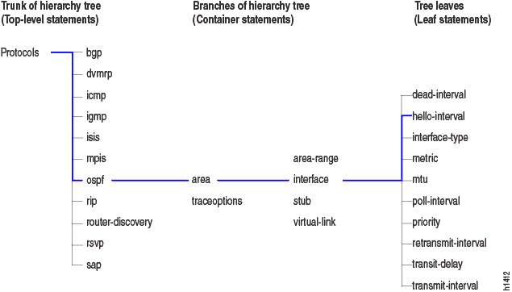

title: JunOS

# Конфигурация JunOS

## Базовая

!!! note "Заметка"
	При входе на устройство вы можете попасть в консоль FreeBSD. Чтобы перейти в консоль JunOS, введите `cli`

### Переход в режим конфигурирования

Изначально при попадании на устройство Juniper вы оказываетесь в **Operational** режиме. Чтобы начать конфигурировать ваше устройство Juniper, нужно перейти в режим конфигурирования. Делается это вводом команды `configure` в Operational режиме.

При переходе из режима в режим ваше приветствие сменится, благодаря этому вы и можете понимать, в каком режиме находитесь:

```bash
user@host> configure 
Entering configuration mode

[edit]
user@host# 
```

Также возможно выполнение **команд Operational** режима **в режиме Configuration**. Делается это таким образом:

```bash
[edit]
user@host# run operational-mode-command
```

### Полезные комбинации клавиш

| Комбинация                                  | Действие                                                     |
| :------------------------------------------ | :----------------------------------------------------------- |
| Ctrl+b                                      | Move the cursor back one character.                          |
| **Esc+b or Alt+b**                          | **Move the cursor back one word.**                           |
| Ctrl+f                                      | Move the cursor forward one character.                       |
| **Esc+f or Alt+f**                          | **Move the cursor forward one word.**                        |
| **Ctrl+a**                                  | **Move the cursor to the beginning of the command line.**    |
| **Ctrl+e**                                  | **Move the cursor to the end of the command line.**          |
| Ctrl+h, Delete, or Backspace                | Delete the character before the cursor.                      |
| Ctrl+d                                      | Delete the character at the cursor.                          |
| Ctrl+k                                      | Delete the all characters from the cursor to the end of the command line. |
| Ctrl+u or Ctrl+x                            | Delete the all characters from the command line.             |
| **Ctrl+w, Esc+Backspace, or Alt+Backspace** | **Delete the word before the cursor.**                       |
| **Esc+d or Alt+d**                          | **Delete the word after the cursor.**                        |
| Ctrl+y                                      | Insert the most recently deleted text at the cursor.         |
| Ctrl+l                                      | Redraw the current line.                                     |
| Ctrl+p                                      | Scroll backward through the list of recently executed commands. |
| Ctrl+n                                      | Scroll forward through the list of recently executed commands. |
| Ctrl+r                                      | Search the CLI history incrementally in reverse order for lines matching the search string. |
| Esc+/ or Alt+/                              | Search the CLI history for words for which the current word is a prefix. |
| Esc+. or Alt+                               | Scroll backward through the list of recently entered words in a command line. |
| Esc+number sequence or Alt+number sequence  | Specify the number of times to execute a keyboard sequence.  |

## Управление конфигурацией

Конфигурация JunOS разделена на множество контекстов, которые связаны между собой иерархически.

Пример иерархии в этих контекстах:



### Перемещение между контекстами

Несколько команд, выполняющиеся из под режима **configure**, позволяющие перемещаться между контекстами:

| Command                  | Description                                                  |
| :----------------------- | :----------------------------------------------------------- |
| `edit {hierarchy-level}` | Редактировать конфигурацию в определённом контексте. Пример: `edit protocols ospf area 0` |
| `exit`                   | Перемещает в прошлый контекст, в котором вы работали         |
| `up`                     | Перемещает на один уровень выше в иерархии. Пример: работали в `edit protocols ospf area 0`, переместились в `edit protocols ospf` |
| `top`                    | Перемещает на самый верх иерархии (`edit`)                   |

### Просмотр конфигурации

Подробная дока от Juniper [здесь](https://www.juniper.net/documentation/en_US/junos/topics/topic-map/junos-configuartion-viewing.html)

Просмотр конфигурации всегда выполняется командой `show`, которую в зависимости от её атрибутов можно использовать по-разному:

* `show configuration` - просмотр конфигурации в Operational режиме

* `show` - просмотр конфигурации в Configuration режиме. Показывает только конфигурацию того уровня иерархии, который в данный момент конфигурируется

* `show | compare`  - просмотр изменений между применённой в данный момент конфигурацией и candidate конфигурацией

* `show | compare rollback 2` - просмотр изменений между rollback конфигурацией и candidate конфигурацией

* `show | compare | display {json|xml}` - просмотр изменений в json/xml формате

* `show | display {json|xml}` - просмотр конфигурации в json/xml формате

* `show | display set` - просмотр конфигурации в виде setов, идущих от корня иерархии

	```bash
	[edit system syslog]
	root# show | display set    
	set system syslog user * any emergency
	set system syslog file messages any notice
	set system syslog file messages authorization info
	set system syslog file interactive-commands interactive-commands any
	```

* `show | display set relative` - просмотр конфигурации в виде setов с учётом текущего уровня иерархии

	```bash
	[edit system syslog]
	root# show | display set relative 
	set user * any emergency
	set file messages any notice
	set file messages authorization info
	set file interactive-commands interactive-commands any
	```

### Commit конфигурации

Подробная дока от Juniper [здесь](https://www.juniper.net/documentation/en_US/junos/topics/topic-map/junos-configuration-commit.html)

Commit candidate конфигурации выполняется с помощью команды `commit`, очевидно. Некоторые атрибуты этой команды:

* `commit` - просто commit конфигурации

* `commit and-quit` - commit конфигурации и выход в режим operational

* `commit check` - текущая candidate конфигурация проверяется и при нахождении ошибок выводится сообщение *commit check-out failed*.

* `commit confirmed <timeout>` - commit конфигурации и откат через timeout, если не было получено дополнительное подтверждение commitа. Подтвеждение делается вводом команды `commit` еще раз, пока не истёк timeout

* `commit at <date|time>` - commit конфигурации в определённый момент времени:

	* `hh:mm[:ss]` (часы, минуты и опционально секунды) - commit в определённое время текущего дня. Указанное время должно наступить в будущем, но до 23:59:59 текущего дня.
	* `yyyy-mm-dd hh:mm[:ss]` (год, месяц, дата, часы, минуты и опционально секунды) - commit в определённый день и время. Указанная дата и время должны наступить в будущем.

		!!! warning "Внимание"
			Не забывайте, что установленное время сравнивается с локальным временем на устройстве, а не с временем на вашей рабочей машине

* `commit comment <comment>` - добавление комментария к commitу для лучшего понимания изменений в этом коммите

#### commit prepare/activate

Также с версии 17.3R1 возможно разделить процесс commitа на две стадии:

1. `commit prepare` - на этой стадии candidate конфиг проверяется и генерируется новая база данных с необходимыми файлами (т.е. этот конфиг "подгружается в систему"). В случае обнаружения ошибок в конфиге, выводится сообщение *commit check-out failed*.
2. `commit activate` - на этой стадии подготовленный на прошлой стадии конфиг активируется.

!!! note "Заметка"
	Существует возможность очистить текущий prepared конфиг - `clear system commit prepared`

#### Очистка candidate конфигурации

Очистку candidate конфигурации можно произвести с помощью команды `rollback 0`. По факту - совершается rollback конфигурации до текущей применённой конфигурации.

### Rollback конфигурации

Rollback (откат) конфигурации выполняется, очевидно, командой `rollback`:

* `rollback <0-49>` - откат до одной из предыдущих конфигураций. Посмотреть изменения при rollbackе можно командой `show | compare rollback <0-49>`

### Подгрузка конфигурации


## Комментарии

Дока от Juniper [здесь](https://www.juniper.net/documentation/en_US/junos/topics/reference/command-summary/annotate.html)

В JunOS есть возможность добавлять комментарии (аннотации к разным контекстам). Чтобы добавить комментарий, необходимо

```bash
annotate <context> <comment string>
```

Т.е., если находясь в `edit system login` написать `annotate user admin COMMENT`, то конфигурация данного контекста будет выглядеть так:

```bash
login {
    /* keker */
    user admin {
        uid 2000;
        class super-user;
        authentication {
            encrypted-password "$SECRET-DATA"; ## SECRET-DATA
        }
    }
}
```

## Пользователи и AAA

### Добавление пользователей

```bash
root# edit system login user admin    
	
[edit system login user admin]
```

2. Устанавливаем класс пользователя

   ```bash
   root# set class {operator|read-only|super-user|unauthorized}
   Possible completions:
     <class>              Login class
     operator             permissions [ clear network reset trace view ]
     read-only            permissions [ view ]
     super-user           permissions [ all ]
     unauthorized         permissions [ none ]
   ```

3. Устанавливаем пароль на пользователя

   ```bash
   # Если нужно ввести пароль в plain-text
   root# set authentication plain-text-password
   
   # Если вводится уже зашифрованная строка:
   root# set authentication encrypted-password "$6$ENCRYPTED"
   ```

   

```bash
root# edit system login user admin    
[edit system login user admin]


```

