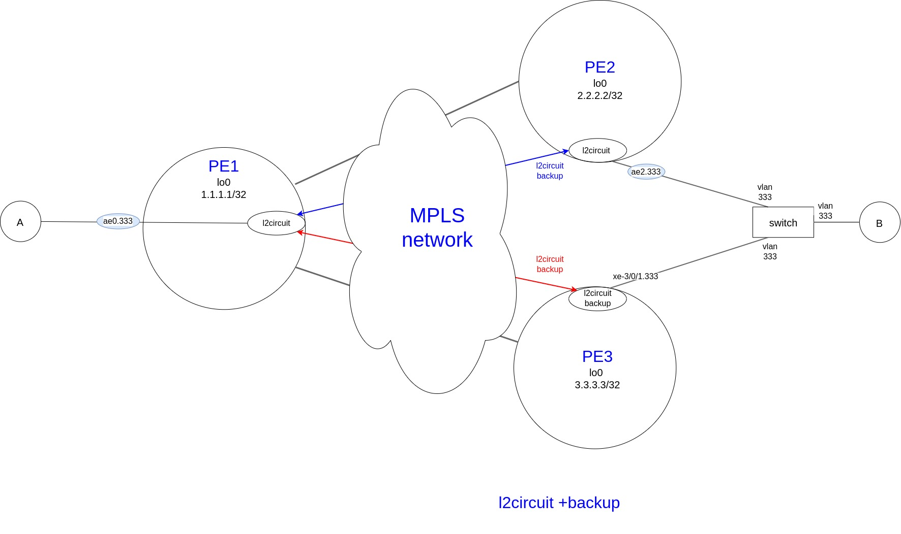
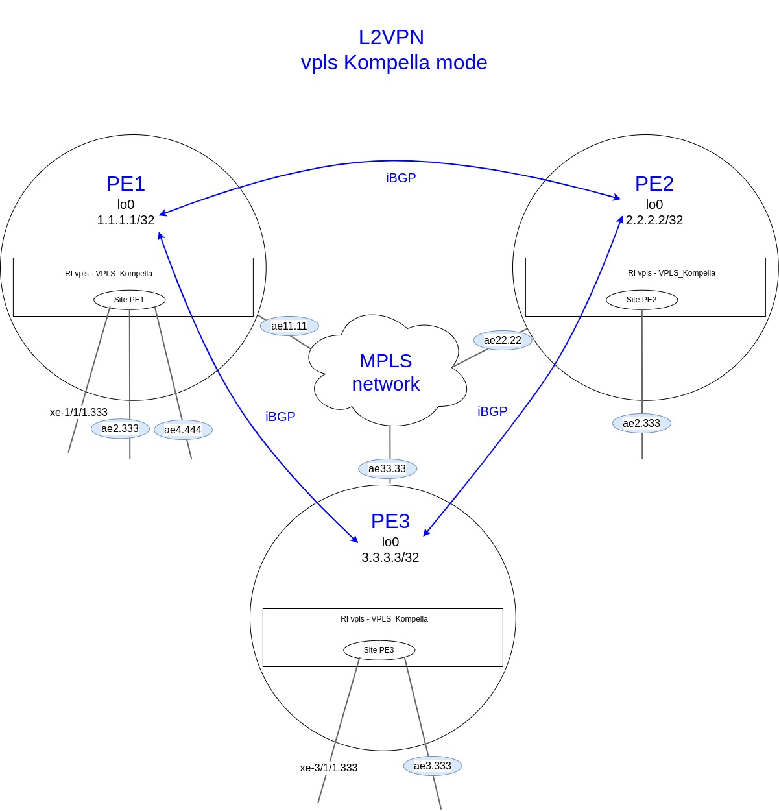

title: MX cases

# Кейсы по MX80/MX480/MX960

## Настройка LAG

```bash
"Создание интерфейса ethernet aggregate (ae0)"

set interfaces ae0 description "L2 LAG-60G"
set interfaces ae0 flexible-vlan-tagging
set interfaces ae0 mtu 9192
set interfaces ae0 encapsulation flexible-ethernet-services
set interfaces ae0 aggregated-ether-options link-speed 10g
set interfaces ae0 aggregated-ether-options lacp active
```

```bash
"Настройка физических интерфейсов, входящих в LAG ae0"

set interfaces xe-2/0/0 description "ae0 member"
set interfaces xe-2/0/0 gigether-options 802.3ad ae0

set interfaces xe-2/0/1 description "ae0 member"
set interfaces xe-2/0/1 gigether-options 802.3ad ae0

set interfaces xe-2/1/0 description "ae0 member"
set interfaces xe-2/1/0 gigether-options 802.3ad ae0

set interfaces xe-2/1/1 description "ae0 member"
set interfaces xe-2/1/1 gigether-options 802.3ad ae0

set interfaces xe-3/1/0 description "ae0 member"
set interfaces xe-3/1/0 gigether-options 802.3ad ae0

set interfaces xe-3/1/1 description "ae0 member"
set interfaces xe-3/1/1 gigether-options 802.3ad ae0
```

```bash
"Диагностика"

"show lacp interfaces ae0"
Aggregated interface: ae0
    LACP state:       Role   Exp   Def  Dist  Col  Syn  Aggr  Timeout  Activity
      xe-2/1/0       Actor    No    No   Yes  Yes  Yes   Yes     Fast    Active
      xe-2/1/0     Partner    No    No   Yes  Yes  Yes   Yes     Fast    Active
      xe-2/1/1       Actor    No    No   Yes  Yes  Yes   Yes     Fast    Active
      xe-2/1/1     Partner    No    No   Yes  Yes  Yes   Yes     Fast    Active
      xe-2/0/0       Actor    No    No   Yes  Yes  Yes   Yes     Fast    Active
      xe-2/0/0     Partner    No    No   Yes  Yes  Yes   Yes     Fast    Active
      xe-2/0/1       Actor    No    No   Yes  Yes  Yes   Yes     Fast    Active
      xe-2/0/1     Partner    No    No   Yes  Yes  Yes   Yes     Fast    Active
      xe-3/1/0       Actor    No    No   Yes  Yes  Yes   Yes     Fast    Active
      xe-3/1/0     Partner    No    No   Yes  Yes  Yes   Yes     Fast    Active
      xe-3/1/1       Actor    No    No   Yes  Yes  Yes   Yes     Fast    Active
      xe-3/1/1     Partner    No    No   Yes  Yes  Yes   Yes     Fast    Active

    LACP protocol:        Receive State  Transmit State          Mux State 
      xe-2/1/0                  Current   Fast periodic Collecting distributing
      xe-2/1/1                  Current   Fast periodic Collecting distributing
      xe-2/0/0                  Current   Fast periodic Collecting distributing
      xe-2/0/1                  Current   Fast periodic Collecting distributing
      xe-3/1/0                  Current   Fast periodic Collecting distributing
      xe-3/1/1                  Current   Fast periodic Collecting distributing
```


## policer 
policer vs shared-bandwidth-policer

!!!warning "Важно"
          При применении полисера на агрегированный интерфейс, 
          в котором находятся интерфейсы с разных PFE полисер работает не правильно.
          По сути стандартный полисер ограничивает полосу только для потров одного PFE, 
          если например порты находятся в 2х разных PFE, то полоса будет удваиваться.
          Описание проблемы:
          https://kb.juniper.net/InfoCenter/index?page=content&id=KB31589&cat=VMX&actp=LIST

  
```bash
  "Терминология Juniper (JNCIA-Junos Study Guide):"
  - RE -  Route Engine - Control Plane
  - PFE - Packet Forward Engine - Data Plane

  
  "Пример LAGа = 4x10G = 40G"

  В данном примере используется 2 разных FPC (по 2 интерфейса в каждом) - соответственно, 
  если использовать стандартный policer например с rate 10Mbps, 
  то по факту полоса будет составлять 20Mbps
  Для того, чтобы ограничение по полосе работало корректно 
  нужно использовать shared-bandwidth-policer

  "show lacp interfaces ae0"              
    Aggregated interface: ae0
        LACP state:       Role   Exp   Def  Dist  Col  Syn  Aggr  Timeout  Activity
          xe-1/1/0       Actor    No    No   Yes  Yes  Yes   Yes     Fast   Passive
          xe-1/1/0     Partner    No    No   Yes  Yes  Yes   Yes     Fast    Active
          xe-1/1/1       Actor    No    No   Yes  Yes  Yes   Yes     Fast   Passive
          xe-1/1/1     Partner    No    No   Yes  Yes  Yes   Yes     Fast    Active
          xe-2/1/0       Actor    No    No   Yes  Yes  Yes   Yes     Fast   Passive
          xe-2/1/0     Partner    No    No   Yes  Yes  Yes   Yes     Fast    Active
          xe-2/1/1       Actor    No    No   Yes  Yes  Yes   Yes     Fast   Passive
          xe-2/1/1     Partner    No    No   Yes  Yes  Yes   Yes     Fast    Active
        LACP protocol:        Receive State  Transmit State          Mux State 
          xe-1/1/0                  Current   Fast periodic Collecting distributing
          xe-1/1/1                  Current   Fast periodic Collecting distributing
          xe-2/1/0                  Current   Fast periodic Collecting distributing
          xe-2/1/1                  Current   Fast periodic Collecting distributing

    "show chassis hardware"                 
      Hardware inventory:
      ---cut---
      FPC 1            
        CPU            
        PIC 0                   BUILTIN      BUILTIN           4x 10GE(LAN) SFP+          
          Xcvr 0               
          Xcvr 1               
          Xcvr 2       
          Xcvr 3       
        PIC 1                   BUILTIN      BUILTIN           4x 10GE(LAN) SFP+          
          Xcvr 0       
          Xcvr 1       
          Xcvr 2       
          Xcvr 3       
        PIC 2                   BUILTIN      BUILTIN           4x 10GE(LAN) SFP+          
          Xcvr 0       
          Xcvr 1       
          Xcvr 2       
          Xcvr 3       
        PIC 3                   BUILTIN      BUILTIN           4x 10GE(LAN) SFP+
          Xcvr 0       
          Xcvr 1       
          Xcvr 2       
          Xcvr 3       
      FPC 2                                                    
        CPU           
        PIC 0                   BUILTIN      BUILTIN           4x 10GE(LAN) SFP+
          Xcvr 0      
          Xcvr 1      
          Xcvr 2      
        PIC 1                   BUILTIN      BUILTIN           4x 10GE(LAN) SFP+         
          Xcvr 0      
          Xcvr 1      
          Xcvr 2      
          Xcvr 3      
        PIC 2                   BUILTIN      BUILTIN           4x 10GE(LAN) SFP+         
          Xcvr 0      
          Xcvr 1      
          Xcvr 2      
          Xcvr 3      
        PIC 3                   BUILTIN      BUILTIN           4x 10GE(LAN) SFP+
          Xcvr 0       
          Xcvr 1                
          Xcvr 2                
          Xcvr 3                
      ---cut---  
```

```bash
"Для корректной работы взависимости от типа интерфейса,"
"используются разные типы полисеров" 

"полисер по скорости для физического интерфейса"
set firewall policer 150Mbit if-exceeding bandwidth-limit 150m
set firewall policer 150Mbit if-exceeding burst-size-limit 14400000
set firewall policer 150Mbit then discard

"полисер по скорости для LAG интерфейса"
set firewall policer 150Mbit_shared shared-bandwidth-policer
set firewall policer 150Mbit_shared if-exceeding bandwidth-limit 150m
set firewall policer 150Mbit_shared if-exceeding burst-size-limit 14400000
set firewall policer 150Mbit_shared then discard      
```

## MPLS

### L2VPN
#### local-l2circuit
Настройка local-switch l2circuit

Для организации L2 связности между двумя интерфейсами на маршрутизаторах MX используется 

так называемый "local-switch l2circuit", по смыслу функционала аналог bridge-domain-a


```bash
"Пример настройки local-switch l2circuit между сабинтерфейсами xe-1/1/1.333 и ae2.333"

set interfaces xe-1/1/1 unit 333 description "L2VPN; local-switch l2circuit"
set interfaces xe-1/1/1 unit 333 encapsulation vlan-ccc
set interfaces xe-1/1/1 unit 333 vlan-id 333
set interfaces xe-1/1/1 unit 333 family ccc policer input 150Mbit

set interfaces ae2 unit 333 description "L2VPN; local-switch l2circuit"
set interfaces ae2 unit 333 encapsulation vlan-ccc
set interfaces ae2 unit 333 vlan-id 333
set interfaces ae2 unit 333 family ccc policer input 150Mbit_shared

"Для связки двух интерфейсов используется конструкция,"
"в которой указывается начальный и конечный интерфейс локольного l2circuit"
set protocols l2circuit local-switching interface xe-1/1/1.333 end-interface interface ae2.333

set protocols l2circuit local-switching interface xe-1/1/1.333 description "L2VPN; local-switch l2circuit"
set protocols l2circuit local-switching interface xe-1/1/1.333 ignore-mtu-mismatch

"полисер по скорости для физического интерфейса"
set firewall policer 150Mbit if-exceeding bandwidth-limit 150m
set firewall policer 150Mbit if-exceeding burst-size-limit 14400000
set firewall policer 150Mbit then discard

"полисер по скорости для LAG интерфейса"
set firewall policer 150Mbit_shared shared-bandwidth-policer
set firewall policer 150Mbit_shared if-exceeding bandwidth-limit 150m
set firewall policer 150Mbit_shared if-exceeding burst-size-limit 14400000
set firewall policer 150Mbit_shared then discard
```

#### l2circuit
"Настройка l2circuit"

Для организации L2 связности между двумя интерфейсами на двух маршрутизаторах l2circuit


```bash
"Пример настройки l2circuit между [PE1 xe-1/1/1.333] и [PE2 xe-2/1/1.333"]

"PE1"
set interfaces xe-1/1/1 unit 333 description "L2VPN l2circuit"
set interfaces xe-1/1/1 unit 333 encapsulation vlan-ccc
set interfaces xe-1/1/1 unit 333 vlan-id 333

set protocols l2circuit neighbor 1.1.1.1 interface xe-1/1/1.333 virtual-circuit-id 333
set protocols l2circuit neighbor 1.1.1.1 interface xe-1/1/1.333 mtu 1600

"PE-2"
set interfaces xe-2/1/1 unit 333 description "L2VPN l2circuit"
set interfaces xe-2/1/1 unit 333 encapsulation vlan-ccc
set interfaces xe-2/1/1 unit 333 vlan-id 333

set protocols l2circuit neighbor 2.2.2.2 interface xe-1/1/1.333 virtual-circuit-id 333
set protocols l2circuit neighbor 2.2.2.2 interface xe-1/1/1.333 mtu 1600
```

#### l2circuit + backup
"Схема и настройка l2circuit с возможностью резерва"

Принцип работы такой схемы заключается в том, 

что при падении на одной стороне связности l2circuit перестраивается на backup соседа.  



```bash
"PE-1"
set interfaces ae2 unit 333 description "L2VPN l2circuit+backup"
set interfaces ae2 unit 333 encapsulation vlan-ccc
set interfaces ae2 unit 333 vlan-id 333
set interfaces ae2 unit 333 family ccc policer input 150Mbit_shared
set interfaces ae2 unit 333 family ccc policer output 150Mbit_shared

set protocols l2circuit neighbor 2.2.2.2 interface ae1.333 virtual-circuit-id 333
set protocols l2circuit neighbor 2.2.2.2 interface ae1.333 description "L2VPN l2circuit+backup"
set protocols l2circuit neighbor 2.2.2.2 interface ae1.333 mtu 1500
set protocols l2circuit neighbor 2.2.2.2 interface ae1.333 pseudowire-status-tlv

"Время перестроения обратно на основной канал, если основной канал заработал"
"В данном случае основной кнала это PE1 - PE2"
"[задается в секундах - в данном случае время перестроения на основной канал задано разным - 5 мин]"
set protocols l2circuit neighbor 2.2.2.2 interface ae1.333 revert-time 300

"Задание backup соседа"
set protocols l2circuit neighbor 2.2.2.2 interface ae1.333 backup-neighbor 3.3.3.3 standby

"полисер по скорости для LAG интерфейса"
set firewall policer 150Mbit_shared shared-bandwidth-policer
set firewall policer 150Mbit_shared if-exceeding bandwidth-limit 150m
set firewall policer 150Mbit_shared if-exceeding burst-size-limit 14400000
set firewall policer 150Mbit_shared then discard
```

```bash
"PE-2"
set interfaces ae0 unit 333 description "L2VPN l2circuit+backup"
set interfaces ae0 unit 333 encapsulation vlan-ccc
set interfaces ae0 unit 333 vlan-id 333
set protocols l2circuit neighbor 1.1.1.1 interface ae1.333 virtual-circuit-id 333
set protocols l2circuit neighbor 1.1.1.1 interface ae1.333 description "L2VPN l2circuit+backup"
set protocols l2circuit neighbor 1.1.1.1 interface ae1.333 mtu 1500
set protocols l2circuit neighbor 1.1.1.1 interface ae1.333 pseudowire-status-tlv
```

```bash
"PE-3"
set interfaces xe-3/0/1 unit 333 description "L2VPN l2circuit+backup"
set interfaces xe-3/0/1 unit 333 encapsulation vlan-ccc
set interfaces xe-3/0/1 unit 333 vlan-id 333
set protocols l2circuit neighbor 1.1.1.1 interface xe-3/0/1.333 virtual-circuit-id 333
set protocols l2circuit neighbor 1.1.1.1 interface xe-3/0/1.333 description "L2VPN l2circuit+backup"
set protocols l2circuit neighbor 1.1.1.1 interface xe-3/0/1.333 mtu 1500
set protocols l2circuit neighbor 1.1.1.1 interface xe-3/0/1.333 pseudowire-status-tlv
```

#### vpls Kompella mode

"Схема и настройка vpls Kompella mode на примере 3-х сайтов"

```bash
"Описание схемы и принципа работы."
Имеется 3 сайта присутствия услуги (PE1, PE2, PE3).
В каждый сайт включено несколько интерфейсов.
Все они в конечном счете объединяются в один броадкаст домен. 

На PE1 изначально один из интерфейсов находится в другом влане.
Для того, чтобы была связность между вcеми интерфейсами vpls домена используется нормализация вланов,
"Достигается это за счет:"
"input-vlan-map pop AND output-vlan-map push"
т.е. при выходе с интерфейса тег влана снимается и далее внутри vpls передается без тега,
а при попадании на исходящий интерфейс в кадр добавляется тег нужного влана.
Таким образом, получается L2 связность между всеми интерфейсами, 
даже несмотря на то, что они находятся в различных вланах.

vrf-target target:1111:123 - RT - определяет принадлежность сайтов vpls к одному домену.
```



```bash
"PE-1"

"Настройка интерфейсов, входящих в vpls домен"
set interfaces xe-1/1/1 unit 333 description "VPLS VPLS_Kompella int xe-1/1/1.333"
set interfaces xe-1/1/1 unit 333 encapsulation vlan-vpls
set interfaces xe-1/1/1 unit 333 vlan-id 333
set interfaces xe-1/1/1 unit 333 input-vlan-map pop
set interfaces xe-1/1/1 unit 333 output-vlan-map push
set interfaces xe-1/1/1 unit 333 family vpls policer input 100Mbit

set interfaces ae2 unit 333 description "VPLS Kompella mode int ae2.333"
set interfaces ae2 unit 333 encapsulation vlan-vpls
set interfaces ae2 unit 333 vlan-id 333
set interfaces ae2 unit 333 input-vlan-map pop
set interfaces ae2 unit 333 output-vlan-map push
set interfaces ae2 unit 333 family vpls policer input 200Mbit

"Настройка Route instance типа - instance-type vpls"
set routing-instances VPLS_Kompella description "VPLS Kompella mode"
set routing-instances VPLS_Kompella instance-type vpls

set routing-instances VPLS_Kompella protocols vpls mac-table-size 1024
set routing-instances VPLS_Kompella protocols vpls no-tunnel-services

"Идентификатор сайта - должен быть для участников vpls домена"
set routing-instances VPLS_Kompella protocols vpls site PE1 site-identifier 1

set routing-instances VPLS_Kompella protocols vpls site PE1 interface ae2.333
set routing-instances VPLS_Kompella protocols vpls site PE1 interface xe-1/1/1.333
set routing-instances VPLS_Kompella protocols vpls site PE1 interface ae4.444

"Перечисление интерфейсов, входящих в vpls домен"
set routing-instances VPLS_Kompella interface xe-1/1/1.333
set routing-instances VPLS_Kompella interface ae2.333
set routing-instances VPLS_Kompella interface ae4.3224

"RT (Route Target) - определяет принадлежность в BGP принадлежность к одному vplsd домену"
set routing-instances VPLS_Kompella vrf-target target:1111:123
```

```bash
"PE-2"

"Настройка интерфейсов, входящих в vpls домен"
set interfaces ae2 unit 333 description "VPLS Kompella mode"
set interfaces ae2 unit 333 encapsulation vlan-vpls
set interfaces ae2 unit 333 vlan-id 333
set interfaces ae2 unit 333 input-vlan-map pop
set interfaces ae2 unit 333 output-vlan-map push
set interfaces ae2 unit 333 family vpls policer input 100Mbit

"Настройка Route instance типа - instance-type vpls"
set routing-instances VPLS_Kompella description "VPLS Kompella mode"
set routing-instances VPLS_Kompella instance-type vpls

set routing-instances VPLS_Kompella protocols vpls mac-table-size 1024
set routing-instances VPLS_Kompella protocols vpls no-tunnel-services

"Идентификатор сайта - должен быть для участников vpls домена"
set routing-instances VPLS_Kompella protocols vpls site PE2 site-identifier 2
set routing-instances VPLS_Kompella protocols vpls site PE2 interface ae2.333

"Перечисление интерфейсов, входящих в vpls домен"
set routing-instances VPLS_Kompella interface ae2.333

"RT (Route Target) - определяет принадлежность в BGP принадлежность к одному vplsd домену"
set routing-instances VPLS_Kompella vrf-target target:1111:123
```

```bash
"PE-3"
"Настройка интерфейсов, входящих в vpls домен"
set interfaces xe-3/1/1 unit 333 description "VPLS VPLS_Kompella int xe-3/1/1.333"
set interfaces xe-3/1/1 unit 333 encapsulation vlan-vpls
set interfaces xe-3/1/1 unit 333 vlan-id 333
set interfaces xe-3/1/1 unit 333 input-vlan-map pop
set interfaces xe-3/1/1 unit 333 output-vlan-map push
set interfaces xe-3/1/1 unit 333 family vpls policer input 200Mbit

set interfaces ae3 unit 333 description "VPLS Kompella mode int ae3.333"
set interfaces ae3 unit 333 encapsulation vlan-vpls
set interfaces ae3 unit 333 vlan-id 333
set interfaces ae3 unit 333 input-vlan-map pop
set interfaces ae3 unit 333 output-vlan-map push
set interfaces ae3 unit 333 family vpls policer input 200Mbit

"Настройка Route instance типа - instance-type vpls"
set routing-instances VPLS_Kompella description "VPLS Kompella mode"
set routing-instances VPLS_Kompella instance-type vpls

set routing-instances VPLS_Kompella protocols vpls mac-table-size 1024
set routing-instances VPLS_Kompella protocols vpls no-tunnel-services

"Идентификатор сайта - должен быть для участников vpls домена"
set routing-instances VPLS_Kompella protocols vpls site PE1 site-identifier 3
set routing-instances VPLS_Kompella protocols vpls site PE1 interface xe-3/1/1.333
set routing-instances VPLS_Kompella protocols vpls site PE1 interface ae3.333

"Перечисление интерфейсов, входящих в vpls домен"
set routing-instances VPLS_Kompella interface xe-3/1/1.333
set routing-instances VPLS_Kompella interface ae3.333

"RT (Route Target) - определяет принадлежность в BGP принадлежность к одному vplsd домену"
set routing-instances VPLS_Kompella vrf-target target:1111:123
```

!!!warning "Важно"
          Для нормальной работы, необходимо также предварительно настроить протоколы LDP и/или RSVP-TE
          взависимости от реализуемого дизайна сети, а также протоколы IGP (OSPF или  IS-IS) 
          Также необходимо, чтобы в протоколе bgp была настроена соответствующая "address family"
          в данном случае: "family l2vpn signaling"

```bash
"PE-1"
"Настройка mpls и ldp на интерфейсах, смотрящих в сторонц ядра сети"
set protocols ldp interface ae11.11
set protocols mpls interface ae11.11

"Настройка аddress family в протоколе BGP"
set protocols bgp group Core type internal
set protocols bgp group Core local-address 1.1.1.1
set protocols bgp group Core family l2vpn signaling
"Указание соседей по BGP"
set protocols bgp group Core neighbor 2.2.2.2 description PE-2
set protocols bgp group Core neighbor 3.3.3.3 description PE-3
```

```bash
"PE-2"
"Настройка mpls и ldp на интерфейсах, смотрящих в сторонц ядра сети"
set protocols ldp interface ae22.22
set protocols mpls interface ae22.22

"Настройка аddress family в протоколе BGP"
set protocols bgp group Core type internal
set protocols bgp group Core local-address 2.2.2.2
set protocols bgp group Core family l2vpn signaling
"Указание соседей по BGP"
set protocols bgp group Core neighbor 1.1.1.1 description PE-1
set protocols bgp group Core neighbor 3.3.3.3 description PE-3
```

```bash
"PE-2"
"Настройка mpls и ldp на интерфейсах, смотрящих в сторонц ядра сети"
set protocols ldp interface ae22.22
set protocols mpls interface ae22.22

"Настройка аddress family в протоколе BGP"
set protocols bgp group Core type internal
set protocols bgp group Core local-address 3.3.3.3
set protocols bgp group Core family l2vpn signaling
"Указание соседей по BGP"
set protocols bgp group Core neighbor 1.1.1.1 description PE-1
set protocols bgp group Core neighbor 2.2.2.2 description PE-2
```
#### vpls Kompella mode + mesh group
!!!warning "Важно"
        Если какое то оборудование, которое должно участвовать в vpls Kompella mode, но данный функционал не поддерживает,
        а например умеет только l2curcuit, точнее xconnect - речь идет про модельный ряд оборудования cisco...
        В таком случае используется функционал juniper, так называемые "mesh-group", 
        с помощью которых можно включать l2circuit как интерфейсы в vpls домен, работающий в режиме Kompella mode.
 

 
#### vpls Martini mode


### EVPN


```bash
```