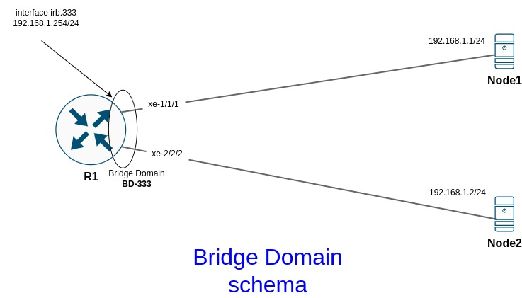
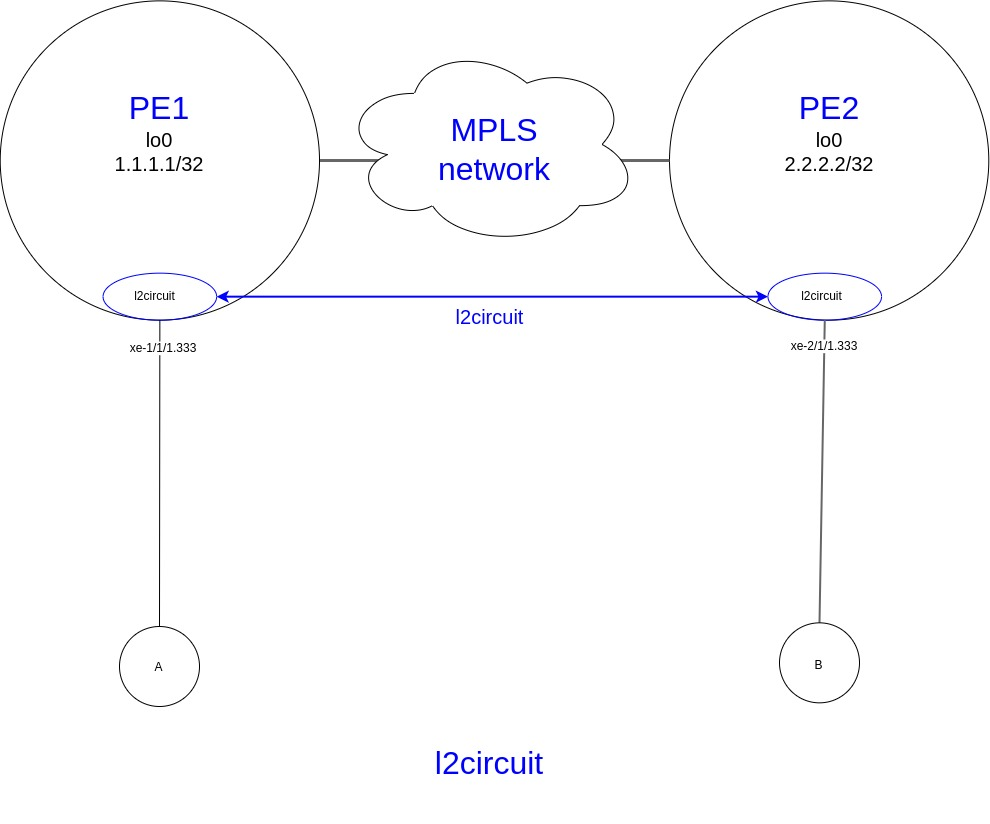

title:  MX cases

# Кейсы по MX80/MX480/MX960

## Настройка LAG

```bash
"Создание интерфейса aggregate ethernet (ae0)"

set interfaces ae0 description "L2 LAG-60G"
set interfaces ae0 flexible-vlan-tagging
set interfaces ae0 mtu 9192
set interfaces ae0 encapsulation flexible-ethernet-services
set interfaces ae0 aggregated-ether-options link-speed 10g
set interfaces ae0 aggregated-ether-options lacp active
```

```bash
"Настройка физических интерфейсов, входящих в LAG ae0"

set interfaces xe-2/0/0 description "ae0 member"
set interfaces xe-2/0/0 gigether-options 802.3ad ae0

set interfaces xe-2/0/1 description "ae0 member"
set interfaces xe-2/0/1 gigether-options 802.3ad ae0

set interfaces xe-2/1/0 description "ae0 member"
set interfaces xe-2/1/0 gigether-options 802.3ad ae0

set interfaces xe-2/1/1 description "ae0 member"
set interfaces xe-2/1/1 gigether-options 802.3ad ae0

set interfaces xe-3/1/0 description "ae0 member"
set interfaces xe-3/1/0 gigether-options 802.3ad ae0

set interfaces xe-3/1/1 description "ae0 member"
set interfaces xe-3/1/1 gigether-options 802.3ad ae0
```

<details><summary>"Диагностика"</summary>
<p>

```bash
"Диагностика"

"show lacp interfaces ae0"
Aggregated interface: ae0
    LACP state:       Role   Exp   Def  Dist  Col  Syn  Aggr  Timeout  Activity
      xe-2/1/0       Actor    No    No   Yes  Yes  Yes   Yes     Fast    Active
      xe-2/1/0     Partner    No    No   Yes  Yes  Yes   Yes     Fast    Active
      xe-2/1/1       Actor    No    No   Yes  Yes  Yes   Yes     Fast    Active
      xe-2/1/1     Partner    No    No   Yes  Yes  Yes   Yes     Fast    Active
      xe-2/0/0       Actor    No    No   Yes  Yes  Yes   Yes     Fast    Active
      xe-2/0/0     Partner    No    No   Yes  Yes  Yes   Yes     Fast    Active
      xe-2/0/1       Actor    No    No   Yes  Yes  Yes   Yes     Fast    Active
      xe-2/0/1     Partner    No    No   Yes  Yes  Yes   Yes     Fast    Active
      xe-3/1/0       Actor    No    No   Yes  Yes  Yes   Yes     Fast    Active
      xe-3/1/0     Partner    No    No   Yes  Yes  Yes   Yes     Fast    Active
      xe-3/1/1       Actor    No    No   Yes  Yes  Yes   Yes     Fast    Active
      xe-3/1/1     Partner    No    No   Yes  Yes  Yes   Yes     Fast    Active

    LACP protocol:        Receive State  Transmit State          Mux State 
      xe-2/1/0                  Current   Fast periodic Collecting distributing
      xe-2/1/1                  Current   Fast periodic Collecting distributing
      xe-2/0/0                  Current   Fast periodic Collecting distributing
      xe-2/0/1                  Current   Fast periodic Collecting distributing
      xe-3/1/0                  Current   Fast periodic Collecting distributing
      xe-3/1/1                  Current   Fast periodic Collecting distributing
```
</p>
</details>


## policer 
policer vs shared-bandwidth-policer

!!!warning "Важно"
          При применении полисера на агрегированный интерфейс, 
          в котором находятся интерфейсы с разных PFE полисер работает не правильно.
          По сути стандартный полисер ограничивает полосу только для потров одного PFE, 
          если например порты находятся в 2х разных PFE, то полоса будет удваиваться.
          Описание проблемы:
          https://kb.juniper.net/InfoCenter/index?page=content&id=KB31589&cat=VMX&actp=LIST


<details><summary>Пример LAGа 4x10G</summary>
<p>

```bash
  "Терминология Juniper (JNCIA-Junos Study Guide):"
  - RE -  Route Engine - Control Plane
  - PFE - Packet Forward Engine - Data Plane

  
  "Пример LAGа = 4x10G = 40G"

  В данном примере используется 2 разных FPC (по 2 интерфейса в каждом) - соответственно, 
  если использовать стандартный policer например с rate 10Mbps, 
  то по факту полоса будет составлять 20Mbps
  Для того, чтобы ограничение по полосе работало корректно 
  нужно использовать shared-bandwidth-policer

  "show lacp interfaces ae0"              
    Aggregated interface: ae0
        LACP state:       Role   Exp   Def  Dist  Col  Syn  Aggr  Timeout  Activity
          xe-1/1/0       Actor    No    No   Yes  Yes  Yes   Yes     Fast   Passive
          xe-1/1/0     Partner    No    No   Yes  Yes  Yes   Yes     Fast    Active
          xe-1/1/1       Actor    No    No   Yes  Yes  Yes   Yes     Fast   Passive
          xe-1/1/1     Partner    No    No   Yes  Yes  Yes   Yes     Fast    Active
          xe-2/1/0       Actor    No    No   Yes  Yes  Yes   Yes     Fast   Passive
          xe-2/1/0     Partner    No    No   Yes  Yes  Yes   Yes     Fast    Active
          xe-2/1/1       Actor    No    No   Yes  Yes  Yes   Yes     Fast   Passive
          xe-2/1/1     Partner    No    No   Yes  Yes  Yes   Yes     Fast    Active
        LACP protocol:        Receive State  Transmit State          Mux State 
          xe-1/1/0                  Current   Fast periodic Collecting distributing
          xe-1/1/1                  Current   Fast periodic Collecting distributing
          xe-2/1/0                  Current   Fast periodic Collecting distributing
          xe-2/1/1                  Current   Fast periodic Collecting distributing

    "show chassis hardware"                 
      Hardware inventory:
      ---cut---
      "FPC 1"            
        CPU            
        "PIC 0"                   BUILTIN      BUILTIN           4x 10GE(LAN) SFP+          
          Xcvr 0               
          Xcvr 1               
          Xcvr 2       
          Xcvr 3       
        "PIC 1"                   BUILTIN      BUILTIN           4x 10GE(LAN) SFP+          
          Xcvr 0       
          Xcvr 1       
          Xcvr 2       
          Xcvr 3       
        "PIC 2"                   BUILTIN      BUILTIN           4x 10GE(LAN) SFP+          
          Xcvr 0       
          Xcvr 1       
          Xcvr 2       
          Xcvr 3       
        "PIC 3"                   BUILTIN      BUILTIN           4x 10GE(LAN) SFP+
          Xcvr 0       
          Xcvr 1       
          Xcvr 2       
          Xcvr 3       
      "FPC 2"                                                    
        CPU           
        PIC 0                   BUILTIN      BUILTIN           4x 10GE(LAN) SFP+
          Xcvr 0      
          Xcvr 1      
          Xcvr 2      
        "PIC 1"                   BUILTIN      BUILTIN           4x 10GE(LAN) SFP+         
          Xcvr 0      
          Xcvr 1      
          Xcvr 2      
          Xcvr 3      
        "PIC 2"                   BUILTIN      BUILTIN           4x 10GE(LAN) SFP+         
          Xcvr 0      
          Xcvr 1      
          Xcvr 2      
          Xcvr 3      
        "PIC 3"                   BUILTIN      BUILTIN           4x 10GE(LAN) SFP+
          Xcvr 0       
          Xcvr 1                
          Xcvr 2                
          Xcvr 3                
      ---cut---  
```
</p>
</details>


```bash
"Для корректной работы взависимости от типа интерфейса,"
"используются разные типы полисеров" 

"полисер по скорости для физического интерфейса"
set firewall policer 150Mbit if-exceeding bandwidth-limit 150m
set firewall policer 150Mbit if-exceeding burst-size-limit 14400000
set firewall policer 150Mbit then discard

"полисер по скорости для LAG интерфейса"
set firewall policer 150Mbit_shared shared-bandwidth-policer
set firewall policer 150Mbit_shared if-exceeding bandwidth-limit 150m
set firewall policer 150Mbit_shared if-exceeding burst-size-limit 14400000
set firewall policer 150Mbit_shared then discard      
```
## Bridge Domain
### Нормализация вланов внутри Bridge Domain
Как обычно изобретаю свой "велосипед"

Пересказ статьи бормаглота из своей практики:
[Оригинал статьи](https://habr.com/ru/post/322560/) 

Имееется канал, у которого в силу технических обстоятельств со стороны клиента разные вланы. 

В таком случае можно объединить данную схему в один Bridge Domain с нормализацией вланов.

Данная схема позволяет осуществлять связность даже если вланы с обоих сторон разные

```bash
  "Настройки":
    "ip" 172.16.243.80/30
    "sw1" - vlan 1000 - ip 172.16.243.81
    "sw2" - vlan 2000 - ip 172.16.243.82
```
#### Топология сети:


#### Конфигурация - нормализуем по влану 1000
```bash
"PE1"
    set interfaces ae1 unit 1000 description "test normalization"
    set interfaces ae1 unit 1000 encapsulation vlan-bridge
    set interfaces ae1 unit 1000 vlan-id 1000
    set interfaces ae1 unit 1000 family bridge policer input 150Mbit

    set interfaces ae2 unit 2000 description "test normalization"
    set interfaces ae2 unit 2000 encapsulation vlan-bridge
    set interfaces ae2 unit 2000 vlan-id 2000
    set interfaces ae2 unit 2000 family bridge policer input 150Mbit

    set routing-instances Local bridge-domains BD-NORM description "test normalization"
    set routing-instances Local bridge-domains BD-NORM interface ae1.1000
    set routing-instances Local bridge-domains BD-NORM interface ae2.2000
    set routing-instances Local bridge-domains BD-NORM vlan-id 1000
```

```bash
"sw1 - ae6 vlan 1000"
  set interfaces ae6 unit 0 family ethernet-switching vlan members VL1000
  set vlans VL1000 description "test normalization"
  set vlans VL1000 vlan-id 1000

  set interfaces vlan unit 1000 family inet address 172.16.243.81/30
  set vlans VL1000 l3-interface vlan.1000
```

```bash
"sw2 - ae5 vlan 2000"
  set interfaces ae5 unit 0 family ethernet-switching vlan members BD-NORM
  set vlans BD-NORM description "test normalization"
  set vlans BD-NORM vlan-id 2000

  set interfaces vlan unit 2000 family inet address 172.16.243.82/30
  set vlans BD-NORM l3-interface vlan.2000
```

##### Диагностика

<details><summary>Diagnostic</summary>
<p>

```bash
"PE1"
"Диагностика - все пингуется 172.16.243.81 и 172.16.243.82"

  "PE1> show bridge mac-table instance Local bridge-domain BD-NORM"
    MAC flags       (S -static MAC, D -dynamic MAC, L -locally learned, C -Control MAC
        O -OVSDB MAC, SE -Statistics enabled, NM -Non configured MAC, R -Remote PE MAC, P -Pinned MAC)

    Routing instance : Local
    Bridging domain : BD-NORM, VLAN : 1000
      MAC                 MAC      Logical          NH     MAC         active
      address             flags    interface        Index  property    source
      00:00:00:00:00:81   D        ae1.1000        
      00:00:00:00:00:82   D        ae2.2000        

  "PE1> show interfaces ae1.1000"                                     
    Logical interface ae1.1000 (Index 981) (SNMP ifIndex 1605)
      Description: test normalization
      "Flags: Up SNMP-Traps 0x20004000 VLAN-Tag [ 0x8100.1000 ]  Encapsulation: VLAN-Bridge"
        "для кадров, пришедших в бридж домен с тегом 1000 ничего не меняеся"
      Tenant Name: (null)
      Statistics        Packets        pps         Bytes          bps
      Bundle:
          Input :             1          0           102            0
          Output:             1          0           102            0
      Adaptive Statistics:
          Adaptive Adjusts:          0
          Adaptive Scans  :          0
          Adaptive Updates:          0
      Protocol bridge, MTU: 9192

  "PE1> show interfaces ae2.2000"                                     
    Logical interface ae2.2000 (Index 980) (SNMP ifIndex 1604)
      Description: test normalization
      "Flags: Up SNMP-Traps 0x20004000 VLAN-Tag [ 0x8100.2000 ] In(swap .1000) Out(swap .2000)"
        "кадры пришедшие в бридж домен с тега 2000 свапаются на тег 1000"
        "кадры выходящие из бридж домена с тега 1000 свапаются на тег 2000"
        "соответственно внутри бридж домена ходят кадры с тегом 1000" 

      Encapsulation: VLAN-Bridge
      Tenant Name: (null)
      Statistics        Packets        pps         Bytes          bps
      Bundle:
          Input :             1          0           102            0
          Output:             1          0           102            0
      Adaptive Statistics:
          Adaptive Adjusts:          0
          Adaptive Scans  :          0
          Adaptive Updates:          0
      Protocol bridge, MTU: 9192
```
</p>
</details>

#### Конфигурация - нормализуем по влану 2000

```bash
"PE1"
"set routing-instances Local bridge-domains BD-NORM vlan-id 2000"
```

##### Диагностика

<details><summary>Diagnostic</summary>
<p>

```bash
"Поменяем влан нормализации внутри бридж домена  - тогда меняется перетеггирование"
тогда...
  "PE1> show bridge mac-table instance Local bridge-domain BD-NORM"
      MAC flags       (S -static MAC, D -dynamic MAC, L -locally learned, C -Control MAC
          O -OVSDB MAC, SE -Statistics enabled, NM -Non configured MAC, R -Remote PE MAC, P -Pinned MAC)

      Routing instance : Local
      Bridging domain : BD-NORM, VLAN : 2000
        MAC                 MAC      Logical          NH     MAC         active
        address             flags    interface        Index  property    source
        00:00:00:00:00:81   D        ae1.1000        
        00:00:00:00:00:82   D        ae2.2000        

  "PE1> show interfaces ae1.1000"
    Logical interface ae1.1000 (Index 983) (SNMP ifIndex 1605)
      Description: test normalization
      "Flags: Up SNMP-Traps 0x20004000 VLAN-Tag [ 0x8100.1000 ] In(swap .2000) Out(swap .1000)"
        "кадры пришедшие в бридж домен с тега 1000 свапаются на тег 2000"
        "кадры выходящие из бридж домена с тега 2000 свапаются на тег 1000"
        "соответственно внутри бридж домена ходят кадры с тегом 2000" 
      Encapsulation: VLAN-Bridge
      Tenant Name: (null)
      Statistics        Packets        pps         Bytes          bps
      Bundle:
          Input :            15          0           946            0
          Output:            15          0           986            0
      Adaptive Statistics:
          Adaptive Adjusts:          0
          Adaptive Scans  :          0
          Adaptive Updates:          0
      Protocol bridge, MTU: 9192

  "PE1> show interfaces ae2.2000"                                     
    Logical interface ae2.2000 (Index 982) (SNMP ifIndex 1604)
      Description: test normalization
      "Flags: Up SNMP-Traps 0x20004000 VLAN-Tag [ 0x8100.2000 ]  Encapsulation: VLAN-Bridge"
        "для кадров, пришедших в бридж домен с тегом 2000 ничего не меняеся"
      Tenant Name: (null)
      Statistics        Packets        pps         Bytes          bps
      Bundle:
          Input :            15          0           986            0
          Output:            15          0           946            0
      Adaptive Statistics:
          Adaptive Adjusts:          0
          Adaptive Scans  :          0
          Adaptive Updates:          0
      Protocol bridge, MTU: 9192

  "sw1> show arp"
    MAC Address       Address         Name                      Interface               Flags
    00:00:00:00:00:82 172.16.243.82   172.16.243.82             vlan.1000               none

  "sw2> show arp"              
    MAC Address       Address         Name                      Interface               Flags
    00:00:00:00:00:81 172.16.243.81   172.16.243.81             vlan.2000               none
```
</p>
</details>

#### Конфигурация - без указания влана

```bash
"PE1"
"set routing-instances Local bridge-domains BD-NORM vlan-id none"
```

##### Диагностика

<details><summary>Diagnostic</summary>
<p>

```bash
"Уберем влан нормализации внутри бридж домена"
PE1
"set routing-instances Local bridge-domains BD-NORM vlan-id none"
тогда...

    "PE1> show bridge mac-table instance Local bridge-domain BD-NORM"    
      MAC flags       (S -static MAC, D -dynamic MAC, L -locally learned, C -Control MAC
          O -OVSDB MAC, SE -Statistics enabled, NM -Non configured MAC, R -Remote PE MAC, P -Pinned MAC)

      Routing instance : Local
      Bridging domain : BD-NORM, VLAN : none
        MAC                 MAC      Logical          NH     MAC         active
        address             flags    interface        Index  property    source
        00:00:00:00:00:81   D        ae1.1000        
        00:00:00:00:00:82   D        ae2.2000        

    "PE1> show interfaces ae1.1000"                                     
      Logical interface ae1.1000 (Index 981) (SNMP ifIndex 1605)
        Description: test normalization
        "Flags: Up SNMP-Traps 0x20004000 VLAN-Tag [ 0x8100.1000 ] In(pop) Out(push 0x0000.1000)"
          "кадры пришедшие в бридж домен с тега 1000 попается и ходит без тега"
          "кадры выходящие из бридж домена пушится тег 1000 и на выход идут уже с тегом 1000"
          "соответственно внутри бридж домена ходят кадры БЕЗ ТЕГА" 
        Encapsulation: VLAN-Bridge
        Tenant Name: (null)
        Statistics        Packets        pps         Bytes          bps
        Bundle:
            Input :             2          0           204            0
            Output:             2          0           204            0
        Adaptive Statistics:
            Adaptive Adjusts:          0
            Adaptive Scans  :          0
            Adaptive Updates:          0
        Protocol bridge, MTU: 9192

    !PE1> show interfaces ae2.2000                                     
      Logical interface ae2.2000 (Index 980) (SNMP ifIndex 1604)
        Description: test normalization
        "Flags: Up SNMP-Traps 0x20004000 VLAN-Tag [ 0x8100.2000 ] In(pop) Out(push 0x0000.2000)"
          "кадры пришедшие в бридж домен с тега 2000 попается и ходит без тега"
          "кадры выходящие из бридж домена пушится тег 2000 и на выход идут уже с тегом 2000"
          "соответственно внутри бридж домена ходят кадры БЕЗ ТЕГА" 
        Encapsulation: VLAN-Bridge
        Tenant Name: (null)
        Statistics        Packets        pps         Bytes          bps
        Bundle:
            Input :             2          0           204            0
            Output:             2          0           204            0
        Adaptive Statistics:
            Adaptive Adjusts:          0
            Adaptive Scans  :          0
            Adaptive Updates:          0
        Protocol bridge, MTU: 9192
```
</p>
</details>

## MPLS

### L2VPN

#### local-l2circuit
Настройка local-switch l2circuit

Для организации L2 связности между двумя интерфейсами на маршрутизаторах MX используется 

так называемый "local-switch l2circuit", по смыслу функционала аналог bridge-domain-a


```bash
"Пример настройки local-switch l2circuit между сабинтерфейсами xe-1/1/1.333 и ae2.333"

set interfaces xe-1/1/1 unit 333 description "L2VPN; local-switch l2circuit"
set interfaces xe-1/1/1 unit 333 encapsulation vlan-ccc
set interfaces xe-1/1/1 unit 333 vlan-id 333
set interfaces xe-1/1/1 unit 333 family ccc policer input 150Mbit

set interfaces ae2 unit 333 description "L2VPN; local-switch l2circuit"
set interfaces ae2 unit 333 encapsulation vlan-ccc
set interfaces ae2 unit 333 vlan-id 333
set interfaces ae2 unit 333 family ccc policer input 150Mbit_shared

"Для связки двух интерфейсов используется конструкция,"
"в которой указывается начальный и конечный интерфейс локольного l2circuit"
set protocols l2circuit local-switching interface xe-1/1/1.333 end-interface interface ae2.333

set protocols l2circuit local-switching interface xe-1/1/1.333 description "L2VPN; local-switch l2circuit"
set protocols l2circuit local-switching interface xe-1/1/1.333 ignore-mtu-mismatch

"полисер по скорости для физического интерфейса"
set firewall policer 150Mbit if-exceeding bandwidth-limit 150m
set firewall policer 150Mbit if-exceeding burst-size-limit 14400000
set firewall policer 150Mbit then discard

"полисер по скорости для LAG интерфейса"
set firewall policer 150Mbit_shared shared-bandwidth-policer
set firewall policer 150Mbit_shared if-exceeding bandwidth-limit 150m
set firewall policer 150Mbit_shared if-exceeding burst-size-limit 14400000
set firewall policer 150Mbit_shared then discard
```


##### Diagnostic
<details><summary>show l2circuit connections interface xe-1/1/1.333</summary>
<p>

```bash

show l2circuit connections interface xe-1/1/1.333                
Layer-2 Circuit Connections:

Legend for connection status (St)   
EI -- encapsulation invalid      NP -- interface h/w not present   
MM -- mtu mismatch               Dn -- down                       
EM -- encapsulation mismatch     VC-Dn -- Virtual circuit Down    
CM -- control-word mismatch      Up -- operational                
VM -- vlan id mismatch		 CF -- Call admission control failure
OL -- no outgoing label          IB -- TDM incompatible bitrate 
NC -- intf encaps not CCC/TCC    TM -- TDM misconfiguration 
BK -- Backup Connection          ST -- Standby Connection
CB -- rcvd cell-bundle size bad  SP -- Static Pseudowire
LD -- local site signaled down   RS -- remote site standby
RD -- remote site signaled down  HS -- Hot-standby Connection
XX -- unknown

Legend for interface status  
Up -- operational            
Dn -- down                   
 Local Switch xe-1/1/1.333 
    Interface                 Type  St     Time last up          # Up trans
    xe-1/1/1.333(vc 0)             loc   Up     Jan 20 11:36:53 2022           1
      Local interface: xe-1/1/1.333, Status: Up, Encapsulation: VLAN
        Description: L2VPN; local-switch l2circuit
      Local interface: ae2.333, Status: Up, Encapsulation: VLAN
```
</p>
</details>


Обратное тоже равно...
<details><summary>show l2circuit connections interface ae2.333</summary>
<p>

```bash

"show l2circuit connections interface ae2.333"                
Layer-2 Circuit Connections:

Legend for connection status (St)   
EI -- encapsulation invalid      NP -- interface h/w not present   
MM -- mtu mismatch               Dn -- down                       
EM -- encapsulation mismatch     VC-Dn -- Virtual circuit Down    
CM -- control-word mismatch      Up -- operational                
VM -- vlan id mismatch		 CF -- Call admission control failure
OL -- no outgoing label          IB -- TDM incompatible bitrate 
NC -- intf encaps not CCC/TCC    TM -- TDM misconfiguration 
BK -- Backup Connection          ST -- Standby Connection
CB -- rcvd cell-bundle size bad  SP -- Static Pseudowire
LD -- local site signaled down   RS -- remote site standby
RD -- remote site signaled down  HS -- Hot-standby Connection
XX -- unknown

Legend for interface status  
Up -- operational            
Dn -- down                   
 Local Switch ae2.333 
    Interface                 Type  St     Time last up          # Up trans
    ae2.333(vc 0)             loc   Up     Jan 20 11:36:53 2022           1
      Local interface: ae2.333, Status: Up, Encapsulation: VLAN
        Description: L2VPN; local-switch l2circuit
      Local interface: xe-1/1/1.333, Status: Up, Encapsulation: VLAN
```
</p>
</details>


##### Альтернативный вариант - это bridge-domain
Альтернативный вариант на основе bridge-domain без применения local-switch.
Приемущество данного варианта заключается в том, что можно терминировать участников бридж домена путем добавления в качестве шлюза irb интерфейс. Также упрощает дебаг путем просмотра mac адресов непосредственно в бридж домене, чего l2circuit делать не позволяет.


```bash

set interfaces xe-1/1/1 unit 0 family bridge vlan-id 333
set interfaces xe-2/2/2 unit 0 family bridge vlan-id 333

set interfaces irb unit 333 family inet address 192.168.1.254/24

set bridge-domains BD-333 domain-type bridge
set bridge-domains BD-333 vlan-id 333
set bridge-domains BD-333 routing-interface irb.333
```

##### Diagnostic
<details><summary>show bridge mac-table bridge-domain BD-333 </summary>
<p>

```bash
"show bridge mac-table bridge-domain BD-333"
  MAC flags       (S -static MAC, D -dynamic MAC, L -locally learned, C -Control MAC
      O -OVSDB MAC, SE -Statistics enabled, NM -Non configured MAC, R -Remote PE MAC, P -Pinned MAC)

  Routing instance : default-switch
  Bridging domain : BD-333, VLAN : 333
    MAC                 MAC      Logical          NH     MAC         active
    address             flags    interface        Index  property    source
    de:ad:be:ef:1a:7b   D        xe-1/1/1.0      
    de:ad:be:ef:1f:71   D        xe-1/1/0.0      
    de:ad:be:ef:5e:97   D        xe-2/2/2.0      
    de:ad:be:ef:5e:98   D        xe-2/2/2.0      
```
</p>
</details>


#### l2circuit
"Настройка l2circuit"

Для организации L2 связности между двумя интерфейсами на двух маршрутизаторах l2circuit



```bash
"Пример настройки l2circuit между [PE1 xe-1/1/1.333] и [PE2 xe-2/1/1.333"]

"PE1"
set interfaces xe-1/1/1 unit 333 description "L2VPN l2circuit"
set interfaces xe-1/1/1 unit 333 encapsulation vlan-ccc
set interfaces xe-1/1/1 unit 333 vlan-id 333

set protocols l2circuit neighbor 1.1.1.1 interface xe-1/1/1.333 virtual-circuit-id 333
set protocols l2circuit neighbor 1.1.1.1 interface xe-1/1/1.333 mtu 1600

"PE-2"
set interfaces xe-2/1/1 unit 333 description "L2VPN l2circuit"
set interfaces xe-2/1/1 unit 333 encapsulation vlan-ccc
set interfaces xe-2/1/1 unit 333 vlan-id 333

set protocols l2circuit neighbor 2.2.2.2 interface xe-1/1/1.333 virtual-circuit-id 333
set protocols l2circuit neighbor 2.2.2.2 interface xe-1/1/1.333 mtu 1600
```

##### Diagnostic

<details><summary>show l2circuit connections interface xe-1/1/1.333</summary>
<p>

```bash
"На PE1"
"show l2circuit connections interface xe-1/1/1.333"
Layer-2 Circuit Connections:

Legend for connection status (St)   
EI -- encapsulation invalid      NP -- interface h/w not present   
MM -- mtu mismatch               Dn -- down                       
EM -- encapsulation mismatch     VC-Dn -- Virtual circuit Down    
CM -- control-word mismatch      Up -- operational                
VM -- vlan id mismatch		 CF -- Call admission control failure
OL -- no outgoing label          IB -- TDM incompatible bitrate 
NC -- intf encaps not CCC/TCC    TM -- TDM misconfiguration 
BK -- Backup Connection          ST -- Standby Connection
CB -- rcvd cell-bundle size bad  SP -- Static Pseudowire
LD -- local site signaled down   RS -- remote site standby
RD -- remote site signaled down  HS -- Hot-standby Connection
XX -- unknown

Legend for interface status  
Up -- operational            
Dn -- down                   
Neighbor: 2.2.2.2 
    Interface                 Type  St     Time last up          # Up trans
    xe-1/1/1.333(vc 333)         rmt   Up     Feb 17 22:58:25 2022           2
      Remote PE: 2.2.2.2, Negotiated control-word: Yes (Null)
      Incoming label: 202, Outgoing label: 383
      Negotiated PW status TLV: Yes
      local PW status code: 0x00000000, Neighbor PW status code: 0x00000000
      Local interface: xe-1/1/1.333, Status: Up, Encapsulation: VLAN
      Flow Label Transmit: No, Flow Label Receive: No
```
</p>
</details>


#### l2circuit + backup
"Схема и настройка l2circuit с возможностью резерва"

Принцип работы такой схемы заключается в том, 

что при падении на одной стороне связности l2circuit перестраивается на backup соседа.  


```bash
"PE-1"
set interfaces ae2 unit 333 description "L2VPN l2circuit+backup"
set interfaces ae2 unit 333 encapsulation vlan-ccc
set interfaces ae2 unit 333 vlan-id 333
set interfaces ae2 unit 333 family ccc policer input 150Mbit_shared
set interfaces ae2 unit 333 family ccc policer output 150Mbit_shared

set protocols l2circuit neighbor 2.2.2.2 interface ae1.333 virtual-circuit-id 333
set protocols l2circuit neighbor 2.2.2.2 interface ae1.333 description "L2VPN l2circuit+backup"
set protocols l2circuit neighbor 2.2.2.2 interface ae1.333 mtu 1500
set protocols l2circuit neighbor 2.2.2.2 interface ae1.333 pseudowire-status-tlv

"Время перестроения обратно на основной канал, если основной канал заработал"
"В данном случае основной канал это PE1 - PE2"
"[задается в секундах - в данном случае время перестроения на основной канал задано разным - 5 мин]"
set protocols l2circuit neighbor 2.2.2.2 interface ae1.333 revert-time 300

"Задание backup соседа"
set protocols l2circuit neighbor 2.2.2.2 interface ae1.333 backup-neighbor 3.3.3.3 standby

"полисер по скорости для LAG интерфейса"
set firewall policer 150Mbit_shared shared-bandwidth-policer
set firewall policer 150Mbit_shared if-exceeding bandwidth-limit 150m
set firewall policer 150Mbit_shared if-exceeding burst-size-limit 14400000
set firewall policer 150Mbit_shared then discard
```

```bash
"PE-2"
set interfaces ae0 unit 333 description "L2VPN l2circuit+backup"
set interfaces ae0 unit 333 encapsulation vlan-ccc
set interfaces ae0 unit 333 vlan-id 333
set protocols l2circuit neighbor 1.1.1.1 interface ae1.333 virtual-circuit-id 333
set protocols l2circuit neighbor 1.1.1.1 interface ae1.333 description "L2VPN l2circuit+backup"
set protocols l2circuit neighbor 1.1.1.1 interface ae1.333 mtu 1500
set protocols l2circuit neighbor 1.1.1.1 interface ae1.333 pseudowire-status-tlv
```

```bash
"PE-3"
set interfaces xe-3/0/1 unit 333 description "L2VPN l2circuit+backup"
set interfaces xe-3/0/1 unit 333 encapsulation vlan-ccc
set interfaces xe-3/0/1 unit 333 vlan-id 333
set protocols l2circuit neighbor 1.1.1.1 interface xe-3/0/1.333 virtual-circuit-id 333
set protocols l2circuit neighbor 1.1.1.1 interface xe-3/0/1.333 description "L2VPN l2circuit+backup"
set protocols l2circuit neighbor 1.1.1.1 interface xe-3/0/1.333 mtu 1500
set protocols l2circuit neighbor 1.1.1.1 interface xe-3/0/1.333 pseudowire-status-tlv
```

##### Diagnostic
<details><summary>show l2circuit connections interface xe-1/1/1.333</summary>
<p>

```bash
"PE1"
"show l2circuit connections interface ae4.510"
Layer-2 Circuit Connections:

Legend for connection status (St)   
EI -- encapsulation invalid      NP -- interface h/w not present   
MM -- mtu mismatch               Dn -- down                       
EM -- encapsulation mismatch     VC-Dn -- Virtual circuit Down    
CM -- control-word mismatch      Up -- operational                
VM -- vlan id mismatch		 CF -- Call admission control failure
OL -- no outgoing label          IB -- TDM incompatible bitrate 
NC -- intf encaps not CCC/TCC    TM -- TDM misconfiguration 
BK -- Backup Connection          ST -- Standby Connection
CB -- rcvd cell-bundle size bad  SP -- Static Pseudowire
LD -- local site signaled down   RS -- remote site standby
RD -- remote site signaled down  HS -- Hot-standby Connection
XX -- unknown

Legend for interface status  
Up -- operational            
Dn -- down                   
Neighbor: 2.2.2.2 
    Interface                 Type  St     Time last up          # Up trans
    ae2.333(vc 333)          rmt   Up     Jun  2 15:44:30 2021           1
      Remote PE: 2.2.2.2, Negotiated control-word: Yes (Null)
      Incoming label: 1417, Outgoing label: 359280
      Negotiated PW status TLV: Yes
      local PW status code: 0x00000000, Neighbor PW status code: 0x00000000
      Local interface: ae2.333, Status: Up, Encapsulation: VLAN
        Description: L2VPN l2circuit+backup
      Flow Label Transmit: No, Flow Label Receive: No
"Неактивный - backup neighbor"
Neighbor: 3.3.3.3 
    ae2.333(vc 333)          rmt   ST   
      local PW status code: 0x00000000, Neighbor PW status code: 0x00000000
```
</p>
</details>


#### vpls Kompella mode

"Схема и настройка vpls Kompella mode на примере 3-х сайтов"

```bash
"Описание схемы и принципа работы."
Имеется 3 сайта присутствия услуги (PE1, PE2, PE1).
В каждый сайт включено несколько интерфейсов.
Все они в конечном счете объединяются в один броадкаст домен. 

На PE1 изначально один из интерфейсов находится в другом влане.
Для того, чтобы была связность между вcеми интерфейсами vpls домена используется нормализация вланов,
"Достигается это за счет:"
"input-vlan-map pop AND output-vlan-map push"
т.е. при выходе с интерфейса тег влана снимается и далее внутри vpls передается без тега,
а при попадании на исходящий интерфейс в кадр добавляется тег нужного влана.
Таким образом, получается L2 связность между всеми интерфейсами, 
даже несмотря на то, что они находятся в различных вланах.

vrf-target target:1111:123 - RT - определяет принадлежность сайтов vpls к одному домену.
```


```bash
"PE-1"

"Настройка интерфейсов, входящих в vpls домен"
set interfaces xe-1/1/1 unit 333 description "VPLS VPLS_Kompella int xe-1/1/1.333"
set interfaces xe-1/1/1 unit 333 encapsulation vlan-vpls
set interfaces xe-1/1/1 unit 333 vlan-id 333
set interfaces xe-1/1/1 unit 333 input-vlan-map pop
set interfaces xe-1/1/1 unit 333 output-vlan-map push
set interfaces xe-1/1/1 unit 333 family vpls policer input 100Mbit

set interfaces ae2 unit 333 description "VPLS Kompella mode int ae2.333"
set interfaces ae2 unit 333 encapsulation vlan-vpls
set interfaces ae2 unit 333 vlan-id 333
set interfaces ae2 unit 333 input-vlan-map pop
set interfaces ae2 unit 333 output-vlan-map push
set interfaces ae2 unit 333 family vpls policer input 200Mbit

"Настройка Route instance типа - instance-type vpls"
set routing-instances VPLS_Kompella description "VPLS Kompella mode"
set routing-instances VPLS_Kompella instance-type vpls

set routing-instances VPLS_Kompella protocols vpls mac-table-size 1024
set routing-instances VPLS_Kompella protocols vpls no-tunnel-services

"Идентификатор сайта - должен быть для участников vpls домена"
set routing-instances VPLS_Kompella protocols vpls site PE1 site-identifier 1

set routing-instances VPLS_Kompella protocols vpls site PE1 interface ae2.333
set routing-instances VPLS_Kompella protocols vpls site PE1 interface xe-1/1/1.333
set routing-instances VPLS_Kompella protocols vpls site PE1 interface ae4.444

"Перечисление интерфейсов, входящих в vpls домен"
set routing-instances VPLS_Kompella interface xe-1/1/1.333
set routing-instances VPLS_Kompella interface ae2.333
set routing-instances VPLS_Kompella interface ae4.3224

"RT (Route Target) - определяет принадлежность в BGP принадлежность к одному vplsd домену"
set routing-instances VPLS_Kompella vrf-target target:1111:123
```

```bash
"PE-2"

"Настройка интерфейсов, входящих в vpls домен"
set interfaces ae2 unit 333 description "VPLS Kompella mode"
set interfaces ae2 unit 333 encapsulation vlan-vpls
set interfaces ae2 unit 333 vlan-id 333
set interfaces ae2 unit 333 input-vlan-map pop
set interfaces ae2 unit 333 output-vlan-map push
set interfaces ae2 unit 333 family vpls policer input 100Mbit

"Настройка Route instance типа - instance-type vpls"
set routing-instances VPLS_Kompella description "VPLS Kompella mode"
set routing-instances VPLS_Kompella instance-type vpls

set routing-instances VPLS_Kompella protocols vpls mac-table-size 1024
set routing-instances VPLS_Kompella protocols vpls no-tunnel-services

"Идентификатор сайта - должен быть для участников vpls домена"
set routing-instances VPLS_Kompella protocols vpls site PE2 site-identifier 2
set routing-instances VPLS_Kompella protocols vpls site PE2 interface ae2.333

"Перечисление интерфейсов, входящих в vpls домен"
set routing-instances VPLS_Kompella interface ae2.333

"RT (Route Target) - определяет принадлежность в BGP принадлежность к одному vplsd домену"
set routing-instances VPLS_Kompella vrf-target target:1111:123
```

```bash
"PE-3"
"Настройка интерфейсов, входящих в vpls домен"
set interfaces xe-3/1/1 unit 333 description "VPLS VPLS_Kompella int xe-3/1/1.333"
set interfaces xe-3/1/1 unit 333 encapsulation vlan-vpls
set interfaces xe-3/1/1 unit 333 vlan-id 333
set interfaces xe-3/1/1 unit 333 input-vlan-map pop
set interfaces xe-3/1/1 unit 333 output-vlan-map push
set interfaces xe-3/1/1 unit 333 family vpls policer input 200Mbit

set interfaces ae3 unit 333 description "VPLS Kompella mode int ae3.333"
set interfaces ae3 unit 333 encapsulation vlan-vpls
set interfaces ae3 unit 333 vlan-id 333
set interfaces ae3 unit 333 input-vlan-map pop
set interfaces ae3 unit 333 output-vlan-map push
set interfaces ae3 unit 333 family vpls policer input 200Mbit

"Настройка Route instance типа - instance-type vpls"
set routing-instances VPLS_Kompella description "VPLS Kompella mode"
set routing-instances VPLS_Kompella instance-type vpls

set routing-instances VPLS_Kompella protocols vpls mac-table-size 1024
set routing-instances VPLS_Kompella protocols vpls no-tunnel-services

"Идентификатор сайта - должен быть для участников vpls домена"
set routing-instances VPLS_Kompella protocols vpls site PE1 site-identifier 3
set routing-instances VPLS_Kompella protocols vpls site PE1 interface xe-3/1/1.333
set routing-instances VPLS_Kompella protocols vpls site PE1 interface ae3.333

"Перечисление интерфейсов, входящих в vpls домен"
set routing-instances VPLS_Kompella interface xe-3/1/1.333
set routing-instances VPLS_Kompella interface ae3.333

"RT (Route Target) - определяет принадлежность в BGP принадлежность к одному vplsd домену"
set routing-instances VPLS_Kompella vrf-target target:1111:123
```

!!!warning "Важно"
          Для нормальной работы, необходимо также предварительно настроить протоколы LDP и/или RSVP-TE
          взависимости от реализуемого дизайна сети, а также протоколы IGP (OSPF или  IS-IS) 
          Также необходимо, чтобы в протоколе bgp была настроена соответствующая "address family"
          в данном случае: "family l2vpn signaling"

```bash
"PE-1"
"Настройка mpls и ldp на интерфейсах, смотрящих в сторонц ядра сети"
set protocols ldp interface ae11.11
set protocols mpls interface ae11.11

"Настройка аddress family в протоколе BGP"
set protocols bgp group Core type internal
set protocols bgp group Core local-address 1.1.1.1
set protocols bgp group Core family l2vpn signaling
"Указание соседей по BGP"
set protocols bgp group Core neighbor 2.2.2.2 description PE-2
set protocols bgp group Core neighbor 3.3.3.3 description PE-3
```

```bash
"PE-2"
"Настройка mpls и ldp на интерфейсах, смотрящих в сторонц ядра сети"
set protocols ldp interface ae22.22
set protocols mpls interface ae22.22

"Настройка аddress family в протоколе BGP"
set protocols bgp group Core type internal
set protocols bgp group Core local-address 2.2.2.2
set protocols bgp group Core family l2vpn signaling
"Указание соседей по BGP"
set protocols bgp group Core neighbor 1.1.1.1 description PE-1
set protocols bgp group Core neighbor 3.3.3.3 description PE-3
```

```bash
"PE-2"
"Настройка mpls и ldp на интерфейсах, смотрящих в сторонц ядра сети"
set protocols ldp interface ae22.22
set protocols mpls interface ae22.22

"Настройка аddress family в протоколе BGP"
set protocols bgp group Core type internal
set protocols bgp group Core local-address 3.3.3.3
set protocols bgp group Core family l2vpn signaling
"Указание соседей по BGP"
set protocols bgp group Core neighbor 1.1.1.1 description PE-1
set protocols bgp group Core neighbor 2.2.2.2 description PE-2
```
##### Diagnostic

<details><summary>show vpls connections instance VPLS_Kompella</summary>
<p>

```bash
Показать состояние инстанса и соседей
"show vpls connections instance VPLS_Kompella"
  Layer-2 VPN connections:

  Legend for connection status (St)   
  EI -- encapsulation invalid      NC -- interface encapsulation not CCC/TCC/VPLS
  EM -- encapsulation mismatch     WE -- interface and instance encaps not same
  VC-Dn -- Virtual circuit down    NP -- interface hardware not present 
  CM -- control-word mismatch      -> -- only outbound connection is up
  CN -- circuit not provisioned    <- -- only inbound connection is up
  OR -- out of range               Up -- operational
  OL -- no outgoing label          Dn -- down                      
  LD -- local site signaled down   CF -- call admission control failure      
  RD -- remote site signaled down  SC -- local and remote site ID collision
  LN -- local site not designated  LM -- local site ID not minimum designated
  RN -- remote site not designated RM -- remote site ID not minimum designated
  XX -- unknown connection status  IL -- no incoming label
  MM -- MTU mismatch               MI -- Mesh-Group ID not available
  BK -- Backup connection	         ST -- Standby connection
  PF -- Profile parse failure      PB -- Profile busy
  RS -- remote site standby	 SN -- Static Neighbor
  LB -- Local site not best-site   RB -- Remote site not best-site
  VM -- VLAN ID mismatch           HS -- Hot-standby Connection

  Legend for interface status 
  Up -- operational           
  Dn -- down

Instance: VPLS_Kompella
Edge protection: Not-Primary
  BGP-VPLS State
  Local site: PE1 (1)
    connection-site           Type  St     Time last up          # Up trans
    2                         rmt   Up     Feb 24 16:20:10 2022           1
      Remote PE: 2.2.2.2, Negotiated control-word: No
      Incoming label: 6744, Outgoing label: 223
      Local interface: lsi.1048002, Status: Up, Encapsulation: VPLS
        Description: Intf - vpls VPLS_Kompella local site 1 remote site 2
      Flow Label Transmit: No, Flow Label Receive: No

      Remote PE: 3.3.3.3, Negotiated control-word: No
      Incoming label: 6744, Outgoing label: 223
      Local interface: lsi.1048003, Status: Up, Encapsulation: VPLS
        Description: Intf - vpls VPLS_Kompella local site 1 remote site 3
      Flow Label Transmit: No, Flow Label Receive: No
  BGP-VPLS State
  Local site: PE11 (11)
    connection-site           Type  St     Time last up          # Up trans
    2                         rmt   LM   
```
</p>
</details>


<details><summary>show vpls mac-table instance VPLS_Kompella</summary>
<p>

```bash
Показать mac таблицу vpls 
"show vpls mac-table instance VPLS_Kompella"        

MAC flags       (S -static MAC, D -dynamic MAC, L -locally learned, C -Control MAC
    O -OVSDB MAC, SE -Statistics enabled, NM -Non configured MAC, R -Remote PE MAC, P -Pinned MAC)

Routing instance : VPLS_Kompella
 Bridging domain : __VPLS_Kompella__, VLAN : NA
   MAC                 MAC      Logical          NH     MAC         active
   address             flags    interface        Index  property    source
   11:1d:a1:be:ef:00   D        ae2.333        
   00:00:02:01:de:ad   D        lsi.1048002     
   00:00:c4:a1:55:ff   D        ae2.333        
   00:a2:ee:a2:1a:84   D        ae2.333        
   00:00:03:01:de:ad   D        lsi.1048003     
   48:46:fb:8c:c3:7c   D        ae2.333        
   4c:4e:35:ae:4a:81   D        ae2.333        
   c4:0a:cb:21:06:42   D        ae4.444        

```
</p>
</details>


#### vpls Kompella mode + mesh group

!!!warning "Важно"
        Если какое то оборудование, которое должно участвовать в vpls Kompella mode, но данный функционал не поддерживает,
        а например умеет только l2circuit, точнее xconnect - речь идет про модельный ряд оборудования cisco...
        В таком случае используется функционал juniper, так называемые "mesh-group", 
        с помощью которых можно включать l2circuit как интерфейсы в vpls домен, работающий в режиме Kompella mode.
 


C учетом всего сказанного конфигурация на PE1 будет следующей:

=== "Debian (apt)"

	`apt install network-manager` - установка произведётся автоматически. Сам пакет и его зависимости присутствуют в стандартных Debian репозиториях.

    ```bash
    "PE-1"
    "Настройка интерфейсов, входящих в vpls домен"
    set interfaces xe-1/1/1 unit 333 description "VPLS VPLS_Kompella int xe-1/1/1.333"
    set interfaces xe-1/1/1 unit 333 encapsulation vlan-vpls
    ```
	
	Вместе с ним будет установлен nmtui - графическая оболочка для него.

=== "CentOS (yum)"

	`yum install ...` 
	
	!!! warning "FIXME"

```bash
"PE-1"
"Настройка интерфейсов, входящих в vpls домен"
set interfaces xe-1/1/1 unit 333 description "VPLS VPLS_Kompella int xe-1/1/1.333"
set interfaces xe-1/1/1 unit 333 encapsulation vlan-vpls
set interfaces xe-1/1/1 unit 333 vlan-id 333
set interfaces xe-1/1/1 unit 333 input-vlan-map pop
set interfaces xe-1/1/1 unit 333 output-vlan-map push
set interfaces xe-1/1/1 unit 333 family vpls policer input 100Mbit

set interfaces ae2 unit 333 description "VPLS Kompella mode int ae2.333"
set interfaces ae2 unit 333 encapsulation vlan-vpls
set interfaces ae2 unit 333 vlan-id 333
set interfaces ae2 unit 333 input-vlan-map pop
set interfaces ae2 unit 333 output-vlan-map push
set interfaces ae2 unit 333 family vpls policer input 200Mbit

"Настройка Route instance типа - instance-type vpls"
set routing-instances VPLS_Kompella description "VPLS Kompella mode"
set routing-instances VPLS_Kompella instance-type vpls

set routing-instances VPLS_Kompella protocols vpls mac-table-size 1024
set routing-instances VPLS_Kompella protocols vpls no-tunnel-services

"Идентификатор сайта - должен быть для участников vpls домена"
set routing-instances VPLS_Kompella protocols vpls site PE1 site-identifier 1
set routing-instances VPLS_Kompella protocols vpls site PE1 interface ae2.333
set routing-instances VPLS_Kompella protocols vpls site PE1 interface xe-1/1/1.333
set routing-instances VPLS_Kompella protocols vpls site PE1 interface ae4.444

"Добавляется дополнительный сайт - [site PE11],"
"участник которого по сути mesh группа - [PE11_mesh],"
"в которой находится xconnect(l2circuit)"
"-----------------------------------------------------------------------"
set routing-instances VPLS_Kompella protocols vpls site PE11 site-identifier 11
set routing-instances VPLS_Kompella protocols vpls site PE11 mesh-group PE11_mesh

set routing-instances VPLS_Kompella protocols vpls mesh-group PE11_mesh vpls-id 333
set routing-instances VPLS_Kompella protocols vpls mesh-group PE11_mesh neighbor 11.11.11.11 encapsulation-type ethernet-vlan
"-----------------------------------------------------------------------"

"Перечисление интерфейсов, входящих в vpls домен"
set routing-instances VPLS_Kompella interface xe-1/1/1.333
set routing-instances VPLS_Kompella interface ae2.333
set routing-instances VPLS_Kompella interface ae4.3224

"RT (Route Target) - определяет принадлежность в BGP принадлежность к одному vplsd домену"
set routing-instances VPLS_Kompella vrf-target target:1111:123
```

```bash
PE11
"На стороне циски PE11 настраивается стандартный xconnect"
pseudowire-class PE11_bcp
  encapsulation l2tpv3
  ip local interface Loopback0
!
interface GigabitEthernet0/0.333
  description mesh_group_in_vpls
  encapsulation dot1Q 333
  xconnect 1.1.1.1 333 encapsulation mpls
    mtu 1500
  service-policy input 50Mbit
  service-policy output 50Mbit
```

!!!warning "Важное замечание:"
        Само собой подразумевается, что для работы MPLS Kompella Mode должно уже быть настроен сам MPLS (LDP и/или RSVP-TE)
        также должен быть настоен протокол IGP, например (OSPF или IS-IS), а так же настроен iBGP протокол между PE 
        (full mesh или RR). Ну и конечно же включение в bgp отдельной address family (afi=25 / safi=65) - Kompell Mode
        В нотации Juniper это - ""


##### Diagnostic

<details><summary>show vpls connections instance VPLS_Kompella</summary>
<p>

```bash
Показать состояние инстанса и соседей
"show vpls connections instance VPLS_Kompella"
  Layer-2 VPN connections:

  Legend for connection status (St)   
  EI -- encapsulation invalid      NC -- interface encapsulation not CCC/TCC/VPLS
  EM -- encapsulation mismatch     WE -- interface and instance encaps not same
  VC-Dn -- Virtual circuit down    NP -- interface hardware not present 
  CM -- control-word mismatch      -> -- only outbound connection is up
  CN -- circuit not provisioned    <- -- only inbound connection is up
  OR -- out of range               Up -- operational
  OL -- no outgoing label          Dn -- down                      
  LD -- local site signaled down   CF -- call admission control failure      
  RD -- remote site signaled down  SC -- local and remote site ID collision
  LN -- local site not designated  LM -- local site ID not minimum designated
  RN -- remote site not designated RM -- remote site ID not minimum designated
  XX -- unknown connection status  IL -- no incoming label
  MM -- MTU mismatch               MI -- Mesh-Group ID not available
  BK -- Backup connection	         ST -- Standby connection
  PF -- Profile parse failure      PB -- Profile busy
  RS -- remote site standby	 SN -- Static Neighbor
  LB -- Local site not best-site   RB -- Remote site not best-site
  VM -- VLAN ID mismatch           HS -- Hot-standby Connection

  Legend for interface status 
  Up -- operational           
  Dn -- down

Instance: VPLS_Kompella
Edge protection: Not-Primary
  BGP-VPLS State
  Local site: PE1 (1)
    connection-site           Type  St     Time last up          # Up trans
    2                         rmt   Up     Feb 24 16:20:10 2022           1
      Remote PE: 2.2.2.2, Negotiated control-word: No
      Incoming label: 6744, Outgoing label: 223
      Local interface: lsi.1048002, Status: Up, Encapsulation: VPLS
        Description: Intf - vpls VPLS_Kompella local site 1 remote site 2
      Flow Label Transmit: No, Flow Label Receive: No

      Remote PE: 3.3.3.3, Negotiated control-word: No
      Incoming label: 6744, Outgoing label: 223
      Local interface: lsi.1048003, Status: Up, Encapsulation: VPLS
        Description: Intf - vpls VPLS_Kompella local site 1 remote site 3
      Flow Label Transmit: No, Flow Label Receive: No
  BGP-VPLS State
  Local site: PE11 (11)
    connection-site           Type  St     Time last up          # Up trans
    2                         rmt   LM   

  LDP-VPLS State
  Mesh-group connections: PE11_mesh
    Neighbor                  Type  St     Time last up          # Up trans
    11.11.11.11(vpls-id 333) rmt  Up     Mar  9 07:43:53 2022           1
      Remote PE: 11.11.11.11, Negotiated control-word: No
      Incoming label: 6767, Outgoing label: 573
      Negotiated PW status TLV: No
      Local interface: lsi.1048011, Status: Up, Encapsulation: VLAN
        Description: Intf - vpls VPLS_Kompella neighbor 11.11.11.11 vpls-id 333
      Flow Label Transmit: No, Flow Label Receive: No
```
</p>
</details>


<details><summary>show vpls mac-table instance VPLS_Kompella</summary>
<p>

```bash
Показать mac таблицу vpls 
"show vpls mac-table instance VPLS_Kompella"        

MAC flags       (S -static MAC, D -dynamic MAC, L -locally learned, C -Control MAC
    O -OVSDB MAC, SE -Statistics enabled, NM -Non configured MAC, R -Remote PE MAC, P -Pinned MAC)

Routing instance : VPLS_Kompella
 Bridging domain : __VPLS_Kompella__, VLAN : NA
   MAC                 MAC      Logical          NH     MAC         active
   address             flags    interface        Index  property    source
   11:1d:a1:be:ef:00   D        ae2.333        
   00:00:02:01:de:ad   D        lsi.1048002     
   00:00:c4:a1:55:ff   D        ae2.333        
   00:a2:ee:a2:1a:84   D        ae2.333        
   00:00:03:01:de:ad   D        lsi.1048003     
   48:46:fb:8c:c3:7c   D        ae2.333        
   4c:4e:35:ae:4a:81   D        ae2.333        
   c4:0a:cb:21:06:42   D        ae4.444        
   c4:72:95:a3:0d:97   D        lsi.1048011     
   c4:72:95:a3:0d:c2   D        lsi.1048011    

```
</p>
</details>

#### vpls Martini mode


### EVPN


```bash
```