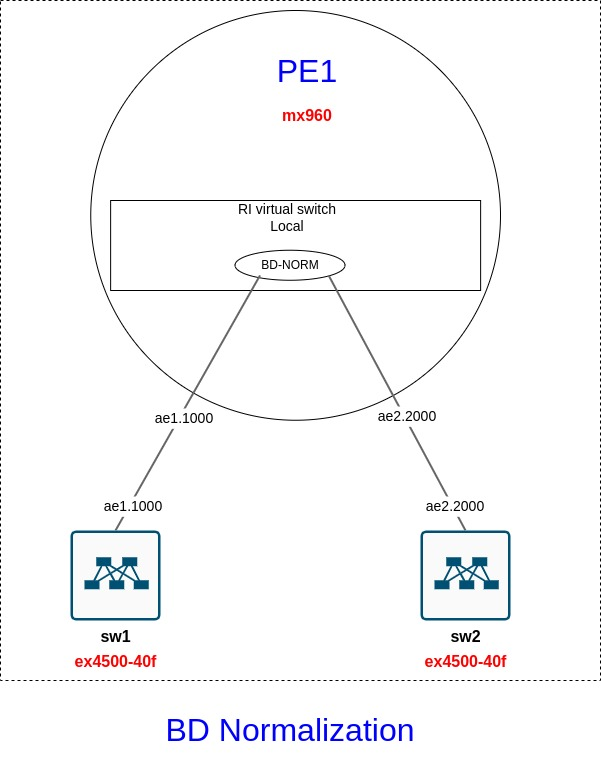
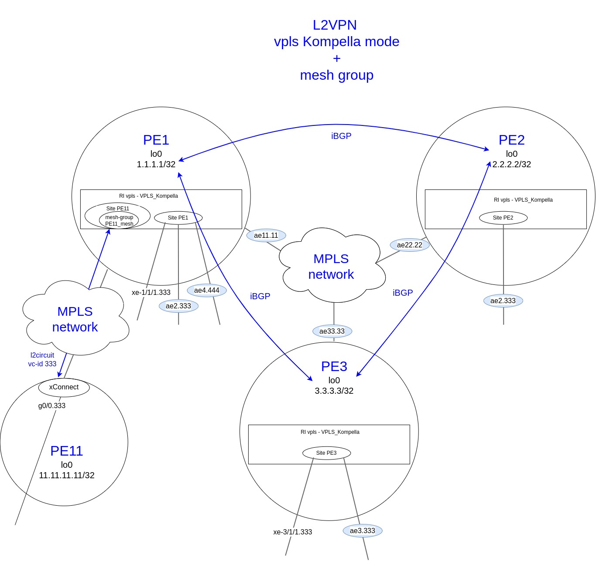
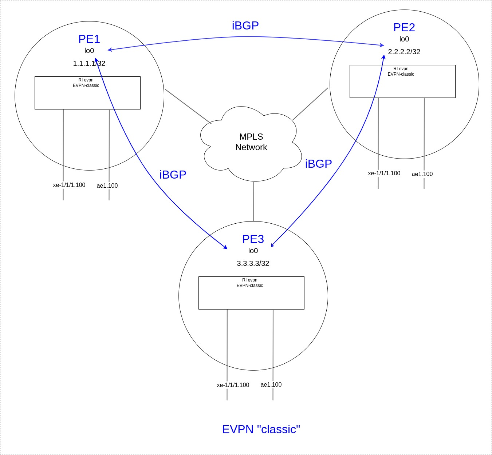
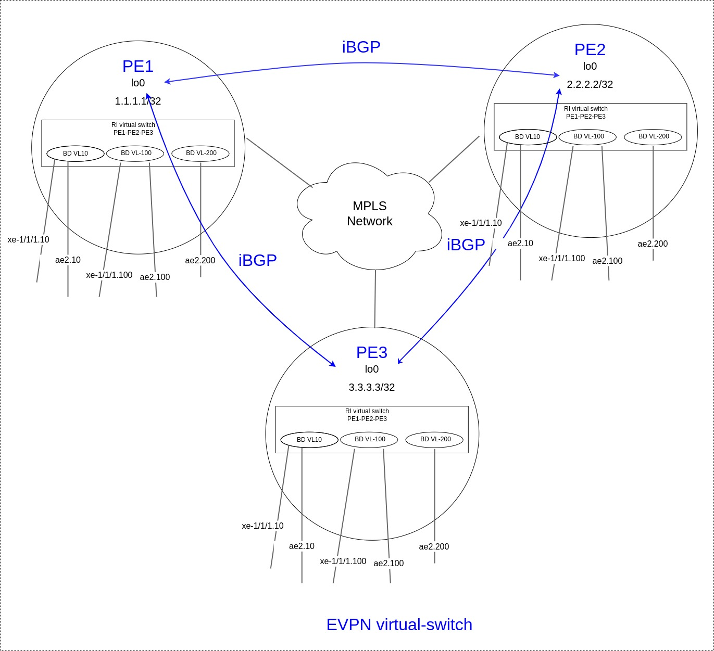

title:  MX cases

# Кейсы по MX80/MX480/MX960

## Настройка LAG

```bash
"Создание интерфейса aggregate ethernet (ae0)"

set interfaces ae0 description "L2 LAG-60G"
set interfaces ae0 flexible-vlan-tagging
set interfaces ae0 mtu 9192
set interfaces ae0 encapsulation flexible-ethernet-services
set interfaces ae0 aggregated-ether-options link-speed 10g
set interfaces ae0 aggregated-ether-options lacp active
```

```bash
"Настройка физических интерфейсов, входящих в LAG ae0"

set interfaces xe-2/0/0 description "ae0 member"
set interfaces xe-2/0/0 gigether-options 802.3ad ae0

set interfaces xe-2/0/1 description "ae0 member"
set interfaces xe-2/0/1 gigether-options 802.3ad ae0

set interfaces xe-2/1/0 description "ae0 member"
set interfaces xe-2/1/0 gigether-options 802.3ad ae0

set interfaces xe-2/1/1 description "ae0 member"
set interfaces xe-2/1/1 gigether-options 802.3ad ae0

set interfaces xe-3/1/0 description "ae0 member"
set interfaces xe-3/1/0 gigether-options 802.3ad ae0

set interfaces xe-3/1/1 description "ae0 member"
set interfaces xe-3/1/1 gigether-options 802.3ad ae0
```

<details><summary>"Диагностика"</summary>
<p>

```bash
"Диагностика"

"show lacp interfaces ae0"
Aggregated interface: ae0
    LACP state:       Role   Exp   Def  Dist  Col  Syn  Aggr  Timeout  Activity
      xe-2/1/0       Actor    No    No   Yes  Yes  Yes   Yes     Fast    Active
      xe-2/1/0     Partner    No    No   Yes  Yes  Yes   Yes     Fast    Active
      xe-2/1/1       Actor    No    No   Yes  Yes  Yes   Yes     Fast    Active
      xe-2/1/1     Partner    No    No   Yes  Yes  Yes   Yes     Fast    Active
      xe-2/0/0       Actor    No    No   Yes  Yes  Yes   Yes     Fast    Active
      xe-2/0/0     Partner    No    No   Yes  Yes  Yes   Yes     Fast    Active
      xe-2/0/1       Actor    No    No   Yes  Yes  Yes   Yes     Fast    Active
      xe-2/0/1     Partner    No    No   Yes  Yes  Yes   Yes     Fast    Active
      xe-3/1/0       Actor    No    No   Yes  Yes  Yes   Yes     Fast    Active
      xe-3/1/0     Partner    No    No   Yes  Yes  Yes   Yes     Fast    Active
      xe-3/1/1       Actor    No    No   Yes  Yes  Yes   Yes     Fast    Active
      xe-3/1/1     Partner    No    No   Yes  Yes  Yes   Yes     Fast    Active

    LACP protocol:        Receive State  Transmit State          Mux State 
      xe-2/1/0                  Current   Fast periodic Collecting distributing
      xe-2/1/1                  Current   Fast periodic Collecting distributing
      xe-2/0/0                  Current   Fast periodic Collecting distributing
      xe-2/0/1                  Current   Fast periodic Collecting distributing
      xe-3/1/0                  Current   Fast periodic Collecting distributing
      xe-3/1/1                  Current   Fast periodic Collecting distributing 
```
</p>
</details>

## monitor interface
Полезная команда для просмотра текущего трафика на интерфейсе.

<details><summary>monitor interface et-0/0/0.1111</summary>
<p>

```bash
Interface: et-0/0/0.1111, Enabled, Link is Up
Flags: SNMP-Traps 0x4000
Encapsulation: ENET0
VLAN-Tag [ 0x8100.1111 ]
Local statistics:                                                Current delta
  Input bytes:                6114379118                                [5543]
  Output bytes:               1634279431                                [1629]
  Input packets:                19245465                                  [25]
  Output packets:               19009869                                  [23]
Remote statistics:
  Input bytes:          18127645978833589 (11754587224 bps)      [24021808840]
  Output bytes:         1760683485458425 (1235757384 bps)         [2669082378]
  Input packets:          16972537566537 (1471883 pps)              [23845815]
  Output packets:          3862189819944 (353879 pps)                [5829571]
IPv6 statistics:
  Input bytes:             4472221468558 (13210160 bps)             [14292195]
  Output bytes:             410218938007 (30824 bps)                   [30460]
  Input packets:              8531742751 (1303 pps)                    [30135]
  Output packets:              383253185 (7 pps)                         [118]
Traffic statistics:
  Input bytes:          18127652093212707                        [24021814383]
  Output bytes:         1760685119737856                          [2669084007]
  Input packets:          16972556812002                            [23845840]
  Output packets:          3862208829813                             [5829594]
Protocol: inet, MTU: 1500, Flags: 0x800

```
</p>
</details>


## protocol l2-learning 
Необходим для настройки параметров изучения mac-адресов

[l2-learning-edit-protocols](https://www.juniper.net/documentation/us/en/software/junos/multicast-l2/topics/ref/statement/l2-learning-edit-protocols.html)

```bash
"Пример конфигурации"
show configuration protocols l2-learning        
  global-mac-move {
      threshold-time 30;
      reopen-time 30;
      threshold-count 5;
      log;
  }
  global-mac-table-aging-time 1200;
  global-mac-ip-table-aging-time 600;
```

## policer 
policer vs shared-bandwidth-policer

!!!warning "Важно"
          При применении полисера на агрегированный интерфейс, 
          в котором находятся интерфейсы с разных PFE полисер работает не правильно.
          По сути стандартный полисер ограничивает полосу только для потров одного PFE, 
          если например порты находятся в 2х разных PFE, то полоса будет удваиваться.
          Описание проблемы:
          https://kb.juniper.net/InfoCenter/index?page=content&id=KB31589&cat=VMX&actp=LIST


<details><summary>Пример LAGа 4x10G</summary>
<p>

```bash
  "Терминология Juniper (JNCIA-Junos Study Guide):"
  - RE -  Route Engine - Control Plane
  - PFE - Packet Forward Engine - Data Plane

  
  "Пример LAGа = 4x10G = 40G"

  В данном примере используется 2 разных FPC (по 2 интерфейса в каждом) - соответственно, 
  если использовать стандартный policer например с rate 10Mbps, 
  то по факту полоса будет составлять 20Mbps
  Для того, чтобы ограничение по полосе работало корректно 
  нужно использовать shared-bandwidth-policer

  "show lacp interfaces ae0"              
    Aggregated interface: ae0
        LACP state:       Role   Exp   Def  Dist  Col  Syn  Aggr  Timeout  Activity
          xe-1/1/0       Actor    No    No   Yes  Yes  Yes   Yes     Fast   Passive
          xe-1/1/0     Partner    No    No   Yes  Yes  Yes   Yes     Fast    Active
          xe-1/1/1       Actor    No    No   Yes  Yes  Yes   Yes     Fast   Passive
          xe-1/1/1     Partner    No    No   Yes  Yes  Yes   Yes     Fast    Active
          xe-2/1/0       Actor    No    No   Yes  Yes  Yes   Yes     Fast   Passive
          xe-2/1/0     Partner    No    No   Yes  Yes  Yes   Yes     Fast    Active
          xe-2/1/1       Actor    No    No   Yes  Yes  Yes   Yes     Fast   Passive
          xe-2/1/1     Partner    No    No   Yes  Yes  Yes   Yes     Fast    Active
        LACP protocol:        Receive State  Transmit State          Mux State 
          xe-1/1/0                  Current   Fast periodic Collecting distributing
          xe-1/1/1                  Current   Fast periodic Collecting distributing
          xe-2/1/0                  Current   Fast periodic Collecting distributing
          xe-2/1/1                  Current   Fast periodic Collecting distributing

    "show chassis hardware"                 
      Hardware inventory:
      ---cut---
      "FPC 1"            
        CPU            
        "PIC 0"                   BUILTIN      BUILTIN           4x 10GE(LAN) SFP+          
          Xcvr 0               
          Xcvr 1               
          Xcvr 2       
          Xcvr 3       
        "PIC 1"                   BUILTIN      BUILTIN           4x 10GE(LAN) SFP+          
          Xcvr 0       
          Xcvr 1       
          Xcvr 2       
          Xcvr 3       
        "PIC 2"                   BUILTIN      BUILTIN           4x 10GE(LAN) SFP+          
          Xcvr 0       
          Xcvr 1       
          Xcvr 2       
          Xcvr 3       
        "PIC 3"                   BUILTIN      BUILTIN           4x 10GE(LAN) SFP+
          Xcvr 0       
          Xcvr 1       
          Xcvr 2       
          Xcvr 3       
      "FPC 2"                                                    
        CPU           
        PIC 0                   BUILTIN      BUILTIN           4x 10GE(LAN) SFP+
          Xcvr 0      
          Xcvr 1      
          Xcvr 2      
        "PIC 1"                   BUILTIN      BUILTIN           4x 10GE(LAN) SFP+         
          Xcvr 0      
          Xcvr 1      
          Xcvr 2      
          Xcvr 3      
        "PIC 2"                   BUILTIN      BUILTIN           4x 10GE(LAN) SFP+         
          Xcvr 0      
          Xcvr 1      
          Xcvr 2      
          Xcvr 3      
        "PIC 3"                   BUILTIN      BUILTIN           4x 10GE(LAN) SFP+
          Xcvr 0       
          Xcvr 1                
          Xcvr 2                
          Xcvr 3                
      ---cut---  
```
</p>
</details>


```bash
"Для корректной работы взависимости от типа интерфейса,"
"используются разные типы полисеров" 

"полисер по скорости для физического интерфейса"
set firewall policer 150Mbit if-exceeding bandwidth-limit 150m
set firewall policer 150Mbit if-exceeding burst-size-limit 14400000
set firewall policer 150Mbit then discard

"полисер по скорости для LAG интерфейса"
set firewall policer 150Mbit_shared shared-bandwidth-policer
set firewall policer 150Mbit_shared if-exceeding bandwidth-limit 150m
set firewall policer 150Mbit_shared if-exceeding burst-size-limit 14400000
set firewall policer 150Mbit_shared then discard      
```

## configure/configure private/configure exclusive
Принцип работы c БД конфигурации Juniper...

### configure
 При работе просто в режиме "configure" по сути все пользователи разделяют одну конфигурацию и при коммите применяю все изменения сделанные в конфиге, всеми пользователями...
 Данный режим работы можно назвать "depricated" при многопользовательской работе, т.к. будет вносить "неразбериху и сумятицу" в работу...
 
### configure private
 При работе в таком режиме возможно многопользовательская работа с конфигурацией за счет того, что каждый пользователь работает со своей приватной копией кандидата конфигурации.
 При применении коннфигурации комиттится только дифф. с рабочим конфигом. Тут тоже может быть ньюанс, если оба пользователя в своей приватной конфигурации правят одни и теже секции конфига... 

 

### configure exclusive
 По сути при входе в "configure exclusive" пользователь монопольно забирает права на редактирование и коммитта конфига.
 Конфигурации всех остальных пользоватей не могут примениться в данном режиме.


[лит-ра](https://supportportal.juniper.net/s/article/Junos-How-can-multiple-users-edit-different-parts-of-a-configuration-simultaneously?language=en_US)

## Dynamic-DB
Если кратко, то dynamic-db используется для ускорения выполнения операций коммита для определенных сущностей, в частности секции "policy-options".

<details><summary>Пример вариантов сущностей которые можно конфигурить в "configure dynamic"</summary>
<p>

``` bash
"MX> configure dynamic"
  Entering configuration mode
  {master}[edit dynamic]

"MX# show ?"
Possible completions:
  <[Enter]>            Execute this command
> logical-systems      Logical systems
> policy-options       Policy option configuration
  |                    Pipe through a command

"MX# show policy-options ?"         
  Possible completions:
    <[Enter]>            Execute this command
  > as-path              BGP autonomous system path regular expression
  > as-path-group        Group a set of AS paths
  > community            BGP community information
  > condition            Define a route advertisement condition
  > mac-list             Define a named set of mac addresses
  > policy-statement     Routing policy
  > prefix-list          Define a named set of address prefixes
  > route-distinguisher  Route-distinguisher information
  > route-filter-list    Define a named set of route-filter address prefixes
  > source-address-filter-list  Define a named set of source address filter address prefixes
    |                    Pipe through a command
  {master}[edit dynamic]

"MX# show logical-systems ?"                         
  Possible completions:
    <[Enter]>            Execute this command
    <name>               Logical system name
    |                    Pipe through a command
  {master}[edit dynamic]

"MX# show logical-systems TEST ?"           
  Possible completions:
    <[Enter]>            Execute this command
  > policy-options       Policy option configuration
    |                    Pipe through a command
  {master}[edit dynamic]

|"MX# show logical-systems TEST policy-options ?"
  Possible completions:
    <[Enter]>            Execute this command
  > as-path              BGP autonomous system path regular expression
  > as-path-group        Group a set of AS paths
  > community            BGP community information
  > condition            Define a route advertisement condition
  > mac-list             Define a named set of mac addresses
  > policy-statement     Routing policy
  > prefix-list          Define a named set of address prefixes
  > route-distinguisher  Route-distinguisher information
  > route-filter-list    Define a named set of route-filter address prefixes
  > source-address-filter-list  Define a named set of source address filter address prefixes
    |                    Pipe through a command
```

</p>
</details>


Содержимое dynamic-db находится в отдельном файле /var/run/db/juniper.dyn.
При редактировании динамической конфигурации не происходит глобальная проверка всего конфига джунипера, что существенно ускоряет время коммита. Данная система полезна/используется при частой модификации в основном префикс листов, которые периодически обновляюся в соответствии фильтрации префиксов с общедоступных БД, таких как RIPE, RADB, https://www.ididb.ru/, ect...

В глобальной конфигурации просто делается ссылка на названия в dynamic-db.

<details><summary>Пример конфигурации prefix-list AS1111</summary>
<p>

```bash
"MX> show configuration policy-options prefix-list AS1111 | display set"
  set policy-options prefix-list AS1111 dynamic-db
                                                                                                               
"MX> configure dynamic" 
  Entering configuration mode
  {master}[edit dynamic]

"MX# show policy-options prefix-list AS1111 | display set"
  set policy-options prefix-list AS1111 1.1.0.0/22;
  set policy-options prefix-list AS1111 11.11.0.0/23;
  set policy-options prefix-list AS1111 111.111.111.0/24;
```

</p>
</details>


Лит-ра:
[Understanding Dynamic Routing Policies](https://www.juniper.net/documentation/us/en/software/junos/routing-policy/topics/concept/policy-dynamic-understanding.html) 


## Bridge Domain
### Нормализация вланов внутри Bridge Domain
Как обычно изобретаю свой "велосипед"

Пересказ статьи бормаглота из своей практики:
[Оригинал статьи](https://habr.com/ru/post/322560/) 

Имееется канал, у которого в силу технических обстоятельств со стороны клиента разные вланы. 

В таком случае можно объединить данную схему в один Bridge Domain с нормализацией вланов.

Данная схема позволяет осуществлять связность даже если вланы с обоих сторон разные

```bash
  "Настройки":
    "ip" 172.16.243.80/30
    "sw1" - vlan 1000 - ip 172.16.243.81
    "sw2" - vlan 2000 - ip 172.16.243.82
```
#### Топология сети:


#### Конфигурация - нормализуем по влану 1000
```bash
"PE1"
    set interfaces ae1 unit 1000 description "test normalization"
    set interfaces ae1 unit 1000 encapsulation vlan-bridge
    set interfaces ae1 unit 1000 vlan-id 1000
    set interfaces ae1 unit 1000 family bridge policer input 150Mbit

    set interfaces ae2 unit 2000 description "test normalization"
    set interfaces ae2 unit 2000 encapsulation vlan-bridge
    set interfaces ae2 unit 2000 vlan-id 2000
    set interfaces ae2 unit 2000 family bridge policer input 150Mbit

    set routing-instances Local bridge-domains BD-NORM description "test normalization"
    set routing-instances Local bridge-domains BD-NORM interface ae1.1000
    set routing-instances Local bridge-domains BD-NORM interface ae2.2000
    set routing-instances Local bridge-domains BD-NORM vlan-id 1000
```

```bash
"sw1 - ae6 vlan 1000"
  set interfaces ae6 unit 0 family ethernet-switching vlan members VL1000
  set vlans VL1000 description "test normalization"
  set vlans VL1000 vlan-id 1000

  set interfaces vlan unit 1000 family inet address 172.16.243.81/30
  set vlans VL1000 l3-interface vlan.1000
```

```bash
"sw2 - ae5 vlan 2000"
  set interfaces ae5 unit 0 family ethernet-switching vlan members BD-NORM
  set vlans BD-NORM description "test normalization"
  set vlans BD-NORM vlan-id 2000

  set interfaces vlan unit 2000 family inet address 172.16.243.82/30
  set vlans BD-NORM l3-interface vlan.2000
```

##### Диагностика

<details><summary>Diagnostic</summary>
<p>

```bash
"PE1"
"Диагностика - все пингуется 172.16.243.81 и 172.16.243.82"

  "PE1> show bridge mac-table instance Local bridge-domain BD-NORM"
    MAC flags       (S -static MAC, D -dynamic MAC, L -locally learned, C -Control MAC
        O -OVSDB MAC, SE -Statistics enabled, NM -Non configured MAC, R -Remote PE MAC, P -Pinned MAC)

    Routing instance : Local
    Bridging domain : BD-NORM, VLAN : 1000
      MAC                 MAC      Logical          NH     MAC         active
      address             flags    interface        Index  property    source
      00:00:00:00:00:81   D        ae1.1000        
      00:00:00:00:00:82   D        ae2.2000        

  "PE1> show interfaces ae1.1000"                                     
    Logical interface ae1.1000 (Index 981) (SNMP ifIndex 1605)
      Description: test normalization
      "Flags: Up SNMP-Traps 0x20004000 VLAN-Tag [ 0x8100.1000 ]  Encapsulation: VLAN-Bridge"
        "для кадров, пришедших в бридж домен с тегом 1000 ничего не меняеся"
      Tenant Name: (null)
      Statistics        Packets        pps         Bytes          bps
      Bundle:
          Input :             1          0           102            0
          Output:             1          0           102            0
      Adaptive Statistics:
          Adaptive Adjusts:          0
          Adaptive Scans  :          0
          Adaptive Updates:          0
      Protocol bridge, MTU: 9192

  "PE1> show interfaces ae2.2000"                                     
    Logical interface ae2.2000 (Index 980) (SNMP ifIndex 1604)
      Description: test normalization
      "Flags: Up SNMP-Traps 0x20004000 VLAN-Tag [ 0x8100.2000 ] In(swap .1000) Out(swap .2000)"
        "кадры пришедшие в бридж домен с тега 2000 свапаются на тег 1000"
        "кадры выходящие из бридж домена с тега 1000 свапаются на тег 2000"
        "соответственно внутри бридж домена ходят кадры с тегом 1000" 

      Encapsulation: VLAN-Bridge
      Tenant Name: (null)
      Statistics        Packets        pps         Bytes          bps
      Bundle:
          Input :             1          0           102            0
          Output:             1          0           102            0
      Adaptive Statistics:
          Adaptive Adjusts:          0
          Adaptive Scans  :          0
          Adaptive Updates:          0
      Protocol bridge, MTU: 9192
```
</p>
</details>

#### Конфигурация - нормализуем по влану 2000

```bash
"PE1"
"set routing-instances Local bridge-domains BD-NORM vlan-id 2000"
```

##### Диагностика

<details><summary>Diagnostic</summary>
<p>

```bash
"Поменяем влан нормализации внутри бридж домена  - тогда меняется перетеггирование"
тогда...
  "PE1> show bridge mac-table instance Local bridge-domain BD-NORM"
      MAC flags       (S -static MAC, D -dynamic MAC, L -locally learned, C -Control MAC
          O -OVSDB MAC, SE -Statistics enabled, NM -Non configured MAC, R -Remote PE MAC, P -Pinned MAC)

      Routing instance : Local
      Bridging domain : BD-NORM, VLAN : 2000
        MAC                 MAC      Logical          NH     MAC         active
        address             flags    interface        Index  property    source
        00:00:00:00:00:81   D        ae1.1000        
        00:00:00:00:00:82   D        ae2.2000        

  "PE1> show interfaces ae1.1000"
    Logical interface ae1.1000 (Index 983) (SNMP ifIndex 1605)
      Description: test normalization
      "Flags: Up SNMP-Traps 0x20004000 VLAN-Tag [ 0x8100.1000 ] In(swap .2000) Out(swap .1000)"
        "кадры пришедшие в бридж домен с тега 1000 свапаются на тег 2000"
        "кадры выходящие из бридж домена с тега 2000 свапаются на тег 1000"
        "соответственно внутри бридж домена ходят кадры с тегом 2000" 
      Encapsulation: VLAN-Bridge
      Tenant Name: (null)
      Statistics        Packets        pps         Bytes          bps
      Bundle:
          Input :            15          0           946            0
          Output:            15          0           986            0
      Adaptive Statistics:
          Adaptive Adjusts:          0
          Adaptive Scans  :          0
          Adaptive Updates:          0
      Protocol bridge, MTU: 9192

  "PE1> show interfaces ae2.2000"                                     
    Logical interface ae2.2000 (Index 982) (SNMP ifIndex 1604)
      Description: test normalization
      "Flags: Up SNMP-Traps 0x20004000 VLAN-Tag [ 0x8100.2000 ]  Encapsulation: VLAN-Bridge"
        "для кадров, пришедших в бридж домен с тегом 2000 ничего не меняеся"
      Tenant Name: (null)
      Statistics        Packets        pps         Bytes          bps
      Bundle:
          Input :            15          0           986            0
          Output:            15          0           946            0
      Adaptive Statistics:
          Adaptive Adjusts:          0
          Adaptive Scans  :          0
          Adaptive Updates:          0
      Protocol bridge, MTU: 9192

  "sw1> show arp"
    MAC Address       Address         Name                      Interface               Flags
    00:00:00:00:00:82 172.16.243.82   172.16.243.82             vlan.1000               none

  "sw2> show arp"              
    MAC Address       Address         Name                      Interface               Flags
    00:00:00:00:00:81 172.16.243.81   172.16.243.81             vlan.2000               none
```
</p>
</details>

#### Конфигурация - без указания влана

```bash
"PE1"
"set routing-instances Local bridge-domains BD-NORM vlan-id none"
```

##### Диагностика

<details><summary>Diagnostic</summary>
<p>

```bash
"Уберем влан нормализации внутри бридж домена"
PE1
"set routing-instances Local bridge-domains BD-NORM vlan-id none"
тогда...

    "PE1> show bridge mac-table instance Local bridge-domain BD-NORM"    
      MAC flags       (S -static MAC, D -dynamic MAC, L -locally learned, C -Control MAC
          O -OVSDB MAC, SE -Statistics enabled, NM -Non configured MAC, R -Remote PE MAC, P -Pinned MAC)

      Routing instance : Local
      Bridging domain : BD-NORM, VLAN : none
        MAC                 MAC      Logical          NH     MAC         active
        address             flags    interface        Index  property    source
        00:00:00:00:00:81   D        ae1.1000        
        00:00:00:00:00:82   D        ae2.2000        

    "PE1> show interfaces ae1.1000"                                     
      Logical interface ae1.1000 (Index 981) (SNMP ifIndex 1605)
        Description: test normalization
        "Flags: Up SNMP-Traps 0x20004000 VLAN-Tag [ 0x8100.1000 ] In(pop) Out(push 0x0000.1000)"
          "кадры пришедшие в бридж домен с тега 1000 попается и ходит без тега"
          "кадры выходящие из бридж домена пушится тег 1000 и на выход идут уже с тегом 1000"
          "соответственно внутри бридж домена ходят кадры БЕЗ ТЕГА" 
        Encapsulation: VLAN-Bridge
        Tenant Name: (null)
        Statistics        Packets        pps         Bytes          bps
        Bundle:
            Input :             2          0           204            0
            Output:             2          0           204            0
        Adaptive Statistics:
            Adaptive Adjusts:          0
            Adaptive Scans  :          0
            Adaptive Updates:          0
        Protocol bridge, MTU: 9192

    !PE1> show interfaces ae2.2000                                     
      Logical interface ae2.2000 (Index 980) (SNMP ifIndex 1604)
        Description: test normalization
        "Flags: Up SNMP-Traps 0x20004000 VLAN-Tag [ 0x8100.2000 ] In(pop) Out(push 0x0000.2000)"
          "кадры пришедшие в бридж домен с тега 2000 попается и ходит без тега"
          "кадры выходящие из бридж домена пушится тег 2000 и на выход идут уже с тегом 2000"
          "соответственно внутри бридж домена ходят кадры БЕЗ ТЕГА" 
        Encapsulation: VLAN-Bridge
        Tenant Name: (null)
        Statistics        Packets        pps         Bytes          bps
        Bundle:
            Input :             2          0           204            0
            Output:             2          0           204            0
        Adaptive Statistics:
            Adaptive Adjusts:          0
            Adaptive Scans  :          0
            Adaptive Updates:          0
        Protocol bridge, MTU: 9192
```
</p>
</details>

## MPLS

[очень полезная статья](https://blog.marquis.co/layer-2-vpns-on-junos/)

Для базовой настройки MPLS и работы технологий необходимы следующие настройки:

=== "interfaces"

    ```bash
    "На участвующих в MPLS интерфесах настраивается тип инкапсуляции"
    set interfaces xe-1/1/1 flexible-vlan-tagging
    set interfaces xe-1/1/1 mtu 9216
    set interfaces xe-1/1/1 encapsulation flexible-ethernet-services

    set interfaces ae2 flexible-vlan-tagging
    set interfaces ae2 mtu 9192
    set interfaces ae2 encapsulation flexible-ethernet-services
    set interfaces ae2 aggregated-ether-options lacp active
    ```

=== "MPLS"

    ```bash
    "На участвующих в MPLS интерфесах"
    set protocols mpls interface xe-1/1/1.333
    set protocols mpls interface ae2.333    
    ```

=== "RSVP-TE"

    ```bash
    "На участвующих в RSVP-TE интерфесах"
    set protocols rsvp interface xe-1/1/1
    set protocols rsvp interface ae2.0
    ```

=== "LDP"
    
    ```bash
    "Возможна работа протокола LDP поверх протокола RSVP-TE"
    "Классическая схема для Джунов"
    set protocols ldp interface xe-1/1/1.333
    set protocols ldp interface ae2.333
    set protocols ldp interface lo0.0
    ```

=== "OSPF or IS-IS"

    ```bash
    "Можно поднять любой из 2-х протоколов IGP"
    "На соответствующих интерфейсах, где данный протокол должен быть настроен )))"

    "Настройки для OSPF c bfd тюнингом"
    set protocols ospf area 0.0.0.0 interface xe-1/1/1.0 interface-type p2p
    set protocols ospf area 0.0.0.0 interface xe-1/1/1.0 bfd-liveness-detection minimum-interval 500
    set protocols ospf area 0.0.0.0 interface xe-1/1/1.0 bfd-liveness-detection multiplier 6
    set protocols ospf area 0.0.0.0 interface ae2.0 interface-type p2p
    set protocols ospf area 0.0.0.0 interface ae2.0 bfd-liveness-detection minimum-interval 500
    set protocols ospf area 0.0.0.0 interface ae2.0 bfd-liveness-detection multiplier 6
    "Для работы RSVP-TE включаеим в OSPF траффик инженеринг"
    set protocols ospf traffic-engineering 


    "Настройки для IS-IS"
    set protocols isis reference-bandwidth 1000g
    set protocols isis level 1 disable
    set protocols isis level 2 wide-metrics-only
    set protocols isis interface xe-1/1/1.0 ldp-synchronization
    set protocols isis interface xe-1/1/1.0 point-to-point
    set protocols isis interface xe-1/1/1.0 link-protection
    set protocols isis interface ae2.0 ldp-synchronization
    set protocols isis interface ae2.0 point-to-point
    set protocols isis interface ae2.0 link-protection
    set protocols isis interface lo0.0
    "Для работы RSVP-TE включаеим в IS-IS траффик инженеринг"
    set protocols isis traffic-engineering family inet shortcuts
    ```

=== "BGP"

    ```bash
    "Для Kompella mode"
    set protocols bgp group ibgp family l2vpn signaling

    "Для L3VPN"
    set protocols bgp group ibgp family inet-vpn unicast
    
    "Для EVPN"
    set protocols bgp group ibgp family evpn signaling
    ```

### L2VPN

#### local-l2circuit
Настройка local-switch l2circuit

Для организации L2 связности между двумя интерфейсами на маршрутизаторах MX используется 

так называемый "local-switch l2circuit", по смыслу функционала аналог bridge-domain-a


```bash
"Пример настройки local-switch l2circuit между сабинтерфейсами xe-1/1/1.333 и ae2.333"

set interfaces xe-1/1/1 unit 333 description "L2VPN; local-switch l2circuit"
set interfaces xe-1/1/1 unit 333 encapsulation vlan-ccc
set interfaces xe-1/1/1 unit 333 vlan-id 333
set interfaces xe-1/1/1 unit 333 family ccc policer input 150Mbit

set interfaces ae2 unit 333 description "L2VPN; local-switch l2circuit"
set interfaces ae2 unit 333 encapsulation vlan-ccc
set interfaces ae2 unit 333 vlan-id 333
set interfaces ae2 unit 333 family ccc policer input 150Mbit_shared

"Для связки двух интерфейсов используется конструкция,"
"в которой указывается начальный и конечный интерфейс локольного l2circuit"
set protocols l2circuit local-switching interface xe-1/1/1.333 end-interface interface ae2.333

set protocols l2circuit local-switching interface xe-1/1/1.333 description "L2VPN; local-switch l2circuit"
set protocols l2circuit local-switching interface xe-1/1/1.333 ignore-mtu-mismatch

"полисер по скорости для физического интерфейса"
set firewall policer 150Mbit if-exceeding bandwidth-limit 150m
set firewall policer 150Mbit if-exceeding burst-size-limit 14400000
set firewall policer 150Mbit then discard

"полисер по скорости для LAG интерфейса"
set firewall policer 150Mbit_shared shared-bandwidth-policer
set firewall policer 150Mbit_shared if-exceeding bandwidth-limit 150m
set firewall policer 150Mbit_shared if-exceeding burst-size-limit 14400000
set firewall policer 150Mbit_shared then discard
```


##### Diagnostic
<details><summary>show l2circuit connections interface xe-1/1/1.333</summary>
<p>

```bash

show l2circuit connections interface xe-1/1/1.333                
Layer-2 Circuit Connections:

Legend for connection status (St)   
EI -- encapsulation invalid      NP -- interface h/w not present   
MM -- mtu mismatch               Dn -- down                       
EM -- encapsulation mismatch     VC-Dn -- Virtual circuit Down    
CM -- control-word mismatch      Up -- operational                
VM -- vlan id mismatch		 CF -- Call admission control failure
OL -- no outgoing label          IB -- TDM incompatible bitrate 
NC -- intf encaps not CCC/TCC    TM -- TDM misconfiguration 
BK -- Backup Connection          ST -- Standby Connection
CB -- rcvd cell-bundle size bad  SP -- Static Pseudowire
LD -- local site signaled down   RS -- remote site standby
RD -- remote site signaled down  HS -- Hot-standby Connection
XX -- unknown

Legend for interface status  
Up -- operational            
Dn -- down                   
 Local Switch xe-1/1/1.333 
    Interface                 Type  St     Time last up          # Up trans
    xe-1/1/1.333(vc 0)             loc   Up     Jan 20 11:36:53 2022           1
      Local interface: xe-1/1/1.333, Status: Up, Encapsulation: VLAN
        Description: L2VPN; local-switch l2circuit
      Local interface: ae2.333, Status: Up, Encapsulation: VLAN
```
</p>
</details>


Обратное тоже равно...
<details><summary>show l2circuit connections interface ae2.333</summary>
<p>

```bash

"show l2circuit connections interface ae2.333"                
Layer-2 Circuit Connections:

Legend for connection status (St)   
EI -- encapsulation invalid      NP -- interface h/w not present   
MM -- mtu mismatch               Dn -- down                       
EM -- encapsulation mismatch     VC-Dn -- Virtual circuit Down    
CM -- control-word mismatch      Up -- operational                
VM -- vlan id mismatch		 CF -- Call admission control failure
OL -- no outgoing label          IB -- TDM incompatible bitrate 
NC -- intf encaps not CCC/TCC    TM -- TDM misconfiguration 
BK -- Backup Connection          ST -- Standby Connection
CB -- rcvd cell-bundle size bad  SP -- Static Pseudowire
LD -- local site signaled down   RS -- remote site standby
RD -- remote site signaled down  HS -- Hot-standby Connection
XX -- unknown

Legend for interface status  
Up -- operational            
Dn -- down                   
 Local Switch ae2.333 
    Interface                 Type  St     Time last up          # Up trans
    ae2.333(vc 0)             loc   Up     Jan 20 11:36:53 2022           1
      Local interface: ae2.333, Status: Up, Encapsulation: VLAN
        Description: L2VPN; local-switch l2circuit
      Local interface: xe-1/1/1.333, Status: Up, Encapsulation: VLAN
```
</p>
</details>


##### Альтернативный вариант - это bridge-domain
Альтернативный вариант на основе bridge-domain без применения local-switch.
Приемущество данного варианта заключается в том, что можно терминировать участников бридж домена путем добавления в качестве шлюза irb интерфейс. Также упрощает дебаг путем просмотра mac адресов непосредственно в бридж домене, чего l2circuit делать не позволяет.


```bash

set interfaces xe-1/1/1 unit 0 family bridge vlan-id 333
set interfaces xe-2/2/2 unit 0 family bridge vlan-id 333

set interfaces irb unit 333 family inet address 192.168.1.254/24

set bridge-domains BD-333 domain-type bridge
set bridge-domains BD-333 vlan-id 333
set bridge-domains BD-333 routing-interface irb.333
```

##### Diagnostic
<details><summary>show bridge mac-table bridge-domain BD-333 </summary>
<p>

```bash
"show bridge mac-table bridge-domain BD-333"
  MAC flags       (S -static MAC, D -dynamic MAC, L -locally learned, C -Control MAC
      O -OVSDB MAC, SE -Statistics enabled, NM -Non configured MAC, R -Remote PE MAC, P -Pinned MAC)

  Routing instance : default-switch
  Bridging domain : BD-333, VLAN : 333
    MAC                 MAC      Logical          NH     MAC         active
    address             flags    interface        Index  property    source
    de:ad:be:ef:1a:7b   D        xe-1/1/1.0      
    de:ad:be:ef:1f:71   D        xe-1/1/0.0      
    de:ad:be:ef:5e:97   D        xe-2/2/2.0      
    de:ad:be:ef:5e:98   D        xe-2/2/2.0      
```
</p>
</details>


#### l2circuit
"Настройка l2circuit"

Для организации L2 связности между двумя интерфейсами на двух маршрутизаторах l2circuit


```bash
"Пример настройки l2circuit между [PE1 xe-1/1/1.333] и [PE2 xe-2/1/1.333"]

"PE1"
set interfaces xe-1/1/1 unit 333 description "L2VPN l2circuit"
set interfaces xe-1/1/1 unit 333 encapsulation vlan-ccc
set interfaces xe-1/1/1 unit 333 vlan-id 333

set protocols l2circuit neighbor 1.1.1.1 interface xe-1/1/1.333 virtual-circuit-id 333
set protocols l2circuit neighbor 1.1.1.1 interface xe-1/1/1.333 mtu 1600

"PE-2"
set interfaces xe-2/1/1 unit 333 description "L2VPN l2circuit"
set interfaces xe-2/1/1 unit 333 encapsulation vlan-ccc
set interfaces xe-2/1/1 unit 333 vlan-id 333

set protocols l2circuit neighbor 2.2.2.2 interface xe-1/1/1.333 virtual-circuit-id 333
set protocols l2circuit neighbor 2.2.2.2 interface xe-1/1/1.333 mtu 1600
```

##### Diagnostic

<details><summary>show l2circuit connections interface xe-1/1/1.333</summary>
<p>

```bash
"На PE1"
"show l2circuit connections interface xe-1/1/1.333"
Layer-2 Circuit Connections:

Legend for connection status (St)   
EI -- encapsulation invalid      NP -- interface h/w not present   
MM -- mtu mismatch               Dn -- down                       
EM -- encapsulation mismatch     VC-Dn -- Virtual circuit Down    
CM -- control-word mismatch      Up -- operational                
VM -- vlan id mismatch		 CF -- Call admission control failure
OL -- no outgoing label          IB -- TDM incompatible bitrate 
NC -- intf encaps not CCC/TCC    TM -- TDM misconfiguration 
BK -- Backup Connection          ST -- Standby Connection
CB -- rcvd cell-bundle size bad  SP -- Static Pseudowire
LD -- local site signaled down   RS -- remote site standby
RD -- remote site signaled down  HS -- Hot-standby Connection
XX -- unknown

Legend for interface status  
Up -- operational            
Dn -- down                   
Neighbor: 2.2.2.2 
    Interface                 Type  St     Time last up          # Up trans
    xe-1/1/1.333(vc 333)         rmt   Up     Feb 17 22:58:25 2022           2
      Remote PE: 2.2.2.2, Negotiated control-word: Yes (Null)
      Incoming label: 202, Outgoing label: 383
      Negotiated PW status TLV: Yes
      local PW status code: 0x00000000, Neighbor PW status code: 0x00000000
      Local interface: xe-1/1/1.333, Status: Up, Encapsulation: VLAN
      Flow Label Transmit: No, Flow Label Receive: No
```
</p>
</details>


#### l2circuit + backup
"Схема и настройка l2circuit с возможностью резерва"

Принцип работы такой схемы заключается в том, 

что при падении на одной стороне связности l2circuit перестраивается на backup соседа.  


=== "PE-1"
    ```bash
    set interfaces ae2 unit 333 description "L2VPN l2circuit+backup"
    set interfaces ae2 unit 333 encapsulation vlan-ccc
    set interfaces ae2 unit 333 vlan-id 333
    set interfaces ae2 unit 333 family ccc policer input 150Mbit_shared
    set interfaces ae2 unit 333 family ccc policer output 150Mbit_shared

    set protocols l2circuit neighbor 2.2.2.2 interface ae1.333 virtual-circuit-id 333
    set protocols l2circuit neighbor 2.2.2.2 interface ae1.333 description "L2VPN l2circuit+backup"
    set protocols l2circuit neighbor 2.2.2.2 interface ae1.333 mtu 1500
    set protocols l2circuit neighbor 2.2.2.2 interface ae1.333 pseudowire-status-tlv

    "Время перестроения обратно на основной канал, если основной канал заработал"
    "В данном случае основной канал это PE1 - PE2"
    "[задается в секундах - в данном случае время перестроения на основной канал задано разным - 5 мин]"
    set protocols l2circuit neighbor 2.2.2.2 interface ae1.333 revert-time 300

    "Задание backup соседа"
    set protocols l2circuit neighbor 2.2.2.2 interface ae1.333 backup-neighbor 3.3.3.3 standby

    "полисер по скорости для LAG интерфейса"
    set firewall policer 150Mbit_shared shared-bandwidth-policer
    set firewall policer 150Mbit_shared if-exceeding bandwidth-limit 150m
    set firewall policer 150Mbit_shared if-exceeding burst-size-limit 14400000
    set firewall policer 150Mbit_shared then discard
    ```

=== "PE-2"
    ```bash
    set interfaces ae0 unit 333 description "L2VPN l2circuit+backup"
    set interfaces ae0 unit 333 encapsulation vlan-ccc
    set interfaces ae0 unit 333 vlan-id 333
    set protocols l2circuit neighbor 1.1.1.1 interface ae1.333 virtual-circuit-id 333
    set protocols l2circuit neighbor 1.1.1.1 interface ae1.333 description "L2VPN l2circuit+backup"
    set protocols l2circuit neighbor 1.1.1.1 interface ae1.333 mtu 1500
    set protocols l2circuit neighbor 1.1.1.1 interface ae1.333 pseudowire-status-tlv
    ```

=== "PE-3"
    ```bash
    set interfaces xe-3/0/1 unit 333 description "L2VPN l2circuit+backup"
    set interfaces xe-3/0/1 unit 333 encapsulation vlan-ccc
    set interfaces xe-3/0/1 unit 333 vlan-id 333
    set protocols l2circuit neighbor 1.1.1.1 interface xe-3/0/1.333 virtual-circuit-id 333
    set protocols l2circuit neighbor 1.1.1.1 interface xe-3/0/1.333 description "L2VPN l2circuit+backup"
    set protocols l2circuit neighbor 1.1.1.1 interface xe-3/0/1.333 mtu 1500
    set protocols l2circuit neighbor 1.1.1.1 interface xe-3/0/1.333 pseudowire-status-tlv
    ```

##### Diagnostic
<details><summary>show l2circuit connections interface xe-1/1/1.333</summary>
<p>

```bash
"PE1"
"show l2circuit connections interface ae4.510"
Layer-2 Circuit Connections:

Legend for connection status (St)   
EI -- encapsulation invalid      NP -- interface h/w not present   
MM -- mtu mismatch               Dn -- down                       
EM -- encapsulation mismatch     VC-Dn -- Virtual circuit Down    
CM -- control-word mismatch      Up -- operational                
VM -- vlan id mismatch		 CF -- Call admission control failure
OL -- no outgoing label          IB -- TDM incompatible bitrate 
NC -- intf encaps not CCC/TCC    TM -- TDM misconfiguration 
BK -- Backup Connection          ST -- Standby Connection
CB -- rcvd cell-bundle size bad  SP -- Static Pseudowire
LD -- local site signaled down   RS -- remote site standby
RD -- remote site signaled down  HS -- Hot-standby Connection
XX -- unknown

Legend for interface status  
Up -- operational            
Dn -- down                   
Neighbor: 2.2.2.2 
    Interface                 Type  St     Time last up          # Up trans
    ae2.333(vc 333)          rmt   Up     Jun  2 15:44:30 2021           1
      Remote PE: 2.2.2.2, Negotiated control-word: Yes (Null)
      Incoming label: 1417, Outgoing label: 359280
      Negotiated PW status TLV: Yes
      local PW status code: 0x00000000, Neighbor PW status code: 0x00000000
      Local interface: ae2.333, Status: Up, Encapsulation: VLAN
        Description: L2VPN l2circuit+backup
      Flow Label Transmit: No, Flow Label Receive: No
"Неактивный - backup neighbor"
Neighbor: 3.3.3.3 
    ae2.333(vc 333)          rmt   ST   
      local PW status code: 0x00000000, Neighbor PW status code: 0x00000000
```
</p>
</details>


#### vpls Kompella mode

"Схема и настройка vpls Kompella mode на примере 3-х сайтов"

```bash
"Описание схемы и принципа работы."
Имеется 3 сайта присутствия услуги (PE1, PE2, PE1).
В каждый сайт включено несколько интерфейсов.
Все они в конечном счете объединяются в один броадкаст домен. 

На PE1 изначально один из интерфейсов находится в другом влане.
Для того, чтобы была связность между вcеми интерфейсами vpls домена используется нормализация вланов,
"Достигается это за счет:"
"input-vlan-map pop AND output-vlan-map push"
т.е. при выходе с интерфейса тег влана снимается и далее внутри vpls передается без тега,
а при попадании на исходящий интерфейс в кадр добавляется тег нужного влана.
Таким образом, получается L2 связность между всеми интерфейсами, 
даже несмотря на то, что они находятся в различных вланах.

vrf-target target:1111:123 - RT - определяет принадлежность сайтов vpls к одному домену.
```


=== "PE-1"

    ```bash
    "Настройка интерфейсов, входящих в vpls домен"
    set interfaces xe-1/1/1 unit 333 description "VPLS VPLS_Kompella int xe-1/1/1.333"
    set interfaces xe-1/1/1 unit 333 encapsulation vlan-vpls
    set interfaces xe-1/1/1 unit 333 vlan-id 333
    set interfaces xe-1/1/1 unit 333 input-vlan-map pop
    set interfaces xe-1/1/1 unit 333 output-vlan-map push
    set interfaces xe-1/1/1 unit 333 family vpls policer input 100Mbit

    set interfaces ae2 unit 333 description "VPLS Kompella mode int ae2.333"
    set interfaces ae2 unit 333 encapsulation vlan-vpls
    set interfaces ae2 unit 333 vlan-id 333
    set interfaces ae2 unit 333 input-vlan-map pop
    set interfaces ae2 unit 333 output-vlan-map push
    set interfaces ae2 unit 333 family vpls policer input 200Mbit

    "Настройка Route instance типа - instance-type vpls"
    set routing-instances VPLS_Kompella description "VPLS Kompella mode"
    set routing-instances VPLS_Kompella instance-type vpls

    set routing-instances VPLS_Kompella protocols vpls mac-table-size 1024
    set routing-instances VPLS_Kompella protocols vpls no-tunnel-services

    "Идентификатор сайта - должен быть для участников vpls домена"
    set routing-instances VPLS_Kompella protocols vpls site PE1 site-identifier 1

    set routing-instances VPLS_Kompella protocols vpls site PE1 interface ae2.333
    set routing-instances VPLS_Kompella protocols vpls site PE1 interface xe-1/1/1.333
    set routing-instances VPLS_Kompella protocols vpls site PE1 interface ae4.444

    "Перечисление интерфейсов, входящих в vpls домен"
    set routing-instances VPLS_Kompella interface xe-1/1/1.333
    set routing-instances VPLS_Kompella interface ae2.333
    set routing-instances VPLS_Kompella interface ae4.3224

    "RT (Route Target) - определяет принадлежность в BGP принадлежность к одному vplsd домену"
    set routing-instances VPLS_Kompella vrf-target target:1111:123
    ```

=== "PE-2"

    ```bash
    "Настройка интерфейсов, входящих в vpls домен"
    set interfaces ae2 unit 333 description "VPLS Kompella mode"
    set interfaces ae2 unit 333 encapsulation vlan-vpls
    set interfaces ae2 unit 333 vlan-id 333
    set interfaces ae2 unit 333 input-vlan-map pop
    set interfaces ae2 unit 333 output-vlan-map push
    set interfaces ae2 unit 333 family vpls policer input 100Mbit

    "Настройка Route instance типа - instance-type vpls"
    set routing-instances VPLS_Kompella description "VPLS Kompella mode"
    set routing-instances VPLS_Kompella instance-type vpls

    set routing-instances VPLS_Kompella protocols vpls mac-table-size 1024
    set routing-instances VPLS_Kompella protocols vpls no-tunnel-services

    "Идентификатор сайта - должен быть для участников vpls домена"
    set routing-instances VPLS_Kompella protocols vpls site PE2 site-identifier 2
    set routing-instances VPLS_Kompella protocols vpls site PE2 interface ae2.333

    "Перечисление интерфейсов, входящих в vpls домен"
    set routing-instances VPLS_Kompella interface ae2.333

    "RT (Route Target) - определяет принадлежность в BGP принадлежность к одному vplsd домену"
    set routing-instances VPLS_Kompella vrf-target target:1111:123
    ```

=== "PE-3"

    ```bash
    "Настройка интерфейсов, входящих в vpls домен"
    set interfaces xe-3/1/1 unit 333 description "VPLS VPLS_Kompella int xe-3/1/1.333"
    set interfaces xe-3/1/1 unit 333 encapsulation vlan-vpls
    set interfaces xe-3/1/1 unit 333 vlan-id 333
    set interfaces xe-3/1/1 unit 333 input-vlan-map pop
    set interfaces xe-3/1/1 unit 333 output-vlan-map push
    set interfaces xe-3/1/1 unit 333 family vpls policer input 200Mbit

    set interfaces ae3 unit 333 description "VPLS Kompella mode int ae3.333"
    set interfaces ae3 unit 333 encapsulation vlan-vpls
    set interfaces ae3 unit 333 vlan-id 333
    set interfaces ae3 unit 333 input-vlan-map pop
    set interfaces ae3 unit 333 output-vlan-map push
    set interfaces ae3 unit 333 family vpls policer input 200Mbit

    "Настройка Route instance типа - instance-type vpls"
    set routing-instances VPLS_Kompella description "VPLS Kompella mode"
    set routing-instances VPLS_Kompella instance-type vpls

    set routing-instances VPLS_Kompella protocols vpls mac-table-size 1024
    set routing-instances VPLS_Kompella protocols vpls no-tunnel-services

    "Идентификатор сайта - должен быть для участников vpls домена"
    set routing-instances VPLS_Kompella protocols vpls site PE1 site-identifier 3
    set routing-instances VPLS_Kompella protocols vpls site PE1 interface xe-3/1/1.333
    set routing-instances VPLS_Kompella protocols vpls site PE1 interface ae3.333

    "Перечисление интерфейсов, входящих в vpls домен"
    set routing-instances VPLS_Kompella interface xe-3/1/1.333
    set routing-instances VPLS_Kompella interface ae3.333

    "RT (Route Target) - определяет принадлежность в BGP принадлежность к одному vplsd домену"
    set routing-instances VPLS_Kompella vrf-target target:1111:123
    ```

!!!warning "Важно"
          Для нормальной работы, необходимо также предварительно настроить протоколы LDP и/или RSVP-TE
          взависимости от реализуемого дизайна сети, а также протоколы IGP (OSPF или  IS-IS) 
          Также необходимо, чтобы в протоколе bgp была настроена соответствующая "address family"
          в данном случае: "family l2vpn signaling"


=== "PE-1"

    ```bash
    "Настройка mpls и ldp на интерфейсах, смотрящих в сторонц ядра сети"
    set protocols ldp interface ae11.11
    set protocols mpls interface ae11.11

    "Настройка аddress family в протоколе BGP"
    set protocols bgp group Core type internal
    set protocols bgp group Core local-address 1.1.1.1
    set protocols bgp group Core family l2vpn signaling
    "Указание соседей по BGP"
    set protocols bgp group Core neighbor 2.2.2.2 description PE-2
    set protocols bgp group Core neighbor 3.3.3.3 description PE-3
    ```

=== "PE-2"

    ```bash
    "Настройка mpls и ldp на интерфейсах, смотрящих в сторонц ядра сети"
    set protocols ldp interface ae22.22
    set protocols mpls interface ae22.22

    "Настройка аddress family в протоколе BGP"
    set protocols bgp group Core type internal
    set protocols bgp group Core local-address 2.2.2.2
    set protocols bgp group Core family l2vpn signaling
    "Указание соседей по BGP"
    set protocols bgp group Core neighbor 1.1.1.1 description PE-1
    set protocols bgp group Core neighbor 3.3.3.3 description PE-3
    ```

=== "PE-3"

    ```bash
    "Настройка mpls и ldp на интерфейсах, смотрящих в сторонц ядра сети"
    set protocols ldp interface ae22.22
    set protocols mpls interface ae22.22

    "Настройка аddress family в протоколе BGP"
    set protocols bgp group Core type internal
    set protocols bgp group Core local-address 3.3.3.3
    set protocols bgp group Core family l2vpn signaling
    "Указание соседей по BGP"
    set protocols bgp group Core neighbor 1.1.1.1 description PE-1
    set protocols bgp group Core neighbor 2.2.2.2 description PE-2
    ```

##### Diagnostic

<details><summary>show vpls connections instance VPLS_Kompella</summary>
<p>

```bash
Показать состояние инстанса и соседей
"show vpls connections instance VPLS_Kompella"
  Layer-2 VPN connections:

  Legend for connection status (St)   
  EI -- encapsulation invalid      NC -- interface encapsulation not CCC/TCC/VPLS
  EM -- encapsulation mismatch     WE -- interface and instance encaps not same
  VC-Dn -- Virtual circuit down    NP -- interface hardware not present 
  CM -- control-word mismatch      -> -- only outbound connection is up
  CN -- circuit not provisioned    <- -- only inbound connection is up
  OR -- out of range               Up -- operational
  OL -- no outgoing label          Dn -- down                      
  LD -- local site signaled down   CF -- call admission control failure      
  RD -- remote site signaled down  SC -- local and remote site ID collision
  LN -- local site not designated  LM -- local site ID not minimum designated
  RN -- remote site not designated RM -- remote site ID not minimum designated
  XX -- unknown connection status  IL -- no incoming label
  MM -- MTU mismatch               MI -- Mesh-Group ID not available
  BK -- Backup connection	         ST -- Standby connection
  PF -- Profile parse failure      PB -- Profile busy
  RS -- remote site standby	 SN -- Static Neighbor
  LB -- Local site not best-site   RB -- Remote site not best-site
  VM -- VLAN ID mismatch           HS -- Hot-standby Connection

  Legend for interface status 
  Up -- operational           
  Dn -- down

Instance: VPLS_Kompella
Edge protection: Not-Primary
  BGP-VPLS State
  Local site: PE1 (1)
    connection-site           Type  St     Time last up          # Up trans
    2                         rmt   Up     Feb 24 16:20:10 2022           1
      Remote PE: 2.2.2.2, Negotiated control-word: No
      Incoming label: 6744, Outgoing label: 223
      Local interface: lsi.1048002, Status: Up, Encapsulation: VPLS
        Description: Intf - vpls VPLS_Kompella local site 1 remote site 2
      Flow Label Transmit: No, Flow Label Receive: No

      Remote PE: 3.3.3.3, Negotiated control-word: No
      Incoming label: 6744, Outgoing label: 223
      Local interface: lsi.1048003, Status: Up, Encapsulation: VPLS
        Description: Intf - vpls VPLS_Kompella local site 1 remote site 3
      Flow Label Transmit: No, Flow Label Receive: No
  BGP-VPLS State
  Local site: PE11 (11)
    connection-site           Type  St     Time last up          # Up trans
    2                         rmt   LM   
```
</p>
</details>


<details><summary>show vpls mac-table instance VPLS_Kompella</summary>
<p>

```bash
Показать mac таблицу vpls 
"show vpls mac-table instance VPLS_Kompella"        

MAC flags       (S -static MAC, D -dynamic MAC, L -locally learned, C -Control MAC
    O -OVSDB MAC, SE -Statistics enabled, NM -Non configured MAC, R -Remote PE MAC, P -Pinned MAC)

Routing instance : VPLS_Kompella
 Bridging domain : __VPLS_Kompella__, VLAN : NA
   MAC                 MAC      Logical          NH     MAC         active
   address             flags    interface        Index  property    source
   11:1d:a1:be:ef:00   D        ae2.333        
   00:00:02:01:de:ad   D        lsi.1048002     
   00:00:c4:a1:55:ff   D        ae2.333        
   00:a2:ee:a2:1a:84   D        ae2.333        
   00:00:03:01:de:ad   D        lsi.1048003     
   48:46:fb:8c:c3:7c   D        ae2.333        
   4c:4e:35:ae:4a:81   D        ae2.333        
   c4:0a:cb:21:06:42   D        ae4.444        

```
</p>
</details>


#### vpls Kompella mode (Advanced Edition)

!!!warning "Принцип Advanced Edition"
        Более продвинутый вариант, чтобы не плодить "пуш-попов" а интерфейсах
        достаточно просто нормализовать вланы внутри Routing-Instance
        для этого просто прописывается vlan-id:
        
```bash
"set routing-instances VPLS_Kompella vlan-id 333"
```

```bash
"Описание схемы и принципа работы."

Имеется 3 сайта присутствия услуги (PE1, PE2, PE1).
В каждый сайт включено несколько интерфейсов.
Все они в конечном счете объединяются в один броадкаст домен. 

На PE1 изначально один из интерфейсов находится в другом влане.
Для того, чтобы была связность между вcеми интерфейсами vpls домена используется нормализация вланов,
"Достигается это за счет: нормализации вланов внутри vpls домена"
т.е. при выходе с интерфейса тег влана меняется на тег, указанный во vlan-id vpls домена,
а при попадании на исходящий интерфейс в кадр добавляется тег нужного влана.
Таким образом, получается L2 связность между всеми интерфейсами, 
даже несмотря на то, что они находятся в различных вланах.

vrf-target target:1111:123 - RT - определяет принадлежность сайтов vpls к одному домену.
```

=== "PE-1"
    
    ```bash
    "Настройка интерфейсов, входящих в vpls домен"
    set interfaces xe-1/1/1 unit 333 description "VPLS VPLS_Kompella int xe-1/1/1.333"
    set interfaces xe-1/1/1 unit 333 encapsulation vlan-vpls
    set interfaces xe-1/1/1 unit 333 vlan-id 333
    set interfaces xe-1/1/1 unit 333 family vpls policer input 100Mbit

    set interfaces ae2 unit 333 description "VPLS Kompella mode int ae2.333"
    set interfaces ae2 unit 333 encapsulation vlan-vpls
    set interfaces ae2 unit 333 vlan-id 333
    set interfaces ae2 unit 333 family vpls policer input 200Mbit

    "Настройка Route instance типа - instance-type vpls"
    set routing-instances VPLS_Kompella description "VPLS Kompella mode"
    set routing-instances VPLS_Kompella instance-type vpls

    set routing-instances VPLS_Kompella protocols vpls mac-table-size 1024
    set routing-instances VPLS_Kompella protocols vpls no-tunnel-services

    "Идентификатор сайта - должен быть для участников vpls домена"
    set routing-instances VPLS_Kompella protocols vpls site PE1 site-identifier 1

    set routing-instances VPLS_Kompella protocols vpls site PE1 interface ae2.333
    set routing-instances VPLS_Kompella protocols vpls site PE1 interface xe-1/1/1.333
    set routing-instances VPLS_Kompella protocols vpls site PE1 interface ae4.444

    "Перечисление интерфейсов, входящих в vpls домен"
    set routing-instances VPLS_Kompella interface xe-1/1/1.333
    set routing-instances VPLS_Kompella interface ae2.333
    set routing-instances VPLS_Kompella interface ae4.3224

    "!!!нормализация вланов внутри vpls домена!!!"
    set routing-instances VPLS_Kompella vlan-id 333

    "RT (Route Target) - определяет принадлежность в BGP принадлежность к одному vplsd домену"
    set routing-instances VPLS_Kompella vrf-target target:1111:123
    ```

=== "PE-2"
    
    ```bash
    "Настройка интерфейсов, входящих в vpls домен"
    set interfaces ae2 unit 333 description "VPLS Kompella mode"
    set interfaces ae2 unit 333 encapsulation vlan-vpls
    set interfaces ae2 unit 333 vlan-id 333
    set interfaces ae2 unit 333 family vpls policer input 100Mbit

    "Настройка Route instance типа - instance-type vpls"
    set routing-instances VPLS_Kompella description "VPLS Kompella mode"
    set routing-instances VPLS_Kompella instance-type vpls

    set routing-instances VPLS_Kompella protocols vpls mac-table-size 1024
    set routing-instances VPLS_Kompella protocols vpls no-tunnel-services
    vpls Kompella mode
    "Идентификатор сайта - должен быть для участников vpls домена"
    set routing-instances VPLS_Kompella protocols vpls site PE2 site-identifier 2
    set routing-instances VPLS_Kompella protocols vpls site PE2 interface ae2.333

    "Перечисление интерфейсов, входящих в vpls домен"
    set routing-instances VPLS_Kompella interface ae2.333

    "!!!нормализация вланов внутри vpls домена!!!"
    set routing-instances VPLS_Kompella vlan-id 333

    "RT (Route Target) - определяет принадлежность в BGP принадлежность к одному vpls домену"
    set routing-instances VPLS_Kompella vrf-target target:1111:123
    ```

=== "PE-3"
    
    ```bash
    "Настройка интерфейсов, входящих в vpls домен"
    set interfaces xe-3/1/1 unit 333 description "VPLS VPLS_Kompella int xe-3/1/1.333"
    set interfaces xe-3/1/1 unit 333 encapsulation vlan-vpls
    set interfaces xe-3/1/1 unit 333 vlan-id 333
    set interfaces xe-3/1/1 unit 333 family vpls policer input 200Mbit

    set interfaces ae3 unit 333 description "VPLS Kompella mode int ae3.333"
    set interfaces ae3 unit 333 encapsulation vlan-vpls
    set interfaces ae3 unit 333 vlan-id 333
    set interfaces ae3 unit 333 family vpls policer input 200Mbit

    "Настройка Route instance типа - instance-type vpls"
    set routing-instances VPLS_Kompella description "VPLS Kompella mode"
    set routing-instances VPLS_Kompella instance-type vpls

    set routing-instances VPLS_Kompella protocols vpls mac-table-size 1024
    set routing-instances VPLS_Kompella protocols vpls no-tunnel-services

    "Идентификатор сайта - должен быть для участников vpls домена"
    set routing-instances VPLS_Kompella protocols vpls site PE1 site-identifier 3
    set routing-instances VPLS_Kompella protocols vpls site PE1 interface xe-3/1/1.333
    set routing-instances VPLS_Kompella protocols vpls site PE1 interface ae3.333

    "Перечисление интерфейсов, входящих в vpls домен"
    set routing-instances VPLS_Kompella interface xe-3/1/1.333
    set routing-instances VPLS_Kompella interface ae3.333

    "!!!нормализация вланов внутри vpls домена!!!"
    set routing-instances VPLS_Kompella vlan-id 333

    "RT (Route Target) - определяет принадлежность в BGP принадлежность к одному vplsd домену"
    set routing-instances VPLS_Kompella vrf-target target:1111:123
    ```

##### Diagnostic "нормализации"

<details><summary>show interfaces ae4.3224 extensive</summary>
<p>

```bash
Посмотрим. что происходит с вланами на входе и на выходе из интерфейса,
в котором влан не соответвует vlan-id vpls домена
"PE1> show interfaces ae4.3224 extensive"                      
  Logical interface ae4.3224 (Index 1228) (SNMP ifIndex 1891) (Generation 1536)
    Description: VPLS VPLS_Kompella; s145707
    Flags: Up SNMP-Traps 0x4000 VLAN-Tag [ 0x8100.3224 ] In(swap .333) Out(swap .3224)  Encapsulation: VLAN-VPLS
    Traffic statistics:
     Input  bytes  :            322528719
     Output bytes  :            945880793
     Input  packets:              1318813
     Output packets:             10083708
    Local statistics:
     Input  bytes  :                    0
     Output bytes  :                    0
     Input  packets:                    0
     Output packets:                    0
    Transit statistics:
     Input  bytes  :            322528719                  256 bps
     Output bytes  :            945880793                 1392 bps
     Input  packets:              1318813                    0 pps
     Output packets:             10083708                    2 pps
    Protocol vpls, MTU: 9216, Generation: 1376, Route table: 38, Mesh Group: __all_ces__, Next-hop: 2473,
    vpls-status: up
      Policer: Input: 10Mbit-ae4.3224-vpls-i, Output: 10Mbit-ae4.3224-vpls-o
```
</p>
</details>

Посмотрим. что происходит с вланами на входе и на выходе из интерфейса,
в котором влан не соответвует vlan-id vpls домена

<details><summary>show interfaces xe-1/1/1.333 extensive</summary>
<p>

```bash
Посмотрим. что происходит с вланами на входе и на выходе из интерфейса
в котором влан соответвует vlan-id vpls домена
"PE1> show interfaces xe-1/1/1.333 extensive"
  Logical interface xe-1/1/1.333 (Index 1227) (SNMP ifIndex 1806) (Generation 1535)
    Description: VPLS Simpl
    Flags: Up SNMP-Traps 0x4000 VLAN-Tag [ 0x8100.333 ]  Encapsulation: VLAN-VPLS
    Traffic statistics:
     Input  bytes  :          54556005615
     Output bytes  :         228083647089
     Input  packets:            232221941
     Output packets:            266538101
    Local statistics:
     Input  bytes  :                    0
     Output bytes  :                    0
     Input  packets:                    0
     Output packets:                    0
    Transit statistics:
     Input  bytes  :          54556005615               137552 bps
     Output bytes  :         228083647089               234816 bps
     Input  packets:            232221941                   53 pps
     Output packets:            266538101                   52 pps
    Protocol vpls, MTU: 9216, Generation: 1375, Route table: 38, Mesh Group: __all_ces__, Next-hop: 2458,
    vpls-status: up
      Policer: Input: 1Gbit-xe-1/1/1.333-vpls-i, Output: 1Gbit-xe-1/1/1.333-vpls-o
```
</p>
</details>

#### vpls Kompella mode + mesh group

!!!warning "Важно"
        Если какое то оборудование, которое должно участвовать в vpls Kompella mode, но данный функционал не поддерживает,
        а например умеет только l2circuit, точнее xconnect - речь идет про модельный ряд оборудования cisco...
        В таком случае используется функционал juniper, так называемые "mesh-group", 
        с помощью которых можно включать l2circuit как интерфейсы в vpls домен, работающий в режиме Kompella mode.
 



C учетом всего сказанного конфигурация на PE1 и PE11 будет следующей:

=== "PE-1"

    ```bash
    "PE-1"
    "Настройка интерфейсов, входящих в vpls домен"
    set interfaces xe-1/1/1 unit 333 description "VPLS VPLS_Kompella int xe-1/1/1.333"
    set interfaces xe-1/1/1 unit 333 encapsulation vlan-vpls
    set interfaces xe-1/1/1 unit 333 vlan-id 333
    set interfaces xe-1/1/1 unit 333 input-vlan-map pop
    set interfaces xe-1/1/1 unit 333 output-vlan-map push
    set interfaces xe-1/1/1 unit 333 family vpls policer input 100Mbit

    set interfaces ae2 unit 333 description "VPLS Kompella mode int ae2.333"
    set interfaces ae2 unit 333 encapsulation vlan-vpls
    set interfaces ae2 unit 333 vlan-id 333
    set interfaces ae2 unit 333 input-vlan-map pop
    set interfaces ae2 unit 333 output-vlan-map push
    set interfaces ae2 unit 333 family vpls policer input 200Mbit

    "Настройка Route instance типа - instance-type vpls"
    set routing-instances VPLS_Kompella description "VPLS Kompella mode"
    set routing-instances VPLS_Kompella instance-type vpls

    set routing-instances VPLS_Kompella protocols vpls mac-table-size 1024
    set routing-instances VPLS_Kompella protocols vpls no-tunnel-services

    "Идентификатор сайта - должен быть для участников vpls домена"
    set routing-instances VPLS_Kompella protocols vpls site PE1 site-identifier 1
    set routing-instances VPLS_Kompella protocols vpls site PE1 interface ae2.333
    set routing-instances VPLS_Kompella protocols vpls site PE1 interface xe-1/1/1.333
    set routing-instances VPLS_Kompella protocols vpls site PE1 interface ae4.444

    "Добавляется дополнительный сайт - [site PE11],"
    "участник которого по сути mesh группа - [PE11_mesh],"
    "в которой находится xconnect(l2circuit)"
    "-----------------------------------------------------------------------"
    set routing-instances VPLS_Kompella protocols vpls site PE11 site-identifier 11
    set routing-instances VPLS_Kompella protocols vpls site PE11 mesh-group PE11_mesh

    set routing-instances VPLS_Kompella protocols vpls mesh-group PE11_mesh vpls-id 333
    set routing-instances VPLS_Kompella protocols vpls mesh-group PE11_mesh neighbor 11.11.11.11 encapsulation-type ethernet-vlan
    "-----------------------------------------------------------------------"

    "Перечисление интерфейсов, входящих в vpls домен"
    set routing-instances VPLS_Kompella interface xe-1/1/1.333
    set routing-instances VPLS_Kompella interface ae2.333
    set routing-instances VPLS_Kompella interface ae4.3224

    "RT (Route Target) - определяет принадлежность в BGP принадлежность к одному vplsd домену"
    set routing-instances VPLS_Kompella vrf-target target:1111:123
    ```

=== "PE-11"

    ```bash
    PE11
    "На стороне циски PE11 настраивается стандартный xconnect"
    pseudowire-class PE11_bcp
      encapsulation l2tpv3
      ip local interface Loopback0
    !
    interface GigabitEthernet0/0.333
      description mesh_group_in_vpls
      encapsulation dot1Q 333
      xconnect 1.1.1.1 333 encapsulation mpls
        mtu 1500
      service-policy input 50Mbit
      service-policy output 50Mbit
    ```

!!!warning "Важное замечание:"
        Само собой подразумевается, что для работы MPLS Kompella Mode должно уже быть настроен сам MPLS (LDP и/или RSVP-TE)
        также должен быть настоен протокол IGP, например (OSPF или IS-IS), а так же настроен iBGP протокол между PE 
        (full mesh или RR). Ну и конечно же включение в bgp отдельной address family (afi=25 / safi=65) - Kompell Mode
        В нотации Juniper это - ""


##### Diagnostic

<details><summary>show vpls connections instance VPLS_Kompella</summary>
<p>

```bash
Показать состояние инстанса и соседей
"show vpls connections instance VPLS_Kompella"
  Layer-2 VPN connections:

  Legend for connection status (St)   
  EI -- encapsulation invalid      NC -- interface encapsulation not CCC/TCC/VPLS
  EM -- encapsulation mismatch     WE -- interface and instance encaps not same
  VC-Dn -- Virtual circuit down    NP -- interface hardware not present 
  CM -- control-word mismatch      -> -- only outbound connection is up
  CN -- circuit not provisioned    <- -- only inbound connection is up
  OR -- out of range               Up -- operational
  OL -- no outgoing label          Dn -- down                      
  LD -- local site signaled down   CF -- call admission control failure      
  RD -- remote site signaled down  SC -- local and remote site ID collision
  LN -- local site not designated  LM -- local site ID not minimum designated
  RN -- remote site not designated RM -- remote site ID not minimum designated
  XX -- unknown connection status  IL -- no incoming label
  MM -- MTU mismatch               MI -- Mesh-Group ID not available
  BK -- Backup connection	         ST -- Standby connection
  PF -- Profile parse failure      PB -- Profile busy
  RS -- remote site standby	 SN -- Static Neighbor
  LB -- Local site not best-site   RB -- Remote site not best-site
  VM -- VLAN ID mismatch           HS -- Hot-standby Connection

  Legend for interface status 
  Up -- operational           
  Dn -- down

Instance: VPLS_Kompella
Edge protection: Not-Primary
  BGP-VPLS State
  Local site: PE1 (1)
    connection-site           Type  St     Time last up          # Up trans
    2                         rmt   Up     Feb 24 16:20:10 2022           1
      Remote PE: 2.2.2.2, Negotiated control-word: No
      Incoming label: 6744, Outgoing label: 223
      Local interface: lsi.1048002, Status: Up, Encapsulation: VPLS
        Description: Intf - vpls VPLS_Kompella local site 1 remote site 2
      Flow Label Transmit: No, Flow Label Receive: No

      Remote PE: 3.3.3.3, Negotiated control-word: No
      Incoming label: 6744, Outgoing label: 223
      Local interface: lsi.1048003, Status: Up, Encapsulation: VPLS
        Description: Intf - vpls VPLS_Kompella local site 1 remote site 3
      Flow Label Transmit: No, Flow Label Receive: No
  BGP-VPLS State
  Local site: PE11 (11)
    connection-site           Type  St     Time last up          # Up trans
    2                         rmt   LM   

  LDP-VPLS State
  Mesh-group connections: PE11_mesh
    Neighbor                  Type  St     Time last up          # Up trans
    11.11.11.11(vpls-id 333) rmt  Up     Mar  9 07:43:53 2022           1
      Remote PE: 11.11.11.11, Negotiated control-word: No
      Incoming label: 6767, Outgoing label: 573
      Negotiated PW status TLV: No
      Local interface: lsi.1048011, Status: Up, Encapsulation: VLAN
        Description: Intf - vpls VPLS_Kompella neighbor 11.11.11.11 vpls-id 333
      Flow Label Transmit: No, Flow Label Receive: No
```
</p>
</details>


<details><summary>show vpls mac-table instance VPLS_Kompella</summary>
<p>

```bash
Показать mac таблицу vpls 
"show vpls mac-table instance VPLS_Kompella"        

MAC flags       (S -static MAC, D -dynamic MAC, L -locally learned, C -Control MAC
    O -OVSDB MAC, SE -Statistics enabled, NM -Non configured MAC, R -Remote PE MAC, P -Pinned MAC)

Routing instance : VPLS_Kompella
 Bridging domain : __VPLS_Kompella__, VLAN : NA
   MAC                 MAC      Logical          NH     MAC         active
   address             flags    interface        Index  property    source
   11:1d:a1:be:ef:00   D        ae2.333        
   00:00:02:01:de:ad   D        lsi.1048002     
   00:00:c4:a1:55:ff   D        ae2.333        
   00:a2:ee:a2:1a:84   D        ae2.333        
   00:00:03:01:de:ad   D        lsi.1048003     
   48:46:fb:8c:c3:7c   D        ae2.333        
   4c:4e:35:ae:4a:81   D        ae2.333        
   c4:0a:cb:21:06:42   D        ae4.444        
   c4:72:95:a3:0d:97   D        lsi.1048011     
   c4:72:95:a3:0d:c2   D        lsi.1048011    

```
</p>
</details>

#### vpls Martini mode
[VPLS Configuration (BGP and LDP Interworking)](https://www.juniper.net/documentation/us/en/software/junos/vpn-l2/topics/example/vpls-bgp-ldp-configuring-detailed-solutions.html)


### EVPN

"50 оттенков EVPN"

#### 1. "Классический" EVPN 
```bash
  В данном случае под словом "классический" подразумевается то, 
  что тип routing-instance является "instance-type evpn"
```



##### Конфигурация 

Так как порты здесь одни и те же, то и конфигурация EVPN Instance будет идентичная.

Отличия только будут в bgp - будут разные bgp neighbor

=== "PE1"

    ```bash 
      "PE1"
      "Routing Instance типа evpn"
        set routing-instances PE1-PE2-PE3 instance-type evpn
        set routing-instances PE1-PE2-PE3 description "EVPN classic"
        set routing-instances PE1-PE2-PE3 interface xe-1/1/1.100
        set routing-instances PE1-PE2-PE3 interface ae1.100
        set routing-instances PE1-PE2-PE3 vrf-target target:1111:2222
        
        set routing-instances PE1-PE2-PE3 protocols evpn mac-table-size 500
        set routing-instances PE1-PE2-PE3 protocols evpn interface-mac-limit 250
        set routing-instances PE1-PE2-PE3 protocols evpn interface xe-1/1/1.100
        set routing-instances PE1-PE2-PE3 protocols evpn interface ae1.100
            
        "Настройка интерфейсов"
        set interfaces xe-1/1/1 unit 100 description "L2VPN 100"
        set interfaces xe-1/1/1 unit 100 encapsulation vlan-bridge
        set interfaces xe-1/1/1 unit 100 vlan-id 100
        set interfaces ae1 unit 100 description "L2VPN 100"
        set interfaces ae1 unit 100 encapsulation vlan-bridge
        set interfaces ae1 unit 100 vlan-id 100

        "Для наглядности конфиг в виде структуры:"
        routing-instances {
          PE1-PE2-PE3 {        
            protocols {
                evpn {
                    mac-table-size {
                        500;
                    }
                    interface-mac-limit {;
                        250;
                    }
                    interfaces xe-1/1/1.100;
                    interfaces ae1.100;
                }
              }
            }
            description "EVPN classic";
            instance-type evpn;
            interface xe-1/1/1.100;
            interface ae1.100;
            vrf-target target:1111:2222;
          }
        }
    ```

=== "PE2"

    ```bash 
      "PE2"
      "Routing Instance типа evpn"
        set routing-instances PE1-PE2-PE3 instance-type evpn
        set routing-instances PE1-PE2-PE3 description "EVPN classic"
        set routing-instances PE1-PE2-PE3 interface xe-1/1/1.100
        set routing-instances PE1-PE2-PE3 interface ae1.100
        set routing-instances PE1-PE2-PE3 vrf-target target:1111:2222
        
        set routing-instances PE1-PE2-PE3 protocols evpn mac-table-size 500
        set routing-instances PE1-PE2-PE3 protocols evpn interface-mac-limit 250
        set routing-instances PE1-PE2-PE3 protocols evpn interface xe-1/1/1.100
        set routing-instances PE1-PE2-PE3 protocols evpn interface ae1.100

        "Настройка интерфейсов"
        set interfaces xe-1/1/1 unit 100 description "L2VPN 100"
        set interfaces xe-1/1/1 unit 100 encapsulation vlan-bridge
        set interfaces xe-1/1/1 unit 100 vlan-id 100
        set interfaces ae1 unit 100 description "L2VPN 100"
        set interfaces ae1 unit 100 encapsulation vlan-bridge
        set interfaces ae1 unit 100 vlan-id 100

        "Для наглядности конфиг в виде структуры:"
        routing-instances {
          PE1-PE2-PE3 {        
            protocols {
                evpn {
                    mac-table-size {
                        500;
                    }
                    interface-mac-limit {;
                        250;
                    }
                    interfaces xe-1/1/1.100;
                    interfaces ae1.100;
                }
              }
            }
            description "EVPN classic";
            instance-type evpn;
            interface xe-1/1/1.100;
            interface ae1.100;
            vrf-target target:1111:2222;
          }
        }
    ```

=== "PE3"

    ```bash 
      "PE3"
      "Routing Instance типа evpn"
        set routing-instances PE1-PE2-PE3 instance-type evpn
        set routing-instances PE1-PE2-PE3 description "EVPN classic"
        set routing-instances PE1-PE2-PE3 interface xe-1/1/1.100
        set routing-instances PE1-PE2-PE3 interface ae1.100
        set routing-instances PE1-PE2-PE3 vrf-target target:1111:2222
        
        set routing-instances PE1-PE2-PE3 protocols evpn mac-table-size 500
        set routing-instances PE1-PE2-PE3 protocols evpn interface-mac-limit 250
        set routing-instances PE1-PE2-PE3 protocols evpn interface xe-1/1/1.100
        set routing-instances PE1-PE2-PE3 protocols evpn interface ae1.100

        "Настройка интерфейсов"
        set interfaces xe-1/1/1 unit 100 description "L2VPN 100"
        set interfaces xe-1/1/1 unit 100 encapsulation vlan-bridge
        set interfaces xe-1/1/1 unit 100 vlan-id 100
        set interfaces ae1 unit 100 description "L2VPN 100"
        set interfaces ae1 unit 100 encapsulation vlan-bridge
        set interfaces ae1 unit 100 vlan-id 100

        "Для наглядности конфиг в виде структуры:"
        routing-instances {
          PE1-PE2-PE3 {        
            protocols {
                evpn {
                    mac-table-size {
                        500;
                    }
                    interface-mac-limit {;
                        250;
                    }
                    interfaces xe-1/1/1.100;
                    interfaces ae1.100;
                }
              }
            }
            description "EVPN classic";
            instance-type evpn;
            interface xe-1/1/1.100;
            interface ae1.100;
            vrf-target target:1111:2222;
          }
        }
    ```

#### 2. EVPN Etree

```bash
При работе в режиме EVPN Etree - весь трафик проходит через центральный узел "root".
Соответственно остальные учатники evpn нгазываются "leaf".
"Leaf-ы" не могут общаться между собой напрямую, а только через "root".
```

[EVPN-Etree документацая](https://www.juniper.net/documentation/us/en/software/junos/evpn-vxlan/topics/example/example-etree-service-evpn-configuring.html#:~:text=The%20EVPN%2DETree%20service%20is,a%20root%20or%20a%20leaf.)


##### Конфигурация 
```bash
по сути добавляется только роль интерфейсов - "root" или "leaf", 
а также в протоколе evpn добавляется сторока: "evpn-etree".
```

=== "PE1"

    ```bash 
      "PE1"
      "Routing Instance типа evpn"
        set routing-instances PE1-PE2-PE3 instance-type evpn
        set routing-instances PE1-PE2-PE3 description "EVPN Etree"
        set routing-instances PE1-PE2-PE3 interface xe-1/1/1.100
        set routing-instances PE1-PE2-PE3 interface ae1.100
        set routing-instances PE1-PE2-PE3 vrf-target target:1111:2222
        
        set routing-instances PE1-PE2-PE3 protocols evpn mac-table-size 500
        set routing-instances PE1-PE2-PE3 protocols evpn interface-mac-limit 250
        set routing-instances PE1-PE2-PE3 protocols evpn interface xe-1/1/1.100
        set routing-instances PE1-PE2-PE3 protocols evpn interface ae1.100
        "set routing-instances PE1-PE2-PE3 protocols evpn evpn-etree"

        "Настройка интерфейсов"
        set interfaces xe-1/1/1 unit 100 description "L2VPN 100"
        set interfaces xe-1/1/1 unit 100 encapsulation vlan-bridge
        set interfaces xe-1/1/1 unit 100 vlan-id 100
        "set interfaces xe-1/1/1 unit 100 etree-ac-role leaf"
        set interfaces ae1 unit 100 description "L2VPN 100"
        set interfaces ae1 unit 100 encapsulation vlan-bridge
        set interfaces ae1 unit 100 vlan-id 100
        "set interfaces ae1 unit 100 etree-ac-role root"


        "Для наглядности конфиг в виде структуры:"
        routing-instances {
          PE1-PE2-PE3 {        
            protocols {
                evpn {
                    mac-table-size {
                        500;
                    }
                    interface-mac-limit {;
                        250;
                    }
                    interfaces xe-1/1/1.100;
                    interfaces ae1.100;
                    "evpn-etree;"
                }
              }
            }
            description "EVPN Etree";
            instance-type evpn;
            interface xe-1/1/1.100;
            interface ae1.100;
            vrf-target target:1111:2222;
          }
        }
    ```

=== "PE2"

    ```bash 
      "PE2"
      "Routing Instance типа evpn"
        set routing-instances PE1-PE2-PE3 instance-type evpn
        set routing-instances PE1-PE2-PE3 description "EVPN Etree"
        set routing-instances PE1-PE2-PE3 interface xe-1/1/1.100
        set routing-instances PE1-PE2-PE3 interface ae1.100
        set routing-instances PE1-PE2-PE3 vrf-target target:1111:2222
        
        set routing-instances PE1-PE2-PE3 protocols evpn mac-table-size 500
        set routing-instances PE1-PE2-PE3 protocols evpn interface-mac-limit 250
        set routing-instances PE1-PE2-PE3 protocols evpn interface xe-1/1/1.100
        set routing-instances PE1-PE2-PE3 protocols evpn interface ae1.100
        "set routing-instances PE1-PE2-PE3 protocols evpn evpn-etree"

        "Настройка интерфейсов"
        set interfaces xe-1/1/1 unit 100 description "L2VPN 100"
        set interfaces xe-1/1/1 unit 100 encapsulation vlan-bridge
        set interfaces xe-1/1/1 unit 100 vlan-id 100
        "set interfaces xe-1/1/1 unit 100 etree-ac-role leaf"
        set interfaces ae1 unit 100 description "L2VPN 100"
        set interfaces ae1 unit 100 encapsulation vlan-bridge
        set interfaces ae1 unit 100 vlan-id 100
        "set interfaces ae1 unit 100 etree-ac-role leaf"


        "Для наглядности конфиг в виде структуры:"
        routing-instances {
          PE1-PE2-PE3 {        
            protocols {
                evpn {
                    mac-table-size {
                        500;
                    }
                    interface-mac-limit {
                        250;
                    }
                    interfaces xe-1/1/1.100;
                    interfaces ae1.100;
                    "evpn-etree;"
                }
              }
            }
            description "EVPN Etree";
            instance-type evpn;
            interface xe-1/1/1.100;
            interface ae1.100;
            vrf-target target:1111:2222;
          }
        }
    ```

=== "PE3"

    ```bash 
      "PE3"
      "Routing Instance типа evpn"
        set routing-instances PE1-PE2-PE3 instance-type evpn
        set routing-instances PE1-PE2-PE3 description "EVPN Etree"
        set routing-instances PE1-PE2-PE3 interface xe-1/1/1.100
        set routing-instances PE1-PE2-PE3 interface ae1.100
        set routing-instances PE1-PE2-PE3 vrf-target target:1111:2222
        
        set routing-instances PE1-PE2-PE3 protocols evpn mac-table-size 500
        set routing-instances PE1-PE2-PE3 protocols evpn interface-mac-limit 250
        set routing-instances PE1-PE2-PE3 protocols evpn interface xe-1/1/1.100
        set routing-instances PE1-PE2-PE3 protocols evpn interface ae1.100
        "set routing-instances PE1-PE2-PE3 protocols evpn evpn-etree"

        "Настройка интерфейсов"
        set interfaces xe-1/1/1 unit 100 description "L2VPN 100"
        set interfaces xe-1/1/1 unit 100 encapsulation vlan-bridge
        set interfaces xe-1/1/1 unit 100 vlan-id 100
        "set interfaces xe-1/1/1 unit 100 etree-ac-role leaf"
        set interfaces ae1 unit 100 description "L2VPN 100"
        set interfaces ae1 unit 100 encapsulation vlan-bridge
        set interfaces ae1 unit 100 vlan-id 100
        "set interfaces ae1 unit 100 etree-ac-role leaf"


        "Для наглядности конфиг в виде структуры:"
        routing-instances {
          PE1-PE2-PE3 {        
            protocols {
                evpn {
                    mac-table-size {
                        500;
                    }
                    interface-mac-limit {
                        250;
                    }
                    interfaces xe-1/1/1.100;
                    interfaces ae1.100;
                    "evpn-etree;"
                }
              }
            }
            description "EVPN Etree";
            instance-type evpn;
            interface xe-1/1/1.100;
            interface ae1.100;
            vrf-target target:1111:2222;
          }
        }
    ```

#### 3. EVPN в virtual-switch

```bash
При озникновении задачи передачи по EVPN несколько независимых влан.
Чтобы не делать отдельные RI для каждого отдельного влана
используется Route Instance типа virtual-switch, 
внутри которого каждый влан заводится в свой бридж домен,
таким образом изолируя разные вланы друг от друга.
```

```bash
"Структурно данную конструкцию можно описать таким образом:"
  virtual-switch {
    bridge-domain {
      vlan-id
      interfaces
    }
  }
```



##### Конфигуарация

Так как номерация потров, участвующих в evpn одинаковая,
то настройки Routing Instance на PE1, PE2, PE3 будут тоже одинаковые.
Отличия только будут в bgp - будут разные bgp neighbor.

=== "PE1"

    ```bash 
      "PE1"

      set routing-instances PE1-PE2-PE3 protocols evpn extended-vlan-list 10
      set routing-instances PE1-PE2-PE3 protocols evpn extended-vlan-list 100
      set routing-instances PE1-PE2-PE3 protocols evpn extended-vlan-list 200

      set routing-instances PE1-PE2-PE3 description "PE1-PE2-PE3"
      set routing-instances PE1-PE2-PE3 instance-type virtual-switch
      
      set routing-instances PE1-PE2-PE3 bridge-domains VL10 description "L2VPN 10"
      set routing-instances PE1-PE2-PE3 bridge-domains VL10 vlan-id 10
      set routing-instances PE1-PE2-PE3 bridge-domains VL10 interface xe-1/1/1.10
      set routing-instances PE1-PE2-PE3 bridge-domains VL10 interface ae2.10

      set routing-instances PE1-PE2-PE3 bridge-domains VL100 description "L2VPN 100"
      set routing-instances PE1-PE2-PE3 bridge-domains VL100 vlan-id 100
      set routing-instances PE1-PE2-PE3 bridge-domains VL100 interface xe-1/1/1.100
      set routing-instances PE1-PE2-PE3 bridge-domains VL100 interface ae2.100

      set routing-instances PE1-PE2-PE3 bridge-domains VL200 description "L2VPN 200"
      set routing-instances PE1-PE2-PE3 bridge-domains VL200 vlan-id 200
      set routing-instances PE1-PE2-PE3 bridge-domains VL200 interface ae2.200

      set routing-instances PE1-PE2-PE3 vrf-target target:1111:2222

      "Настройка интерфейсов"
      set interfaces xe-1/1/1 unit 10 description "L2VPN 10"
      set interfaces xe-1/1/1 unit 10 encapsulation vlan-bridge
      set interfaces xe-1/1/1 unit 10 vlan-id 10
      set interfaces ae2 unit 10 description "L2VPN 10"
      set interfaces ae2 unit 10 encapsulation vlan-bridge
      set interfaces ae2 unit 10 vlan-id 10

      set interfaces xe-1/1/1 unit 100 description "L2VPN 100"
      set interfaces xe-1/1/1 unit 100 encapsulation vlan-bridge
      set interfaces xe-1/1/1 unit 100 vlan-id 100
      set interfaces ae2 unit 100 description "L2VPN 100"
      set interfaces ae2 unit 100 encapsulation vlan-bridge
      set interfaces ae2 unit 100 vlan-id 100

      set interfaces ae2 unit 200 description "L2VPN 200"
      set interfaces ae2 unit 200 encapsulation vlan-bridge
      set interfaces ae2 unit 200 vlan-id 200


      "Для наглядности конфиг в виде структуры:"
      routing-instances PE1-PE2-PE3 {

        protocols {
            evpn {
                extended-vlan-list [ 10 100 200 ];
            }
        }
        
        description "PE1-PE2-PE3";
        instance-type virtual-switch;
        bridge-domains {
            VL10 {
                description "L2VPN 10";
                vlan-id 10;
                interface xe-1/1/1.10;
                interface ae2.10;
            }
            VL100 {
                description "L2VPN 100";
                vlan-id 100;
                interface xe-1/1/1.100;
                interface ae2.100;
            }
            VL200 {
                description "L2VPN 200";
                vlan-id 10;
                interface ae2.200;
            }
        }
        vrf-target target:1111:2222;
      }
    ```

=== "PE2"

    ```bash 
      "PE2"

      set routing-instances PE1-PE2-PE3 protocols evpn extended-vlan-list 10
      set routing-instances PE1-PE2-PE3 protocols evpn extended-vlan-list 100
      set routing-instances PE1-PE2-PE3 protocols evpn extended-vlan-list 200

      set routing-instances PE1-PE2-PE3 description "PE1-PE2-PE3"
      set routing-instances PE1-PE2-PE3 instance-type virtual-switch

      set routing-instances PE1-PE2-PE3 bridge-domains VL10 description "L2VPN 10"
      set routing-instances PE1-PE2-PE3 bridge-domains VL10 vlan-id 10
      set routing-instances PE1-PE2-PE3 bridge-domains VL10 interface xe-1/1/1.10
      set routing-instances PE1-PE2-PE3 bridge-domains VL10 interface ae2.10

      set routing-instances PE1-PE2-PE3 bridge-domains VL100 description "L2VPN 100"
      set routing-instances PE1-PE2-PE3 bridge-domains VL100 vlan-id 100
      set routing-instances PE1-PE2-PE3 bridge-domains VL100 interface xe-1/1/1.100
      set routing-instances PE1-PE2-PE3 bridge-domains VL100 interface ae2.100

      set routing-instances PE1-PE2-PE3 bridge-domains VL200 description "L2VPN 200"
      set routing-instances PE1-PE2-PE3 bridge-domains VL200 vlan-id 200
      set routing-instances PE1-PE2-PE3 bridge-domains VL200 interface ae2.200

      set routing-instances PE1-PE2-PE3 vrf-target target:1111:2222

      "Настройка интерфейсов"
      set interfaces xe-1/1/1 unit 10 description "L2VPN 10"
      set interfaces xe-1/1/1 unit 10 encapsulation vlan-bridge
      set interfaces xe-1/1/1 unit 10 vlan-id 10
      set interfaces ae2 unit 10 description "L2VPN 10"
      set interfaces ae2 unit 10 encapsulation vlan-bridge
      set interfaces ae2 unit 10 vlan-id 10

      set interfaces xe-1/1/1 unit 100 description "L2VPN 100"
      set interfaces xe-1/1/1 unit 100 encapsulation vlan-bridge
      set interfaces xe-1/1/1 unit 100 vlan-id 100
      set interfaces ae2 unit 100 description "L2VPN 100"
      set interfaces ae2 unit 100 encapsulation vlan-bridge
      set interfaces ae2 unit 100 vlan-id 100

      set interfaces ae2 unit 200 description "L2VPN 200"
      set interfaces ae2 unit 200 encapsulation vlan-bridge
      set interfaces ae2 unit 200 vlan-id 200


      "Для наглядности конфиг в виде структуры:"
      routing-instances PE1-PE2-PE3 {

        protocols {
            evpn {
                extended-vlan-list [ 10 100 200 ];
            }
        }
        
        description "PE1-PE2-PE3";
        instance-type virtual-switch;
        bridge-domains {
            VL10 {
                description "L2VPN 10";
                vlan-id 10;
                interface xe-1/1/1.10;
                interface ae2.10;
            }
            VL100 {
                description "L2VPN 100";
                vlan-id 100;
                interface xe-1/1/1.100;
                interface ae2.100;
            }
            VL200 {
                description "L2VPN 200";
                vlan-id 10;
                interface ae2.200;
            }
        }
        vrf-target target:1111:2222;
      }
    ```

=== "PE3"

    ```bash 
      "PE3"

      set routing-instances PE1-PE2-PE3 protocols evpn extended-vlan-list 10
      set routing-instances PE1-PE2-PE3 protocols evpn extended-vlan-list 100
      set routing-instances PE1-PE2-PE3 protocols evpn extended-vlan-list 200

      set routing-instances PE1-PE2-PE3 description "PE1-PE2-PE3"
      set routing-instances PE1-PE2-PE3 instance-type virtual-switch
      set routing-instances PE1-PE2-PE3 bridge-domains VL10 description "L2VPN 10"
      set routing-instances PE1-PE2-PE3 bridge-domains VL10 vlan-id 10
      set routing-instances PE1-PE2-PE3 bridge-domains VL10 interface xe-1/1/1.10
      set routing-instances PE1-PE2-PE3 bridge-domains VL10 interface ae2.10

      set routing-instances PE1-PE2-PE3 bridge-domains VL100 description "L2VPN 100"
      set routing-instances PE1-PE2-PE3 bridge-domains VL100 vlan-id 100
      set routing-instances PE1-PE2-PE3 bridge-domains VL100 interface xe-1/1/1.100
      set routing-instances PE1-PE2-PE3 bridge-domains VL100 interface ae2.100

      set routing-instances PE1-PE2-PE3 bridge-domains VL200 description "L2VPN 200"
      set routing-instances PE1-PE2-PE3 bridge-domains VL200 vlan-id 200
      set routing-instances PE1-PE2-PE3 bridge-domains VL200 interface ae2.200

      set routing-instances PE1-PE2-PE3 vrf-target target:1111:2222

      "Настройка интерфейсов"
      set interfaces xe-1/1/1 unit 10 description "L2VPN 10"
      set interfaces xe-1/1/1 unit 10 encapsulation vlan-bridge
      set interfaces xe-1/1/1 unit 10 vlan-id 10
      set interfaces ae2 unit 10 description "L2VPN 10"
      set interfaces ae2 unit 10 encapsulation vlan-bridge
      set interfaces ae2 unit 10 vlan-id 10

      set interfaces xe-1/1/1 unit 100 description "L2VPN 100"
      set interfaces xe-1/1/1 unit 100 encapsulation vlan-bridge
      set interfaces xe-1/1/1 unit 100 vlan-id 100
      set interfaces ae2 unit 100 description "L2VPN 100"
      set interfaces ae2 unit 100 encapsulation vlan-bridge
      set interfaces ae2 unit 100 vlan-id 100

      set interfaces ae2 unit 200 description "L2VPN 200"
      set interfaces ae2 unit 200 encapsulation vlan-bridge
      set interfaces ae2 unit 200 vlan-id 200

      "Для наглядности конфиг в виде структуры:"
      routing-instances PE1-PE2-PE3 {

        protocols {
            evpn {
                extended-vlan-list [ 10 100 200 ];
            }
        }
        
        description "PE1-PE2-PE3";
        instance-type virtual-switch;
        bridge-domains {
            VL10 {
                description "L2VPN 10";
                vlan-id 10;
                interface xe-1/1/1.10;
                interface ae2.10;
            }
            VL100 {
                description "L2VPN 100";
                vlan-id 100;
                interface xe-1/1/1.100;
                interface ae2.100;
            }
            VL200 {
                description "L2VPN 200";
                vlan-id 10;
                interface ae2.200;
            }
        }
        vrf-target target:1111:2222;
      }
    ```

```bash

```

#### Диагностика EVPN

##### Просмотр соседей
<details><summary>show evpn instance PE1-PE2-PE3 neighbor-info</summary>
<p>

```bash
  "PE3> show evpn instance PE1-PE2-PE3 neighbor-info"    
  Instance: PE1-PE2-PE3
    Number of neighbors: 3
      Address               MAC    MAC+IP        AD        IM        ES Leaf-label
      1.1.1.1           758       613         1         1         0       754
      2.2.2.2            28        12         1         1         0        20
```

</p>
</details>

##### Просмотр мак адресов в EVPN
<details><summary>show evpn mac-table instance PE1-PE2-PE3</summary>
<p>
        
```bash
  "PE3> show evpn mac-table instance PE1-PE2-PE3"        

    MAC flags       (S -static MAC, D -dynamic MAC, L -locally learned, C -Control MAC
        O -OVSDB MAC, SE -Statistics enabled, NM -Non configured MAC, R -Remote PE MAC, P -Pinned MAC)

    Routing instance : PE1-PE2-PE3
    Bridging domain : __PE1-PE2-PE3__, VLAN : 100
      MAC                 MAC      Logical          NH     MAC         active
      address             flags    interface        Index  property    source
      00:00:40:11:7a:61   D        xe-1/1/1/1.1311          Leaf    
      00:00:5e:00:01:08   D        xe-1/1/1.100                Leaf    
      00:00:5e:00:01:09   D        xe-1/1/1.100                Leaf    
      00:00:5e:00:01:1f   D        xe-1/1/1.100                Leaf    
      00:00:5e:00:01:26   D        xe-1/1/1.100                Leaf    
      00:00:5e:00:01:27   DC                        1048581 Root       1.1.1.1                   
      00:00:5e:00:01:28   D        xe-1/1/1.100                Leaf    
      00:00:5e:00:01:29   D        xe-1/1/1.100                Leaf    
      00:00:5e:00:01:30   D        xe-1/1/1.100                Leaf    
      00:00:5e:00:01:31   D        xe-1/1/1.100                Leaf    
      00:00:5e:00:01:33   D        xe-1/1/1.100                Leaf    
      00:00:5e:00:01:3a   DC                        1048581 Root       1.1.1.1                   
      00:00:5e:00:01:3b   DC                        1048581 Root       1.1.1.1                   
      00:00:5e:00:01:3c   D        xe-1/1/1.100                Leaf    
      00:00:5e:00:01:3d   DC                        1048581 Root       1.1.1.1                   
      00:00:5e:00:01:44   D        xe-1/1/1.100                Leaf    
      00:00:5e:00:01:45   DC                        1048581 Root       1.1.1.1                   
      00:00:5e:00:01:46   DC                        1048581 Root       1.1.1.1                   
      00:00:5e:00:01:47   DC                        1048581 Root       1.1.1.1                   
      00:00:5e:00:01:50   D        xe-1/1/1.100                Leaf    
      00:00:5e:00:01:51   D        xe-1/1/1.100                Leaf    
      00:00:5e:00:01:52   DC                        1048581 Root       1.1.1.1                   
      00:00:5e:00:01:53   D        xe-1/1/1.100                Leaf    
      00:00:5e:00:01:55   D        xe-1/1/1.100                Leaf    
      00:00:5e:00:01:56   D        xe-1/1/1.100                Leaf    
      "--- cut ---"
```
</p>
</details>


##### Просмотр таблицы EVPN
<details><summary>show evpn database instance PE1-PE2-PE3</summary>
<p>

```bash
  "PE1> show evpn database instance PE1-PE2-PE3"                             
    Instance: PE1-PE2-PE3
    VLAN  DomainId  MAC address        Active source                  Timestamp        IP address
    100            00:00:40:11:7a:61  ae1.100                        Mar 25 07:56:22
    100            00:00:5e:00:01:08  xe-1/1/1.100                   Mar 27 14:50:04  172.16.111.254
    100            00:00:5e:00:01:26  xe-1/1/1.100                   Mar 27 14:42:33
    100            00:00:5e:00:01:28  xe-1/1/1.100                   Mar 27 14:42:33
    100            00:00:5e:00:01:29  xe-1/1/1.100                   Mar 27 13:56:35  172.16.111.33
    100            00:00:5e:00:01:30  xe-1/1/1.100                   Mar 27 14:50:04  172.16.111.1
    100            00:00:5e:00:01:31  xe-1/1/1.100                   Mar 27 13:56:35
    100            00:00:5e:00:01:32  xe-1/1/1.100                   Mar 27 14:50:04
    100            00:00:5e:00:01:33  xe-1/1/1.100                   Mar 27 13:56:35
    100            00:50:c2:20:c5:a3  2.2.2.2                        Mar 27 14:48:08  172.16.111.69
    100            00:50:c2:20:c5:bb  2.2.2.2                        Mar 27 14:25:51  172.16.111.86
    100            00:50:c2:20:c5:c7  3.3.3.3                        Mar 27 14:53:44  172.16.111.149
    --- cut ---
```

</p>
</details>

##### Просмотр таблицы EVPN для определенного интерфейса
<details><summary>show evpn database instance PE1-PE2-PE3 interface xe-1/1/1.100</summary>
<p>

```bash
  "PE1> show evpn database instance PE1-PE2-PE3 interface xe-1/1/1.100"                             
    Instance: PE1-PE2-PE3
    VLAN  DomainId  MAC address        Active source                  Timestamp        IP address
    100            00:00:40:11:7a:61  ae1.100                        Mar 25 07:56:22
    100            00:00:5e:00:01:08  xe-1/1/1.100                   Mar 27 14:50:04  172.16.111.254
    100            00:00:5e:00:01:26  xe-1/1/1.100                   Mar 27 14:42:33
    100            00:00:5e:00:01:28  xe-1/1/1.100                   Mar 27 14:42:33
    100            00:00:5```
e:00:01:29  xe-1/1/1.100                   Mar 27 13:56:35  172.16.111.33
    100            00:00:5e:00:01:30  xe-1/1/1.100                   Mar 27 14:50:04  172.16.111.1
    100            00:00:5e:00:01:31  xe-1/1/1.100                   Mar 27 13:56:35
    100            00:00:5e:00:01:32  xe-1/1/1.100                   Mar 27 14:50:04
    100            00:00:5e:00:01:33  xe-1/1/1.100                   Mar 27 13:56:35
    100            00:50:c2:20:c5:a3  2.2.2.2                        Mar 27 14:48:08  172.16.111.69
    100            00:50:c2:20:c5:bb  2.2.2.2                        Mar 27 14:25:51  172.16.111.86
    100            00:50:c2:20:c5:c7  3.3.3.3                        Mar 27 14:53:44  172.16.111.149
    --- cut ---
```
</p>
</details>


##### Просмотр таблицы EVPN включая историю появления маков на интах
<details><summary>show evpn database instance PE1-PE2-PE3 extensive</summary>
<p>

  ```bash
  За счет истории появления маков на интах можно понять,
  когда что флапало или петляло
  "PE1> show evpn database instance PE1-PE2-PE3 extensive"
  Instance: PE1-PE2-PE3

  VLAN ID: 100, MAC address: 00:00:40:11:7a:61
  State: 0x0
  Source: xe-1/1/1/1.1311, Rank: 1, Status: Active
    Mobility sequence number: 0 (minimum origin address 77.94.160.13)
    Timestamp: Mar 31 22:44:21.742770 (0x62460495)
    State: <Local-MAC-Only Local-To-Remote-Adv-Allowed Local-Leaf>
    MAC advertisement route status: Created
    History db: <No entries>

  VLAN ID: 100, MAC address: 00:00:5e:00:01:08
  Nexthop ID: 1048581
  State: 0x1 <Duplicate-Detected>
  Mobility history
    Mobility event time     Type    Source           Seq num
    Mar 14 19:53:55.509276  Local   ae2.100          13
    Mar 14 19:53:56.681165  Remote  2.2.2.2          14
    Mar 14 19:53:57.535553  Local   ae2.100          15
    Mar 14 19:53:58.477264  Remote  2.2.2.2          16
    Mar 14 19:56:54.055096  Local   ae2.100          17
  Source: 2.2.2.2, Rank: 1, Status: Active
    MAC label: 750
    Mobility sequence number: 16 (minimum origin address 2.2.2.2)
    Timestamp: Mar 14 19:53:59.200082 (0x622f7327)
    State: <Remote-To-Local-Adv-Done>
    MAC advertisement route status: Not created (no local state present)
    IP address: 10.1.8.254
    History db: <No entries>

  VLAN ID: 100, MAC address: 00:00:5e:00:01:14
  Nexthop ID: 1048581
  State: 0x1 <Duplicate-Detected>
  Mobility history
    Mobility event time     Type    Source           Seq num
    Mar 14 19:53:55.509451  Local   ae2.100          13
    Mar 14 19:53:56.681240  Remote  2.2.2.2          14
    Mar 14 19:53:57.535724  Local   ae2.100          15
    Mar 14 19:53:58.478198  Remote  2.2.2.2          16
    Mar 14 19:56:54.055374  Local   ae2.100          17
  Source: 2.2.2.2, Rank: 1, Status: Active
    MAC label: 750
    Mobility sequence number: 16 (minimum origin address 2.2.2.2)
    Timestamp: Mar 14 19:53:59.200398 (0x622f7327)
    State: <Remote-To-Local-Adv-Done>
    MAC advertisement route status: Not created (no local state present)
    IP address: 10.1.128.1
    History db: <No entries>

  VLAN ID: 100, MAC address: 00:00:5e:00:01:1f
  Nexthop ID: 1048581
  State: 0x1 <Duplicate-Detected>
  Mobility history
    Mobility event time     Type    Source           Seq num
    Mar 14 19:53:55.509622  Local   ae2.100          13
    Mar 14 19:53:56.681455  Remote  2.2.2.2          14
    --- cut ---
  ```
</p>
</details>

##### Просмотр таблицы evpn - включая типы записей

<details><summary>show route table PE1-PE2-PE3.evpn.0</summary>
<p>

```bash
  PE1> show route table PE1-PE2-PE3.evpn.0     

    PE1-PE2-PE3.evpn.0: 1527 destinations, 1527 routes (1527 active, 0 holddown, 0 hidden)
    + = Active Route, - = Last Active, * = Both

    1:3.3.3.3:0::0::FFFF:FFFF/192 AD/ESI        
                      *[BGP/170] 2d 01:59:56, localpref 100, from 1.1.1.1
                          AS path: I, validation-state: unverified
                        >  to 2.2.2.2 via ae0.1, Push 14483
    1:1.1.1.1:0::0::FFFF:FFFF/192 AD/ESI        
                      *[BGP/170] 2d 01:59:56, localpref 100, from 1.1.1.1
                          AS path: I, validation-state: unverified
                        >  to 2.2.2.2 via ae0.1
    1:77.94.160.4:0::0::FFFF:FFFF/192 AD/ESI        
                      *[BGP/170] 2d 01:59:56, localpref 100, from 1.1.1.1
                          AS path: I, validation-state: unverified
                        >  to 2.2.2.2 via ae0.1, Push 528
    2:3.3.3.3:15::100::00:0a:19:ca:a5:53/304 MAC/IP        
                      *[BGP/170] 00:26:37, localpref 100, from 1.1.1.1
                          AS path: I, validation-state: unverified
                        >  to 2.2.2.2 via ae0.1, Push 14483
    2:3.3.3.3:15::100::00:0a:19:ca:a7:30/304 MAC/IP        
                      *[BGP/170] 00:23:43, localpref 100, from 1.1.1.1
                          AS path: I, validation-state: unverified
                        >  to 2.2.2.2 via ae0.1, Push 14483
```

</p>
</details>


##### Диагностика RI virtual-switch 

<details><summary>show bridge mac-table instance PE1-PE2-PE3 bridge-domain VL100</summary>
<p>

```bash
  "PE1> show bridge mac-table instance PE1-PE2-PE3 bridge-domain VL100"

  MAC flags       (S -static MAC, D -dynamic MAC, L -locally learned, C -Control MAC
      O -OVSDB MAC, SE -Statistics enabled, NM -Non configured MAC, R -Remote PE MAC, P -Pinned MAC)

  Routing instance : PE1-PE2-PE3
  Bridging domain : VL100, VLAN : 100
    MAC                 MAC      Logical          NH     MAC         active
    address             flags    interface        Index  property    source
    00:58:3f:11:5b:53   DC                        1048578            2.2.2.2                  
    00:58:3f:13:90:0e   DC                        1048578            2.2.2.2                  
    4c:4e:35:ae:4a:80   DC                        1048578            2.2.2.2                  
    5c:5e:ab:6d:82:81   D        ae2.100        
    b0:c6:9a:e3:c7:c4   D        ae2.100        
    f8:f0:82:7d:74:f2   DC                        1048578            3.3.3.3  
```

</p>
</details>

##### Очистить мак адрес в EVPN
<details><summary>clear evpn mac-table instance PE1-PE2-PE3 00:00:de:ed:be:ef</summary>
<p>

</p>
</details>
