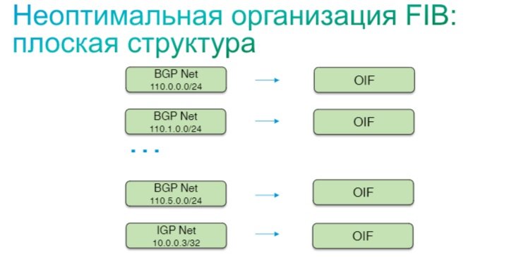
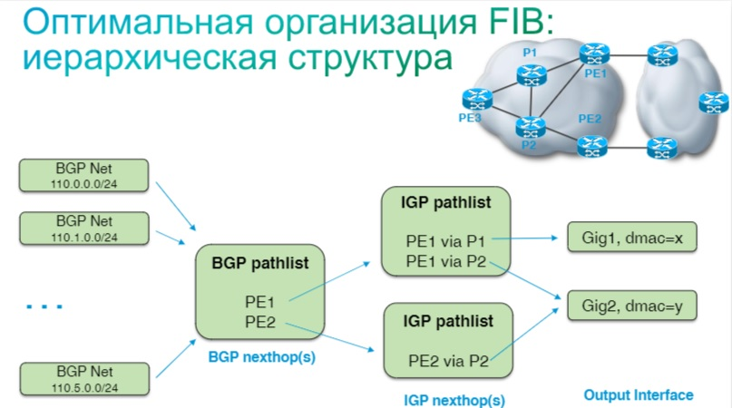
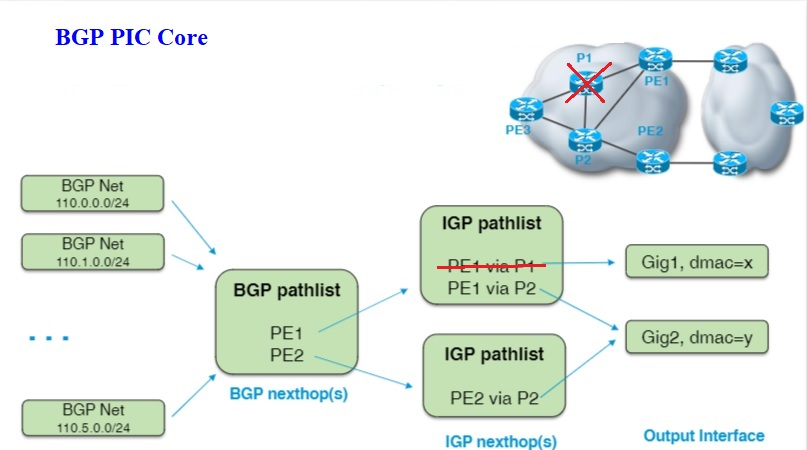
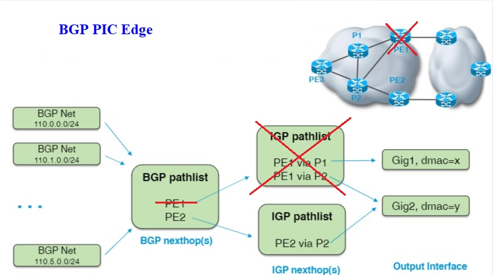

title: BGP PIC

# BGP PIC
## Назначения механизма
BGP PIC(Prefix Independent Convergence) - механизм, который обеспечивает независимую от RIB сходимость префиксов на уровне FIB.

**Изначально FIB был плоским, т.н. FIB flattened.**
При такой схеме организации FIB при смене next-hop-а, в RIB приходится перестраивать всю таблицу маршрутизации касательно тех префиксов, у которых сменился netx-hop. Для BGP, где этих перфиксвов для ipv4 в FV сейчас уже больше 850000 записей сходимость будет занимать достаточно длительное время.

Для решения проблемы по времени сходимости была придумана иерархическая модель организации FIB, т.н. FIB hierarchial.

Иерархическая модель является по сути ссылочной моделью, когда next-hop-ом для BGP префикса по сути является ссылка на next-hop(ы) IGP префиксов.

Такая модель удобна тем, что при пропадении одного из IGP NH, просто используются другие доступные IGP NH и нет необходимости в пересчете маршрутов для всех BGP префиксов. Точно также и при пропадении одного из BGP NH, используются другие доступные BGP NH. 
Таким образом, достигается быстрая сходимость по протоколу BGP.

!!! note "Важно"
      Непрямая зависимость между IGP и BGP записями 
      позволяет избежать обновления BGP информации в FIB в случае, 
      если BGP префиксы не затронуты напрямую.

Необходимые условия для такой работы - наличие нескольких ECMP маршрутов до NH для BGP и IGP.
**Такая модель работы и называется BGP PIC.**

Например, при включении режима multihop в BGP - как раз начинает работать механизм BGP PIC.

### Имеется два варианта работы:
При BGP PIC возможно два варианта возникновения проблемы с NH

- BGP PIC Core
- BGP PIC Edge

#### BGP PIC Core
BGP PIC Core - происходит, когда нарушается связность внутри сети, в таком случае BGP NH не меняется, а происходит смена IGP NH.

При этом в RIB просто удаляется нерабочий IGP NH и остаются только рабочие IGP NH.
И таким образом, не происходит пересчет BGP префиксов в FIB.
При этом BGP NHT(Next-Hop Address Tracking) - посылает уведомление процессу BGP, которое может привести к запуску BGP Control-Plane Convergence.
BGP NHT - это функция, которая уведомляет BGP об изменении маршрутизации для BGP NH.

!!! warning "Важно"
          Посредством BGP NHT через Data Plane по сути происходит управления Control Plane.

#### BGP PIC Edge
BGP PIC Edge - Когда становится недоступным пограничный маршрутизатор.

В таком случае, меняется сам BGP NH. При этом в FIB просто удаляется недоступный BGP NH, и остаются только рабочие BGP NH
при этом перестроения BGP prefix-ов в RIB тоже не происходит. 
При этом BGP NHT(Next-Hop Address Tracking) - посылает уведомление процессу BGP об удалении BGP NH, которое приводит к запуску BGP Control-Plane Convergence.

### Литература по BGP PIC 
#### 1. [Конфигурация и особенности BGP PIC призентация](https://community.cisco.com/t5/%D0%BC%D0%B0%D1%80%D1%88%D1%80%D1%83%D1%82%D0%B8%D0%B7%D0%B0%D1%86%D0%B8%D1%8F-%D0%B8-%D0%BA%D0%BE%D0%BC%D0%BC%D1%83%D1%82%D0%B0%D1%86%D0%B8%D1%8F/%D0%BA%D0%BE%D0%BD%D1%84%D0%B8%D0%B3%D1%83%D1%80%D0%B0%D1%86%D0%B8%D1%8F-%D0%B8-%D0%BE%D1%81%D0%BE%D0%B1%D0%B5%D0%BD%D0%BD%D0%BE%D1%81%D1%82%D0%B8-border-gateway-protocol-bgp-prefix/ta-p/3148094?attachment-id=40782)

#### 2. [Конфигурация и особенности BGP PIC вебинар](https://community.cisco.com/t5/%D0%BC%D0%B0%D1%80%D1%88%D1%80%D1%83%D1%82%D0%B8%D0%B7%D0%B0%D1%86%D0%B8%D1%8F-%D0%B8-%D0%BA%D0%BE%D0%BC%D0%BC%D1%83%D1%82%D0%B0%D1%86%D0%B8%D1%8F-%D0%B2%D0%B8%D0%B4%D0%B5%D0%BE/%D0%BA%D0%BE%D0%BD%D1%84%D0%B8%D0%B3%D1%83%D1%80%D0%B0%D1%86%D0%B8%D1%8F-%D0%B8-%D0%BE%D1%81%D0%BE%D0%B1%D0%B5%D0%BD%D0%BD%D0%BE%D1%81%D1%82%D0%B8-border-gateway-protocol-bgp-prefix/ba-p/3107354)

