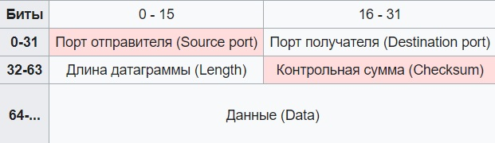

title: UDP

# Протокол UDP

## Определение/Назначение

**UDP (User Datagram Protocol)** - протокол транспортного уровня в [модели OSI](https://icebale.readthedocs.io/en/latest/networks/protocols/OSI-anatomy/).
Предназначен для передачи данных по сети, является одним из наиболее популярным протоколом. 
Особенностью протокола udp является, то что он в отличии от tcp не создает соединения при обмене информации с другой стороной, а посылает поток данных без подтверждения их доставки. Является ненадежным протоколом доставки транспортного уровня. 

Контроль за целостностью данных и их повторной досылкой при такой необходимости(если такая задача стоит) уже выносится на уровень функционала самого приложения. 

В этой связи UDP часто используется как RTP (Real Time Protocol), где нужно своевременность доставки информации, вместо ее надежности,
например видео и аудио потоки.

Единицы измерения - датаграмма(datagram). 

## Структура заголовка

- Source port: 2 bytes
- Destination port: 2 bytes
- Length: 2 bytes
- Checksum: 2 bytes

**Итого размер UDP-заголовка = 8 bytes**

### Псевдозаголовок
Как и в [TCP] протоколе в UPD заголовке тоже нет информации об адресе отправителя и получателя, поэтому даже при совпадении порта получателя нельзя с точностью сказать, что сообщение пришло в нужное место. 

Псевдозаголовок не включается в UDP-datagam. Он используется для расчёта контрольной суммы перед отправлением сообщения и при его получении (получатель составляет свой псевдозаголовок, используя адрес хоста, с которого пришло сообщение, и собственный адрес, а затем считает контрольную сумму).
И таким образом получатель понимает от кого и кому предназначена данная udp датаграмма и передается дальше уже с точным определением «приложения», которому эти данные предназначены.

## Реализация протоколов на базе UDP
В настоящее время на базе протокола UDP бурно развивается протокол QUIC, разработанный Google, для передачи http/https.

## Пример udp в дампе
дамп трафика при работе dns по протоколу udp можно посмотреть [здесь](https://icebale.readthedocs.io/en/latest/networks/wireshark.collection/dns-A-rec-mail.ru-udp.pcapng)

## Литература
[wikipedia](https://ru.wikipedia.org/wiki/UDP)