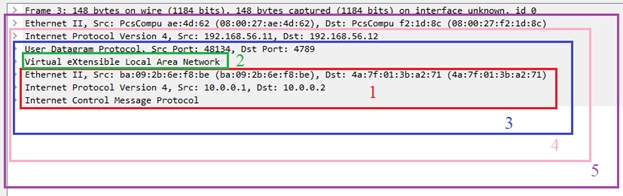
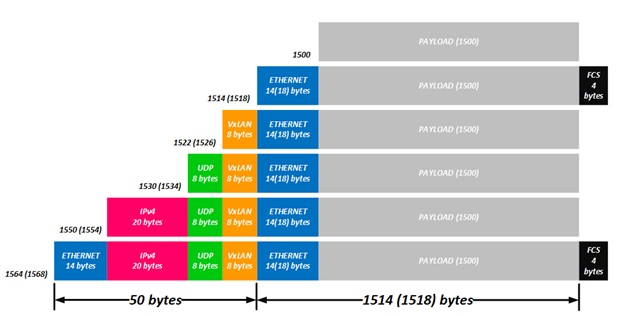

title: VxLAN

# VxLAN


Disclaimer:

```bash
Это почти, вольный пересказ статьи с Хабра «Введение в VxLAN»
Написана здесь для собственных учебных целей, чтобы разложить для себя «по полочкам» материал об VxLAN.
Прости Марат, но уже другой… )
```

Так что если вам интересна тема, то вот [оригинал статьи](https://habr.com/ru/post/344326/)


## Рассматриваемые темы

```bash
1.	Понятие VxLAN
2.	Терминология VTEP, VNI…
3.	Типы реализации VxLAN
    - Особенность реализации EVPN на базе underlay VxLAN
```

## Основы: 

VxLAN – это технология L2 связности через L3 сеть. По сути VxLAN – по своей идее аналогичен MPLS/L2VPN, MPLS/EVPN.


### Лирическое отступление

VxLAN – сети для «бедных»… 

По сути, за этим пседоопределением скрыт весь смысл VxLAN… Рассмотрим это поподробнее.
На первый взгляд профит от сетей на базе MPLS много больше, чем от VxLAN.
На базе underlay сети MPLS тут тебе и L2 и L3 и трафик инженеринг.
А VxLAN дает только передачу L2 по опорной сети L3, т.е в VxLAN в качестве underlay сети выступает чистый L3.

Но если рассматривать сферу применения технологий MPLS и VxLAN, то сразу становится понятным, что оборудование поддерживающее MPLS пользуют крупные ISP, которым надо гонять и L2 и L3 на просторах всей своей сети…
А VxLAN пользуют ЦОДы (DC – Data Center), которым нужна L2 связность между своими локациями (сайтами) и в которых используется всеми любимый дизайн сети CLOS, который подразумевает наличие большого и легко масштабируемого парка маршрутизаторов.
Так вот если сопоставлять стоимость оборудования поддерживающего MPLS и VxLAN, то оборудование поддерживающее MPLS на много дороже по ценовой категории, чем оборудование поддерживающее VxLAN, п.э. из экономических соображений ЦОДы гоняют L2 не в MPLS/(L2VPN,EVPN), а в VxLAN.


**P.S.** Ну и как несложно понять оборудка, на которой есть реализация MPLS также как правило поддерживает и VxLAN.


## Терминология 

По аналогии с MPLS PE в VxLAN - это VTEP (Virtual Tunnel End Point) – это устройство, на котором происходит инкапсуляция/декапсуляция кадров в/из VxLAN. 

Роль влан-тега выполняет VNI (Virtual Network Identifier) – имеет длину 24bits  - соответственно количество VNI = 16 777 214, что значительно больше VLAN=4096

По сути, стандартный Ethernet кадр с дополнительным заголовком с VNI заворачивается в UDP датаграмму и передается по L3 сети на основании данных VTEP. 

VNI в отличии от метки MPLS (которая дложна быть уникальна только внутри одного устройства) должен быть уникальным для всего VxLAN домена.


### Пример VxLAN



```bash
1 - Стандартный «клиентский» кадр 
2 - Заголовок VxLAN
3 - Стандартная UDP датаграмма
4 – Стандартый IP пакет
5 – Стандартый кадр, внутри которого находится VxLAN
```

VxLAN в рамках модели OSI можно представить в виде:



По сути, стандартный «клиентский» кадр инкапсулируется в UDP датаграмму и далее в ip и далее в L2 кадр…

В статье достаточно ясно указали причину такой  последовательности упаковки.

Вопрос: почему бы сразу не упаковывать «клиентский» кадр в ip? – Ответ заключается в том, что заголовке ip имеется  поле «protocol», которое указыввает тип протокола вышестоящего уровня, а для VxLAN такового номера нет, п.э. при его обработки могут возникнуть вопросы(непонятные ситуации) с обработкой такой структуры.

Вопрос: почему «клиентский» кадр упаковывается в UDP, а не в TCP? – Ответ на этот вопрос тоже на поверхности: представьте что у вас 
клиентский кадр тоже передает tcp, тогда начнутся всякие интересные «спецэффекты», что контроль передачи информации будет происходить дважды и может увеличить задержку при передачи информации, за счет «tree-way handshake», уменьшения «slider window», «congestion control» и пр. тонкостей работы протокола TCP.

Тут же при упаковки «клиентского» кадра в UDP, по сути не производится контроль передачи, впрочем как и при стандартной передачи кадра по сети на L2 уровне. Под VxLAN специально выделен UDP порт 4789.

## VxLAN vs VLAN

"Плюшки" от внедрения VxLAN:
```bash
1. Нет необходимости в протоколе семейства STP;
2. Быстрая сходимость в случае отказа узла или линка;
3. Не надо перекладывать вланы в случае физического обрыва линка, трафик пойдет автоматически через оставшиеся линки.
4. Увеличенное количество L2 доменов (4K vs 16M);
5. Балансировка трафика по эквивалентным путям (ECMP);
6. L2 можно растянуть на несколько площадок;
7. При добавлении нового влана нет необходимости протягивать новый влан по всем промежуточным коммутаторам сети 
   (в VxLAN конфигурация делается только на VTEP).
```

## Типы VxLAN (по сути варианты реализации поиска VTEP соседей)

### Static (Unicast) VxLAN

**Static (Unicast) VxLAN** – способ, когда все удаленные VTEPы указываются вручную в конфигурации. При такой работе происходит юникаст расфлуживание (реплицирование "клиентских" кадров), которое нужно передать в определенный VNI.
 Минусы: 
  - сложность администрирования (ручная настройка)
  - большой объем флуда

### Multicast VxLAN

**Multicast VxLAN** – способ, когда определенные VNI ассоциируются с определенными мультикаст группами. Таким образом, поиск VTEP соседей осуществляется в автоматическом режиме, посредством работы с мультикаст группами, соответственно VTEPы слушают мультикаст группы, которые ассоциированы с VNI (или несколькими VNI). Тогда если пакет от одного VTEP-а отправляется на определенную мультикаст группу, то его примут все участники данной мультикаст группы. Тут в отличии от «Static VxLAN» нет необходимости реплицирования кадров, а достаточно отправить «клиентские кадры» запакованные в UDP на определенную мультикаст группу, которуб слушают все нужные VTEPы.

По сути, тут работает связка PIM + VNI-мультикаст группа.

### EVPN VxLAN

**EVPN VxLAN** – способ, когда в качестве control plane для VxLAN используется EVPN.
По сути «control plane» тут осуществляется с помощью BGP протокола, который благодаря  многообразию своих AFI/SAFI может таскать внутри себя практически любую информация.  В данном случае по BGP  осуществляется изучение mac адресов между VTEP-ами и поиску соседних VTEP-ов. 

Под EVPN в BGP выделено AFI 25/SAFI 70 – это позволило превратить mac адрес в аналог маршрутизирумых адресов ip и передавать его в BGP 
анонсах – тут прямая аналогия с L3VPN.

При использовании EVPN/MPLS в BGP NLRI передавался сам mac адрес (естественно не забываем про RT/RD/next-hop и т д ) и MPLS метка. Сейчас нам метка ни к чему — у нас нет MPLS. А она нам и не нужна, потому что у нас есть VNI! Вопрос только в том, как вместо метки в BGP сообщении закодировать VNI. 

Для передачи VNI используют метку EVPN NLRI, которая как раз равна 3 байта – 24 бита, необходимых для передачи VNI. 
Остается только вопрос как различить MPLS метку от VNI?
(при кодировании MPLS метки последние 4 бита не используются, п.э. значение 
"01100100"– будет восприниматься на MPLS метка "0110 0100" = "6" , а не "100".

Для решения данной проблемы, вводится дополнительное комьюнити (VxLAN Encapsulation).

Остальные принципы работы примерно такие же как в сзязке MPLS/EVPN, те же 5 маршрутов.
Концепция EVPN подразумевает следующее поведение — когда какой-то из удаленных VTEP-ов изучил mac адрес через data plane, он формирует BGP сообщение, в котором указывает данный мак и рассылает его своим пирам. Все остальные VTEP-ы, приняв это BGP сообщение инсталлируют полученный mac в таблицы форвардинга. Таким образом, при отправки на такой mac адрес «клиентского » кадра такой кадр рассылается уже не ка BUM трафик (флудясь во все известные VTEP соседи), а посылается уже unicast (таргетно) согласно известной записи в таблице mac адресов.

Также отличается механизм защиты от петель при multihoming All-Active.
В EVPN/MPLS эта проблема решена простым добавлением ESI метки в стек — если в стеке есть такая метка, то DF не станет отправлять трафик обратно в сегмент, из которого трафик получен. Но в VxLAN нет меток.

Как и в EVPN/MPLS интерфейсы, которые смотрят в один и тот же сегмент должны иметь один и тот же идентификатор — ESI. После обмена маршрутами типа 4, узлы находят своих партнеров по ESI (в отличии от MC-LAG их может быть больше двух) и выбирают DF (Distignated Forwarder), который будет слать широковещательный трафик в сегмент. Так как в VxLAN нет меток, но известны адреса соседей по ESI, то при получении широковещательного кадра, коммутатор сначала смотрит, с какого source адреса прилетел пакет (то есть из какого туннеля). Если пакет прилетел от VTEP-а, который у него указан, как сосед по ESI, то кадр в сторону клиента не отправляется. Как правило этот механизм реализован на уровне железа и носит название "local bias".


### VxLAN с использованием контроллера

В таком сценарии настройка VTEP сводится к указанию адреса контроллера, а поиск соседей и прочий сопутствующий функционал реализуется контроллером.


## Литература

- [1. Введение в VxLAN]((https://habr.com/ru/post/344326/)

Пример дампа в wireshark можно посмотреть [здесь](https://icebale.readthedocs.io/en/latest/networks/wireshark.collection/vxlan-arp-icmp.pcapng)