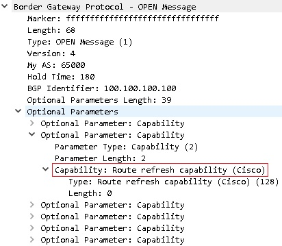

title: Route refresh

# Route refresh  
Route refresh -  Механизм, который позволяет перезапрашивать у соседа всю таблицу префиксов без переустановления BGP сессии.
Такое может быть необходимо, например при смене входящего фильтра.
Запрос на обновление маршрутов передается в сообщении BGP Route-Refresh message.

Описан в [RFC-2918](https://datatracker.ietf.org/doc/html/rfc2918)

Изначально после установления соединения BGP спикеры обмениваются сообщением "OPEN message", в котором указывают поддерживаемые ими параметры
(Optional Parameter: Capability).

В том числе и параметр поддержки механизма Route Refresh




В статье [Route Refresh vs Soft Reconfiguration](https://ccieblog.co.uk/bgp/route-refresh-capability-vs-soft-reconfiguration)
описаны какая фича лучше или хуже...

По итогу, если есть поддержка "Route Refresh", то "Soft Reconfiguration" по факту и не нужна.

При подачи команды 
```bash
clear ip bgp x.x.x.x in
```
если механизм "Route refresh" поддерживается, то происходит отправка соседу сообщения "ROUTE-REFRESH Message", в котором отправляющая сторона просят перслать заново все известные соседу маршруты, при этом сессия BGP не переустанавливается.

