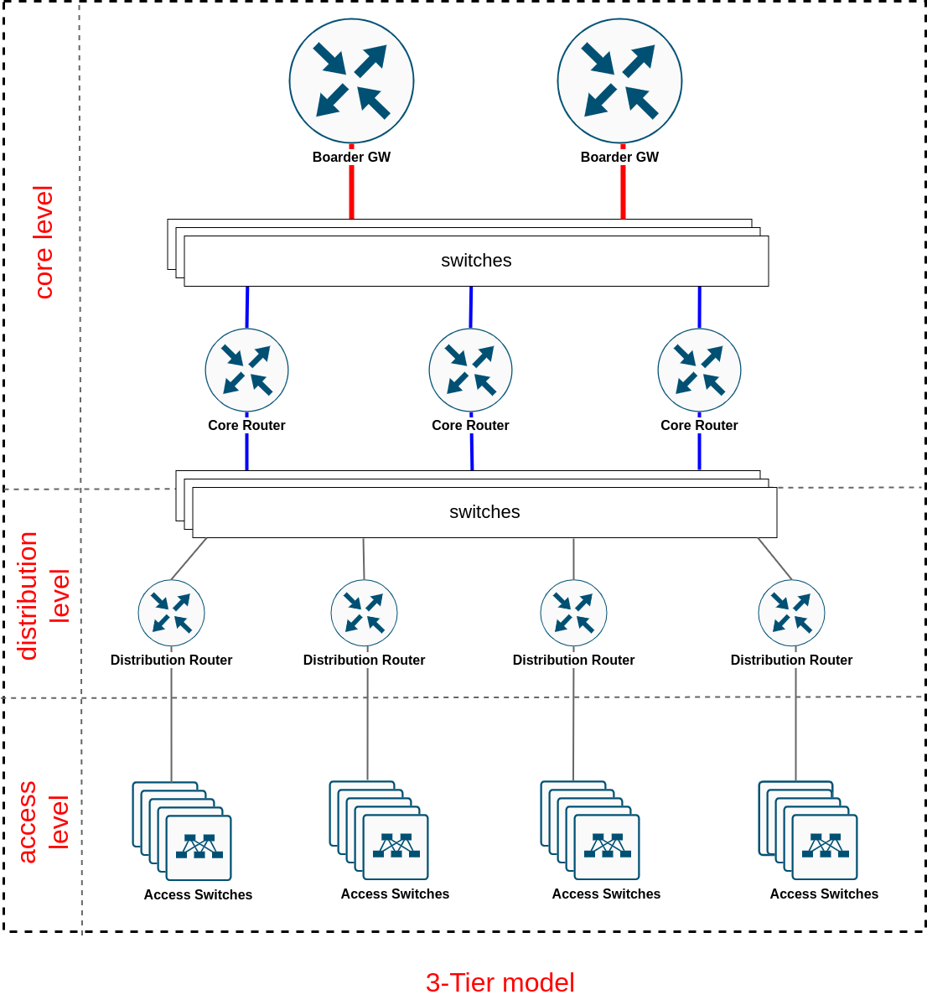
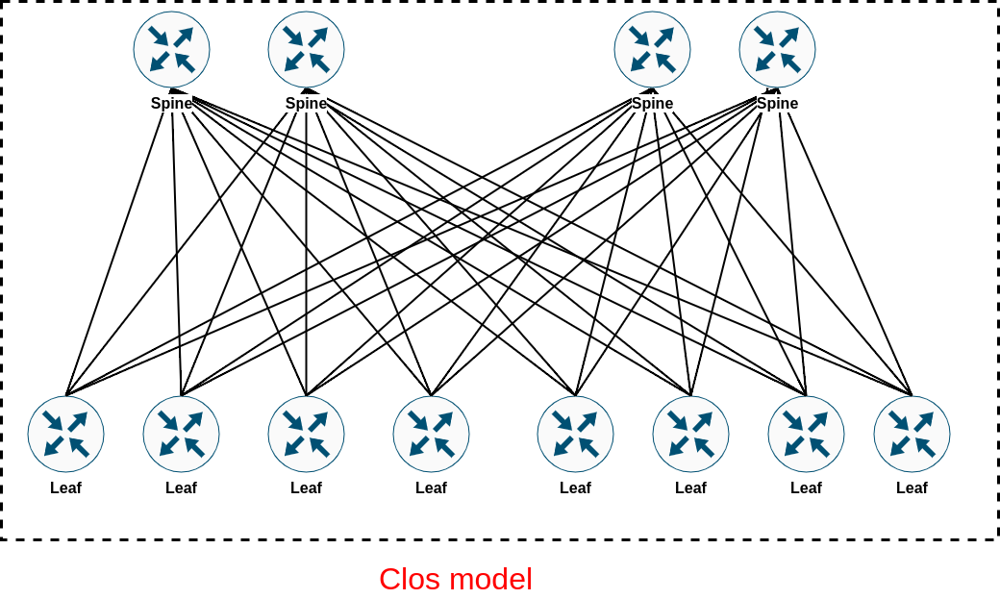
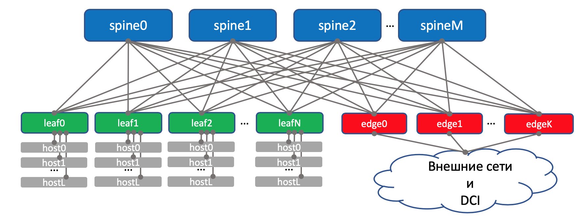
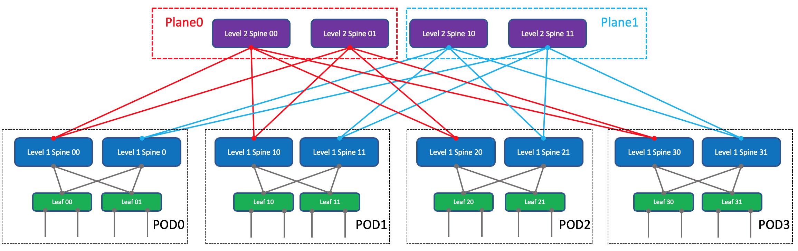
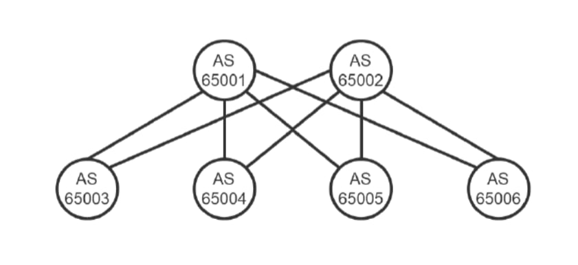
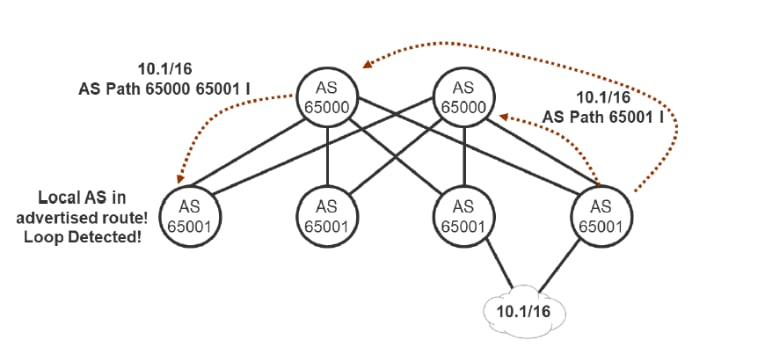
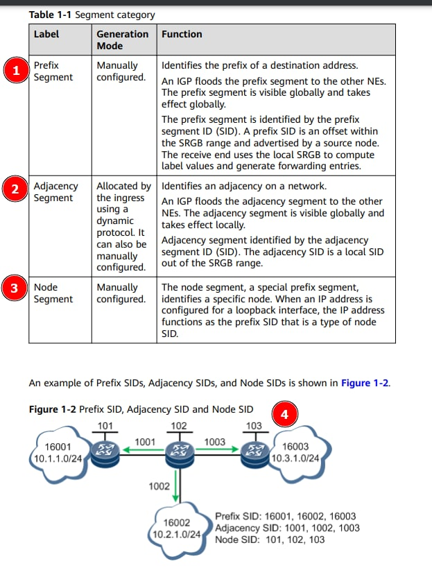
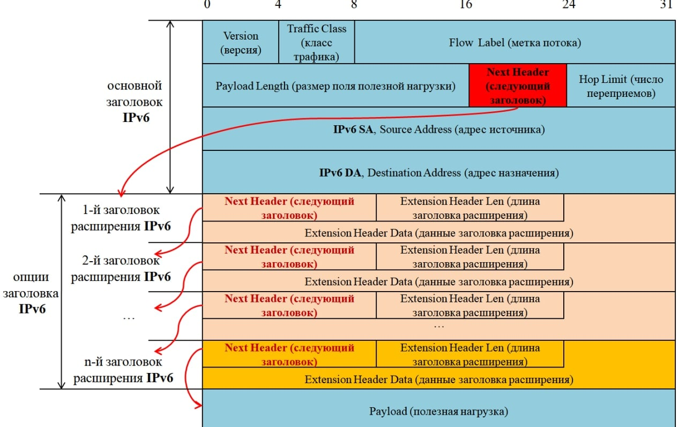
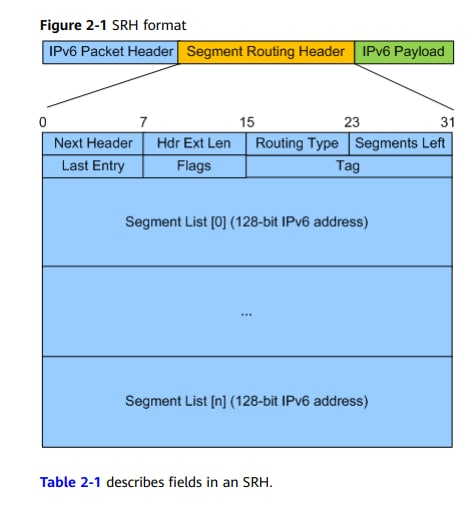
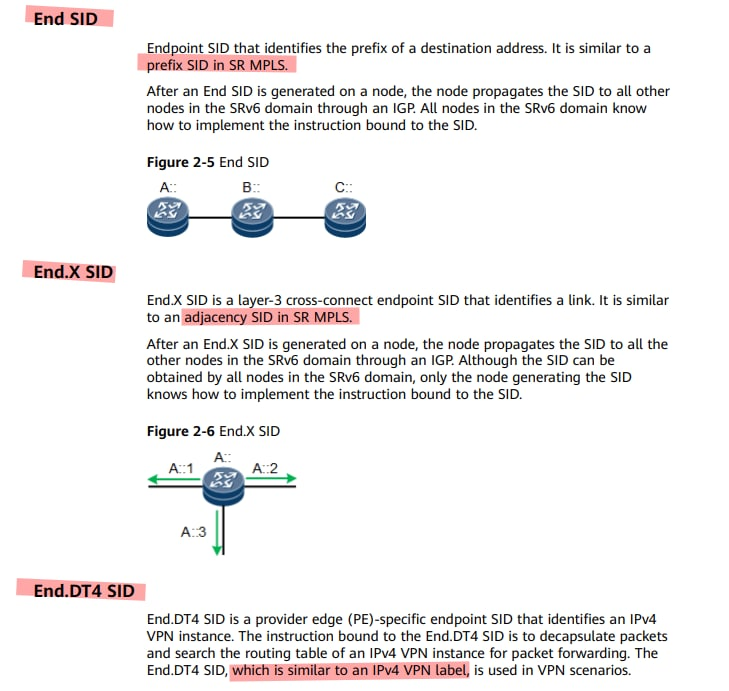

title: DC и все, все, все...

# DC


## Рассматриваемые темы

```bash
1. Архитектура cетей ISP/DC
  1.1. Сети ISP - Классические 3-х уровневые сети (3-Tier)
  1.2. Сети DC 
     - сети Clos 
  1.3. Сети Clos vs 3-Tier

2. Дизайн сетей Clos
  2.1. IGP+BGP
  2.2. eBGP
  2.3. iBGP + eBGP

3. Технологии и эволюция DC (overlay/underlay)
  3.1. EVPN/MPLS vs EVPN/VxLAN
  3.2. Оверлей от хоста/Чистый L3 (MPLSoverGRE, MPLSoverUDP)
  3.3. SR
  3.4. SRv6
  3.5. Conclusions (+/-)
```

```bash
"Итак, погнали! (ц) Дима Ч. )"

Постараюсь рассказать своими словами и разложить всё "по полочкам"...
```

## 1. Архитектура "классических" сетей и сетей DC

Как обычно нужно начать с общих определений, а потом переходить к частностям.

### 1.1. Сети ISP - Классические 3-х уровневые сети (3-Tier)

Исторически сформировалась топология иерархической 3-х уровневой модели сети - как правило это типичная сеть ISP:

``` bash
1. Уровень Ядра
2. Уровень Дистрибуции
3. Уровень Доступа
```

``` bash
Каждый из этих уровней отвечал за свой функционал:
"1. Уровень Ядра" - состоит из пограничных маршрутизаторов и маршрутизаторов ядра
  Как видно из названия:
   - Пограничные маршрутизаторы - отвечают за связь с миром
   - Маршрутизаторы ядра - осуществляют маршрутизацию внутри сети 
     и отвечают за взаимодействия между пограничными маршрутизаторами 
     и коммутаторами дистрибьюции

"2. Уровень Дистрибуции" - состоит из коммутаторов дистрибьюции.
  Коммутаторы дистрибьюции - это как правило L3 коммутаторы, задача которых
   обеспечить связность между ядром и коммутаторами доступа.

"3. Уровень Доступа" - коммутаторы, в которые подключаются конечные клиенты.
```



3-Tier сеть


#### Технологии, используемые в 3-Tier
Классическая 3-х уровневая модель сети может реализовываться на 3-х различных технологиях:

``` bash
- VPN (pptp, l2vpn)
- BRAS (pppoe)
- IPoE
```

##### VPN (pptp, l2vpn)
```bash
 На заре "провайдостроения" была популярна данная технология посторения сети.
 Технология постоения сети, когда изначально ip адресация выдается как правило при помощи DHCP сервера.
 И создается так называемая "опорная ip сеть". 
 Потом поверх нее для доступа в Интернет происходит подключение к VPN-серверу провайдера, 
 например pptp, l2tp и пр...
 Таким образом, пользователи внутри сети как правила неизолированы друг от друга. 
 Плюс к этому для доступа в Интернет нжно было дополнительно авторизоваться на VPN сервере провайдера.
```

##### BRAS (pppoe)
```bash
 Далее технологии "провайдостроения" развивались по принципу изолирования 
 и централизации управления пользователями
 Клиент авторизовался по логину и паролю на так называемом BRAS (Broadband Remote Access Server), 
 который как раз и представлял из себя PPPoE сервер.
 Приемущество такого подхода заколючалось в том, что клиенты в такой топологии как правило 
 не могли общаться напрямую друг с другом минуя центрального PPPoE сервера. 
 Таким образом достигалась изоляция пользователей. Также плюсом PPPoE являлось то, 
 что для авторизации не нужно было опорной ip сети, 
 ибо для PPPoE  общение между клиентом и сервером это просто "труба" 
 исключительно P2P (PADI, PADO).

```

##### IPoE 
```bash
 Далее технологии "провайдостроения" развивались по принципу унификации и так появилась 
 так называемая технология IPoE.  Ни в одном RFC про нее нету ни слова. )
 А технология тем не менее есть и весьма популярна...

 Суть технологии заключается в том, чтобы выдавать ip адрес клиенту согласно его местоположению в сети,
 т.е. согласно информации оо коммутаторе и норему порта, куда клиент подключен, 
 так называемая DHCP option 82. По сути с помощью option 82 как раз и передается информация о коммутаторе 
 и порту на котором находится клиент.
 В соответвии с данной информацией DHCP и выдает ip адрес клиенту.
```

```bash
Если говорить за общие принципы постоения 3-Tier, то все сводилось к тому, 
что от "доступа" в сторону "пограничников" происходило увеличение сложности 
и конечно же стоимости оборудования сети. И по сути ядро сети было реализовано на достаточно мощных железяках, 
масшабировать которые как правило было проблематично с точки зрения стоимости и архитектурных решений. 
Также если например ядро сети состояло из двух "плеч", то падение одного из них 
приводило к деградации пропускной способности в 2 раза соответственно, п.э. как правило запас 
по емкости каналов закладывался с запасом в 2 раза...

Тут стоит обязательно упомянуть о "географии" хождения трафика.
Как правило в сети ISP трафик ходит "сервер-юг", т.е. трафик по "много" большей части входящий идет 
из сети Интернета к пользователю и по "много" меньшей части обратно - исходящий трафик от пользователя 
в интернет и также немного внутри самой сети.
```

```bash
Если брать "физику процесса", то я бы по восходящей охарактеризовал это так:
 1. Dial-up
 2. Docsis
 3. xDSL (ADSL/SHDSL)
 4. Campus (ETTH/xPON)
```

#### 1.2. Сети DC

```bash
 Сети DC принципиально отличаются по идиологии от сетей ISP.
 Все дело именно в той самой "географии" хождения трафика.
 Дело в том, что в отличии от сетей ISP в сетях DC преобладает "западно-восточный" тип хождения трафика.
 Связано это с тем, что сервисы внутри DC сети много активнее общаются между собой в отличие от сети ISP, 
 п.э. такого типа трафика они генерят на порядок больше чем ISP сети.

 Отсюда и сложности реализации на модели сети провайдера функционала сетей DC, а в частности масшабирования.
 Масштабирование в сети ISP - это по сути вложение больших денежных средств в обновление оборудования, 
 что не приемлемо для сети DC.
 Отказ "плеч", приводит к быстрой деградации сети, 
 при этом иметь удвоенный запас по пропускной способности - весьма финансово затратно.

 По этой причине начинались комбинаторные изывкания по поиску приципиально другого дизайна для сетей DC.
 В конечном счете все изыскания завершились на использовании сети Клоза, принцип которой гласит, что...
```

 Как не крути, а цитировать Марата прийдется, чему я впрочем весьма рад! :)
 
 ибо сказать более точно/просто про определение например сети Клоза наверно будет нельзя:

#### - Сети Clos:

```bash
 Клоз предложил неблокируемую сеть, в которой любые входы могут установить соединение 
 с любыми выходами в любой момент времени. 
 Для этого он предложил разделить входы и выходы дополнительным уровнем коммутации, 
 который позволит простраивать соединения между входами и выходами по запросу. (ц) ## Литра [1]

 По сути, дополнительный уровнь коммутации и есть та самая пресловутая "фабрика коммутации", 
 которая позволяет организавать соединение между "входом" и "выходом".
```
 
```bash
 Варианты: 
  - L2 фабрика 
  - L3 фабрика

 - L2 фабрика - когда вся коммутация по сути построена на уровне L2, т.е "switching":
  - Весьма плохое решение, т.к. любое масшабирование приводит к перенастройке всей фабрики. 
  - как правило проприетарно. 

 - L3 фабрика - когда вся коммутация по сути построена на уровне L3, т.е. на маршрутизации ip:
   - маштабируемое решение,
   - вендоронезавимое
```

Таким образом, плавно подходим к рассмотрению архитектуры сетей Clos, тем самымм Leaf-Spine и прочему великолепию...


```bash
Итак, основные тезисы про сети Clos в DC:
- Фабрика сети Clos - это сеть L3, т.е. ip маршрутизация.
- Хоть как правило устройства в сети DC называют коммутаторами, 
  но по сути речь идет именно о маршрутизации, т.е. об L3 функционале.
- Для простоты масштабирования выбирается однотипное оборудование с одинаковым "радиксом" (портовой емкостью).
- Вводится такой термин, как переподписка (оversubscription), 
  который означает отношение суммарной емкости портов аплинков к суммарной емкости портов даунлинков
  Соответственно выбирается приемлемая переподписка из соображений масштаб/денежные затраты.

Сеть Клоза состоит из коммуаторов Leaf и Spine:
картинки буду дергать тоже у  Марата. Прости Марат, так получилось...)

- Каждый Leaf соединяется с каждым Spine-ом
- Spine-ы между собой не соединяются.
```

3-stage Clos сеть



Более функционально 3-stage Clos сеть представлена у Марата - с Edge-Leaf-ами



Для более гибкого масштабирования вводится еще один уровень Super Spine, 
тогда модель получается уже пяти уровневая, тоже взята из сттатьи Марата


```bash
В 5-stage Clos сети появляеся еще одна логическая единица - POD (Point Of Delivery).
- POD - это обособленный набор из Leaf-в и Spine-ов. 
- РОD-ы объединяются между собой через Super Spine, 
- Между Спайнами и Суперспайнами уже нет полной связности - это всязано с конечным количеством портовой емкости. 
  п.э. Super Spine образуют отдельную логическую сущность под названием Plane (плоскость)
```

#### 1.3. Сети Clos vs 3-Tier

Ну собственно, данный раздел уже описан выше.

```bash
Еще раз сделаю основные выводы:
Главный вывод - классическая 3-х уровневая модель не удовлетворяет потребностям сетей DC:
 - Сложно/дорого масштабировать.
 - Неудовлетворяет по принципу хождения трафика "север-юг" vs "запад-восток"

Отсюда и поиск другого дизайна сети для DC.
По итогу архитектура cети Clos полностью удовлетворяет потребностям сетей DC:
 - Легко/бюджетно масштабируется (как правило добавлением просто новых POD-ов)
 - Удовлетворяет по принципу хождения трафика "запад-восток"
```

!!!warning "Важный момент"
          По сути принципиальная разница в посторении классической 3-Tier сети по сравнению с Clos сетью
          звключается в том, что в Clos сети отсутствуют коммутаторы, т.е. компоненты L2 связности,
          т.о. вся по сути сеть представляет собой чистую фабрику из L3 устройств.

## 2. Дизайн сетей Clos

Итак, по сути дальше речь будет идти исключительно об ip-фабрике, она же L3-фабрика.

Внутри фабрики используется несколько протоколов или их комбинация.
Далее рассмотрим динамические протоколы, которые используются для постороения маршрутизации внутри фабрик.

### 2.1. IGP+BGP 
Классическая связка протоколов, унаследованная от ISP.


Для понимания работы такого дизайна можно посмотреть [здесь](https://icebale.readthedocs.io/en/latest/networks/design/disign-l3/)


```bash
Как правило в качестве IGP протокола используется OSPF или IS-IS по которому, 
анонсируются стыковочные сети (linknet) и лупбеки устройств (Leafes и Spaines), 
а клиентские сети аноносируются по протоколу iBGP. 
Для балансировки по ECMP настравиаются одинаковые стоимости путей для протокола IGP (cost), 
чтобы в RIB попадало несколько маршрутов до одного и того же префикса.

Недостаток такого подхода заключается в том, что при большом количестве оборудования, 
что весьма характерно для DC появляется проблема 
в скорости сходимости IGP из-за большого колическтво устройств в фабрике, даже если IGP делить на зоны.
```

По этому на сцену выходит наш любимый BGP в качестве единственного протокола, используемого внутри фабрики. 

!!!warning "Но есть ньюанс(ц)..."
          Например, если в качестве underlay у нас используется MPLS, 
          то для него в "классической" схеме для TE нужно пользовать IGP протокол OSPF (LSA9,10,11)
          или IS-IS дополнительные TLV. чтобы передавать информацию, 
          которую рассматривает RSVP-TE для построения TED(Traffic Engineering Database) - без IGP (OSPF или IS-IS) тут никак!!!
          Далее по нарративу на сцену выходят уже SR или SRv6. но это уже будет описано дальше по ходу повествования... )

###  2.2. eBGP
```bash
Тут принцип такой, что каждое устройство имеет свою собственную AS 
и соответственно все соединения между устройствами устанавливаются согласно логике поведения eBGP. 
Соседство устанавливается на стыковочных ip адресах.
```



Фабрика, основанная на eBGP

```bash
Каждый Leaf имеет соседство с каждым Spine. Для балансировки по ECMP настраивается BGP multipath, 
чтобы в RIB попадало несколько маршрутов до одного и того же префикса.
Приемущество, простота реализации, автоматическая защита от петель, 
т.к. в качестве защиты от петель используется основное свойство eBGP - уникальность AS в AS-PATH

В качестве "спорного" можно указать унифицированность такого подхода.
В связи с чем, некоторые мои товарищи в продакшене всё же предпочитают подход, 
рассмативамый в следующем пункте (iBGP + eBGP). 
Но опять таки оговорюсь - это для подходит связки EVPN/VxLAN, но никак не для EVPN/MPLS...
```

###  2.3. iBGP + eBGP
Есть вариант когда используется принцип комбинации iBGP и eBGP.
Это вариант, когда Leaf-ы находятся в одной AS, а Spine-ы в другой AS. 




```bash
При таком подходе, как "считается" проще:
- осуществлять ZTP устройств (не надо выбирать новые уникальные AS для каждого нового устройства)
- Осуществлять troubleshooting - хотя это тоже относительно спортый момент

Из недостатков такого подхода: при такой архитектуре фабрики нарушается принцип loop-prevention, 
т.к. в AS-PATH префикса, пришедшего на Leaf будет находиться его собственная AS, 
что незамедлительно приведет к дропу данного префикса. 
Однако есть команды, которые меняют дефолтовое поведение loop-prevention и позволяют принимать такие префиксы.
Для Junuiper это такие команды как "as-override" или "advertise-peer-as".

Тут тоже мнения рознятся... Например, весьма уважаемые мною люди, считают, 
что при отключении защиты по сути от loop-prevention много легче наступить на грабли и петлянуть "на все деньги".

Но это скорее вопрос риторический: "На вкус и цвет все фломастеры разные" (ц).
Что запилили в продакшен, то и крутится... )
```

Итак мы рассмотрели протоколы, на которых строится маршрутизации внутри фабрики.

Переходим к "водным процедурам", а именно к вариантам реализации работы фабрики в разрезе overlay/underlay сетей.

## 3. Технологии и эволюция DC (oberlay/underlay)
### 3.1. EVPN/MPLS vs EVPN/VxLAN

[Как я упоминал ранее](https://icebale.readthedocs.io/en/latest/networks/protocols-tech/VXLAN/#_3) когда рассматривал VxLAN.

```bash
Кратко повторюсь еще раз: 
По моему мнению, исторически изначально возник MPLS для сетей ISP.
Позже после L3VPN, L2VPN "подтянулся" к этим оверлеям и EVPN.
И оказалось, что EVPN идеально подходит для работы в DC, в то же время и возникла технология VxLAN.
И вот тут уже сильное влияние оказала экономическая составляющая.
По сути ценник оборудования, поддерживающее VxLAN оказался значительно ниже, 
чем ценник оборудования поддерживающего MPLS.
А с учетом того, что дизайн сетей DC (читай Clos) содержит весьма большое количество оборудования, 
то экономически "сильно" выгоднее было строить сети используя связку EVPN/VxLAN нежели связку EVPN/MPLS.
```


### 3.2. Оверлей от хоста/Чистый L3 (MPLS over GRE, MPLS over UDP)
```bash
Другой подход, отличный от "классического" является организация оверлея от хоста, 
т.е. когда уже на хосте формируется "сервис" по сути любой (L2VPN, L3VPN), упаковывается в ip пакет 
и просто отправляется по чистой L3 сети до хоста назначения, 
где данный оверлей уже распаковываетяс и передаются в нужное место (нужному сервису).
 
Типичный пример такого подхода - это например "OpenContrail" от Juniper, 
который сейчас стал сейчас "Tungsten Fabric".
Где в конечном L3VPN/EVPN реализуются на MPLS over UDP, MPLS over GRE. 
Таким образом, (MPLS over UDP) или (MPLS over GRE) передается на хост назначения через "классическую" L3 сеть.
Тут конечно все "обмазано" SDN. Но реализация "Tungsten Fabric" - это тема как минимум отдельной большой статьи.

Здесь же задача рассмотреть именно разные подходы для реализации фабрик DC, 
сравнить их и выявить их плюсы и минусы...
```

### 3.3. SR
Прогрессивное человечество сетевых инженеров не стояло на месте и вот возникло следующая парадигма развития сетей MPLS андерлеев.

```bash
По сути, при разработки Segment Routing (SR) пытались решить несколько задач:
1. Попытаться уйти от сложного и не очень "поворотливого" протокола RSVP-TE, 
   т.е. по сути найти альтернативу реализации TE.
2. Исключить сигнальные протоколы (RSVP-TE и LDP), т.о. исключив из схему одну точку "отказа"
```

```bash
По итогу в результате работы инженеров IETF появился Source Packet Routing in Networking (SPRING).

```
[SPRING](https://datatracker.ietf.org/wg/spring/documents/#:~:text=Document%20search-,Source%20Packet%20Routing%20in%20Networking%20(spring),-About)

```bash
Основная конценпция SR: 
- Разбиение сети на логические сегменты. 
- Введение так называемых Segment ID (SID), которые являются уникальными внутри сегмента, 
  По сути SID - это префикс в сети.
  SID-ы делятся на 3 категории:
   - Prefix Segment - идентификатор префикса ip сетей
   - Adjacency Segment - идентификатор префикcа ip адреса "linknet" сети
   - Node Segment - идентификтор ip адреса хоста - это ip адрес loopback-а маршрутизатора.
```



```bash
- SIDы - преобразуются в MPLS метки на уровне форвардинга.
- Распространения SID-ов могут происходить в [и/или]:
  - IGP протоколах OSPF(в LSA10), ISIS (в новых типах TLV).
  - с помощью SDN контроллера

Принцип работы в SR "простыми" словами заключается в том, 
что при передачи информации между L2 и L3 уровнем модели OSI добавляются заголовки (MPLS headers), 
по которым пакет должен передаваться по сети, таким образом можно указать путь для пакета 
в явном или не "полностью явном" виде внутри сети. 
Таким образом осуществляется Traffic Engineering в сети SR. 
Соответственно решить самостоятельно задачу по TE оборудка не может 
и эту задачу выполняет внешний контроллер, 
который строит оптимальные маршруты внутри сети в соответствии со свободными полосами.
```


### 3.4. SRv6
Следующим эволюционным шагом был SRv6.

```bash
  Под эгидой того, что "MPLS НЕ НУЖЕН"!!!
```

!!!warning "Идея SRv6..."
          По сути основная идея SRv6 заключается в том, 
          что благодаря возможности стандарта ipv6 добавлять "произвольное" число заголовков в пакет ipv6.
          Таким образом, в пакет ipv6 можно "зашить" точный путь из точки А до точки B, 
          что по сути позволяет передавать внутри ipv6 пакета всю маршрутную информацию об узлах, 
          через которые должен проходить данный пакет.
          Таким образом, по итогу, MPLS становится уже НЕ НУЖЕН!!! - вся инфа уже есть в ipv6!!!

```bash
Основная конценпция SRv6: 
 - В заголовок ipv6 пакета добавляется информация в виде произвольное количество заголовков, 
   т.н. SRH (Segmet Routing Header),
   которые в явном виде указываю путь прохождения данного пакета в сети.
 - SHR  - содержит по сути ipv6 next-hop-a (помимо прочей служебной информации)
 - SRv6 segment ID - это ipv6 адрес. SID состоит из 2-х частей [Locator:Function]
```







```bash
 - Выделяют много видов SID-ов, которые используются для различных случаев:
   - "End SID" - является конечным адресом навзначения (аналог Prefix SID в SR)
   - "End.X SID" - аналог adjecency SID в SR
   - "End.DT4 SID" - аналог сервисной метки в MPLS для ipv4
   - "End.DT6 SID" - аналог сервисной метки в MPLS для ipv6
```




```bash
 - Распространения SID-ов могут происходить в:
  - ISIS (в новых типах TLV).
  - с помощью SDN контроллера
```

```bash
По сути дальше можно инкапсулировать ipv4 и ipv6 сервисы поверх чистой транспортной сети ipv6.

```

```bash
  Вроде бы SRv6 это сплошные плюсы - избавляемся от MPLS, 
  все действия нативны в рамках стандарта ipv6, нно тоже есть ньюансы.
  Например, как пояснил мне эксперт по сетям DC - проблема для сетей DC, 
  основанных на SRv6 заключается в том, что в современных чипах например в Broadcom Trident 
  в настоящее время реализовано малое количество ECMP групп для SRv6. 
  Что приводит к невозможности полноценного использования ECMP с большим количеством "равных путей", 
  ибо при подсчете Hash-a (из-за количество ECMP групп) часть портов просто будет простаивать. 
```

### 3.5. Conclusions (+/-)
```bash
"Пожелания, предложения, жалобы на режим" (ц)

Исторический путь overlay/underlay сетей:
["чистый" MPLS -> VxLAN -> "оверлей от хоста" -> SR -> SRv6]

Если рассматривать эволюцию overlay/underlay сетей, 
то все идет в конечном счете к упрощению предоставления сервисов.

Я думаю, что будущее за SRv6, проблемы с чипами со временем решится, контроллеры напишут...
Реализации, известные мне в продакшене разные и являются скорее воплощений тех идей,
которые приходили на момент деплоя этих сетей в продакшен сетевым инженерам.
Смена принципа работы сети или я бы даже больше сказал - "парадигмы" работы сети  
- это всегда ответственное решение, которое в конечном счете ведет к прогрессу...
"Мир не стоит на месте - всё течет, всё меняется" (ц)
```

## Литра:

- [1. Как построить Гугл. Или сети современных датацентров](https://linkmeup.ru/blog/1262/)
- [2. АДСМ 1.1. Основы виртуализации](https://linkmeup.ru/blog/1260/)
- [3. АДСМ2. Дизайн сети](https://linkmeup.ru/blog/1261/)
- [4. ECMP и балансировка в датацентрах](https://linkmeup.ru/blog/903/)
- [5. Курс Poplar IP-ФАБРИКА И EVPN/VXLAN В СОВРЕМЕННОМ ЦОД](https://www.junipertrain.ru/course/?category=10&course=80) [my achieve](img/dc/achive.jpg)
- [6. New IP Technologies](img/dc/nt.jpg)
- [7. RFC8577](https://www.rfc-editor.org/rfc/rfc8577.html)
- [8. Где сохранить пакет? Чипы и буферы](https://linkmeup.ru/blog/920/)