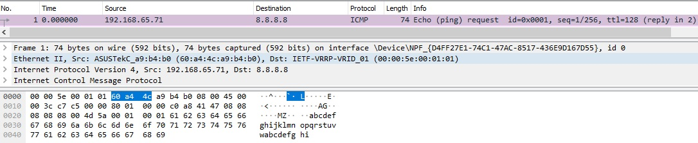
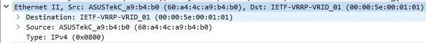
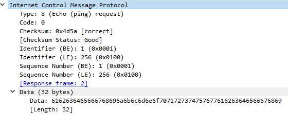
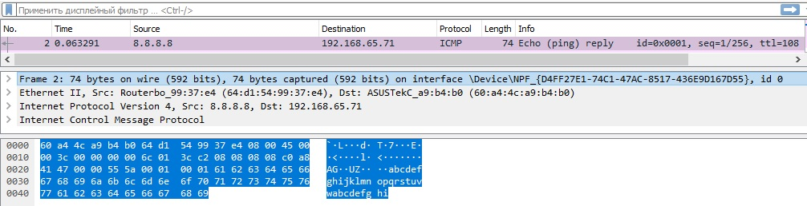
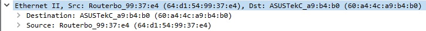
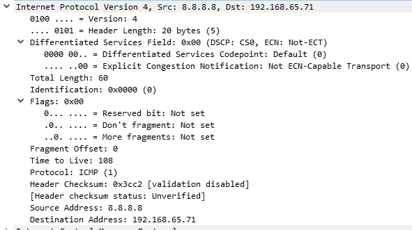
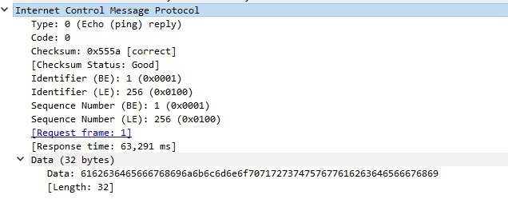

title: ICMP

# Протокол ICMP

Descrambler:
```bash
...Like a pies of cake...
```


## Определение
Можно быть достаточно академичным и написать тут сложное и многоямбовое определение и назначение протокола ICMP, но делать это не хочется, попробую описать в 2-3 словах его суть...

Протокол ICMP (Internet Control Message Protocol) предназначен для диагностики и сообщении об ошибках при проверки сетевой связности.

## Назначение
Примеры назначения.


## Пример icmp протокола:
### Echo-Request
Проверка доступности удаленного хоста (команда ping)

Самый простой пример - это использование icmp в команде ping.



#### L2
```java
 type: 0x800 - IPv4
```



#### L3

```java
 protocol: 1 - ICMP
```


#### L4-L7
```java
Type: 8  - Echo ping (request)
Code: 0
```




### Echo-Reply


#### L2
```java
 type: 0x800 - IPv4
```



#### L3
```java
 protocol: 1 - ICMP
```


#### L4-L7
```java
Type: 0  - Echo ping (reply)
Code: 0
```



Пример icmp дампа в wireshark можно посмотреть [здесь](https://icebale.readthedocs.io/en/latest/networks/wireshark.collection/icmp-ping.pcapng)
