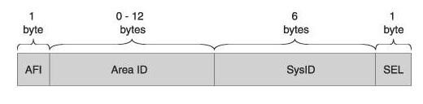
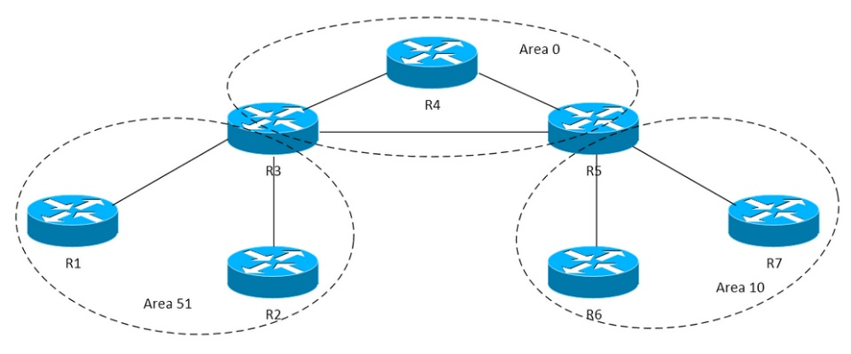
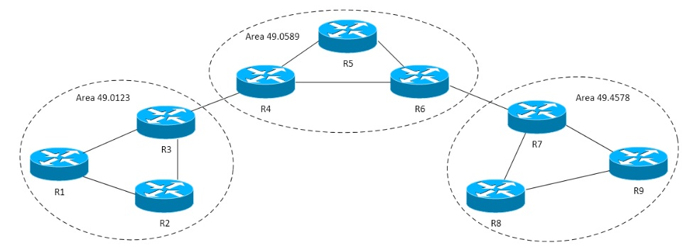
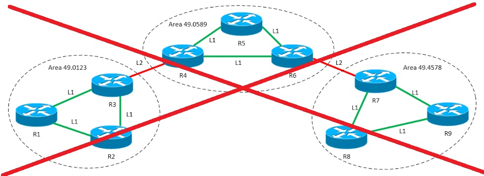
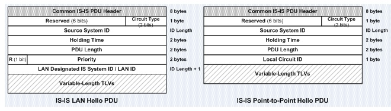
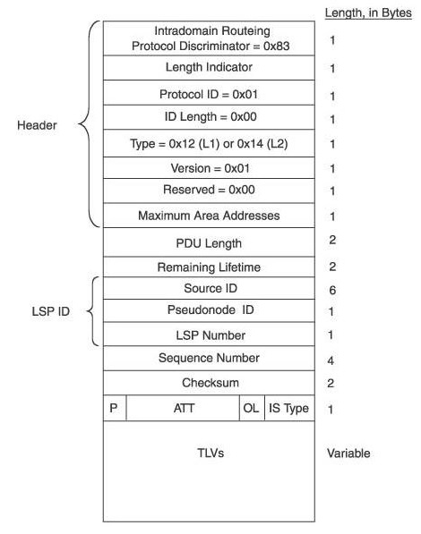
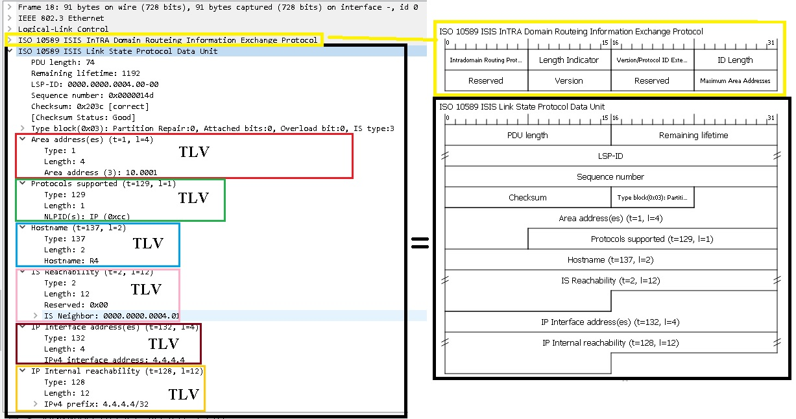

title: IS-IS

# Протокол IS-IS


Disclaimer:

```bash
Говорят, что протокол IS-IS является запрещенным протоколом динамической маршрутизации на территории РФ, 
но это не точно... 
```

## Определение/Назначение

```bash
"IS-IS (Intermediate System to Intermediate System)" - link-state протокол динамической маршрутизации.
```
Алгоритм выбора оптимального маршрута строится по Алгоритму Дейкстры, какой используется и в протоколе [OSPF](https://icebale.readthedocs.io/en/latest/networks/protocols/OSPF/).

## История протокола

История протокола IS-IS уходит своими корнями в то время, когда еще протокол ip не захватил и не монополизировал Layer 3 модели OSI и были и другие реализации протоколов, к таковым относиться и протокол IS-IS...

По этому можно сказать, что протокол IS-IS "не от мира сего", т.е. не от мира протокола ip...

IS-IS работает поверх канального уровня модели OSI, поэтому он не привязан к конкретному протоколу сетевого уровня. 
Также IS-IS не использует протокол IP для доставки сообщений, содержащих информацию о маршрутизации (LSA и прочее).

!!!warning "Важная информация"
			Другими словами, (весьма крамольная мысль с точки зрения современного сетевого стека протоколов) 
			для IS-IS протокола не нужна ip связность между его участниками...

Протокол IS-IS разработан Digital Equipment Corporation как составляющая часть DECnet Phase V. Он был стандартизирован ISO в 1992 году как ISO 10589 для взаимодействия между сетевыми устройствами, которые обозначались как Промежуточные Системы (в противовес конечным устройствам). Основная цель разработки IS-IS - маршрутизация пакетов средствами, входящими в набор протоколов ISO OSI - CLNS.


## Терминология

СLNP (Connection Less Network Protocol) - бесконтактный сетевой протокол - это дейтаграммный протокол передачи данных, функционально очень похожий на протокол IP.

### Адресация в СLNP



NET идентификатор (идентификатор сети):

```bash
- "AFI" (Authority and Format Identifier) - является частью номера области, хотя постоянно изображается отдельно. 
  Подавляющее большинство реализаций IS-IS на маршрутизаторах имеют это поле, равным 49. 
  Адреса, у которых AFI был равен 49, относились к классу локальных.

- "Area ID", номер области, к которой принадлежит маршрутизатор. Это поле переменной длины.

- "System ID" - это идентификатор маршрутизатора. У каждого маршрутизатора в топологии он должен быть уникальным, 
  поскольку именно по System ID маршрутизаторы "узнают" друг друга при осознании топологии. 
  В OSPF аналогом System ID является Router ID (однако он имеет другой формат).
```

В идентификатор сети удобно "забивать" например ip адрес loopback интерфейса и номер локации, для облегчения дебага/траблшутинга в виде:

```bash
Тогда как вариант идентификатор сети будет вида:
49.xxyy.zzzz.zzzz.zzzz.00

где
- "xx" - номер локации,
- "yy" - номер по порядку оборудования
- "zzzz.zzzz.zzzz" - ip адрес loopback интерфейса
	- если IP-адрес 199.106.168.253, то zzzz.zzzz.zzzz==1991.0616.8253
	- если IP-адрес 199.17.7.233, то zzzz.zzzz.zzzz==1990.1700.7233 (недостающие разряды дополняются нулями)
```
Пример
```bash
net 49.0001.1990.1700.7233.00

- "00" - локация 0
- "01" - номер по порядку оборудования
- "1990.1700.7233" - ip адрес лупбека 199.17.7.233
```

### Дизайн сети IS-IS vs OSPF

В отличии от сети OSPF, где маршрутизатор может находиться одновременно в нескольких областях (OSPF AREA), т.к. раздел области идет по интерфейсу.




В сети IS-IS разделение происходит областей происходит по маршрутизатором целиком т.е. маршрутизатор не может быть одновременно в разных областях.




Cуществует два типа доменов IS-IS (на самом деле в теории их 3):
- L1 - соседство, которое формируется между маршрутизаторами в одной области 
- L2 - соседство, которое формируется между маршрутизаторами одной области, так и между разными областями.

Такие два уровня взаимодействий позволяют выделить три типа маршрутизаторов в IS-IS домене:
Маршрутизаторы L1 - это те устройства, у которых все взаимодействия с другими маршрутизаторами происходят на 1 уровне.
Маршрутизаторы L2 - это те устройства, у которых все соседства организованы на 2 уровне.
Маршрутизаторы L1/L2 - это устройства, поддерживающие взаимодействия обоих уровней.


!!!warning "Примечание" 
			На самом деле есть еще домен типа L3 который осуществляет маршрутизацию между различными доменами. 
			В IP-сетях за это отвечает протокол BGP, а в OSI — IDRP (Interdomain Routing Protocol). 
			Маршрутизация L3 не поддерживается маршрутизаторами Cisco.


### Тонкости дизайна
С точки зрения дизайна протокола нижеследующий дизайн не может быть рабочим для IS-IS.



Требование IS-IS, заключающееся в том, что всё множество L2 взаимодействий между маршрутизаторами должно быть непрерывным.

По сути аналогом OSPF Backbone (Area 0) является не какая-то конкретная area с каким-то номером, а все множество соседств L2 между отдельными маршрутизаторами. Именно это множество L2 соседств формирует backbone или ядро сети IS-IS, к которому подключаются остальные части топологии (или остальные area), внутри которых могут быть сформированы соседства уровня 1. В этом контексте маршрутизаторы L1/L2 можно назвать примерным аналогом ABR в OSPF.

 На маршрутизаторе через один интерфейс можно сформировать соседства обоих уровней. То есть маршрутизатор может на одном и том же интерфейсе сформировать и соседство уровня 1, и L2 соседство. С точки зрения протокола IS-IS, это вполне себе штатное поведение. 


## Этапы установления соседства (adjacency) в IS-IS

```bash
1. "New" - состояние когда процесс установления соседства только начинается. 
   Маршрутизатор переходит в это состояние в момент загрузки или при настройке 
   начальной конфигурации IS-IS.
2. "One-Way" - IS-IS маршрутизатор переходит в это состояние после Hello PDU. 
   Машрутизатор находится в этом состоянии пока не будет получен Hello PDU пакет, 
   содержащий адрес локального маршрутизатора в качестве соседа.
3. "Initializing" - состояние в которое переходит маршрутизатор при получении Hello PDU пакета,
   в котором указан его собственный локальный адрес в качестве соседа. Это состояние означает, 
   что была установлена двунаправленная связь.
4. "Up" - состояние полного функционирования отношений IS-IS. Это состояние означает,
   что были сформированы отношения соседства и произошла синхронизация баз данных маршрутизаторов.
5. "Down" - состояние утерянного соседства. IS-IS маршрутизатор переходит в это состояние 
    по одной из нескольких причин: несоответствие зоны (area), окончание таймаута удержания 
    или ошибка аутентификации.
6. "Reject" - состояние маршрутизатора после сбоя проверки подлинности. 
   IS-IS маршрутизатор будет постоянно менять свое состояние между этим и состоянием Down.
```

Так же как и в OSPF для установления соседства используется сообщения типа Hello - IS-IS Hello, но есть несколько существенных отличий.

 IS-IS также формирует соседства благодаря обмену сообщениями IS-IS Hello(IIH), но в отличие от OSPF, IS-IS имеет три разных типа Hello сообщений. Для рассылки Hello на широковещательных и на Point-to-Point интерфейсах в IS-IS используются разные типы сообщений. Помимо этого Hello для широковещательных интерфейсов делятся на два типа: Level 1 и Level 2. В итоге можно сказать, что мы имеем дело со следующими типами IS-IS Hello (или как их еще называют IIH):
 
```bash
1. Point-to-Point
2. L1 LAN
3. L2 LAN
```

Пример формата IIH для LAN и P-t-P



Все сообщения в IS-IS называются PDU - (Packet Data Unit)

Hello PDU, 
Link-State PDU (LSP) - рассмотрим далее.

Ключевой особенностью всех этих сообщений является нахождением в них конструкции "TLV".

!!!warning "Важно"
			TLV - это абревиатура "Type Length Value" - по сути универсальная конструкция, в которою можно закодировать всё что угодно.
			Наличие TLV придает протоколу IS-IS очень большую гибкость, так например для внедрения IPv6 в OSPF пришлось полностью менять
			версию протокола, а в IS-IS достаточно было просто "запилить" новые типы TLV...


Наподобии работы OSPF в широковещательном домене протокол IS-IS тоже производит выбор назначенного маршрутизатора (DIS - Designated Intermediate System) в подобных топологиях. Выбор DIS также производится на основании сравнения приоритетов, настроенных на интерфейсах маршрутизаторов. Если приоритеты одинаковые, то в выборах побеждает маршрутизатор с численно большим МАС адресом. Однако процесс выбора DIS в IS-IS отличается от процесса выбора DR в OSPF следующими деталями:

```bash
1. Не выбирается Backup DIS.
2. Соседства в таком широковещательном домене все равно формируются по схеме Full Mesh, 
   а не только между DIS и не-DIS.
3. Выставление приоритета, равного 0, не означает, что маршрутизатор не может быть выбран DIS.
4. Если в широковещательный домен добавить маршрутизатор с более высоким приоритетом, 
   чем у текущего DIS, то произойдут перевыборы, и новый маршрутизатор возьмет на себя роль нового DIS.
5. Возможно существование разных DIS на уровне 1 и на уровне 2.
```

## "LSDB" IS-IS

В протоколе IS-IS для каждого маршрутизатора тоже в конечном счете формируется общая БД по топологии сети, которая состоит из Link-State PDU (LSP). Принципиальное отличие LSDB OSPF и IS-IS заключается в том, что по сути LSP - это сборная информация о машрутах и стоимости маршрута конкретного маршрутизатора. Каждый маршрутизатор ретранслирует полученный LSP от соседа - все остальным соседям своей зоны.
Т.о. LSDB в IS-IS представляет собой информацию, состояющую из LSP всех соседей области L1 или L2, а в OSPF получается информация распространяется с помощью универсального "транспорта" LSU, внутри которого передаются соответствующие LSA.


Пример структуры LSP




### Типы TLV

```bash
"Area address TLV (TLV Type 1)"

Эта TLV всегда помещается перед остальными. В ней маршрутизатор указывает, какой area он принадлежит. 
Здесь стоит напомнить, что в протоколе IS-IS, согласно дизайну, 
маршрутизатор всегда целиком принадлежит какой-то определенной area.
```

```bash
"IS Neighbors TLV (TLV Type 2)"

Эта TLV служит для описания всех соседних маршрутизаторов, 
которые известны устройству, генерирующему TLV. 
```

```bash
"IP internal reachability TLV (TLV Type 128)"

Эта TLV используется для описания подключенных к маршрутизатору сетей. 
Все сети, которые настроены на интерфейсах, включенных в работу IS-IS, попадают в эту TLV.
```


```bash
"Protocols Supported TLV (TLV Type 129)"

Используется для перечисления протоколов, маршрутизацию которых поддерживает данное устройство. 
```

```bash
"IP external reachability TLV (TLV Type 130)"

Как и в протоколе OSPF, в IS-IS есть концепция внешних маршрутов. 
То есть маршрутизатор может переносить маршрутную информацию в домен маршрутизации IS-IS 
из какого-то другого протокола маршрутизации (OSPF, RIP, BGP, static). 
Такой маршрутизатор называется ASBR, и его работа в этой роли приводит к появлению внешних маршрутов.
```

```bash
"IP interface address TLV (TLV Type 132)"

В эту TLV маршрутизатор помещает адреса тех интерфейсов, которые включены в работу IS-IS, 
и через которые будет производиться рассылка LSP.
```

```bash
"Extended IP reachability TLV (TLV Type 135)"

Эта TLV является еще одним способом, с помощью которого маршрутизатор 
может описать подключенные к нему сети, а также внешние сети. 
Может возникнуть вопрос, для чего она нужна, если уже есть
IP internal reachability и IP external reachability.
Формат предполагает возможность указать только адрес сети и длину префикса. 
То есть эта TLV действительно позволяет описать сеть, не делая акцент на то, 
внешняя это сеть или внутренняя. Помимо этого мы видим единственное поле Metric длиной 4 байта. 
Разумеется, это поле используется для обозначения значения метрики интерфейса, 
к которому подключена внутренняя сеть, или метрики маршрута до внешней сети. 
И длина этого поля – это первая причина, почему существует Extended IP reachability TLV: 
это возможность использовать численно большие значения метрики 
(больше тех, которые давали TLV 128 и 130)
```

```bash
"Dynamic Hostname TLV (TLV Type 137)"

Эта TLV используется для распространения информации о локальном Hostname маршрутизатора. 
```

### Пример LSP



Внутри LSP находятся как "кубики" TLV.


После формирования LSDB IS-IS каждый маршрутизатор по алгоритму Дейкстры строит свою оптимальную таблицу маршрутизации.


## Литература

- [1. XGURU IS-IS](http://xgu.ru/wiki/IS-IS)
- [2. IS-IS Википедия](https://ru.wikipedia.org/wiki/IS-IS)
- [3. IS-IS для тех, кто понимает OSPF (Часть 1)](https://community.cisco.com/t5/%D0%BC%D0%B0%D1%80%D1%88%D1%80%D1%83%D1%82%D0%B8%D0%B7%D0%B0%D1%86%D0%B8%D1%8F-%D0%B8-%D0%BA%D0%BE%D0%BC%D0%BC%D1%83%D1%82%D0%B0%D1%86%D0%B8%D1%8F-%D0%B1%D0%BB%D0%BE%D0%B3%D0%B8/is-is-%D0%B4%D0%BB%D1%8F-%D1%82%D0%B5%D1%85-%D0%BA%D1%82%D0%BE-%D0%BF%D0%BE%D0%BD%D0%B8%D0%BC%D0%B0%D0%B5%D1%82-ospf-%D1%87%D0%B0%D1%81%D1%82%D1%8C-1/ba-p/3103119)
- [4. IS-IS для тех, кто понимает OSPF (часть 2)](https://community.cisco.com/t5/%D0%BC%D0%B0%D1%80%D1%88%D1%80%D1%83%D1%82%D0%B8%D0%B7%D0%B0%D1%86%D0%B8%D1%8F-%D0%B8-%D0%BA%D0%BE%D0%BC%D0%BC%D1%83%D1%82%D0%B0%D1%86%D0%B8%D1%8F-%D0%B1%D0%BB%D0%BE%D0%B3%D0%B8/is-is-%D0%B4%D0%BB%D1%8F-%D1%82%D0%B5%D1%85-%D0%BA%D1%82%D0%BE-%D0%BF%D0%BE%D0%BD%D0%B8%D0%BC%D0%B0%D0%B5%D1%82-ospf-%D1%87%D0%B0%D1%81%D1%82%D1%8C-2/ba-p/3103435)
- [4. IS-IS для тех, кто понимает OSPF (часть 3)](https://community.cisco.com/t5/%D0%BC%D0%B0%D1%80%D1%88%D1%80%D1%83%D1%82%D0%B8%D0%B7%D0%B0%D1%86%D0%B8%D1%8F-%D0%B8-%D0%BA%D0%BE%D0%BC%D0%BC%D1%83%D1%82%D0%B0%D1%86%D0%B8%D1%8F-%D0%B1%D0%BB%D0%BE%D0%B3%D0%B8/is-is-%D0%B4%D0%BB%D1%8F-%D1%82%D0%B5%D1%85-%D0%BA%D1%82%D0%BE-%D0%BF%D0%BE%D0%BD%D0%B8%D0%BC%D0%B0%D0%B5%D1%82-ospf-%D1%87%D0%B0%D1%81%D1%82%D1%8C-3/ba-p/3104734)


Пример дампа в wireshark можно посмотреть [здесь](https://icebale.readthedocs.io/en/latest/networks/wireshark.collection/isis.pcapng)