title: MPLS 

# MPLS 

MPLS и не только.
Зависовки на тему…


## Нарратив:
- [1. Базовые представления о сети MPLS](https://linkmeup.ru/blog/154.html)
	- 1.1. Принцип работы
	- 1.2. Протокол LDP
	- 1.3. Протокол RSVP-TE
- [2. L3VPN](https://linkmeup.ru/blog/204.html)
	- [2.1. MPLS L3VPN и доступ в Интернет](https://linkmeup.ru/blog/248.html)
- [3. L2VPN](https://linkmeup.ru/blog/261.html)
	- 3.1. xconnect (точка-точка)
	- 3.2. VPLS (точка-многоточка)
    	- 3.2.1 Мартини драфт
		- 3.2.2	Компелла драфт
- [4.1. EVPN](https://linkmeup.ru/blog/264.html)
- [4.2. EVPN Multihoming](https://linkmeup.ru/blog/301.html)  
- [5. Inter-AS](https://habr.com/ru/post/302600)
- [6. MPLS TE](https://linkmeup.ru/blog/302.html)
	- 6.1. Использование протоколов Link State (ISIS, OSPF) для передачи информации о TE.
- 7. MPLS SR
	- 7.1. Использование протоколов Link State (ISIS, OSPF) как замена сигнальных протоколов LDP/RSVP-TE

Disclaimer 1:
```bash
Для усвоения вышеперечисленного материала планирую записывать сюда вольный пересказ этих статей 
с дальнейшим описанием реализации данного функционала на практике… 

Хочу сказать огромное спасибо Маратам за цикл статей СДСМ!!! )
```

Disclaimer 2:
```bash
Когда сетевые инженеры достигли совершенства в протоколах динамической маршрутизации, 
то им стало скучно и они решили, что почему бы им не стать на секундочку hardware инженерами 
и не запилить самим коммутаторы и маршрутизаторы на уже существующей основе.

Так и появился MPLS...

P.S. Благо, что новые номера AFI и SAFI преспокойно добавляются в BGP... )))
```

Итак, как говорит один мой друг: "Погнали"! )


## 1. Базовые представления о сети MPLS

## Определение/Назначение MPLS

MPLS (MultiProtocol Label Switching) - технология коммутации пакетов по меткам.

MPLS позволяет просто менять метку и коммутировать пакет дальше по сети, не заглядывая в его содержимое.

Коммутация по меткам универсальна с точки зрения данных, которые находятся внутри пакета.

Но для того, чтобы знать куда отправить пакет нужны изначально данные в RIB, для которых формируются метки, за это отвечают сигнальные протоколы MPLS (LDP, RSVP-TE). LDP, RSVP-TE формируют метки.

MPLS сама по себе как технология связности по меткам бесполезна, но учитываю то, что благодаря MPLS, можно изолировать друг от друга разные пакеты разных клиентских сетей, то в этом свете технология MPLS оказалась очень перспективной.

По сути MPLS является "underlay" сетью для построения "overlay" сетей, таких как: L3VPN, L2VPN, EVPN и пр...


## Терминология MPLS

Терминологии много и она несколько сдублирована по определениям - главно не кольцануть тут! )

```bash
"LSR – Label Switch Router" – маршрутизаторы, оперирующие метками, которые передают пакеты на основании меток, 
т.е. маршрутизаторы сети MPLS (P, PE)
```

```bash
"Intermediate LSR" они же "P" (Provider) – маршрутизаторы, "молотилки" трафика в MPLS. 
Ничё не умеют, кроме переписывания меток(swap) и перекладывания(forward) пакетов из порта в порт.
```

```bash
"PE – Provider Edge (Engress LSR, Ingress LSR)" – инициируют изначально разбегание новых меток по сети MPLS 
при появления новых FEC.
По сути на PE сосредоточен весь интеллект работы сети MPLS…
```

```bash
"Ingress LSR (тоже PE)" - входной маршрутизатор сети MPLS – 
назначает первоначальную метку для пакета (Push Label) в сети MPLS. 
```

```bash
"Engress LSR (тоже PE)" - выходной маршрутизатор сети MPLS – 
снимает метку для пакета (Pop Label) в сети MPLS и отправляет 
на конечный маршрутизатор абона CE  - Customer Router
```

```bash
"LER – Label Edge Router" – (Ingress LSR, Engress LSR. Они же PE – Provider Edge)
```

```bash
"CE – Client Edge" – клиентский маршрутизатор (на нем уже нет MPLS)
```

Роли P-PE могут меняться и зависят исключительно от начальной и конечной точки LSP.


```bash
"LSP – Label Switch Path" – путь переключения меток от источника к получателю 
от Ingress LSR до Egress LSR – т.е. это по сути последовательность коммутаторов.
Другими словами LSP - это однонаправленный путь, т.е. путь «туда», 
может не совпадать от пути «оттуда». 
LSP – строится всегда от Egress LSP в сторону Ingress LSP
```

Пример LSP

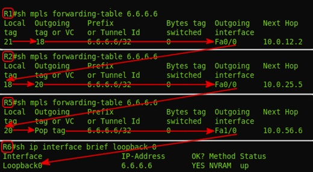


```bash
"FEC – Forwarding Equalence Class" – это эквивалентные классы трафика, 
которые форвардятся использую один и тот же путь в сети MPLS (LSP).
```

!!! warning "Важно!"
			FEC – является ключевым понятием в MPLS – это определения для трафика одного класса, 
			который проходит через коробку по определенному пути, т.е. кадры, 
			пришедший с меткой условно-говоря «20» являются кадрами одного FEC 
			и будут переправлены в определенный инт, и данным кадрам будет навешана определенная метка, 
			которая заранее скалькулировалась именно для данного FEC.
			Тут, в нашем случае FEC – ip адрес назначения в таблице маршрутизации.


Для примера: 

имеется 2 типа класса трафика FEC - web и VoIP, соответственно для каждого из этих типов будет разные маршруты.  

для web –  будет длинный, но более широкий путь по полосе,  

для VoIP (критичного к задержкам) – короткий, но более узкий по полосе. 

Исходя из этой вводной будет сформировано 2 разных LSP (Label Switched Path) 

(т.е. будут разные метки на LSR для этих двух типов, разным FEC…

```bash
"LIB – Label Information Base" – аналог RIB для IP. 
В LIB указано, какую метку менять на какую и в какой интерфейс отправить 
(рекурсивна, так же как и RIB)
```

```bash
"LFIB – Label Forwarding Information Base" – аналог FIB для IP, находится уже на "Data plane", 
например физически на ASIC-ах линейной карты.
```

## Структура заголовка MPLS

Размер заголовка MPLS – 32 bits


```bash
"Label" = 20bit = 2^20= 1048576 – всего меток в MPLS
```

```bash
"TC – Traffic Class" - аналог DSCP в IP  = 3bit =2^3=8 значений
```

```bash
"S – Bottom of Stack" – дно стека меток. Если рано «1» - то больше меток нет, если «0» то есть еще метки дальше
```

```bash
"TTL – Time To Live" – полный аналог IP TTL – 8bit=2^8=255
```

В заголовке MPLS может быть несколько меток, тогда это выглядит следующим образом:


MPLS заголовок вставляется между L2 и L3 уровнями, п.э. его условно называют протокол 2,5 уровня.


## Методы распространения меток:

!!!warning "Принципиальный момент" 
			для понимания механизма работы MPLS необходимо знать, что метки распространяются 
			от получателя трафика к отправителю, т.е. от Engress LSR к Ingress LSR 
			и никак не наоборот!!!

#### 1.	DU vs DoD – отправка соседям инфы про метки для новых FEC

```bash
"DU - Downstream Unsolicited" - как только LSR узнает про новый FEC он тут же 
рассылает всем соседям метки про новые FEC. 
(напоминает механизм PIM SM в мультикасте)
```
```bash
DoD – Downstream on Demand – рассылает метки про новые FEC, только по запросу от соседей.
```

#### 2. Ordered Control vs Independent Control 

```bash
"Ordered Control" – последовательная отправка инфы, про новые FEC метки, 
когда уже пришла инфа от Egress LSR про метку для данного FEC.
```

```bash
"Independent Control" – подход, когда инфа про новые FEC пересылается неупорядоченно 
даже если не дошла метка для данного FEC со стороны Engress LSR
```

Подведу итог по первому и второму пункту:
```bash 
т.е. "DU-vs-DoD" – это про отправки метки без запроса и по запросу от соседа,
а "OC-vs-IC" – это про отправки меток дожидаясь или не дожидаясь 
метки про данный FEC от соседа со стороны Egress LSR 
```


### 3.	Liberal Label Retention Mode  vs  Conservative Label Retention Mode

```bash
"Liberal Label Retention Mode" - Хранит метки для небестовых FEC.
```

```bash
"Conservative Label Retention Mode" - Не Хранит метки для небестовых FEC
```

### Оптимизация работы с метками PHP

```bash
"Penultimate Hop Popping (PHP)" – отбрасывание метки на предпоследнем прыжке – 
оптимизация работы MPLS (чтобы не передавать лишний раз метку если известно, что дальше будет последний, 
т.е. Egress LSR в пути следования пакета).
Тут как раз «палится» метка - 3: Implicit Null. Фиктивная метка, которая используется 
для оптимизации процесса передачи пакета MPLS на Egress LSR. 
Эта метка может анонсироваться, но никогда не используется в заголовке MPLS реально.
```


## Протоколы передачи меток (LDP/RSVP-TE)

### LDP 

"LDP – Label Distribution Protocol"
Ищет соседей – путем отправки Hello UDP пакета на мультикаст адрес 224.0.0.2, порт 646 при TTL=1
Если соседи найдены устанавливает с ними соседство через TCP port 646, TTL=255 Initailization
Keepalive – по TCP установленными соседями. Информация о метках передается в сообщении Label Mapping Message.

У Марата в статье все расписано и понятно про LSP – не вижу смысла дублировать это тут?

Вкраце – "LSR" он же "PE" «понимает», что он стал Egress LSR для нового FEC. Тогда он ставит для своего локального FEC входящую метку «3» - Implicit Null и передает данную метку соседу, сосед добавляет исходящую метку для данного FEC «3» и назначает входящую метку для данного FEC и т.д. по всем участникам LSP.

В результате получается вот такое (бесстыже стырено у Марата) :)

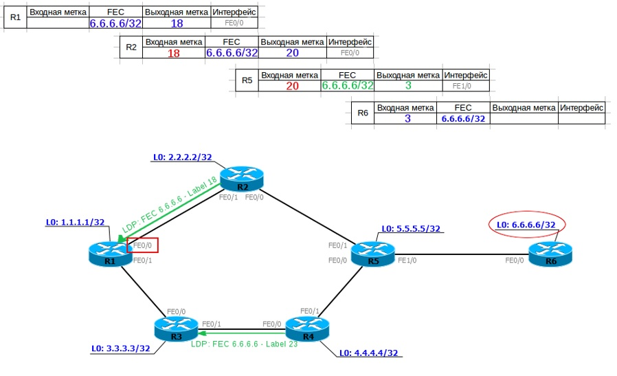


#### Выводы по LDP:
```bash
1.	Данный протокол никак напрямую не использует протоколы IGP 
    (работает в этом плане по принципу PIM)
2.	Не имеет резервных путей
3.	При смене топологии пересчитывается 
    (сначала сходится IGP, потом уже LDP)
```


!!!warning "Остался вопрос по LDP:"
			если на промежуточный LSR прийдет одна и та же метка 
			от двух разных соседей (других LSR) про разные FEC, 
			то проиcходит перегенерация меток на Engress LSR?


### RSVP-TE

"RSVP-TE" – протокол назначения меток с учетом Traffic Enginering-а, когда в канал закладывается еще и гарантированная полоса. 

Такой функционал достигается за счет использования расширений в «Link State» протоколах ISIS и OSFP, с помощью которых распространяется информация о доступной полосе на пути следования пакета LSP для определенного FEC.

Для ISIS - дополнительные TLV.

Для OSPF – opaque LSA (LSA9,10,11) – scope. Opaque LSA – как следует из названия не прозрачно для процесса LS для маршрутизации и 
соответственно их нет в OSPF Database.

На основании «opaque LSA» формируется TED – Traffic Engineering Database – и ее для своих нужд уже пользует протокол RSVP TE.
```bash
"LSA Type 9" — link-local scope
"LSA Type 10" — area-local scope
"LSA Type 11" — AS scope
```

Т.о. данные о полосах RSVP-TE берет из расширений протоколов ISIS или OSPF, необходимая TE для построения LSP.

Такие как: характеристиками линий, интерфейсов и т.д.


## 2. L3VPN

```bash
"L3VPN" – функционал на базе сети MPLS, обеспечивающий прозрачную маршрутизацию для клиента, 
между его филиалами через сеть вышестоящего провайдера.
```

### Принцип работы L3VPN:
```bash
1.	Клиент передает данные о своих сетях провайдеру 
через один из протоколов маршрутизации ISIS, OSPF, BGP
2.	Провайдер изолирует и передает данные на другую точку присутствия клиента.
```

```bash
Для решения данной задачи используется сеть MPLS, отдельные VRF для точек присутствия клиента 
и через интеграцию посредством протокола BGP в секции «vpnv4 unicast» (AFI=1/SAFI=128) 
передаются от PE точки входа в PE точки выхода (от Ingress PE до Engress PE).

На входе от клиента в сеть провайдера пакету добавляется 
дополнительная метка - сервисная, которая будет идентифицировать пакет при выходе 
из сети MPLS – куда данный пакет в какой VRF форвардить. 

Верхняя метка добавляется как обычно транспортная, которая "пушится" (push), т.е. "добавляется" на входящем «PE», 
"свапается" (swap), т.е. "меняется" на «P» маршрутизаторах сети MPLS 
и "попается" (pop), т.е. "удаляется" на выходном «PE».

Данные о префиксах "клиентских" сетей передаются в BGP Update сообщениях.

Для идентификации уникальности префиксов внутри BGP используется "Router Destignisher", 
уникальный иденитфикатор, который добавляется к префиксу при выходе из VRF. 

Для идентификации передачи префикса в нужный VRF используется идентификатор "Router Target",
с помощью которого префикс передается в таблицу маршрутизации нужного VRF-а. 
```

Рассмотрим такую схему (прости Марат)…


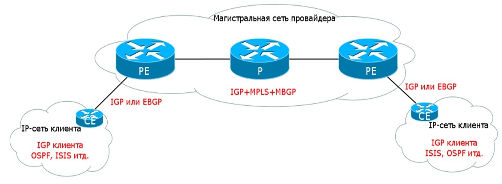


### Постановка задачи:

Имеется две точки присутствия клиента в сети провайдера задача провайдера организовать маршрутизацию между этими точками с условием изоляции данного трафика от остальных сетей. 

Для решение данной задачи используется технология L3VPN


#### "Живой" пример L3VPN: 

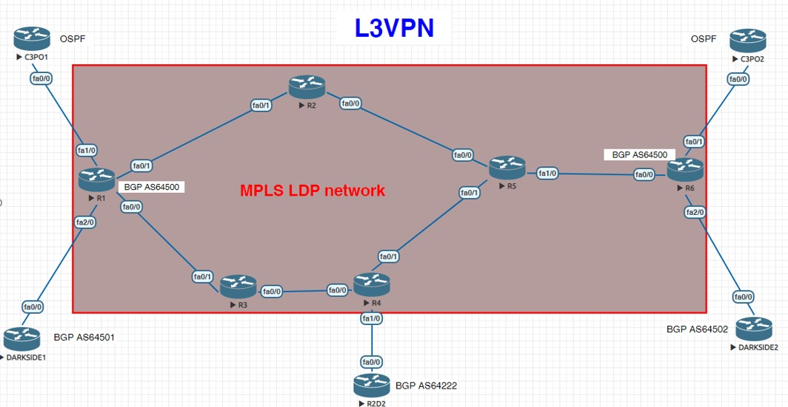

Описание схемы:

```bash
R1,R2,R3,R4,R5,R6 – маршрутизаторы сети провайдера
Имеются 3 клиента: C3PO, DARKSIDE, R2D2
"C3PO1(CE)" – подключен в R1(PE)
  ip plan:
  - lo0      - 10.10.10.10/32
  - int f0/0 - 192.168.1.1/24

"C3PO2(CE)" – подключен в R6(PE)
  ip plan:
  - lo0      - 20.20.20.20/32
  - int f0/0 - 192.168.2.1/24

"DARKSIDE1(CE)" – подключен в R1(PE)
 ip plan:
  - lo0      - 11.11.11.11/32
  - int f0/0 - 192.168.1.1/24

"DARKSIDE2 (CE)" – подключен в R6(PE)
 ip plan:
  - lo0      - 22.22.22.22/32
  - int f0/0 - 192.168.2.1/24


"R2D2 (CE)" – подключен в R4(PE)
 ip plan:
  - lo0      - 222.222.222.222/32
  - int f0/0 - 192.168.222.1/24

C3PO и DARKSIDE – не имеют доступа друг к другу
R2D2 и DARKSIDE – не имеют доступа друг к другу
C3PO и R2D2 –имеют связность друг с другом (маршруты ликаются чз взаимный RT import)

C3PO передает маршруты провайдеру по OSPF 
DARKSIDE и R2D2 передает маршруты провайдеру по BGP 
В сети провайдера IGP - ISIS, MPLS - LDP
BGP vpnv4 настроен на R1,R4,R6.

Соответственно для C3PO мы редистрибъютим маршруты между OSPF клиента и BGP провайдера
```

Теперь поподробнее как всё это работает...

#### Рассмотрим взаимодействия между C3PO1 - R2D2 

```bash
1. Взаимодействие внутри/между VRF 
  - С3PO - работает по OSPF
  - R2D2 - по BGP

Для организации взаимодействия между разными VRF необходимо "ликать" их маршруты между собой,
для этого используется механизм импорта в VRF
```

```bash
На PE R1, к которому подключен CE C3PO1:

R1#
!
ip vrf C3PO
 rd 64500:100
 route-target export 64500:100
 route-target import 64500:100
 route-target import 64500:300

Комментарии:
 - rd 64500:100 - Это Router Destignisher, который используется как уникальный идентификатор, 
                  при передачи префиксов в BGP Update сообющениях.
 
 - route-target 64500:100 - это "родной" Route Target VRF C3P0
 - route-target 64500:300 - это  Route Target VRF R2D2
 
 Соответственно:
 - для импорта добавляются оба-два эти RT - чтобы принимать префиксы от VRF, 
   принадлежащих VRF C3P0 и R2D2
 - для экспорта добавляется RT своего VRF (C3PO)
```

```bash
Аналогичным способом "ликаются" и маршруты и на R4 (PE), к которому подключен R2D2

R4#
!
ip vrf R2D2
 rd 64222:300
 route-target export 64500:300
 route-target import 64500:300
 route-target import 64500:100

Особо обращу тут внимание на то, что rd и rt - это совершенно независимые друг от друга вещи.
В данном случае, RD - вообще мог бы быть произвольным, достаточно, чтобы он был просто уникальным.
А вот RT должен быть именно такой каким его будут импортировть к себе другие VRF-ы. 
```

```bash
Теперь, когда на обоих PE настроено взаимодействие между VRF надо настроить связность между самими PE.

Для этого используется как раз протокол BGP секция vpnv4 (AFI=1/SAFI=128), оно же "L3VPN unicast"

R1#
!
router bgp 64500
 no synchronization
 bgp router-id 1.1.1.1
 bgp log-neighbor-changes
 neighbor 4.4.4.4 remote-as 64500
 neighbor 4.4.4.4 update-source Loopback0
 neighbor 6.6.6.6 remote-as 64500
 neighbor 6.6.6.6 update-source Loopback0
 no auto-summary
 !
 address-family vpnv4
  neighbor 4.4.4.4 activate
  neighbor 4.4.4.4 send-community both
  neighbor 6.6.6.6 activate
  neighbor 6.6.6.6 send-community both
 exit-address-family
 !
 address-family ipv4 vrf DARKSIDE
  neighbor 192.168.1.1 remote-as 64501
  neighbor 192.168.1.1 activate
  no synchronization
 exit-address-family
 !
 address-family ipv4 vrf C3PO
  redistribute ospf 2 vrf C3PO
  no synchronization
 exit-address-family

 Комментарии:
 - в секция "address-family vpnv4" - перечисляются соседи по BGP для L3VPN, т.е. PE (R4 и К6)
 - Для взаимодействия с клиентами L3VPN по BGP должны передаваться и приниматься маршруты 
   для "родных" протоколов маршрутизации самих клиентов.
   Для C3PO - Это OSPF
   Для DARKSIDE - Это BGP
   Соответственно должен происходить и редистрибьюция маршрутов с клиенского IGP VRF в BGP (PE) и наоборот.
   За этот функционал в нашем, рассматриваемом случае, отвечает секция "address-family ipv4 vrf C3PO"

   "address-family ipv4 vrf C3PO
  	redistribute ospf 2 vrf C3PO"

   При чем, обращаю особое внимание, что тип IGP протокола "клиента" L3VPN настраиется и на самом PE маршрутизаторе.
	
	"router ospf 2 vrf C3PO
	 router-id 1.1.1.1
	 log-adjacency-changes
	 redistribute bgp 64500 subnets
	 network 192.168.0.0 0.0.255.255 area 0"

   При этом в OSPF 2 RIB естественно хранятся маршруты известные с C3PO

	"R1#sh ip ospf 2 rib

	OSPF local RIB for Process 2
	Codes: * - Best, > - Installed in global RIB

	*>  10.10.10.10/32, Intra, cost 2, area 0
	      via 192.168.1.1, FastEthernet1/0
	*   192.168.1.0/24, Intra, cost 1, area 0, Connected
	      via 192.168.1.2, FastEthernet1/0"

```

Рассмотрим, что при этом происходит "под капотом"

```bash
1. от R4 на R1 gо BGP приходит BGP Update вида:
```

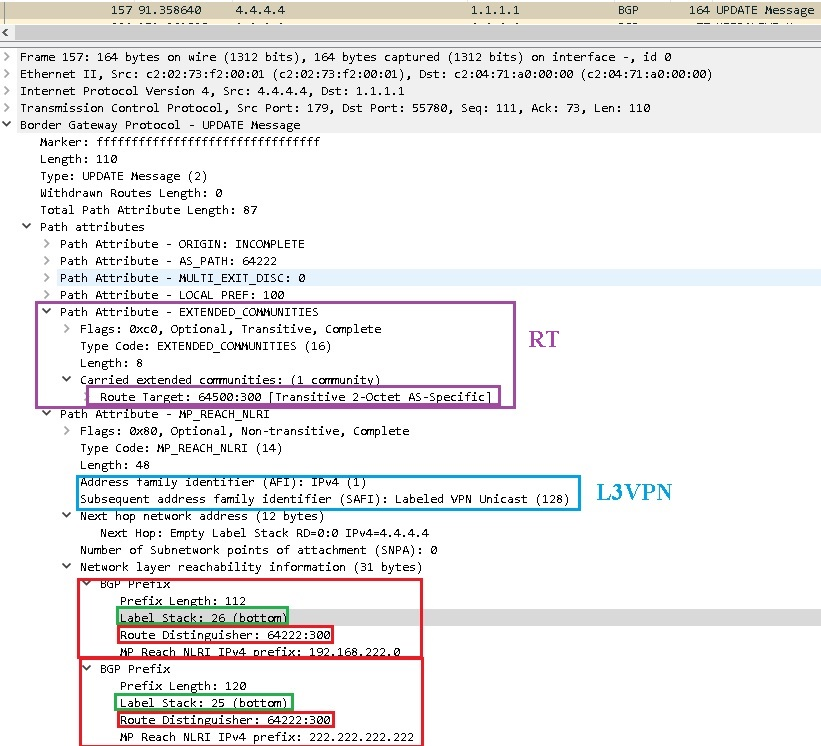

```bash
где:
- Передается L3VPN unicast (AFI=1/SAFI=128) 
- Передается "RT = 64222:300" в виде BGP Extended Community
- В NLRI содержится 2 префикса "192.168.222.0" и "222.222.222.222", у которых "RD = 64222:300"
- Также для данных префиксов передается сервисная метка, которая сгенерирована на R4:
  - Для префикса "192.168.222.0" она равна 26
  - Для префикса "222.222.222.222" она равна 25
- слово "bottom" в метке означает, что это нижняя метка для R4.
```

```bash
Как видно из LFIB на R4 - всё так и есть:

```


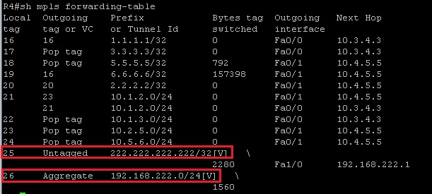


```bash
По CEF на R1 для VRF C3PO видно, что:
- для достижения сети 192.168.222.0/24 нужно добавить две метки "18 и 26" и отправить в интерфейс fa0/0
- для достижения сети 222.222.222.222/32 нужно добавить две метки "18 и 25" и отправить в интерфейс fa0/0
```

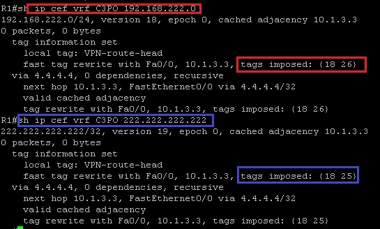

```bash
Транспортную метку "18" генерит уже сам R1 по LDP для FEC 4.4.4.4:
```

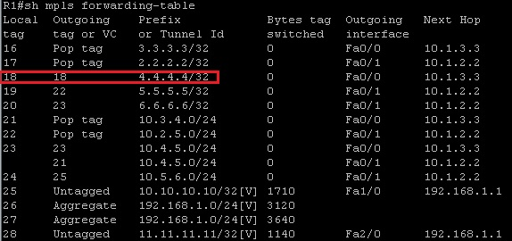


```bash
Соответственно данные маршруты попали на R1 в VRF C3PO по BGP:
```

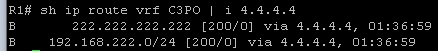


```bash
И соответственно данные маршруты попали на CE C3PO по OSPF
```
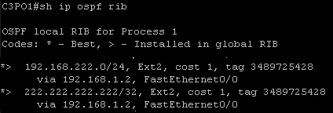


```bash
Теперь при пинге в C3PO адреса, находящегося на R2D2 на сети MPLS можно увидеть icmp инкапсулированные в MPLS,
как раз с теми самыми транспортыми и сервисыми метками
```

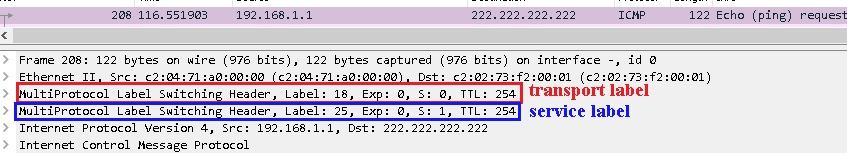


#### Дампы по лабе

[1. Дамп на R1 при включении интерфейса f0/0](https://icebale.readthedocs.io/en/latest/networks/wireshark.collection/l3vpn-laba-r1-f0-0-no-shut.pcapng)

[2. Дамп на R1 при включении интерфейса f0/1](https://icebale.readthedocs.io/en/latest/networks/wireshark.collection/l3vpn-laba-r1-f0-1-no-shut.pcapng)

[3. Дамп на R1 fa1/0](https://icebale.readthedocs.io/en/latest/networks/wireshark.collection/l3vpn-laba-r1-f1-0.pcapng)


Вот собственно и вся «магия» в L3VPN

### Подведем итоги по L3VPN 

Что надо, чтобы работал  L3VPN:
```bash
1.	Должна быть сеть MPLS (LDP или RSVP-TE – без разницы)
2.	Клиент должен передавать анонсы своих сетей через один из протоколов (ISIS, OSPF, BGP) – 
ответочка поднимается на стороне PE.
Если клиентский протокол не BGP, то в него и из него нужно редистрибьютить сети клиента.
3.	На PE с обоих сторон настраивается:
- VRF для данного клиента, туда заносятся RD и RT
- В BGP добавляется секция vpnv4, а также  ipv4 для VRF
```

### Конфиги L3VPN лабы

Конфиги прилагаются… )

<details><summary>R1</summary>
<p>

```bash
R1!
!
hostname R1
!
ip vrf C3PO
 rd 64500:100
 route-target export 64500:100
 route-target import 64500:100
 route-target import 64500:300
!
ip vrf DARKSIDE
 rd 64501:100
 route-target export 64500:200
  route-target import 64500:200
!
!
interface Loopback0
 ip address 1.1.1.1 255.255.255.255
 ip router isis
!
interface FastEthernet0/0
 ip address 10.1.3.1 255.255.255.0
 ip router isis
 duplex auto
 speed auto
 mpls ip
 no cdp enable
!
interface FastEthernet0/1
 ip address 10.1.2.1 255.255.255.0
 ip router isis
 duplex auto
 speed auto
 mpls ip
 no cdp enable
!
interface FastEthernet1/0
 ip vrf forwarding C3PO
 ip address 192.168.1.2 255.255.255.0
 duplex auto
 speed auto
 no cdp enable
!
interface FastEthernet2/0
 ip vrf forwarding DARKSIDE
 ip address 192.168.1.2 255.255.255.0
 duplex auto
 speed auto
!
router ospf 2 vrf C3PO
 router-id 1.1.1.1
 log-adjacency-changes
 redistribute bgp 64500 subnets
 network 192.168.0.0 0.0.255.255 area 0
!
router isis
 net 10.0000.0000.0001.00
!
router bgp 64500
 no synchronization
 bgp router-id 1.1.1.1
 bgp log-neighbor-changes
 neighbor 4.4.4.4 remote-as 64500
 neighbor 4.4.4.4 update-source Loopback0
 neighbor 6.6.6.6 remote-as 64500
 neighbor 6.6.6.6 update-source Loopback0
 no auto-summary
 !
 address-family vpnv4
  neighbor 4.4.4.4 activate
  neighbor 4.4.4.4 send-community both
  neighbor 6.6.6.6 activate
  neighbor 6.6.6.6 send-community both
 exit-address-family
 !
 address-family ipv4 vrf DARKSIDE
  neighbor 192.168.1.1 remote-as 64501
  neighbor 192.168.1.1 activate
  no synchronization
 exit-address-family
 !
 address-family ipv4 vrf C3PO
  redistribute ospf 2 vrf C3PO
  no synchronization
 exit-address-family
!
mpls ldp router-id Loopback0 force
!
```
</p>
</details>

<details><summary>R2</summary>
<p>

```bash

!R2#
!
hostname R2
!
interface Loopback0
 ip address 2.2.2.2 255.255.255.255
 ip router isis
!
interface FastEthernet0/0
 ip address 10.2.5.2 255.255.255.0
 ip router isis
 duplex auto
 speed auto
 mpls ip
 no cdp enable
!
interface FastEthernet0/1
 ip address 10.1.2.2 255.255.255.0
 ip router isis
 duplex auto
 speed auto
 mpls ip
 no cdp enable
!
router isis
 net 10.0000.0000.0002.00
!
ip forward-protocol nd
!
!
ip http server
no ip http secure-server
!
no cdp run
!
!
!
!
mpls ldp router-id Loopback0 force
!
```
</p>
</details>

<details><summary>R3</summary>
<p>

```bash

!R3#
!
hostname R3
!
interface Loopback0
 ip address 3.3.3.3 255.255.255.255
 ip router isis
!
interface FastEthernet0/0
 ip address 10.3.4.3 255.255.255.0
 ip router isis
 duplex auto
 speed auto
 mpls ip
 no cdp enable
!
interface FastEthernet0/1
 ip address 10.1.3.3 255.255.255.0
 ip router isis
 duplex auto
 speed auto
 mpls ip
 no cdp enable
!
router isis
 net 10.0000.0000.0003.00
!
ip forward-protocol nd
!
!
ip http server
no ip http secure-server
!
no cdp run
!
!
!
!
mpls ldp router-id Loopback0 force
!
```
</p>
</details>

<details><summary>R4</summary>
<p>

```bash

!R4#
!
hostname R4
!
ip vrf R2D2
 rd 64222:300
 route-target export 64500:300
 route-target import 64500:300
 route-target import 64500:100
!
interface Loopback0
 ip address 4.4.4.4 255.255.255.255
 ip router isis
!
interface FastEthernet0/0
 ip address 10.3.4.4 255.255.255.0
 ip router isis
 duplex auto
 speed auto
 mpls ip
 no cdp enable
!
interface FastEthernet0/1
 ip address 10.4.5.4 255.255.255.0
 ip router isis
 duplex auto
 speed auto
 mpls ip
 no cdp enable
!
interface FastEthernet1/0
 ip vrf forwarding R2D2
 ip address 192.168.222.2 255.255.255.0
 duplex auto
 speed auto
 no cdp enable
!
router isis
 net 10.0000.0000.0004.00
!
router bgp 64500
 bgp router-id 4.4.4.4
 bgp log-neighbor-changes
 neighbor 1.1.1.1 remote-as 64500
 neighbor 1.1.1.1 update-source Loopback0
 neighbor 6.6.6.6 remote-as 64500
 neighbor 6.6.6.6 update-source Loopback0
 !
 address-family ipv4
  neighbor 1.1.1.1 activate
  neighbor 6.6.6.6 activate
  no auto-summary
  no synchronization
 exit-address-family
 !
 address-family vpnv4
  neighbor 1.1.1.1 activate
  neighbor 1.1.1.1 send-community both
  neighbor 6.6.6.6 activate
  neighbor 6.6.6.6 send-community both
 exit-address-family
 !
 address-family ipv4 vrf R2D2
  neighbor 192.168.222.1 remote-as 64222
  neighbor 192.168.222.1 activate
  no synchronization
 exit-address-family
!
mpls ldp router-id Loopback0 force
!
```
</p>
</details>

<details><summary>R5</summary>
<p>

```bash

!R5#
!
hostname R5
!
interface Loopback0
 ip address 5.5.5.5 255.255.255.255
 ip router isis
!
interface FastEthernet0/0
 ip address 10.2.5.5 255.255.255.0
 ip router isis
 duplex auto
 speed auto
 mpls ip
 no cdp enable
!
interface FastEthernet0/1
 ip address 10.4.5.5 255.255.255.0
 ip router isis
 duplex auto
 speed auto
 mpls ip
 no cdp enable
!
interface FastEthernet1/0
 ip address 10.5.6.5 255.255.255.0
 ip router isis
 speed auto
 full-duplex
 mpls ip
 no cdp enable
!
interface FastEthernet2/0
 no ip address
 shutdown
 duplex auto
 speed auto
!
router isis
 net 10.0000.0000.0005.00
!
mpls ldp router-id Loopback0 force
!
```
</p>
</details>


<details><summary>R6</summary>
<p>

```bash

!R6#
!
hostname R6
!
ip vrf C3PO
 rd 64500:100
 route-target export 64500:100
 route-target import 64500:100
 route-target import 64500:300
!
ip vrf DARKSIDE
 rd 64502:200
 route-target export 64500:200
 route-target import 64500:200
!
interface Loopback0
 ip address 6.6.6.6 255.255.255.255
 ip router isis
!
interface FastEthernet0/0
 ip address 10.5.6.6 255.255.255.0
 ip router isis
 duplex auto
 speed auto
 mpls ip
 no cdp enable
!
interface FastEthernet0/1
 ip vrf forwarding C3PO
 ip address 192.168.2.2 255.255.255.0
 duplex auto
 speed auto
 no cdp enable
!
interface FastEthernet2/0
 ip vrf forwarding DARKSIDE
 ip address 192.168.2.2 255.255.255.0
 duplex auto
 speed auto
 no cdp enable
!
router ospf 2 vrf C3PO
 router-id 6.6.6.6
 log-adjacency-changes
 redistribute bgp 64500 subnets
 network 192.168.0.0 0.0.255.255 area 0
!
router isis
 net 10.0000.0000.0006.00
!
router bgp 64500
 no synchronization
 bgp router-id 6.6.6.6
 bgp log-neighbor-changes
 neighbor 1.1.1.1 remote-as 64500
 neighbor 1.1.1.1 update-source Loopback0
 neighbor 4.4.4.4 remote-as 64500
 neighbor 4.4.4.4 update-source Loopback0
 no auto-summary
 !
 address-family vpnv4
  neighbor 1.1.1.1 activate
  neighbor 1.1.1.1 send-community both
  neighbor 4.4.4.4 activate
  neighbor 4.4.4.4 send-community both
 exit-address-family
 !
 address-family ipv4 vrf DARKSIDE
  neighbor 192.168.2.1 remote-as 64502
  neighbor 192.168.2.1 activate
  no synchronization
 exit-address-family
 !
 address-family ipv4 vrf C3PO
  redistribute ospf 2 vrf C3PO
  no synchronization
 exit-address-family
!
mpls ldp router-id Loopback0 force
!
```
</p>
</details>

<details><summary>C3PO1</summary>
<p>

```bash

!C3PO1#
!
hostname C3PO1
!
interface Loopback0
 ip address 10.10.10.10 255.255.255.255
!
interface FastEthernet0/0
 ip address 192.168.1.1 255.255.255.0
 duplex auto
 speed auto
 no cdp enable
!
interface FastEthernet0/1
 no ip address
 shutdown
 duplex auto
 speed auto
!
router ospf 1
 router-id 10.10.10.10
 log-adjacency-changes
 network 10.10.10.10 0.0.0.0 area 0
 network 192.168.0.0 0.0.255.255 area 0
!
```
</p>
</details>

<details><summary>C3PO2</summary>
<p>

```bash

!C3PO2#
!
hostname C3PO2
!
interface Loopback0
 ip address 20.20.20.20 255.255.255.255
!
interface FastEthernet0/0
 ip address 192.168.2.1 255.255.255.0
 duplex auto
 speed auto
 no cdp enable
!
interface FastEthernet0/1
 no ip address
 shutdown
 duplex auto
 speed auto
!
router ospf 1
 log-adjacency-changes
 network 20.20.20.20 0.0.0.0 area 0
 network 192.168.0.0 0.0.255.255 area 0
!
```
</p>
</details>

<details><summary>DARKSIDE1</summary>
<p>

```bash

!DARKSIDE1#
!
hostname DARKSIDE1
!
interface Loopback0
 ip address 11.11.11.11 255.255.255.255
!
interface FastEthernet0/0
 ip address 192.168.1.1 255.255.255.0
 duplex auto
 speed auto
 no cdp enable
!
interface FastEthernet0/1
 no ip address
 shutdown
 duplex auto
 speed auto
!
router bgp 64501
 bgp log-neighbor-changes
 neighbor 192.168.1.2 remote-as 64500
 !
 address-family ipv4
  redistribute connected
  neighbor 192.168.1.2 activate
  no auto-summary
  no synchronization
 exit-address-family
!
```
</p>
</details>

<details><summary>DARKSIDE2</summary>
<p>

```bash

!DARKSIDE2#
!
hostname DARKSIDE2
!
interface Loopback0
 ip address 22.22.22.22 255.255.255.255
!
interface FastEthernet0/0
 ip address 192.168.2.1 255.255.255.0
 duplex auto
 speed auto
 no cdp enable
!
interface FastEthernet0/1
 no ip address
 shutdown
 duplex auto
 speed auto
!
router bgp 64502
 bgp log-neighbor-changes
 neighbor 192.168.2.2 remote-as 64500
 !
 address-family ipv4
  redistribute connected
  neighbor 192.168.2.2 activate
  no auto-summary
  no synchronization
 exit-address-family
!
```
</p>
</details>

<details><summary>R2D2</summary>
<p>

```bash

!R2D2#
!
hostname R2D2
!
!
interface Loopback0
 ip address 222.222.222.222 255.255.255.255
!
interface FastEthernet0/0
 ip address 192.168.222.1 255.255.255.0
 duplex auto
 speed auto
 no cdp enable
!
interface FastEthernet0/1
 no ip address
 shutdown
 duplex auto
 speed auto
!
router bgp 64222
 bgp router-id 222.222.222.222
 bgp log-neighbor-changes
 neighbor 192.168.222.2 remote-as 64500
 !
 address-family ipv4
  redistribute connected
  neighbor 192.168.222.2 activate
  no auto-summary
  no synchronization
 exit-address-family
!
```
</p>
</details>


Для доступа таких L3VPN клиентов в Интернет используется 3 похода:
```bash
1.	NAT – на стороне клиента + static +VRF leak
2.	NAT на стороне PE + static +VRF leak
3.	“Common Service” – жонглирование RT на стороне граничного с инетом маршрутизатора
```

## 3. L2VPN

### Определение

```bash
L2VPN - по сути, это технология организации L2 связности между двумя или более чем двумя точками через вышестоящую сеть провайдера на сети MPLS.
```


### Терминология

Терминология… ее много… но не так много как в EVPN… )

```bash
"AToM – Any Transport over MPLS" – возможность инкапсулировать трафик любого канального уровня в MPLS
```

Приципиально различают два варианта: 
```bash
1.	точка-точка -  VPWS – Virtual Pseudo Wire Service
2.	точка-многоточка - VPLS – Virtual Private LAN Service
```

#### 3.1 VPWS (L2 точка-точка)


```bash
VPWS - Point-to-Point – общее название услуги VPWS – Virtual Private Wire Service.
Организации L2 связности между двумя точками через MPLS сеть провайдера.
```

##### Терминология VPWS

В основе лежит понятие PW.
```bash
"PW – Pseudo Wire" – это виртуальный двунаправленный канал передачи данных между двумя PE, 
который состоит из пары однонаправленных VC.

"VC – Virtual Curcuit" - однонаправленное  виртуальное соединение, 
которое соединяет две точки клиента через сеть провайдера, от одной AC, до второй AC.

"AC – Attached Curcuit" – интерфейс на PE для подключения клиента

Знакомые уже определения:
"PE - Provider Edge" – граничный маршрутизатор сети MPLS, к которому подсоединяется клиент

"CE – Client Edge" – оборудование клиента, подключаемое к PE
```

И опять я использую тут схемы из СДСМ цикла статей Марата...

Прости Марат… )

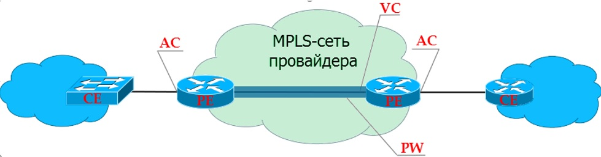


##### Практика VPWS (опять таки по схеме Марата)

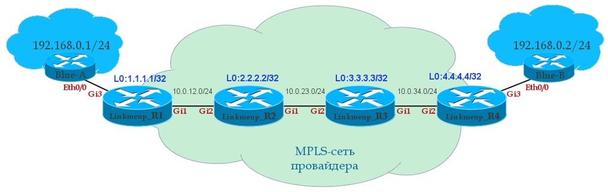


Попробую для «разнообразия» описать процесс работы VPWS своими словами:

Этапы работы механизма VPWS:
```bash
1.	MPLS сеть обменялась метками между P-PE маршрутизаторами сети по протоколу LDP или RSVP-TE. 
    В нашем случае рассмотрим вариант LDP.
2.	После указание на интерфейсах AC настроек принадлежности интерфейса 
    к xconnect и указанию номера VC с обоих сторон:

	---------------------------------------------------
	"R1"
	int gi3
	 xconnect  4.4.4.4  127 encapsulation mpls

	"R4"
	int gi3
	 xconnect 1.1.1.1 127 encapsulation mpls
	! Важно, чтобы VC ID совпадали
	---------------------------------------------------
	
	Тут начинает работать протокол tLDP, который организует связность 
	уже напрямую R1 и R4 коммутаторов по LDP, в отличии от стандарного LDP, 
	который устанавливает связь только с непосредственным соседом, в LDP - TTL=1, 
	в tLDP TTL - уже больше 1 и позволяет проходить через несколько 
	промежуточных маршрутизаторов, по сути организуя туннель 
	между точкой A и точкой B.

	После установки соединения по tLDP передается информация о сервисной метке, 
	чтобы можно было достичь второй стороны.
	Т.о. на кадр пришедший от клиента на R1 навешивается две метки 
	(одна сервисная, которая характеризует xconnect на второй стороне, 
	и транспортной, чтобы кадр передавался на второй xconnect по MPLS сети,
	метки "свапаваются" на P-шках – всё стандартно)...

	Схема работы xconnect весьма проста: 
	- Кадры передаются по сети MPLS с двумя метками сервисной и транспортной. 
	- Сервисная и транспортная метка «пушится» на начальном PE, 
	= Транспортная «свапается» на P маршрутизаторах 
	- Сервисная и транспортная метка «попится» на  конечном PE.
```

```bash
Виды VPWS – их много, то что было описано выше:
- это "EoMPLS" (Ethernet over MPLS), оно же "PWE3" (Pseudo Wire Emulation Edge to Edge)

"VLL (Virtual Leased Line)" — это уже технология, которая позволяет инкапсулировать кадры 
различных протоколов канального уровня в MPLS и передавать их через сеть провайдера.

В природе есть Martini  VLL, Kompella VLL … 
Вообщем? зоопарк – « но, то ли еще будет»…
```

#### 3.2 VPLS (L2 точка-многоточка)

...Едем дальше, VPLS...

Трактат о Мартини, Компелле и их сотоварищах...

##### Терминология

```bash
"VPLS-домен" – изолированная виртуальная L2 сеть.

"VSI" – Virtual Switch Instance – виртуальный коммутатор в пределах одного маршрутизатора 
(аналог VRF – в L3VPN).

"VFI" – Virtual Forwarding Instance - тоже самое, что и VSI, только в терминологии Cisco.

"VE" – Virtual Edge – узел PE, участник VPLS домена.
```

##### Martini draft, Kompella draft

По итогу появилось 2 решения по обнаружению PE, куда подключены клиенты VSI:

```bash
1. Ручная настройка (Martini draft) – стал дефакто для L2VPN
2. Автоматическая настройка (Kompella draft) – «почил в бозе»…
```

###### 3.2.1. Martini draft

По сути, это расширения решения VPWS, только в случае Martini – это пучек PW до каждого PE, входящего 
в VPLS домен от каждого VSI – фигурально «пучёк псевдопроводов»
Все работает на всё том же tLDP.

Шаги настройки Мартини мода:
```bash
1.	Создаем VFI с одинаковыми VPN ID на всех PE, входящих в VPLS
2.	Привязываем AC интерфейсы к Service Instance
3.	Объединяем в один Bridge домен VFI и соответствующие Service Inctance
```


###### Пример настройки "Martini draft" 

Топология сети аналогична предыдущей.

```bash
R1#
l2vpn vfi context Blue 
	vpn id 63
	! R3 является участником данного VPLS (1.1.1.1 - его Loopback)
	member 3.3.3.3 encapsulation mpls
	! R4 является участником данного VPLS (4.4.4.4 - его Loopback)
	member 4.4.4.4 encapsulation mpls
!
! VC, принадлежащий данному VPLS
int gi3
  ! service instance еще одна абстракция - удобна для объединения сервисов 
	service instance 10 ethernet
	description Blue-A
	encapsulation default
!
! VC, принадлежащий данному VPLS
int gi4
  ! service instance еще одна абстракция - удобна для объединения сервисов - только где? :)
	service instance 12 ethernet
	description Blue-C
	encapsulation default
!
! Объединяем наш VFI и VС в один бридж домен
bridge-domain 255
	member vfi Blue
	member gigabitEthernet 3 service-instance 10
	member gigabitEthernet 4 service-instance 12
!
```

Таким образом, при аналогичных настройках на других участниках данного VPLS, получаем на каждом участнике "пучёк pseudowire" свитч соответственно.

Как только настойки применены, то сразу идет установка tLDP сессий между участниками VPLS домена и каждый участник домена знает как добраться до соседа и по  bridge домене фиксируются изученные mac адреса и их исходящие pseudowire.

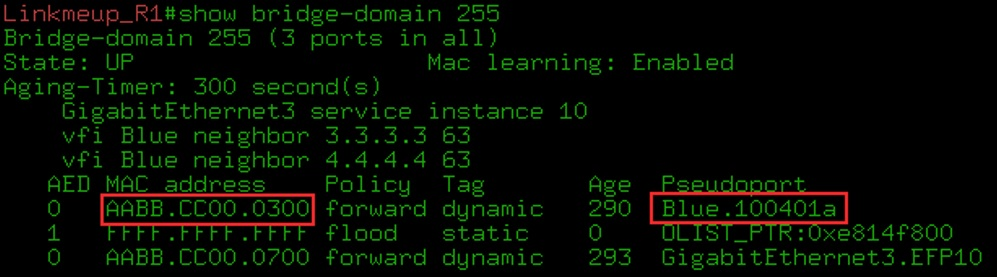

При приходе кадра от клиента с неизвестным мак адресом назначения происходит как и для стандартного коммутатора рассылка данного кадра всем участникам VPLS.


###### 3.2.2 Kompella draft

За основу взят L3VPN, т.е на Control Plane происходит изучения участников VPLS домена при помощи протокола MP-BGP в отдельном address-family L2VPN (AFI (25), VPLS SAFI (65)), но изучение mac адресов остается по прежнему на "Data Plane"

!!!warning "Принципиальный момент!"
			Важно понимать, что несмотря на изучение меток соседей по VDLS домену 
			посредством BGP на "Control Plane",
			по прежнему всё изучение mac адресов происходит на "Data Plane"!!!
			Этот важный момент принципиально отличает L2VPN Kompella mode от EVPN,
			где mac адреса помимо изучения на "Data Plane" еще и изучаются 
			на "Control Plane" в BGP.


- по RD  - также идет исключение смешивания внутри BGP Update-ов

- по RT идет идентификация соответствующего VPLS

!!!warning "Важно для понимания!"
			Для работы такому механизму нужна либо полносвязная Full-mesh топология, либо RR.
			Для RR механизма каждый BGP update будет разбегаться всем соседям, 
			при этом каждому соседу нужно указывать индивидуальную сервисную метку LDP конкретно для него.
			В стандартном виде реализовать это затруднительно, т.к. при этом пришлось 
			бы отправлять столько BGP сообщений, сколько участников в VPLS домене, 
			при этом каждый такой апдейт из-за механизма RR отражался бы все без разбора всем участникам BGP. 
			Такое решение является неприемлемым, п.э. было придумано некое «элегантное» решение, 
			на основе начальных данных в BGP соседи сами однозначно понимают, 
			какую сервисную метку в LDP для соседа надо устанавливать.


Для такого автоматического распределения меток вводятся следующая терминология:
```bash
"VE ID" (настраивается вручную) — это идентификатор PE-маршрутизатора в домене VPLS (его порядковый номер). 
Должен быть уникален в пределах одного VSI.

"LBB" — Label Base — это начало диапазона, первая метка, которая может быть использована.

"VBS" — VE Block Size — это длина блока меток — или проще, минимальное количество меток в этом VSI. 
Для Cisco по умолчанию это 10. Для Juniper — 8 (может быть уменьшен до 2 или увеличен).

"VBO" — VE Block Offset — смещение блока. Используется если меток из одного блока не хватает.
```

Тогда, и опять из СДСМ... да простит меня Марат!

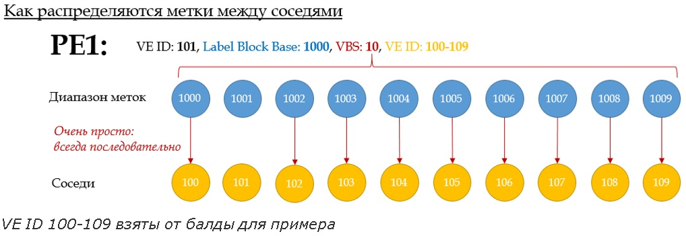

```bash
т.е. приняв такие данные соседи для себя выберут метки LDP в зависимости от своего VE ID. 
Т.е. PE с:
 -VE-ID 100 назначит для такого соседа LDP метку 1000
 -VE-ID 101  - это сам PE1
 -VE-ID 102  назначит для такого соседа LDP метку 1002 
и т.д…

Точно также будет и в обратку…
```

Для детального восприятия механизма будет удобна вот такая схема:

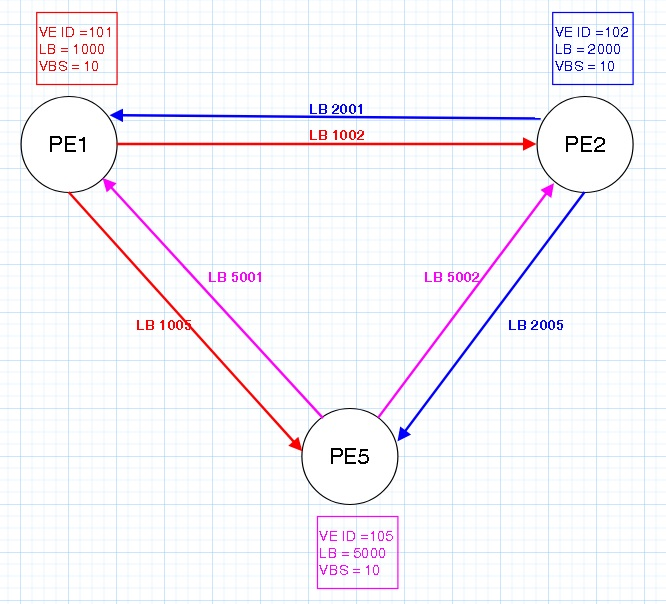

```bash
По сути, PE1 передавая свою информацию VE ID, LB, VBS соседям, 
соседи вычисляют какие метки будут приходить от данного PE

В ИТОГЕ получается, что все участники L2VPN знают, что:

"LB 1002" - это метка от PE1 к PE2
"LB 1003" - это метка от PE1 к PE3

"LB 2001" - это метка от PE2 к PE2
"LB 2005" - это метка от PE2 к PE5

"LB 5001" - это метка от PE5 к PE1
"LB 5002" - это метка от PE5 к PE2
```
Благодаря механизму BGP RR не нужно делать Full Mesh между всеми участниками VPLS.

###### Пример настойки VPLS Kombella mode

```bash
R1#
!
l2vpn vfi context Blue 
	vpn id 63 
	autodiscovery bgp signaling bgp 
	ve id 101
!
!Можно задать вручную диапазон динамически назначаемых меток (но это не обязательно)
mpls label range 1000 1999
!
! Назначаем Service instance для AC
int gi3
	service instance 10 ethernet 
	description Blue-A
	encapsulation default
!
int gi4
	service instance 12 ethernet 
	description Blue-C
	encapsulation default 
!
! Связываем VFI и Service Instance в один bridge домен
!
bridge-domain 255
	member vfi Blue
	member gigabitEthernet 3 service-instance 10
	member gigabitEthernet 4 service-instance 12
!

! Настраиваем BGP
!
router bgp 64500 
  neighbor 3.3.3.3 remote-as 64500
  neighbor 3.3.3.3 update-source Loopback 0
  neighbor 4.4.4.4 remote-as 64500
 neighbor 4.4.4.4 update-source Loopback 0

! Cоздаём address-family l2vpn vpls и указываем всех соседей, 
! которые будут участвовать в L2VPN без привязки к VFI 
!
  address-family l2vpn vpls 
		neighbor 3.3.3.3 activate 
		neighbor 3.3.3.3 send-community extended 
		neighbor 3.3.3.3 suppress-signaling-protocol ldp
		neighbor 4.4.4.4 activate 
		neighbor 4.4.4.4 send-community extended 
		neighbor 4.4.4.4 suppress-signaling-protocol ldp
```

##### Martini vs Kompella |  Итоговые Выводы по L2VPN

По итогу несмотря на автоматическое распределение меток Kompella Mode – «не взлетел».
Точнее не так! Совсем не так! )

По сути в Juniper, где как раз работал Компелла более предпочтительнее стал L2VPN Kompella mode,
а соответственно в Cisco, работником которого был Martini - стал предпочтительнее его подход... )
Хотя оба вендора поддерживают оба варианта решения и даже еще один - L2VPN LDP with BGP autodiscovery


В недалеком будушем, в 2007 году вышел RFC 4762, в котором задача обнаружения соседей происходит через Radius или BGP(autodiscovery LDP signaling BGP). VPLS LDP-signaling with BGP-Autodiscovery. Для BGP командой autodiscovery LDP signaling BGP в секции l2vpn vfi.

Но тут как не крути, а всё равно получение сервисных меток там по прежнему происходит чз tLDP. а через bgp происходит только neigbor autodiscovery... 
Сомнительное улучшения с принципиальной точки зрения.

По итогу в крупном ISP встечается на практике полный зоопарк из Kompella и Martini L2VPN.
Плюс к тому же их комбинаторика: например, Kompella L2VPN + добавление туда интерфейсов, настоенных через xConnect  через так называемые mesh-group (это из Juniper-a)...

```
bash
"mesh-group" -это из Juniper-a
...
"Нора" - это из Ибсена...)

"В общем, вариативности и разнообразия сочитаний L2VPN на практике хватает с избытком, исходя из моего практического опыта..."
```


 
### 4. EVPN (Ethernet VPN)


### 6. MPLS TE
Итак погнали....

Определение MPLS TE -  MPLS Traffic Engineering - по сути работа на сети MPLS с возможностью задания параметров 
для посторения MPLS (маршрута прохождения , задание полосы и пр. параметры)...

Достигается это за счет использование сигнального протокола RSVP-TE, который позволяет сторить MPLS толннели основываясь на "condtarints" - ограничениях которые необходимо соблюсти (тредования по полосе, по путиследования). Также RSVP-TE позволяет
создавать запасные пути для данного сервиса, чтобы при отвале основного пути сразу же в работу включался уже просчитанный резервный механизм FRR (fast rerouting)

Принцип работы RSVP-TE заключается в том, что сначала резервируются метки (путем отправки сообщения "Label request" по всему пути следования) по всему пути LSP и если уже все нормально проходит доназначения, то в обратку отправляется ответ "Reserv" c подтверждение  уже фактического выделением зарезервированных меток...

Т.о. строится LSP для MPLS-TE туннеля. Внутри данного туннеля может быть любой сервис - L3VPN, L2VPN (во всех его эпостасях), тот же  EVPN. По сути RSVP-TE строит транспортную сеть с учетом начальных условий для туннелей, в том числе с заблаговременным резервированием на уровне транспотной сети.

