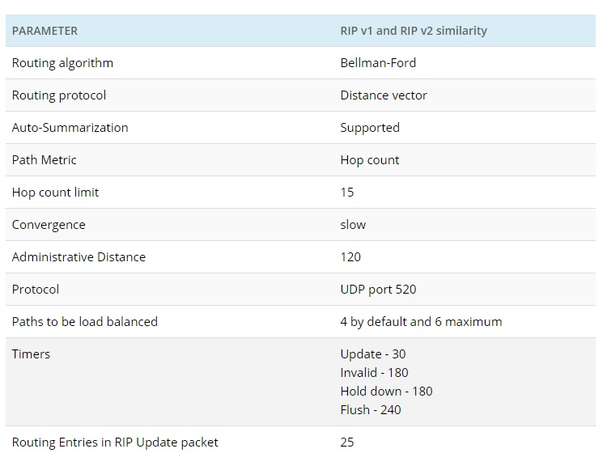
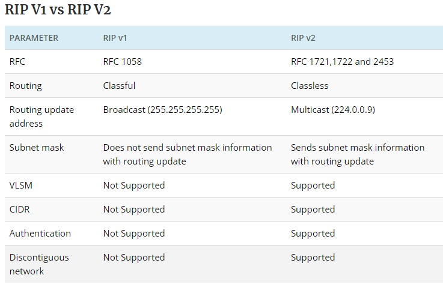
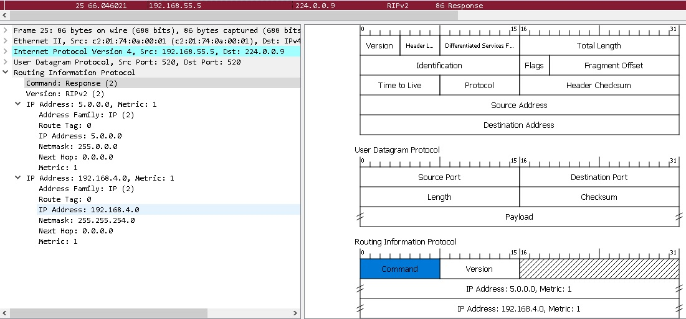
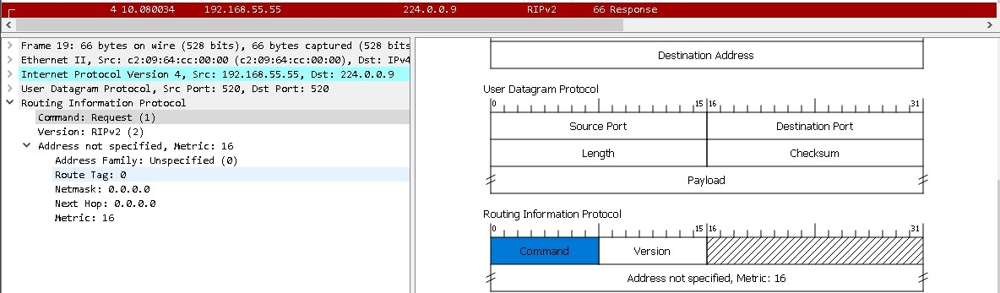
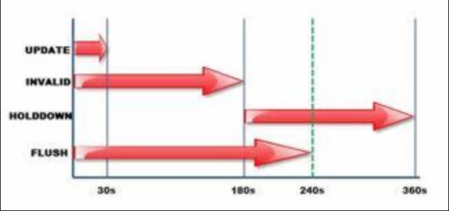

title: RIP

# Протокол динамической маршрутизации RIP

Descrambler:
```bash
RIP is RIP...
Это чисто академические выкладки для закрытия собственного гельштата...
Пройтись по костям этого древнего мамонта, когда то браздившего просторы наших локальных сетей 
во времена коаксиализации и токин рингов...
```


## Определение
Протокол RIP относится к группе IGP протоколов динамической маршрутизации.
Является дистантно-векторным протоколом маршрутизации, "почившим в бозе" много "миллионов лет до н.э.". 
Соответственно в отличии от "link-state" протоколов просто передает своим соседям 
маршруты, которые известны ему самому без привязки к топологии сети. 
Соответственно маршрутизаторы работающие на основе дистантно-векторным протолах не знают топологию своей сети, в отличии "link-state" протоколов, в которых распространяется информация про, какое устройство и с какого интерфейса анонсируется тот или иной маршрут. Т.о. каждый участник "link-state" располагает информацией о всей топологии свое сети (area для OSPF, L1 - для ISIS). Но это чуть обзорный шаг в сторону, едем дальше...

## Назначение
Передавать маршрутную информацию между маршрутизаторами внутри сети.


## Принцип работы:
Передача информации происходит только между непосредственными соседями P2P или участниками одного L2 броадкаст домен.

Существует 2 версии протокола RIP: версия 1 и версия 2

Одинаковость и разность этих версии приведена ниже: 






Основная разница, что v1 не умеет передавать маршруты бесклассовых сетей (CIDR), а также не умеет предавать не стандарную маску сети (VLSM).
В v2 протокол RIP научили CIDR и VLSM. Соответственно сети вида 172.16.0.0/23 не могут передаваться в v1 и без проблем будет передаваться в v2.

Участники протокола обмениваются Request-Response сообщениями.
Несмотря на "странное" название "Response" - это по сути Update сообщение, которое передает существующют таблицу маршрутизации известное по rip маршрутизатором.

Пример сообщения "Response":


Сообщение "Request" используется в особых случаях, например при старте протокола, чтобы запросить маршрутную информацию у соседей.
Пример сообщения "Request"


## Таймеры протокола:
```java
update timer - after that broadcast sent 30sec (период отправки сообщений типа "Response")
invalid timer - after expire route declare as a invalid 180sec 
               (Когда маршрут находится в таблице маршрутизации в состоянии possibly down, 
               	это значит, что Invalid timer истек, а Flush timer еще нет)
hold down - after hold down timer expire 180sec
Flush timer - after expire route entry deleted form routing table 240sec
```

```java
Кароче, теперь па-Русски! )
Что происходит по таймингу:
1. Если в течении 30 секунд не приходит очередной Update от соседа, 
   то маршруты от него метятся в RIB как "possibly down".
2. Если в течении 240 секунд не приходит очередной Update от соседа, 
   то маршруты от него удаляются из RIB.
```


### Пример "possibly down" в RIB


### Общая схема работы таймера:


Структура протокола очень простая:
```bash
- Command
- Version
- Информация об ip адресах.
```

!!!note "Важный факт" 
		Из особенностей работы: по факту при "протухании" маршрутов по RIP на маршрутизаторе не напрямую соединенном с другим.
		Непосредственно соединенный маршрутизатор посылает сообщении "Response" (оно же "Update") с всеми актуальными маршрутами, но уже без тех, которые "протухли"... А не например как в BGP с помощью "withdraw", в котором указываются только отменненые маршруты...

## Конфигурация RIP на оборудовании cisco

```bash
router rip
 version 2
 network 55.0.0.0
 network 192.168.5.0
 network 192.168.55.0
```
В секции router rip перечисляются сети которые будут участвовать в rip.
По желанию, там же тюнятся таймеры.

Особенности синтаксиса: в конфигурации rip v2 указываются только сети без масок, но по факту при обращении к интерфейсу берутся правильные маски в rip database.

## Литература

- [1. RIP](http://xgu.ru/wiki/RIP)
- [2. RIP V1 vs V2](https://ipwithease.com/rip-v1-vs-rip-v2/)
- [3. RIP General Operation, Messaging and Timers](http://www.tcpipguide.com/free/t_RIPGeneralOperationMessagingandTimers-2.htm)
- [4. cisco forum](https://learningnetwork.cisco.com/s/question/0D53i00000Kt6cX/rip-timers)

Пример дампа rip в wireshark можно посмотреть [здесь](https://icebale.readthedocs.io/en/latest/networks/wireshark.collection/rip2.pcapng)
