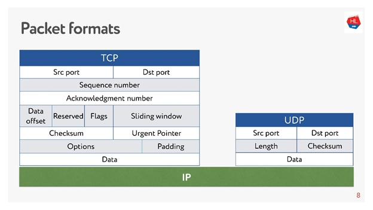
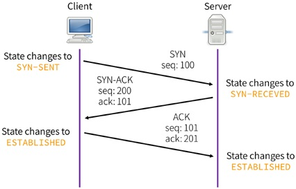
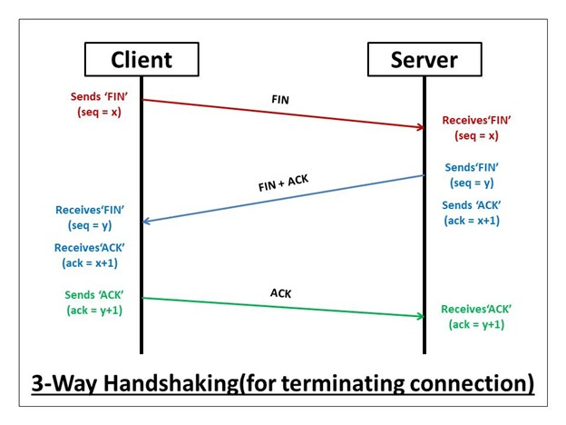
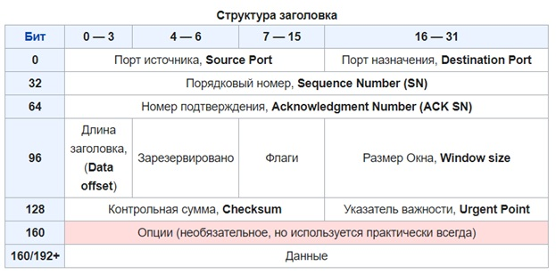
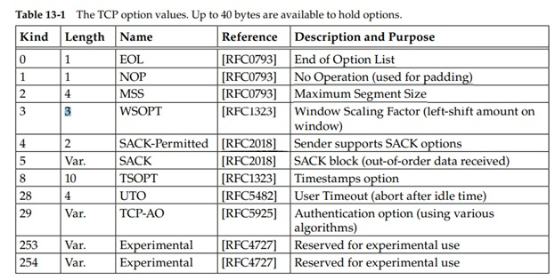
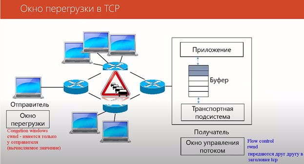
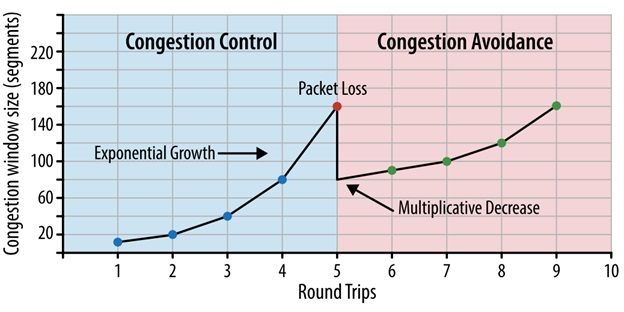
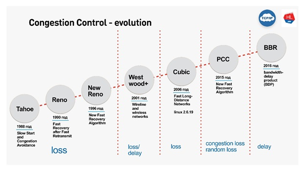

title: TCP

# Протокол TCP
Disclaimer:
```bash
если позволить себе перефразировать классика, то звучать это будет 
приблизительно так:
"аршином общим не измерить, 
там в нём особенная стать, 
в него лишь можно только верить"...

Нуу, это лирика... )

На самом деле информация и рассказ про tcp настолько огромный, 
что его нельзя в принципе втиснуть в какую либо одну статью или даже несколько, 
поскольку принципы и особенности его работы описаны в "тоннах" RFC 
да еще и разнятся взависимости от реализации различных ОС...
```

**Тут я буду писать коротенькие и не очень коротенькие заметки "на полях", с чем я сталкивался в своей практике или изучал в теории...**


## TCP vs UDP
Принципиальная разница в работе TCP и UDP протоколов заключается в том, что при работе по TCP обе стороны устанавливают соединение и согласуют параметры своей работы, при чем еще и контролируют процесс передачи данных на уровне TCP, т.е. если данные не дошли до адресата или пришли «битые», то эти данные отправляются повторно.

Для UDP ситуация полностью обратная: стороны не обмениваются параметрами передачи и данные пересылаются без подтверждения их доставки, т.е. могут теряться при передаче. В этом случае, если приложение использует в качестве транспортного протокола UDP, то контроль передачи данных может осуществляться только на уровне приложения.

Сравнение структуры заголовка TCP/UDP:




## Определение/Назначение 
**TCP** - ( transmission control protocol) - протокол транспортного уровня в [модели OSI](https://icebale.readthedocs.io/en/latest/networks/protocols/OSI-anatomy/).
Предназначен для передачи данных по сети, является наиболее популярным протоколом 
Особенностью протокола tcp является, то что он сам контролирует процесс передачи данных и в случае потери данных досылает их второй стороне.
Таким образом в процессе выполнения tcp сессии происходит обмен информации о сегментах, которые не дошли до адресата или имеют битые 
FCS (fragment control sequence) и данные недостающие сегменты досылаются повторно.

устанавливает соединение между двумя участниками сети посредством создания сокета. 

Сокет – это две разных сущности с точки зрения сети и системы.
```bash
С точки зрения сети это связка  ip_add:port,
С точки зрения системы - это ресурсы, выделенные для буфера приема и отправки данных.
```

### Понятие «Псевдозаголовок»

[Цитата из википедии](https://ru.wikipedia.org/wiki/Transmission_Control_Protocol#%D0%9F%D1%81%D0%B5%D0%B2%D0%B4%D0%BE%D0%B7%D0%B0%D0%B3%D0%BE%D0%BB%D0%BE%D0%B2%D0%BE%D0%BA)

TCP заголовок не содержит информации об адресе отправителя и получателя, поэтому даже при совпадении порта получателя нельзя с точностью сказать, что сообщение пришло в нужное место. Поскольку назначением протокола TCP является надёжная доставка сообщений, то этот момент имеет принципиальное значение. Эту задачу можно было решить разными способами. Самый очевидный — добавить информацию об адресе назначения в заголовок TCP, однако это, во-первых, приводит к дублированию информации, что снижает долю полезной информации, переносимой TCP-сегментом, а во-вторых, нарушает принцип инкапсуляции модели OSI. Поэтому разработчики протокола пошли другим путём и использовали дополнительный псевдозаголовок.
Псевдозаголовок не включается в TCP-сегмент. Он используется для расчёта контрольной суммы перед отправлением сообщения и при его получении (получатель составляет свой псевдозаголовок, используя адрес хоста, с которого пришло сообщение, и собственный адрес, а затем считает контрольную сумму).
И таким образом получатель понимает от кого и кому предназначен данный tcp сегмент и передается дальше уже с точным определением «приложения», которому эти данные предназначены.

Псевдозаголовок состоит из:

- IP-адрес отправителя (Source address)
- IP-адрес получателя (Destination address)
- Протокол (Protocol)
- Длина TCP-сегмента (TCP length)

TCP-заголовок не содержит информации об адресе отправителя и получателя, п.э. используют понятие «псеводозаголовок».

### 3way handshake 

Обычно соединение TCP происходит следующим образом, по принципу
Трехуровневого рукопожатия:

- Клиент отправляет серверу SYN  
- Сервер принимает SYN и в ответ отправляет клиенту SYN-ACK (в знак того, что получил SYN)
- Клиент отправляет серверу ACK (в знак того, что получил SYN-ACK)

В процессе соединения происходит обмен параметрами каждой стороны (основные):
- SEQ-SN – уникальный свой номер 
- ACK-SN - уникальный номер другой стороны
- первоначальный размер окна windows size 



#### Состояния сеанса TCP
  **TCP A                                                    TCP B**
```bash
   1.  CLOSED                                                LISTEN
   2.  SYN-SENT    --> <SEQ=100><CTL=SYN>               -->  SYN-RECEIVED
   3.  ESTABLISHED <-- <SEQ=300><ACK=101><CTL=SYN,ACK>  <--  SYN-RECEIVED
   4.  ESTABLISHED --> <SEQ=101><ACK=301><CTL=ACK>      -->  ESTABLISHED
   5.  ESTABLISHED <-- <SEQ=301><ACK=101><CTL=ACK>      <--  ESTABLISHED
```

### 3way handshake for terminate
Для окончания TCP соединения тоже проходит трехуровневое рукопожатие такого вида:



### Общая таблица состояний 
при TCP соединении выглядет следующим образом:

- CLOSED	    Начальное состояние узла. Фактически фиктивное
- LISTEN	    Сервер ожидает запросов установления соединения от клиента
- SYN-SENT	    Клиент отправил запрос серверу на установление соединения и ожидает ответа
- SYN-RECEIVED	Сервер получил запрос на соединение, отправил ответный запрос и ожидает подтверждения
- ESTABLISHED	Соединение установлено, идёт передача данных
- FIN-WAIT-1	Одна из сторон (назовём её узел-1) завершает соединение, отправив сегмент с флагом FIN
- CLOSE-WAIT	Другая сторона (узел-2) переходит в это состояние, отправив, в свою очередь сегмент ACK и продолжает одностороннюю передачу
- FIN-WAIT-2	Узел-1 получает ACK, продолжает чтение и ждёт получения сегмента с флагом FIN
- LAST-ACK	    Узел-2 заканчивает передачу и отправляет сегмент с флагом FIN
- TIME-WAIT	    Узел-1 получил сегмент с флагом FIN, отправил сегмент с флагом ACK и ждёт 2*MSL секунд, перед окончательным закрытием соединения
- CLOSING	    Обе стороны инициировали закрытие соединения одновременно: после отправки сегмента с флагом FIN узел-1 также получает сегмент FIN, 
                отправляет ACK и находится в ожидании сегмента ACK (подтверждения на свой запрос о разъединении)


### Структура заголовка tcp сегмента 
[данные взяты из википедии](https://ru.wikipedia.org/wiki/Transmission_Control_Protocol)



- Порт источника, Порт назначения
16-битные содержат номера портов — числа, которые определяются по специальному списку.
Порт источника идентифицирует приложение клиента, с которого отправлены пакеты. Ответные данные передаются клиенту на основании этого номера.
Порт назначения идентифицирует порт, на который отправлен пакет.

- Порядковый номер Sequence number (32 бита) — измеряется в байтах, и каждый переданный байт полезных данных (payload) увеличивает это значение на 1.
Если установлен флаг SYN (идёт установление сессии), то поле содержит изначальный порядковый номер — ISN (Initial Sequence Number). В целях безопасности это значение генерируется случайным образом и может быть равно от 0 до 232-1 (4294967295). Первый байт полезных данных в устанавливающейся сессии будет иметь номер ISN+1.
В противном случае, если SYN не установлен, первый байт данных, передаваемый в данном пакете, имеет этот порядковый номер.
Поскольку поток TCP в общем случае может быть длиннее, чем число различных состояний этого поля, то все операции с порядковым номером должны выполняться по модулю 232. Это накладывает практическое ограничение на использование TCP. Если скорость передачи коммуникационной системы такова, чтобы в течение MSL (максимального времени жизни сегмента) произошло переполнение порядкового номера, то в сети может появиться два сегмента с одинаковым номером, относящихся к разным частям потока, и приёмник получит некорректные данные.
Номер подтверждения

- Acknowledgment Number (ACK SN) (32 бита) — если установлен флаг ACK, то это поле содержит порядковый номер октета, который отправитель данного сегмента желает получить. Это означает, что все предыдущие октеты (с номерами от ISN+1 до ACK-1 включительно) были успешно получены.
Каждая сторона подсчитывает свой Sequence number для переданных данных и отдельно Acknowledgement number для полученных данных. Sequence number каждой из сторон соответствует Acknowledgement number другой стороны.

Длина заголовка (смещение данных) - Длина заголовка (Data offset) занимает 4 бита и указывает значение длины заголовка, измеренное в 32-битовых словах. Минимальный размер составляет 20 байт (пять 32-битовых слов), а максимальный — 60 байт (пятнадцать 32-битовых слов). Длина заголовка определяет смещение полезных данных относительно начала сегмента. Например, Data offset равное 1111 говорит о том, что заголовок занимает пятнадцать 32-битных слова (15 строк*32 бита в каждой строке/8 бит = 60 байт).
- Зарезервировано (3 битa) для будущего использования и должно устанавливаться в ноль.

- Флаги (управляющие биты)
Это поле содержит 9 битовых флагов:

- NS (ECN-nonce) — Устойчивый механизм сигнализации насыщения с помощью ECN-nonce (RFC 3540)
- CWR (Congestion Window Reduced) — Поле «Окно перегрузки уменьшено» — флаг установлен отправителем, чтобы указать, что получен пакет с установленным флагом ECE (RFC 3168)
- ECE (ECN-Echo) — Поле «Эхо ECN» — указывает, что данный узел способен на ECN (явное уведомление перегрузки) и для указания отправителю о перегрузках в сети (RFC 3168)
- URG — поле «Указатель важности» задействовано (англ. Urgent pointer field is significant). Когда узел отправляет сегмент с URG флагом, то узел-получатель принимает его на отдельном канале.
- ACK — поле «Номер подтверждения» задействовано (англ. Acknowledgement field is significant)
- PSH — (англ. Push function) инструктирует получателя протолкнуть данные, накопившиеся в приёмном буфере, в приложение пользователя. API для установки PSH флага нет. Обычно он устанавливается ядром, когда оно очищает буфер. Дело в том, что когда узел отправляет информацию, TCP сохраняет ее в буфере и не передает ее сразу другому узлу, ожидая, захочет ли узел-отправитель передать еще. Такая же схема работает и у узла-получателя. Когда он получает информацию, TCP сохраняет ее в буфере, чтобы не тревожить приложение из-за каждого байта полученной информации. Если узел отправляет сегмент с PSH флагом, это значит, что он отправил все, что было нужно.
- RST — оборвать соединения, сбросить буфер (очистка буфера) (англ. Reset the connection)
- SYN — синхронизация номеров последовательности (англ. Synchronize sequence numbers)
- FIN (англ. final, бит) — флаг, будучи установлен, указывает на завершение соединения (англ. FIN bit used for connection termination).

- Размер окна (Window Size) самостоятельно определяет количество байт данных (payload), после передачи которых отправитель ожидает подтверждения от получателя, что данные получены. Иначе говоря, получатель пакета располагает для приёма данных буфером длиной "размер окна" байт.
По умолчанию размер окна измеряется в байтах, поэтому ограничен 216 (65535) байтами. Однако благодаря TCP опции Window scale option этот размер может быть увеличен до 1 Гбайта. Чтобы задействовать эту опцию, обе стороны должны согласовать это в своих SYN сегментах.
Контрольная сумма (Checksum)

- Поле контрольной суммы — это 16-битное дополнение к сумме всех 16-битных слов заголовка (включая псевдозаголовок) и данных. Если сегмент, по которому вычисляется контрольная сумма, имеет длину не кратную 16-битам, то длина сегмента увеличивается до кратной 16-ти, за счёт дополнения к нему справа нулевых битов заполнения. Биты заполнения (0) не передаются в сообщении и служат только для расчёта контрольной суммы. При расчёте контрольной суммы значение самого поля контрольной суммы принимается равным 0.

- Указатель важности (Urgent pointer) - 16-битовое значение положительного смещения от порядкового номера в данном сегменте. Это поле указывает порядковый номер октета, которым заканчиваются важные (urgent) данные. Поле принимается во внимание только для пакетов с установленным флагом URG. Используется для внеполосных данных.

- Опции - Могут применяться в некоторых случаях для расширения протокола. Иногда используются для тестирования. На данный момент в опции практически всегда включают 2 байта NOP (в данном случае 0x01) и 10 байт, задающих timestamps. Вычислить длину поля опции можно через значение поля смещения.
Опции играют важную роль в TCP, в частности в них задается "MSS" и "Window scale", SAck




### Механизмы TCP

#### Window – размер, который в tcp сессии можно передавать без подтверждения доставки со стороны получателя.
Изначально Window ограничен 16 битами и равен 65535 байт – т.е. больший размер указать нельзя из за ограничения размера самого поля.

#### Window scaling option (WSOPT) – занимает 3 байта:

- Первый байт - это “kind”-тип – он равен «3», что говорит о том, что это window scaling option
- Второй байт  - это Length (длина поля), равна «3» - это значит , что поле WSOPT имеет длину 3 байта
- Третий байт – это Shift count (размер битового сдвига влево), т.е. multiplier(множитель) = 2 ^Shift count

Таким образом, Calculated windows size вычисляется так:
Calculated windows size = Windows Size * 2 ^Shift count

Максимальное значение Shift Count = 14
Каким образом максимальное возможное значение 

**MaxCalculatedWindowsSize= WindowSize * 2^14 = 65535 * 2^14 = 65535 * 16384 = 1 073 725 440**

**позволила увеличить возможный размер окна близкое к 1Гбайту**

Параметр Windows Scale передается при тройном рукопожатии в заголовке tcp с флагом ACK.


### TCP SAck
Для оптимизации работы используется механизм TCP SAck - selective acknowledgement 
Это селективный запрос на пересылку данных, которые не дошли до адресата, а не пересылка полностью всей последовательности сегментов, 
либо подтверждение, что все данные окна дошли нормально.

[статья на эту тему](https://packetlife.net/blog/2010/jun/17/tcp-selective-acknowledgments-sack/)


### Sliding window:
В зависимости от размера буфера приемника и полосы пропускания сети в итоге формируется так называемое Sliding windows

#### Механизмы управления Sliding window:
##### Flow control - задача, спасти клиента от переполнения буфера защита от перегрузки 
(получатель говорит какое количество данных он готов принять – остальные дропаются).   При установлении соединения стороны обмениваются размерами окна приема rwnd (receive windows). Каждый ACK-сегмент несет свежее значение rwnd, что позволяет динамически контролировать размер окна.

##### Congestion control - задача, спасти сеть от перегрузки
при перегрузки  сети - пакеты на маршрутизаторе начинают дропаться, соответственно не доходят до адресата это является сигналом для механизма "Congestion control" для уменьшения размера окна. 
Переменная cwnd (congestion windows) – окно перегрузки – локальная переменная не передается в протоколе.


Congestion Window




### Механизмы управления перегрузкой (Congestion Control)



Имеется 2 механизма Congestion Control (управлением перегрузки) в TCP:

#### 1. Flow Control (receive windows - rwnd)– управление потоком согласно размеру свободного буфера получателя.
Основан на том, что в подтверждении о получении передается свободный размер буфера получателя. И таким образом регулируется размер скользящего окна (slide windows) с точки зрения возможности количества принятия данных получателем.

#### 2.	Congestion windows (cwnd)- размер окна, высчитывающийся на стороне отправителя (!!!не передается в заголовке TCP) для того, чтобы предотвратить перегрузку TCP по сети.
Расчет cwnd происходит с помощью механизма slowly start, который поступает следующим образом, идет экспоненциальное увеличение окна передачи в 2 раза при каждой следующей итерации: 1,2,4,8,16…

Когда сегменты начинают теряться, то вступает «в игру» механизм Congestion Avoidance который уменьшает размер окна в 2 раза и после этого окно увеличивается уже линейно + 1 сегмент за каждую итерацию, как только начинают теряться сегменты – окно опять уменьшается в двое ну и так далее.
За счет такого алгоритма быстро определяется приемлемая-стабильная скорость передачи трафика и быстрая реакция на проблемы в сети.

**Размер окна выбирается исходя из min (cwnd, rwnd)**
т.е. с одной стороны происходит учет размера свободного буфера получателя, а с другой происходит учет скорости работы сети.

Механизм Congestion Control принимает решение о том, что произошла перегрузка основываясь на получения информации от принимающей стороны о потери сегментов при передачи, а также при увеличении времени RTT.

Механизм congestion control также различает виды потерь:

- congestion loss (потерю по причине перегрузки) 
- random loss (случайные потери)…

#### Эволюция механизма Congetion control



- Cubic - дефолтовый механизм - действует просто - потерялись пакеты - схлопнул окно.
- BBR - гуглопротокол - делает хитрее, смотрит RTT - если RTT начинает расти, то есть проблемы - окно динамически начинает уменьшаться
- BBR - различает congestion loss и random loss…


## Источники:

[Википедия](https://ru.wikipedia.org/wiki/Transmission_Control_Protocol)

[статья на habr-e](https://habr.com/ru/company/oleg-bunin/blog/461829/)

[статья на habr-e](https://habr.com/ru/company/webo/blog/326258/)

[статья на habr-e](https://habr.com/ru/company/webo/blog/327050/)

[полный курс Компьютерные сети](https://www.youtube.com/watch?v=H6rMGYRKI2s&list=PLtPJ9lKvJ4oiNMvYbOzCmWy6cRzYAh9B1&index=39)

[управление потоком - Flow control](https://www.youtube.com/watch?v=YCW4fLqFlME)

[управление перегрузкой - Congestion control](https://www.youtube.com/watch?v=lGUPQjvSMeo)

Kevin R. Fall, W.Richard Stevens "TCP IP Illustrated Volume 1"


## Настройки
### Path MTU Discovery (PMTUD) 
Как видно из названия, PMTUD - это механизм, который позволяет определить размер MTU на пути от одного участника tcp соединения до другого.

для начала несколько определений:

**MSS** - Maximum Segment Size - как видно из перевода - это "максимальный размер сегмента" tcp.

"Фокус" в том, что изначально, насколько я понимаю, под MSS имели ввиду максимальный размер буфера у хоста, который мог работать с сегментами. Но в конечном счете всё уперлось в среду передачи...

**Цитата с сайта Cisco**

[EN](https://www.cisco.com/c/en/us/support/docs/ip/generic-routing-encapsulation-gre/25885-pmtud-ipfrag.html)

```bash
Originally, MSS meant how big a buffer (greater than or equal to 65496 bytes) 
was allocated on a receiving station to be able to store the TCP data contained 
within a single IPv4 datagram. MSS was the maximum segment (chunk) of data 
that the TCP receiver was willing to accept. This TCP segment could be as large 
as 64K (the maximum IPv4 datagram size) and it could be fragmented 
at the IPv4 layer in order to be transmitted across the network 
to the receiving host. The receiving host would reassemble the IPv4 datagram
before it handed the complete TCP segment to the TCP layer.
```
[RU](https://www.cisco.com/c/ru_ru/support/docs/ip/generic-routing-encapsulation-gre/25885-pmtud-ipfrag.html)
```bash
Сначала значение MSS указывало размер буфера, выделенного на приемной станции 
для хранения данных TCP, содержащихся в одной датаграмме IPv4 
(больше или равно 65 496 байт). MSS был максимально допустимым
сегментом (блоком) данных, которые TCP-получатель был согласен принять. 
Размер этого сегмента TCP мог достигать 64 000 
(максимальный размер датаграммы IPv4). Для передачи по сети приемному хосту 
этот сегмент мог быть сегментирован на уровне IPv4. 
Приемный хост выполнял бы повторную сборку датаграммы IPv4 до передачи 
полного сегмента TCP на уровень TCP.
```

Но так среда передачи "де-факто" сейчас у нас ethernet, то по дефолту размер MTU в ней составляет 1500 byte. И соостветвенно MSS подгоняли под этот размер, чтобы избежать дефрагментацию.

Но вернемся к PMTUD...

Механизм PMTUD поддерживается только для TCP.
Работает PMTUD следующим образом, когда проходит "тройное рукопожатие" ("three way handshake") в TCP, то стороны обмениваются своими параметрами, в том числе и значением MSS и из двух этих значений выбирается минимальное.

Соответвтвенно дальше размер данных в сегменте TCP при передачи не должен превышать договоренного MSS, причем все пакеты отправляютcя с флагом DF (don't fragment) в ip заголовке.
Размер такого сегмента максимального размера MSS, в нашем случае: 

**MSS = MTU = 1500 - 20 (заголовок ip) - 20 (заголовок tcp) = 1460 byte**

При нахождении на одном из промежуточных маршрутизаторов интерфейса с меньшим MTU, такой пакет с установленным битом DF будет отброшен и тогда с маршрутищзатора, отбросившего пакет будет отправлено сообщение с уведомлением "о невозможности достижимости и указанием того, что нужно дефрагментировать":
```java
"ICMP type 3 code 4:
Type 3 — Destination Unreachable
Code 4 - Fragmentation Needed and Don't Fragment was Set"
```

Данное сообщение дойдет до отправителя и в ответ отправитель повторно отправит данные, но уже меньшего размера. Размер MTU на интерфейсе "узкого" маршрутизаторв определяется либо в явном виде согласно [RFC 1191](https://www.ietf.org/rfc/rfc1191.txt), когда значение MTU передается внутри сообщения ICMP, либо согласно рекомендаций других RFC по MTU в сооответствующих средах передачи...

```java
4. Router specification
---cut---
To support the Path MTU Discovery
   technique specified in this memo, the router MUST include the MTU of
   that next-hop network in the low-order 16 bits of the ICMP header
   field that is labelled "unused" in the ICMP specification
```  

Итак, отправитель уменьшил MTU до правильного размера и тогда tcp сессия начинает работать в оптимальном режиме. Тот же самый процесс происходит и с другой стороны, при ответе.

Получается, что при ассиметричной маршрутизации, когда пути входящего и исходящего трафика разные, то и MSS для них, полученное через PMTUD будет тоже разное.

В таком случае размер MSS в разные стороны для одной и той же TCP сессии будут отличаться.


#### Path MTU Discovery Black Hole

Но вот беда, иногда на пути между участниками tcp сессии имеются "criminally braindead ISPs", которые фильтруют все icmp у себя и сообщение ICMP type 3 code 4 в таком случае не дойдет до своего адресата.
В результате сессия tcp не будет работать.

Эта ситуация устраняется при варианте принудительной установки MSS на хосте.
подробности, как с этим бороться описаны тут - [Решение проблемы с PMTU](https://habr.com/ru/post/136871/)

