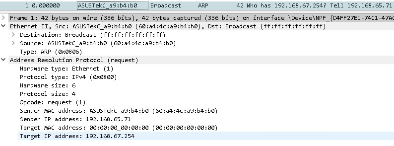
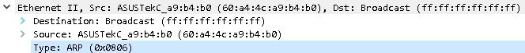
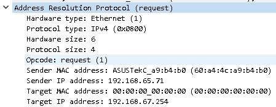
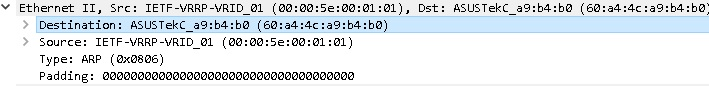
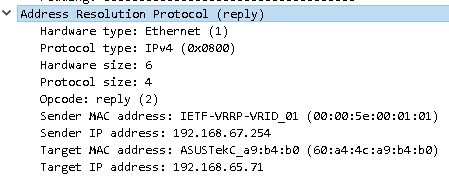

title: ARP

# Протокол ARP
Протокол канального уровня. 

## Определение/назначение
Служебный протокол канального уровня.
Вспомогательный протокол, предназначен для установления MAC адреса при известном ip устройства в броадкаст домене.
Либо при определении MAC адреса шлюза, для отправки кадра на dgw при маршрутизации.
Возможны варианты PROXY-ARP, Gratuitous ARP, но тут их пока рассматривать не буду, тут просто рассмотрю совсем базовые вещи.
По сути, MAC адрес необходим для дальнейшей формирования кадра для его дальнейшей коммутации или маршрутизации.

## Алгоритм работы ARP протокола:

- ARP-request - Запрашививается MAC адрес по известному ip адресу, при этом сообщаются "реквизиты отправителя" (mac и ip адрес отправителя)
- ARP-reply - Тот ip адрес(хотя и не всегда), которому отправлялся запрос отвечает отправителю ARP-запроса и сообщает свой MAC адрес.

**Аналогия**
Проведу небольшую аналогию....

"Аналогия ARP-request": "Эй, Я Иванов, мой номер телефона 232-323. Скажи, Козлов, какой у тебя номер телефона?", 
кричит Иванов в большой комнате...

"Аналогия ARP-reply": "эй Иванов, Я Козлов, мой номер телефона 323-232", 
кричит Козлов Иванову...

- большая комната - броадкаст домен
- Фамилия: Иванов - это ip адрес отправителя
- Фамилия: Козлов - это ip адрес получателя
- номера телефонов - это MAC адреса...


## Формат протокола

### ARP-request
Запрос MAС адреса, соответствующий определенному ip адресу. 



#### Заголовок кадра (L2)
При запросе о МАС адресе отправляется ARP запрос, где в заголовке кадра указывается:

- DA: броадкаст MAC адрес  (ff:ff:ff:ff:ff:ff) - адрес назначения (всем)
- SA: MAС адрес источника (60:a4:4c:a9:b4:b0) - в данном случае
- Type: 0x806 - это номер, который означает ARP протокол. 

В поле "Type" указывается,какой протокол находится на следующем(сетевом) уровне.



#### Протокол ARP (L3-L7)
Собственно как такового "классического" заголовка Layer 3 у ARP-a нет, а сразу идет сам ARP протокол.

В данном случае ARP-request



#### Общий формат ARP протокола

##### 1. Hardware type 
тип протокола канального уровня

В нашем случае, Hardware type = 1 - это номер, соответствующий протоколу Ethernet.

##### 2. Protocol type 
тип протокола сетевого уровня
```
В нашем случае, 
Protocol type = 0x0800 - это номер, соответствующий ipv4.
```

##### 3. Hardware size 
Размер адреса канального уровня
```bash
В нашем случае, Hardware size  - это MAC адрес, 
соответственно это 6 byte.
```
##### 4. Protocol size 
Размер адреса сетевого уровня
```bash
В нашем случае, Protocol size - это ipv4 адрес, 
соответственно это 4 byte.
```

##### 5. Opcode 
код операции в ARP
```bash
- 1 - request
- 2 - reply

есть еще значения, но они редко используюся

- 3  - RARP request
- 4  - RARP reply
...
```

##### 6. Sender MAC Address
MAC адрес отправителя
```bash
В данном случае это: 60:a4:4c:a9:b4:b0
```

##### 7. Sender IP Address
ip адрес отправителя
```bash
В данном случае это: 192.168.65.71
```

##### 8. Target MAC Address
MAC адрес отправителя
```bash
В данном случае это: 00:00:00:00:00:00 что означает, что адрес неизестен.
(по сути его нет необходимости указывать, 
так как раз он и неизвестен его как раз и пытаются узнать)
```

##### 9. Target IP address
ip адрес получателя
```bash
В данном случае это адрес 192.168.67.254, 
который должен ответить на данный запрос и прислать в ответ ARP-reply
```
Ну а далее как раз рассмотрю ARP-reply

### ARP-reply
Ответ на ARP-request

#### Заголовок кадра (L2)
При запросе о МАС адресе отправляется ARP запрос, где в заголовке кадра указывается:

- DA: MAC адрес назначения (60:a4:4c:a9:b4:b0) - адрес назначения, тому кто отправлял ARP запрос
- SA: MAС адрес источника (00:00:5e:00:01:01) 
- Type: 0x806 - это номер, который означает ARP протокол. 

В поле "Type" указывается, какой протокол находится на следующем(сетевом) уровне.



#### Протокол ARP (L3-L7)
В данном случае ARP-reply



##### 1. Hardware type 
тип протокола канального уровня
```bash
В нашем случае, Hardware type = 1 - это номер, 
соответствующий протоколу Ethernet.
```

##### 2. Protocol type 
тип протокола сетевого уровня
```bash
В нашем случае, 
Protocol type = 0x0800 - это номер, соответствующий ipv4.
```

##### 3. Hardware size 
Размер адреса канального уровня
```bash
В нашем случае, Hardware size  - это MAC адрес, 
соответственно это 6 byte.
```

##### 4. Protocol size 
Размер адреса сетевого уровня
```bash
В нашем случае, Protocol size - это ipv4 адрес, 
соответственно это 4 byte.
```

##### 5. Opcode 
код операции в ARP
```bash
- 2 - reply
```

##### 6. Sender MAC Address
MAC адрес отправителя
```bash
В данном случае это: 00:00:5e:00:01:01 - 
это как раз искомый MAC адрес.
```
##### 7. Sender IP Address
ip адрес отправителя
```bash
В данном случае это: 192.168.67.254
```

##### 8. Target MAC Address
MAC адрес получателя
```bash
В данном случае это: 60:a4:4c:a9:b4:b0 
```

##### 9. Target IP address
ip адрес получателя
```bash
В данном случае это: 192.168.65.71
```
##### Padding
Заполнитель, в данном случае равен  18 byte - используется для увеличения кадра до минимальной длины 64 byte
Т.е. размер кадра равен:

- заголовoк кадра              = 14 bytes
- ARP                          = 28 bytes
- Padding                      = 18 bytes
- FCS - frame control summ     = 4 bytes
- ИТОГО                        = 64 bytes

**Примечание: FCS - не показывается при дампе.**

## По Итогу
В конечном счете отправитель узнает MAC адрес на который ему нужно будет отправлять 
и использует в дальнейшем для формирования заголовка кадра, который отправляется на известный ip адрес

на обоих Хостах добавляются ARP-записи, об изученной связке MAC-IP в ARP таблицу вида:
```bash
#Пример ARP таблицы на хосте, который первоначально отправлял ARP запрос 
arp -a

 192.168.67.254        00-00-5e-00-01-01     динамический
```

## Пример arp дампа в wireshark 
можно посмотреть [здесь](https://icebale.readthedocs.io/en/latest/networks/wireshark.collection/arp.pcapng)

Весьма неплохая [статья](https://www.practicalnetworking.net/series/arp/traditional-arp/) на эту тему


