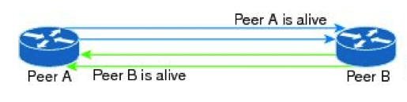
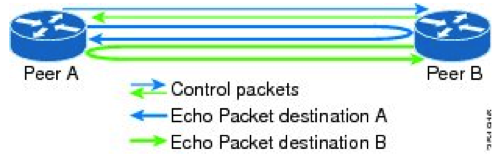
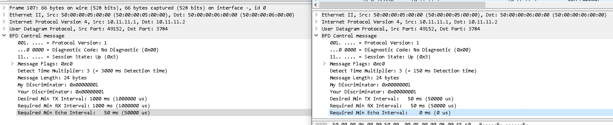
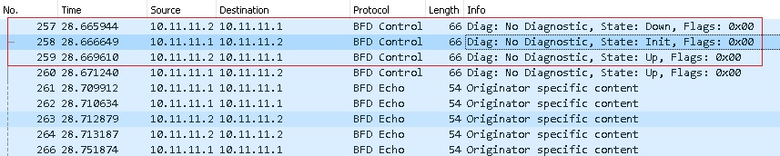

title: BFD

# Протокол BFD

## Определение/Назначение

BFD (Bidirectinal Forwarding Detection) - протокол, предназначенный для детектирования связности между двумя маршрутизаторами. Предназначен для ускорения времени реакции определения недоступности соседей при работе динамических протоколов маршрутизации IGP, BGP. И таким образом ускоряет время реакции этих протоколов и в конечном счете уменьшает время их сходимости.

## Настройки
Протокол BFD является двунаправленным протоколом, т.е. его необходимо настраивать с 2-х сторон.

### Режимы работы
Протокол может работать в двух режимах:

- Async mode - асинхронный режим работы:
- Demand mode 

Рассмотрим каждый из них поподробнее.

- Async mode - асинхронный режим работы:



```bash 
  Узел, на котором запущен BFD в асинхронном режиме, 
  периодически передает пакеты BFD Control. 
  
  BFD Control инкапсулируются в UDP с портом источника 49152 
  и портом назначения 3784. 
  ip адрес источника - это адрес локального интерфейса, 
  а ip адрес - это адрес удаленного интерфейса.
  
  BFD Control пакеты являются однонаправленными, 
  т.е. обычно не требуют ответа. Их цель - подтвердить, 
  что Control BFD на удаленном узле работает. 
  Если предварительно определенное количество интервалов 
  проходит без получения Control BFD пакета от удаленного узла, 
  то локальный узел объявляет сеанс BFD отключенным.
```

- Demand mode 
```bash
  Режим, в котором после установления сессии каждая из сторон 
  опрашивает другую по необходимости, тогда происходит обмен 
  последовательностью пакетов Control BFD и система замолкает, 
  до следующего такого обмена.
```

Для каждого из режимов работы (async mode и demand mode) есть дополнительная функция "echo"



```bash
Каждый из узлов отправляет "BFD echo" пакет, сформированный так, 
что ip адрес источника и назначения там является собственный адрес отправителя. 
Тогда, такой пакет дойдя до соседа вернется 
к отправителю согласно таблицы машрутизации соседа.
Поскольку функция Echo обрабатывает задачу обнаружения, 
то скорость передачи BFD Control пакетов может быть уменьшена в "Acync Mode",
либо вообще перкратиться в "Demand Mode".
Если же функция "Echo" отключена, то BFD Control пакеты начинают работать 
"по честному", согласно таймерам...
```

Для идентификации друг друга соседи обмениваются при установлении сессии идентификаторами, 
они называются "discriminator" и имеют своё уникальное значения для каждой из BFD сессии.

### Таймеры протокола

Могут задаваться непосредственно на интрефейсе:

bfd interval **N1** min_rx **N2** multiplier **interval-multiplier**

Могут задаваться через шаблон:

bfd-template single-hop BFD
 interval min-tx **N1** min-rx **N2** multiplier **interval-multiplier**


**N1** -  интервал генерации BFD Control пакетов (в миллисекундах)

**N2** - минимальный интервал между входящими BFD Control пакетами (в миллисекундах)

**interval-multiplier** - количество пакетов, после пропуска которых BFD сессия переходит в состояние DOWN

Пример:
```bash
bfd-template single-hop BFD-session
 interval min-tx 300 min-rx 300 multiplier 3

300 мс - интервал генерации BFD Control пакетов
300 мс - минимальный интервал между входящими BFD Control пакетами
3 - количество пакетов, после пропуска 
     которых BFD сессия переходит в состояние DOWN

т.о. если через 900 мс не будет прихода BFD Control пакета или BFD echo,
то сессия перейдет в режим DOWN и послужит триггреом для обрыва протокола
динамической маршрутизации, к которой она привязана
```

### Рассмотрю работу протокола на примере оборудования Cisco.
!waring "Важно"
		На оборудовании Cisco режим работы "Demand mode" не поддерживается.

Пример 1 Два маршрутизатора соеденены чз g0/0 с настроенным на интерфейсе bfd
```bash
#R1
interface GigabitEthernet0/0
 ip address 10.11.11.1 255.255.255.0
 bfd interval 50 min_rx 50 multiplier 3
end

#R2
interface GigabitEthernet0/0
 ip address 10.11.11.2 255.255.255.0
 bfd interval 50 min_rx 50 multiplier 3
end
```

Пример 1 Два маршрутизатора соеденены чз g0/0 с настроенным на интерфейсе bfd,
при чем на одном из них отключена функция "echo"
```bash
#R1
interface GigabitEthernet0/0
 ip address 10.11.11.1 255.255.255.0
 bfd interval 50 min_rx 50 multiplier 3
 no bfd echo
end

#R2
interface GigabitEthernet0/0
 ip address 10.11.11.2 255.255.255.0
 bfd interval 50 min_rx 50 multiplier 3
end
```

Тогда если сравнивать BFD Control для этих двух случаев, то
в первом случае BFD Control пакеты "прохлаждаются" (у них интервалы задраны до 1000мс)
и по выставленным таймерам работает только Echo, 
то во втором случае BFD Control пакеты уже работают по правильными таймерам.



Дамп инициализации и процесс работы протокола BFD для "Примера 1" можно скачать [здесь](https://icebale.readthedocs.io/en/latest/networks/wireshark.collection/bfd-control-init+echo.pcapng)



Как видно из дампа при инциализации протокола он проходит три стадии "Down-Init-Up"
В течении этих стадий обе стороны обмениваютс язначениями таймеров и номерами дискриминаторов.
После этого BFD echo пакеты начинают "вкалывать", а BFD Control пакеты "отдыхать".


### Пример настройки протокола BFD для OSPF
``` bash
interface GigabitEthernet0/0
 ip address 10.11.11.1 255.255.255.0
 bfd interval 50 min_rx 50 multiplier 3
!
router ospf 1
 network 10.11.11.0 0.0.0.255 area 0
 network 100.100.100.100 0.0.0.0 area 0
 bfd all-interfaces
```
При такой настройке при отвале/инициализации BFD, сразу же будет информироваться OSPF протокол,
и OSPF будет отключаться/включаться для данного соседа не дожидаясь отработки своих штатных таймеров.

Вот как процесс инициализации BFD с привязкой к OSPF выглядит в дебаге cisco:
```bash
*May  8 18:58:39.892: BFD-DEBUG EVENT: bfd_session_destroyed, proc:CEF, handle:1 act
*May  8 18:58:39.893: %BFD-6-BFD_SESS_DESTROYED: BFD-SYSLOG: bfd_session_destroyed,  ld:1 neigh proc:CEF, handle:1 act
*May  8 18:58:39.906: BFD-DEBUG Event: decreasing credits by 12 [to 0] (0)
*May  8 19:00:21.807: %OSPF-5-ADJCHG: Process 1, Nbr 100.100.100.100 on GigabitEthernet0/0 from LOADING to FULL, Loading Done
*May  8 19:00:22.290: BFD-DEBUG EVENT: bfd_session_created, 10.11.11.1 proc:OSPF, idb:GigabitEthernet0/0 handle:1 act
*May  8 19:00:22.291: %BFD-6-BFD_SESS_CREATED: BFD-SYSLOG: bfd_session_created, neigh 10.11.11.1 proc:OSPF, idb:GigabitEthernet0/0 handle:1 act
*May  8 19:00:22.321: %OSPFv3-5-ADJCHG: Process 1, Nbr 100.100.100.100 on GigabitEthernet0/0 from LOADING to FULL, Loading Done
*May  8 19:00:22.344: BFD-DEBUG EVENT: bfd_session_created, 10.11.11.1 proc:CEF, idb:GigabitEthernet0/0 handle:1 act
*May  8 19:00:23.190: %BFDFSM-6-BFD_SESS_UP: BFD-SYSLOG: BFD session ld:1 handle:1 is going UP
*May  8 19:00:23.194: BFD-DEBUG Packet: Rx IP:10.11.11.1 ld/rd:1/1 diag:0(No Diagnostic) Init  cnt:1 ttl:254 (0)
*May  8 19:00:23.197: BFD-DEBUG Event: V1 FSM ld:1 handle:1 event:RX INIT state:DOWN (0)
*May  8 19:00:23.198: BFD-DEBUG Packet: Tx IP:10.11.11.1 ld/rd:1/1 diag:0(No Diagnostic) Up   cnt:2 (0)
*May  8 19:00:23.199: BFD-DEBUG Packet: Rx IP:10.11.11.1 ld/rd:1/1 diag:0(No Diagnostic) Up  cnt:2 ttl:254 (0)
*May  8 19:00:23.199: BFD-DEBUG Event: V1 FSM ld:1 handle:1 event:RX UP state:UP (0)
*May  8 19:00:23.200: BFD-DEBUG Event: notify client(OSPF) IP:10.11.11.1, ld:1, handle:1, event:UP,  (0)
*May  8 19:00:23.201: BFD-DEBUG Event: notify client(CEF) IP:10.11.11.1, ld:1, handle:1, event:UP,  (0)
```

Отдельную серию заметок хочу посвятить дизайну сети, где как раз планирую показать варианты тюнинга в протоколах IGP их собственных таймеров и возможностей отработки для них BFD протокола.

Например, ["Классический" дизайн сети](https://icebale.readthedocs.io/en/latest/networks/design/disign-l3/) такого вида:

iBGP(по лупбекам)[redistribute connected, static] <---> 

IGP(OSPF или ISIS)[только стыковочные ip и loopback-и], 

с условием тюнинга таймеров и отработкой BFD для IGP протоколов.


Подробную статью работы протокола bfd можно посмотреть [здесь](https://community.cisco.com/t5/service-providers-documents/bfd-support-on-cisco-asr9000/ta-p/3153191/page/6).
