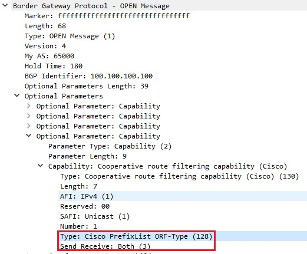
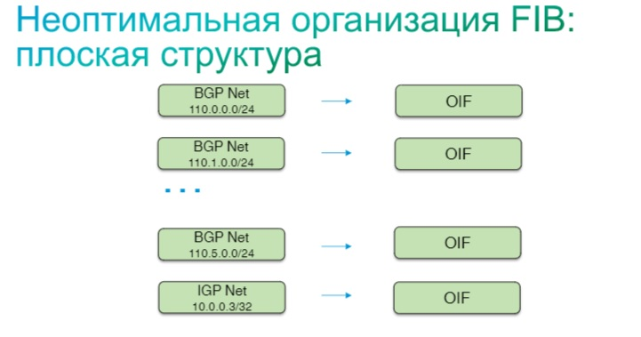
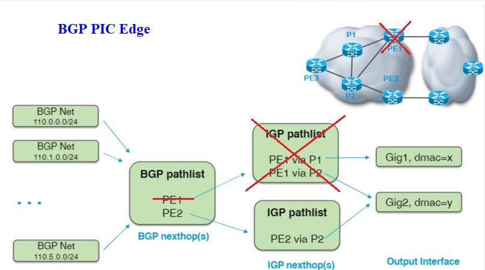

title: BGP

# Протокол BGP

## Определение/Назначение

## Настройки
### ORF  
**orf - output route filters**
```bash

```
  Механизм, который позволяет посылать соседу информацию о тех префиксах, которые хочет принимать вторая сторона.
  Удобно в случае, когда идет фильтрация входящих префиксов. При включенном orf с обоих сторон происходит обмен фильтрами на входящие префиксы и сосед заранее при отправке префиксов сделает на своей стороне фильтрацию лишних (не нужных соседу) и отправит только необходимые.

#### Реализация на оборудовании

##### Cisco
**IOS/IOS-XE**

```bash
     router bgp 65000
      address-family ipv4
        neighbor 1.1.1.1 capability orf prefix-list both
```
подробнее см. [документацию](http://admindoc.ru/1250/bgp-outbound-route-filtering/)

**IOS-XR**
В IOS-XR надо в явном виде указывать prefix-set для ORF

```bash
  prefix-set orf-preset
    172.16.1.0/24,
    172.16.5.0/24,
    172.16.11.0/24
  end-set
  
  route-policy policy-orf
    if orf prefix in orf-preset then
      drop
    endif
    if orf prefix in (172.16.3.0/24, 172.16.7.0/24, 172.16.13.0/24) then
      pass
    endif
  
  router bgp 2
    neighbor 1.1.1.1
      remote-as 3
      address-family ipv4 unicast
        orf route-policy policy-orf
```

###### Пример работы OFR на Cisco IOS

Схема:


<details><summary>настройка R0</summary>
<p>

```bash
hostname R0
int lo0 
 ip add 100.100.100.100 255.255.255.255
!
int lo1 
 ip add 111.111.111.111 255.255.255.255
!
int g0/0
 ip add 10.11.11.1 255.255.255.0
 
router ospf 1
 network 10.11.11.1 0.0.0.255 area 0
 network 100.100.100.100 0.0.0.0 area 0
!
router bgp 65000
 bgp router-id 100.100.100.100
 bgp log-neighbor-changes
 neighbor 1.1.1.1 remote-as 65000
 neighbor 1.1.1.1 update-source Loopback0
 !
 address-family ipv4
  redistribute connected
  neighbor 1.1.1.1 activate
  neighbor 1.1.1.1 default-originate
  neighbor 1.1.1.1 capability orf prefix-list both
  neighbor 1.1.1.1 soft-reconfiguration inbound
  neighbor 1.1.1.1 prefix-list PL-R1-IN in
 exit-address-family
 !
ip prefix-list PL-R1-IN seq 5 deny 22.22.22.22/32
ip prefix-list PL-R1-IN seq 10 permit 0.0.0.0/0 ge 32

```
</p>

<details><summary>настройка R1</summary>
<p>

```bash
hostname vR1
!
int lo0 
 ip add 1.1.1.1 255.255.255.255
!
int g0/0
 ip add 10.11.11.2 255.255.255.0
! 
router ospf 1
 network 10.1.2.1 0.0.0.255 area 0
 network 10.11.11.1 0.0.0.255 area 0
 network 1.1.1.1 0.0.0.0 area 0
!
ipv6 router ospf 1
 router-id 1.1.1.1

int lo1
 ip add 11.11.11.11 255.255.255.255
!
router bgp 65000
 timers bgp 1 3
 bgp router-id 1.1.1.1
 neighbor 100.100.100.100 remote-as 65000
 neighbor 100.100.100.100 update loopback 0
  !
 address-family ipv4
  redistribute connected
  neighbor 2.2.2.2 activate
```
</p>


Дамп установления BGP и обмен префиксами можно  посмотреть [здесь](https://icebale.readthedocs.io/en/latest/networks/wireshark.collection/bgp+orf.pcapng)

Описание работы.

R0 и R1 устанавливают BGP соседство по лупбекам lo0.

Информация о лупбеках и стыковочных сетях передается по OSPF.

На R0 используется префикс лист "PL-R1-IN" для фильтрации входящих от соседа префиксов

"neighbor 1.1.1.1 prefix-list PL-R1-IN in"


Для того, чтобы в принципе сосед не отправлял эти ненужные префиксы настраивается механизм ORF
"neighbor 1.1.1.1 capability orf prefix-list both"

!!! warning "Важно"
    Настройка ORF должна быть с обоих сторон, иначе данный функционал работать не будет!


Тогда при установлении соединения в состоянии "Open" передается в параметрах соединение способность работать с ORF



В сообщении "ROUTE-REFRESH" соседу передается сам префикс лист.


По данному префикс листу сосед производит фильтрацию префиксов на своей стороне еще до отправки их в сообщении "UPDATE".
Как видно из данного рисунка префика 22.22.22.22/32 отсутствует в сообщении BGP UPDATE.


Как видно в таблице принимаемых префиксов (received-routes) изначально нет маршрута отфильтрованного по OFR

<details><summary>R0 просмотр префиксов приходящих по BGP от соседа</summary>
<p>

```bash
R0#sh ip bgp neighbors 1.1.1.1 received-routes
BGP table version is 6452, local router ID is 100.100.100.100
Status codes: s suppressed, d damped, h history, * valid, > best, i - internal,
              r RIB-failure, S Stale, m multipath, b backup-path, f RT-Filter,
              x best-external, a additional-path, c RIB-compressed,
Origin codes: i - IGP, e - EGP, ? - incomplete
RPKI validation codes: V valid, I invalid, N Not found

     Network          Next Hop            Metric LocPrf Weight Path
 r>i 1.1.1.1/32       1.1.1.1                  0    100      0 ?
 r>i 2.2.2.2/32       2.2.2.2                  0    100      0 ?
 *>i 11.11.11.11/32   1.1.1.1                  0    100      0 ?

Total number of prefixes 3


R0#sh ip bgp neighbors 1.1.1.1 routes
BGP table version is 6452, local router ID is 100.100.100.100
Status codes: s suppressed, d damped, h history, * valid, > best, i - internal,
              r RIB-failure, S Stale, m multipath, b backup-path, f RT-Filter,
              x best-external, a additional-path, c RIB-compressed,
Origin codes: i - IGP, e - EGP, ? - incomplete
RPKI validation codes: V valid, I invalid, N Not found

     Network          Next Hop            Metric LocPrf Weight Path
 r>i 1.1.1.1/32       1.1.1.1                  0    100      0 ?
 r>i 2.2.2.2/32       2.2.2.2                  0    100      0 ?
 *>i 11.11.11.11/32   1.1.1.1                  0    100      0 ?
```
</p>

Сам принимаемый от соседа ORF можно посмотреть командой **sh ip bgp nei 100.100.100.100 received prefix-filter**

```bash
R0#sh ip bgp nei 100.100.100.100 received prefix-filter
Address family: IPv4 Unicast
ip prefix-list 100.100.100.100: 2 entries
   seq 5 deny 22.22.22.22/32
   seq 10 permit 0.0.0.0/0 ge 32
```


подробнее см. [документацию](https://www.cisco.com/c/en/us/td/docs/routers/xr12000/software/xr12k_r4-0/routing/configuration/guide/rc40xr12k_chapter7.html#con_1206744)

##### Juniper
**MX80**

```bash
neighbor 2.2.2.2 {
    description "== NEIGHBOR with ORF ==";
    local-address 1.1.1.1;
    peer-as 22222;
    outbound-route-filter {
        bgp-orf-cisco-mode;
        prefix-based {
            accept {
                inet;
            }
        }
    }
}
```

!!! note "Примечание"
	С данной настройкой не удалось подружить Джун с Хуавеем. Нужно сделать лабу

подробнее см. [документацию](https://www.juniper.net/documentation/en_US/junos/topics/topic-map/basic-routing-policies.html#id-example-configuring-bgp-prefix-based-outbound-route-filtering)

##### Huawei
**NE8000-F1A**

```bash
    bgp 11111
     ipv4-family unicast
      peer 1.1.1.1 capability-advertise orf ip-prefix both
```
подробнее см. [документацию](https://support.huawei.com/enterprise/en/doc/EDOC1100146591/ec511dde/configuring-prefix-based-bgp-orf)


### Soft-reconfiguration  
**soft-reconfiguration** 
```bash

```
  Механизм, который позволяет хранить локально таблицу префиксов, принятую от соседа.
  Удобно использовать данный механизм при изменении входящего фильтра, тогда фильтр применяется уже к актуальной существующей таблице префиксов и нет необходимость перезапрашивать всю таблицу заново.\
  Полезно при принятии FullView
  Недостаток: необходима доп. память, чтобы храннить таблицу префиксов

Общая схема работы 


подробнее см. [документацию](https://networklessons.com/bgp/bgp-soft-reset-reconfiguration)


!!! note "Замечание"
    Крайне нежелательно использовать soft-reconfiguration на оборудовании с недостаточным количеством памяти

#### Реализация на оборудовании
##### Cisco

**IOS/IOS-XE**

!!! note "Примечание"
    По умолчанию не включена


Включить можно командой 

```bash
 router bgp 50022
  neighbor 1.1.1.1 remote-as 31257
  neighbor 1.1.1.1 description == NEIGHBOR 1 ==
  !
  address-family ipv4
   neighbor 1.1.1.1 activate
   neighbor 1.1.1.1 soft-reconfiguration inbound
```

**IOS-XR**

!!! note "Примечание"
    По умолчанию не включена

Включить можно командой 

```bash
 neighbor 1.1.1.1
  remote-as 11111
  timers 60 180
  description ==== NEIGHBOR 1 ====
  bmp-activate server 1
  update-source Bundle-Ether1.1
  address-family ipv4 unicast
   send-community-ebgp
   route-policy POLICY_IN in
   route-policy POLICY_OUT out
   soft-reconfiguration inbound always
```
подробнее см. [документацию](https://www.cisco.com/c/en/us/td/docs/routers/crs/software/crs_r3-9/routing/command/reference/rr39crs1book_chapter1.html#wp307968196)

##### Juniper
**MX80**

!!! note "Примечание"
     По умолчанию (не отображается в конфиге) включен 
     в таком режиме - хранит всю информацию о маршрутах, 
     полученную от BGP, за исключением маршрутов, 
     путь AS которых является зацикленным и цикл которых включает локальную AS.

Выключить можно командой 
```bash
 neighbor 1.1.1.1 {
    description "== NEIGHBOR 1 ==";
    local-address 2.2.2.2;
    keep none;
 }
```
подробнее см. [документацию](https://www.juniper.net/documentation/en_US/junos/topics/reference/configuration-statement/keep-edit-protocols-bgp.html)

##### Huawei
**NE8000-F1A**

!!! note "Примечание"
     По умолчанию хранит все маршруты которые прошли через фильтрацию import

Включить можно командой

```bash
    bgp 11111
     ipv4-family unicast
      peer 1.1.1.1 keep-all-routes
```
подробнее см. [документацию](https://support.huawei.com/enterprise/en/doc/EDOC1000174069/78fc123/configuring-bgp-soft-reset)

### PMTUD
PMTUD - Path MTU Discovery позволяет увеличить скорость принятия анонсов по BGP, например при приеме или отправки FullView

Для увеличения скорости, а по сути в данном контексте под скоростью подразумевается размер MTU и в конечном счете значение MSS в tcp сессии используется механизм [PMTUD](https://icebale.readthedocs.io/en/latest/networks/protocols/TCP/#path_mtu_discovery_pmtud)

Для этого нужно:
1. Максимально увеличить MTU на интерфейсе в сторону соседа
2. Включить Path-MTU-Discovery


#### Juniper [mtu-discovery]

[Изначально при установлении tcp соединения по порту 179 для BGP по дефолту MSS устанавливается равным 512 byte. Это делается для того, чтобы минимизировать возможность фрагментации пакета при прохождении промежуточных маршрутизаторов, где возможно выставлен меньший MTU.](https://www.juniper.net/documentation/us/en/software/junos/bgp/topics/ref/statement/mtu-discovery-edit-protocols-bgp.html)

У Джунипера по умолчанию PMTUD [включен](https://www.juniper.net/documentation/us/en/software/junos/bgp/topics/ref/statement/mtu-discovery-edit-protocols-bgp.html)
```bash
system internet-options{
   mtu-discovery
}
interfaces {
  ae0 {
      mtu 9000;
  }
}
```


#### Cisco [tcp path-mtu-discovery]
У Циско по умолчагнию PMTUD [включен](https://www.cisco.com/c/dam/en/us/td/docs/routers/asr920/configuration/guide/iproute/16-8-1/b-iproute-xe-16-8-1-asr920.html)
```bash
tcp path-mtu-discovery

interface Bundle-Ether1.1111
  ! Размер MTU нужно устанавливать уже непосредственно на интерфейсах/сабинтерфейсах
  mtu 9212
```


#### Huawei [path-mtu auto-discovery]
У Хуавея по умолчанию PMTUD [выключен](https://support.huawei.com/enterprise/en/doc/EDOC1100058917/dd638600/configuring-path-mtu-auto-discovery)
```bash
# MTU выставляется непосредственно на интерфейсе или сабинтерфейсе
interface Eth-Trunk19
 mtu 9216

bgp 11111
 peer 2.2.2.2 path-mtu auto-discovery
```

### Fall-over
#### Назначения механизма

Fall-over - механизм, который позволяет оптимизировать время сходимости (convergence) BGP протокола за счет наблюдения за наличием соседа в таблице маршрутизации. 

Пример работы: если BGP сосед вдруг перестал быть доступен в таблице маршрутизации, то BGP сессия сразу отключается, таким образом по итогу сразу же происходит актуализация информации о маршрутах BGP в RIB не дожидаясь отработки таймеров BGP (keepalive interval и holdtime), которые достаточно большие по дефолту (60, 180)

Механизм "fall-over" используется для iBGP, когда адреса BGP соседей - это loopback соседа и соответсвенно маршрут о данном лупбеке передается в протоколе IGP.

Разберем работу механизма "fall-over" на конкретных примерах:
Примеры настройки взяты из [статьи](https://networkop.co.uk/blog/2015/06/11/ibgp-fallover-trick/)

#### Настройка - пример 1:
Пример настройки
```bash
router bgp 100
 neighbor 1.1.1.1 remote-as 100
 neighbor 1.1.1.1 fall-over 
 neighbor 2.2.2.2 remote-as 200
 neighbor 2.2.2.2 fall-over 
!
```
!!! warning "Важно"
    При такой настройке, "fall-over" работает только в том случае, 
    если нет "less specific", маршрута в RIB,  например в виде "корзины", 
    т.к. иначе "next hop" в явном виде в таблице маршрутизации.

Чтобы исключить зависимость от наличия default-а в таблице маршрутизации рассмотрим следующий пример:

#### Настройка - пример 2:
Пример настройки с уникальным route-map для каждого BGP соседа

```bash
router bgp 100
 neighbor 1.1.1.1 remote-as 100
 neighbor 1.1.1.1 fall-over route-map RM-BGP-FALLOVER-1
 neighbor 2.2.2.2 remote-as 200
 neighbor 2.2.2.2 fall-over route-map RM-BGP-FALLOVER-2
!
ip prefix-list PL-ROUTER-1 seq 5 permit 1.1.1.1/32
!
ip prefix-list PL-ROUTER-2 seq 5 permit 2.2.2.2/32
!
route-map RM-BGP-FALLOVER-1 permit 10
 match ip address prefix-list PL-ROUTER-1
!
route-map RM-BGP-FALLOVER-2 permit 10
 match ip address prefix-list PL-ROUTER-2
```
В данном примере используется специальный route-map, который матчит ip адрес BGP соседа не со всей RIB, а только с нужным маршрутом.
Такой конфиг уже устойчив к наличию дефолта и уже таргетно фильтрует из RIB ip адрес каждого соседа.
Но также имеется и недостаток в таком конфиге, т.к. для каждого соседа нужно делать свой route-map.

Чтобы решить этот вопрос используют более унифицированный конфиг:
#### Настройка - пример 3:
Пример настройки с универсальным route-map для каждого BGP соседа

```bash
!
router bgp 100
 neighbor 1.1.1.1 remote-as 100
 neighbor 1.1.1.1 fall-over route-map RM-BGP-FALLOVER
 neighbor 2.2.2.2 remote-as 200
 neighbor 2.2.2.2 fall-over route-map RM-BGP-FALLOVER
!
ip prefix-list PL-ALL-LOOPBACKS seq 5 permit 0.0.0.0/0 ge 32
!
route-map RM-BGP-FALLOVER permit 10
 match ip address prefix-list PL-ALL-LOOPBACKS
!
```

В данном примере в route-map RM-BGP-FALLOVER попадают только префиксы с маской /32 - по сути это и есть ip адреса всех известных в RIB лупбеков.
Логика работы проста - если ip адреса соседа нет в RIB, то и в route-map его тоже не будет и в таком случае запустится механизм fall-over.

### BGP PIC
#### Назначения механизма
BGP PIC(Prefix Independent Convergence) - механизм, который обеспечивает независимую от RIB сходимость префиксов на уровне FIB.

**Изначально FIB был плоским, т.н. FIB flattened.**
При такой схеме организации FIB при смене next-hop-а, в RIB приходится перестраивать всю таблицу маршрутизации касательно тех префиксов, у которых сменился netx-hop. Для BGP, где этих перфиксвов для ipv4 в FV сейчас уже больше 850000 записей сходимость будет занимать достаточно длительное время.




Для решения проблемы по времени сходимости была придумана иерархическая модель организации FIB, т.н. FIB hierarchial.

Иерархическая модель является по сути ссылочной моделью, когда next-hop-ом для BGP префикса по сути является ссылка на next-hop(ы) IGP префиксов.


Такая модель удобна тем, что при пропадении одного из IGP NH, просто используются другие доступные IGP NH и нет необходимости в пересчете маршрутов для всех BGP префиксов. Точно также и при пропадении одного из BGP NH, используются другие доступные BGP NH. 
Таким образом, достигается быстрая сходимость по протоколу BGP.

!!! note "Важно"
      Непрямая зависимость между IGP и BGP записями 
      позволяет избежать обновления BGP информации в FIB в случае, 
      если BGP префиксы не затронуты напрямую.

Необходимые условия для такой работы - наличие нескольких ECMP маршрутов до NH для BGP и IGP.
**Такая модель работы и называется BGP PIC.**

Например, при включении режима multihop в BGP - как раз начинает работать механизм BGP PIC.

#### Имеется два варианта работы:
При BGP PIC возможно два варианта возникновения проблемы с NH

- BGP PIC Core
- BGP PIC Edge

##### BGP PIC Core
BGP PIC Core - происходит, когда нарушается связность внутри сети, в таком случае BGP NH не меняется, а происходит смена IGP NH.


При этом в RIB просто удаляется нерабочий IGP NH и остаются только рабочие IGP NH.
И таким образом, не происходит пересчет BGP префиксов в FIB.
При этом BGP NHT(Next-Hop Address Tracking) - посылает уведомление процессу BGP, которое может привести к запуску BGP Control-Plane Convergence.
BGP NHT - это функция, которая уведомляет BGP об изменении маршрутизации для BGP NH.

!!! warning "Важно"
          Посредством BGP NHT через Data Plane по сути происходит управления Control Plane.

##### BGP PIC Edge
BGP PIC Edge - Когда становится недоступным пограничный маршрутизатор.



В таком случае, меняется сам BGP NH. При этом в FIB просто удаляется недоступный BGP NH, и остаются только рабочие BGP NH
при этом перестроения BGP prefix-ов в RIB тоже не происходит. 
При этом BGP NHT(Next-Hop Address Tracking) - посылает уведомление процессу BGP об удалении BGP NH, которое приводит к запуску BGP Control-Plane Convergence.

#### Литература по BGP PIC 
##### 1. [Конфигурация и особенности BGP PIC призентация](https://community.cisco.com/t5/%D0%BC%D0%B0%D1%80%D1%88%D1%80%D1%83%D1%82%D0%B8%D0%B7%D0%B0%D1%86%D0%B8%D1%8F-%D0%B8-%D0%BA%D0%BE%D0%BC%D0%BC%D1%83%D1%82%D0%B0%D1%86%D0%B8%D1%8F/%D0%BA%D0%BE%D0%BD%D1%84%D0%B8%D0%B3%D1%83%D1%80%D0%B0%D1%86%D0%B8%D1%8F-%D0%B8-%D0%BE%D1%81%D0%BE%D0%B1%D0%B5%D0%BD%D0%BD%D0%BE%D1%81%D1%82%D0%B8-border-gateway-protocol-bgp-prefix/ta-p/3148094?attachment-id=40782)

##### 2. [Конфигурация и особенности BGP PIC вебинар](https://community.cisco.com/t5/%D0%BC%D0%B0%D1%80%D1%88%D1%80%D1%83%D1%82%D0%B8%D0%B7%D0%B0%D1%86%D0%B8%D1%8F-%D0%B8-%D0%BA%D0%BE%D0%BC%D0%BC%D1%83%D1%82%D0%B0%D1%86%D0%B8%D1%8F-%D0%B2%D0%B8%D0%B4%D0%B5%D0%BE/%D0%BA%D0%BE%D0%BD%D1%84%D0%B8%D0%B3%D1%83%D1%80%D0%B0%D1%86%D0%B8%D1%8F-%D0%B8-%D0%BE%D1%81%D0%BE%D0%B1%D0%B5%D0%BD%D0%BD%D0%BE%D1%81%D1%82%D0%B8-border-gateway-protocol-bgp-prefix/ba-p/3107354)


