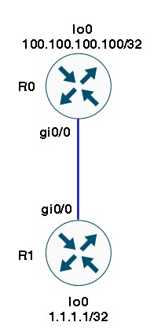
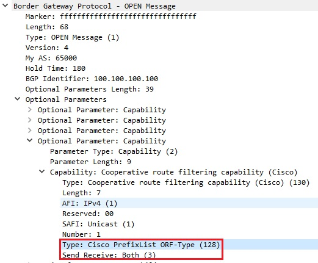
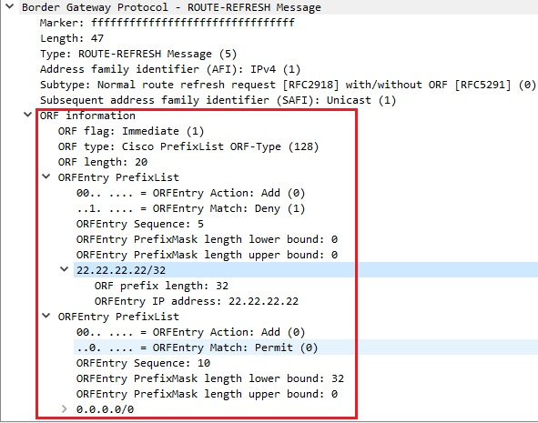
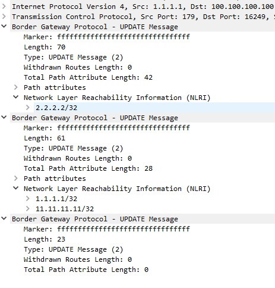

title: ORF

# ORF  
ORF - Output Route Filters
  Механизм, который позволяет посылать соседу информацию о тех префиксах, которые хочет принимать вторая сторона.
  Удобно в случае, когда идет фильтрация входящих префиксов. При включенном orf с обоих сторон происходит обмен фильтрами на входящие префиксы и сосед заранее при отправке префиксов сделает на своей стороне фильтрацию лишних (не нужных соседу) и отправит только необходимые.

## Реализация на оборудовании

### Cisco
**IOS/IOS-XE**

```bash
     router bgp 65000
      address-family ipv4
        neighbor 1.1.1.1 capability orf prefix-list both
```
подробнее см. [документацию](http://admindoc.ru/1250/bgp-outbound-route-filtering/)

**IOS-XR**
В IOS-XR надо в явном виде указывать prefix-set для ORF

```bash
  prefix-set orf-preset
    172.16.1.0/24,
    172.16.5.0/24,
    172.16.11.0/24
  end-set
  
  route-policy policy-orf
    if orf prefix in orf-preset then
      drop
    endif
    if orf prefix in (172.16.3.0/24, 172.16.7.0/24, 172.16.13.0/24) then
      pass
    endif
  
  router bgp 2
    neighbor 1.1.1.1
      remote-as 3
      address-family ipv4 unicast
        orf route-policy policy-orf
```

#### Пример работы ORF

Схема:



<details><summary>настройка R0</summary>
<p>

```bash
hostname R0
int lo0 
 ip add 100.100.100.100 255.255.255.255
!
int lo1 
 ip add 111.111.111.111 255.255.255.255
!
int g0/0
 ip add 10.11.11.1 255.255.255.0
 
router ospf 1
 network 10.11.11.1 0.0.0.255 area 0
 network 100.100.100.100 0.0.0.0 area 0
!
router bgp 65000
 bgp router-id 100.100.100.100
 bgp log-neighbor-changes
 neighbor 1.1.1.1 remote-as 65000
 neighbor 1.1.1.1 update-source Loopback0
 !
 address-family ipv4
  redistribute connected
  neighbor 1.1.1.1 activate
  neighbor 1.1.1.1 default-originate
  neighbor 1.1.1.1 capability orf prefix-list both
  neighbor 1.1.1.1 soft-reconfiguration inbound
  neighbor 1.1.1.1 prefix-list PL-R1-IN in
 exit-address-family
 !
ip prefix-list PL-R1-IN seq 5 deny 22.22.22.22/32
ip prefix-list PL-R1-IN seq 10 permit 0.0.0.0/0 ge 32

```

</p>
</details>

<details><summary>настройка R1</summary>
<p>

```bash
hostname vR1
!
int lo0 
 ip add 1.1.1.1 255.255.255.255
!
int g0/0
 ip add 10.11.11.2 255.255.255.0
! 
router ospf 1
 network 10.1.2.1 0.0.0.255 area 0
 network 10.11.11.1 0.0.0.255 area 0
 network 1.1.1.1 0.0.0.0 area 0
!
ipv6 router ospf 1
 router-id 1.1.1.1

int lo1
 ip add 11.11.11.11 255.255.255.255
!
router bgp 65000
 timers bgp 1 3
 bgp router-id 1.1.1.1
 neighbor 100.100.100.100 remote-as 65000
 neighbor 100.100.100.100 update loopback 0
  !
 address-family ipv4
  redistribute connected
  neighbor 2.2.2.2 activate
```
</p>
</details>

Дамп установления BGP и обмен префиксами можно  посмотреть [здесь](https://icebale.readthedocs.io/en/latest/networks/wireshark.collection/bgp+orf.pcapng)

Описание работы.

R0 и R1 устанавливают BGP соседство по лупбекам lo0.

Информация о лупбеках и стыковочных сетях передается по OSPF.

На R0 используется префикс лист "PL-R1-IN" для фильтрации входящих от соседа префиксов

"neighbor 1.1.1.1 prefix-list PL-R1-IN in"


Для того, чтобы в принципе сосед не отправлял эти ненужные префиксы настраивается механизм ORF
"neighbor 1.1.1.1 capability orf prefix-list both"

!!! warning "Важно"
    Настройка ORF должна быть с обоих сторон, иначе данный функционал работать не будет!


Тогда при установлении соединения в состоянии "Open" передается в параметрах соединение способность работать с ORF



В сообщении "ROUTE-REFRESH" соседу передается сам префикс лист.



По данному префикс листу сосед производит фильтрацию префиксов на своей стороне еще до отправки их в сообщении "UPDATE".
Как видно из данного рисунка префика 22.22.22.22/32 отсутствует в сообщении BGP UPDATE.



Как видно в таблице принимаемых префиксов (received-routes) изначально нет маршрута отфильтрованного по OFR

<details><summary>R0 просмотр префиксов приходящих по BGP от соседа</summary>
<p>

```bash
R0#sh ip bgp neighbors 1.1.1.1 received-routes
BGP table version is 6452, local router ID is 100.100.100.100
Status codes: s suppressed, d damped, h history, * valid, > best, i - internal,
              r RIB-failure, S Stale, m multipath, b backup-path, f RT-Filter,
              x best-external, a additional-path, c RIB-compressed,
Origin codes: i - IGP, e - EGP, ? - incomplete
RPKI validation codes: V valid, I invalid, N Not found

     Network          Next Hop            Metric LocPrf Weight Path
 r>i 1.1.1.1/32       1.1.1.1                  0    100      0 ?
 r>i 2.2.2.2/32       2.2.2.2                  0    100      0 ?
 *>i 11.11.11.11/32   1.1.1.1                  0    100      0 ?

Total number of prefixes 3


R0#sh ip bgp neighbors 1.1.1.1 routes
BGP table version is 6452, local router ID is 100.100.100.100
Status codes: s suppressed, d damped, h history, * valid, > best, i - internal,
              r RIB-failure, S Stale, m multipath, b backup-path, f RT-Filter,
              x best-external, a additional-path, c RIB-compressed,
Origin codes: i - IGP, e - EGP, ? - incomplete
RPKI validation codes: V valid, I invalid, N Not found

     Network          Next Hop            Metric LocPrf Weight Path
 r>i 1.1.1.1/32       1.1.1.1                  0    100      0 ?
 r>i 2.2.2.2/32       2.2.2.2                  0    100      0 ?
 *>i 11.11.11.11/32   1.1.1.1                  0    100      0 ?
```
</p>
</details>

Сам принимаемый от соседа ORF можно посмотреть командой 

**sh ip bgp nei 100.100.100.100 received prefix-filter**

```bash
R0#sh ip bgp nei 100.100.100.100 received prefix-filter
Address family: IPv4 Unicast
ip prefix-list 100.100.100.100: 2 entries
   seq 5 deny 22.22.22.22/32
   seq 10 permit 0.0.0.0/0 ge 32
```


подробнее см. [документацию](https://www.cisco.com/c/en/us/td/docs/routers/xr12000/software/xr12k_r4-0/routing/configuration/guide/rc40xr12k_chapter7.html#con_1206744)

### Juniper
**MX80**

```bash
neighbor 2.2.2.2 {
    description "== NEIGHBOR with ORF ==";
    local-address 1.1.1.1;
    peer-as 22222;
    outbound-route-filter {
        bgp-orf-cisco-mode;
        prefix-based {
            accept {
                inet;
            }
        }
    }
}
```

!!! note "Примечание"
	С данной настройкой не удалось подружить Джун с Хуавеем. Нужно сделать лабу

подробнее см. [документацию](https://www.juniper.net/documentation/en_US/junos/topics/topic-map/basic-routing-policies.html#id-example-configuring-bgp-prefix-based-outbound-route-filtering)

### Huawei
**NE8000-F1A**

```bash
    bgp 11111
     ipv4-family unicast
      peer 1.1.1.1 capability-advertise orf ip-prefix both
```
подробнее см. [документацию](https://support.huawei.com/enterprise/en/doc/EDOC1100146591/ec511dde/configuring-prefix-based-bgp-orf)
