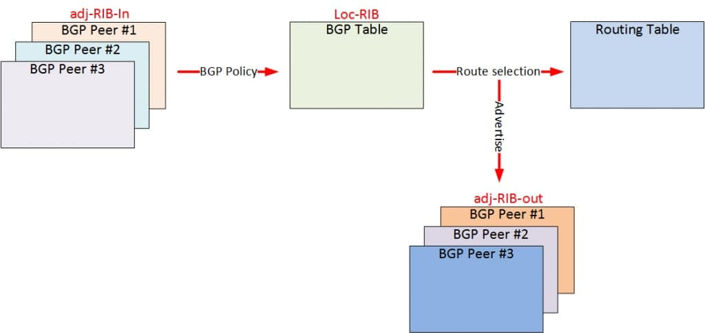

title: Soft-reconfiguration

# Soft-reconfiguration  
Soft-reconfiguration -  Механизм, который позволяет хранить локально таблицу префиксов, принятую от соседа.
  Удобно использовать данный механизм при изменении входящего фильтра, тогда фильтр применяется уже к актуальной существующей таблице префиксов и нет необходимость перезапрашивать всю таблицу заново.
  Полезно при принятии FullView
  Недостаток: необходима доп. память, чтобы храннить таблицу префиксов

Общая схема работы 


подробнее см. [документацию](https://networklessons.com/bgp/bgp-soft-reset-reconfiguration)


!!! note "Замечание"
    Крайне нежелательно использовать soft-reconfiguration на оборудовании с недостаточным количеством памяти

## Реализация на оборудовании
### Cisco

**IOS/IOS-XE**

!!! note "Примечание"
    По умолчанию не включена


Включить можно командой 

```bash
 router bgp 50022
  neighbor 1.1.1.1 remote-as 31257
  neighbor 1.1.1.1 description == NEIGHBOR 1 ==
  !
  address-family ipv4
   neighbor 1.1.1.1 activate
   neighbor 1.1.1.1 soft-reconfiguration inbound
```

**IOS-XR**

!!! note "Примечание"
    По умолчанию не включена

Включить можно командой 

```bash
 neighbor 1.1.1.1
  remote-as 11111
  timers 60 180
  description ==== NEIGHBOR 1 ====
  bmp-activate server 1
  update-source Bundle-Ether1.1
  address-family ipv4 unicast
   send-community-ebgp
   route-policy POLICY_IN in
   route-policy POLICY_OUT out
   soft-reconfiguration inbound always
```
подробнее см. [документацию](https://www.cisco.com/c/en/us/td/docs/routers/crs/software/crs_r3-9/routing/command/reference/rr39crs1book_chapter1.html#wp307968196)

### Juniper
**MX80**

!!! note "Примечание"
     По умолчанию (не отображается в конфиге) включен 
     в таком режиме - хранит всю информацию о маршрутах, 
     полученную от BGP, за исключением маршрутов, 
     путь AS которых является зацикленным и цикл которых включает локальную AS.

Выключить можно командой 
```bash
 neighbor 1.1.1.1 {
    description "== NEIGHBOR 1 ==";
    local-address 2.2.2.2;
    keep none;
 }
```
подробнее см. [документацию](https://www.juniper.net/documentation/en_US/junos/topics/reference/configuration-statement/keep-edit-protocols-bgp.html)

### Huawei
**NE8000-F1A**

!!! note "Примечание"
     По умолчанию хранит все маршруты которые прошли через фильтрацию import

Включить можно командой

```bash
    bgp 11111
     ipv4-family unicast
      peer 1.1.1.1 keep-all-routes
```
подробнее см. [документацию](https://support.huawei.com/enterprise/en/doc/EDOC1000174069/78fc123/configuring-bgp-soft-reset)
