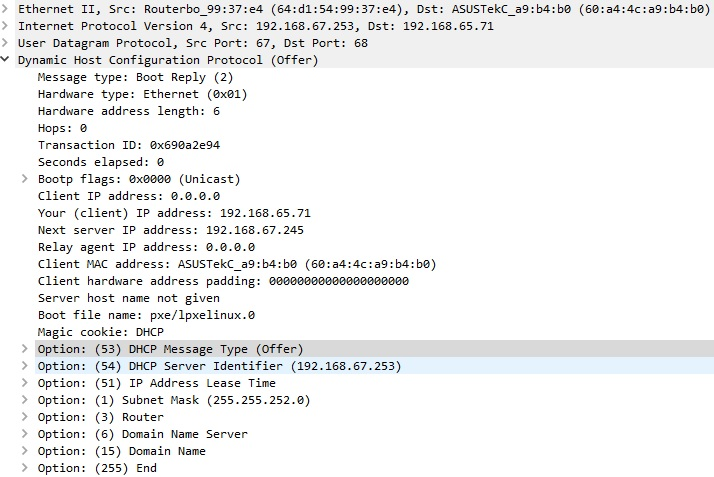

title: DHCP

# Протокол DHCP

## Назначение
Протокол DHCP(Dynamic Host Configuration Protocol) - предназначен для автоматической передачи ip настроек по запросу клиента.
Работает по модели "клиент-сервер", используется в качестве транспортного протока [UPD](https://icebale.readthedocs.io/en/latest/networks/protocols/UDP/).

Клиент отправляет запросы с 68 порта, порт сервера 67.

## Структура сообщения DHCP


| Field       | Description                                      | Length   |
| ----------- | ------------------------------------------------ | -------- |
|op           | Тип сообщения. Boot Request = 1, Boot Reply = 2  | 1 byte   |
|htype	      | Hardware Type - аппаратный тип - Ethernet = 1 	 | 1 byte   |
|hlen	      | Длина аппаратного адреса. MAC-адрес Ethernet = 6 | 1 byte   |
|hops	      | Количество промежуточных маршрутизаторов (так называемых агентов ретрансляции DHCP), через которые прошло сообщение. |  1 byte   |
|xid	      | Уникальный идентификатор транзакции в 4 байта, генерируемый клиентом в начале процесса получения адреса.| 4 byte |
|secs	      | Время в секундах с момента начала процесса получения адреса. Может не использоваться (в этом случае оно устанавливается в 0) | 2 byte |
|flags		  | Поле для флагов — специальных параметров протокола DHCP | 2 bytes |
|ciaddr		  | ip-адрес клиента. Заполняется только в том случае, если клиент уже имеет собственный ip-адрес (это возможно, если клиент выполняет процедуру обновления адреса по истечении срока аренды).	| 4 bytes |
|yiaddr	      | Новый ip-адрес клиента, предложенный сервером.	   | 4 bytes |
|siaddr		  |  Значение присваивается клиентом DHCP, если клиент хочет связаться с конкретным сервером DHCP. ip-адрес сервера DHCP может быть получен при помощи сообщений DHCPOFER и DHCPACK, ранее возвращенных сервером. Сервер может вернуть адрес следующего сервера, с которым следует связаться в процессе загрузки, - например, адрес сервера, на котором хранится загрузочный образ операционной системы   	   | 4 bytes |
|giaddr	      | ip-адрес агента ретрансляции, если таковой был.	   | 4 bytes |
|chaddr	      | Аппаратный адрес (обычно MAC-адрес) клиента. В случае Ethernet первые 6 байт это MAC адрес, а остальные 10-ть заполняются нулями (Client hardware address padding)| 16 bytes|
|sname        |	Необязательное имя сервера.|	64 bytes|
|file         |	Необязательное имя файла на сервере, используемое бездисковыми рабочими станциями при удалённой загрузке. Например, pxe/lpxelinux.0   | 128 bytes |
|options	  | Опций DHCP. Здесь указываются по сути все праметры конфигурации настроек ip на стороне клиента. | up to 214 bytes|

Наиболее "популярные" опции:

- Option 53 - DHCP message type - тип сообщения - (Discover, Offer, Request, Ack, NAС, Inform)
- Option 54 - ip адрес DHCP сервера
- Option 51 - lease time - время аренды
- Option 1 - Subnet mask
- Option 3 - Router - ip адрес gateway
- Option 6 - DNS - ip адреса DNS
- Option 15 - Domain Name - доменное имя 
- Option 255 - End - означает окончание опций
- Option 82 - Указывает ID коммутатора и ID порта, с которого пришел запрос от клиента. 
  Используя данную опцию по сути можно идентифицировать клиента и выдавать ему ip адрес.
  По такому принципу работает, т.ню. технология IPoE.

!!! note "Option 127"
	Имеется такая интересная опция 127, которая согласно [RFC3442](https://datatracker.ietf.org/doc/html/rfc3442) позволяет передавать DHCP клиенту статический маршрут. 

Кусок конфига на dhcp сервере:
```bash
option rfc3442-classless-static-routes 24,172,16,1,192,168,1,254;
```
Объяснение:
```bash
option rfc3442-classless-static-routes 
/24 - маска
172.16.1.0 - адрес сети
192.168.1.254 - адрес шлюза
----------------------------------
т.е. на клиенте дополнительно добавляется статический маршрут 
до сетки 172.16.1.0/24 через 192.168.1.254
```на клиенте: ip route add 172.16.1.0/24 gw 192.168.1.254
```

**П.э. если захочется странного, то можно сделать "протокол динамической маршрутизации" из DHCP - "Почему бы и да?" )**
**уменьшив время аренды, например до 1 минуты и генеря конфиг dhcp сервера с опиций 127, гыгы )))** 


## Процесс получения DHCP адреса
Процесс получения ip адреса по DHCP представляет из себя четыре стадии.
Его еще называют "DORA" - по первым буквам стадий.

### 1. DHCP Discover 
Клиент отправляет в сеть широковещательный запрос на поиск DHCP сервера о том, что он хочет получить настройки ip. 


### 2. DHCP Offer 
Сервер отправляет юнисастом, клиенту предложение с вариантом настроек ip. 
При этом сервер выделяет эти адреса временно, п.э. нет точной гарантии, что клиент их получит.



### 3. DHCP Request 
Клиент отправляет широковещательный запрос на сервер DHCP, 
таким образом подтверждая своё согласие принять данные настройки от DHCP сервера.


### 4. DHCP Ack
Сервер принимает DHCP Request от клиента и если данный адрес еще никому не назначился, 
то отправляет подтверждение в виде DHCP Ack.


После этого клиент начинает работать с заданными ip параметрами, 
а сервер помечает данный ip адрес занятым данным клиентам.

Возможен вариант когда dhcp сервер может отвергнуть подтверждение DHCP Request.
тогда он ответит сообщением DHCP NAK  

## Время аренды (lease time)
Время аренды - это время в течении которого, клиепн может пользовать данный Ip адрес.
Алгоритм продления ip адреса выглядет таким образом:
- При достижении 1/2 времени аренды, клиент делает перезапрос ip адреса
- Если получен положительный ответ, то всё "ОК", если же ответа нет, то 1/2 времени лиза клиент делит пополам и через этот интеравл снова повторно отправляет запрос на продление времени лиза, ну и т.д...
- Если в результате ответа клиент не получает, то он отпавляет запрос на получение нового ip адреса.

<details><summary>Цитата из статьи</summary>
Цитата из литературы [Срок аренды](https://selectel.ru/blog/dhcp-protocol/)
<p>
Когда DHCP-сервер выделяет IP из области, он оставляет запись о том, что этот адрес зарезервирован за клиентом с указанием срока действия IP. Этот срок действия называется срок аренды (lease time). Срок аренды может составлять от 24 часов до нескольких дней, недель или даже месяцев, он задается в настройках самого сервера.
</p>
<p>
Предоставление адреса в аренду, а не на постоянной основе необходимо по нескольким причинам. Во-первых, это разумное использование IP-адресов — отключенные или вышедшие из строя клиенты не резервируют за собой адрес. Во-вторых, это гарантия того, что новые клиенты при необходимости смогут получить уникальный адрес.
</p>

<p>
После получения адреса из области, клиент берет его в аренду на время, называемое T. Клиент переходит в связанное (BOUND) состояние и продолжает нормальную работу, пока не наступит время половины срока аренды — T1.
</p>

<p>
По наступлении T1 клиент инициализирует процедуру получения нового IP или обновления адреса — состояние RENEWING. Процесс повторного получения происходит по упрощенной схеме: клиент прямым сообщением запрашивает (DHCPREQUEST), а сервер подтверждает (DHCPACK) запрос. Время аренды начинает отсчитываться заново.
</p>

<p>
Если подтверждение (DHCPACK) от сервера не поступает, клиент снова запрашивает адрес, но только когда истекает половина T1. Если запрос адреса остается без ответа второй раз, клиент отправляет еще одно сообщение, когда истекает половина от T1/2 (25% от полного срока аренды). Следующий запрос будет отправлен после истечения еще половины оставшегося времени, потом еще половины. И так далее, пока не наступит T2, которое равняется 87,5%, или 7/8 от всего времени аренды. После T2 все попытки продлить аренду IP будут широковещательными. Это значит, что, если первый сервер по какой-то причине недоступен, на запрос адреса сможет ответить любой другой, и работа не будет прервана.
</p>
</details>

## Режимы работы протокола

### Клиент и сервер подключены напрямую


### Клиент и сервер подключены через dhcp relay


При работе через DHCP-relay логика работы несколько меняется:

- формат DHCP DORA, отправляемые и принимаемые клиентом остаются прежними.
- между DHCP-relay и DHCP-сервером формат DHCP запросов видоизменяется.

DHCP-Relay отправляет на DHCP сервер уже измененные запросы с указанием себя в качестве источника и DHCP сервера в качестве получателя, также добавляется поле giaddr

DHCP-сервер также отправляет на DHCP-relay unicast ответы 
DHCP-Relay транслирует обратно клиенту ответы (Offer и Ack) от DHCP сервера уже в обычном виде.


Образцы дампов:

- [1. Стандартый DHCP DORA](https://icebale.readthedocs.io/en/latest/networks/wireshark.collection/dhcp-dora.pcapng)
- [2. DHCP DORA Relay](https://icebale.readthedocs.io/en/latest/networks/wireshark.collection/dhcp-relay.pcapng)
- [3. DHCP DORA Renew](https://icebale.readthedocs.io/en/latest/networks/wireshark.collection/dhcp-dora-renew.pcapng)
- [4. DHCP Release, Nak, Inform](https://icebale.readthedocs.io/en/latest/networks/wireshark.collection/dhcp-release-nak-inform.pcapng)

Литература:

[1. Принципы работы протокола DHCP](https://selectel.ru/blog/dhcp-protocol/)

[2. How a DHCP Server Allocates Network Parameters to New DHCP Clients](https://support.huawei.com/enterprise/en/doc/EDOC1100116724/5cef90ad/how-a-dhcp-server-allocates-network-parameters-to-new-dhcp-clients)

[3. Principles of DHCPv4 Address Allocation](https://support.huawei.com/enterprise/en/doc/EDOC1100125886/c5ff6555/principles-of-dhcpv4-address-allocation)