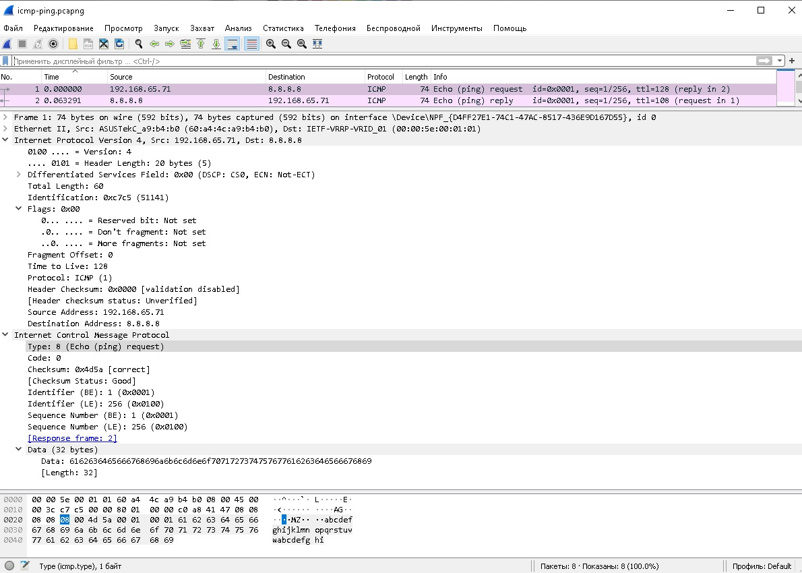

title: ICMP

# Протокол ICMP

Descrambler:
```bash
...Like a pies of cake...
```


## Определение
Можно быть достаточно академичным и написать тут сложное и многоямбовое определение и назначение протокола ICMP, но делать это не хочется, попробую описать в 2-3 словах его суть...

Протокол ICMP (Internet Control Message Protocol) предназначен для диагностики и сообщении об ошибках при проверки сетевой связности.

## Назначение
Примеры назначения.

### Проверка доступности удаленного хоста (команда ping)
Самый простой пример это использование icmp в команде ping

В этом случае отправляется запрос в сеть протокола ICMP
типа: 
```java
Type: 8  - Echo ping (request)
Code: 0
```



Пример icmp дампа в wireshark можно посмотреть [здесь](https://icebale.readthedocs.io/en/latest/networks/wiresharrk.collection/icmp-ping.pcap)
