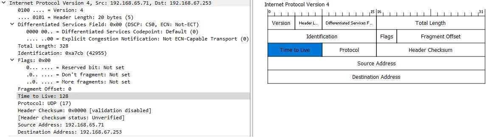

title: IPv4

# Протокол ipv4


## Определениe

Протокол ip является сетевым протоколом Layer 3 (Network) [модели OSI](https://icebale.readthedocs.io/en/latest/networks/protocols/OSI-anatomy/). Единица измерения Layer 3 - это пакет (packet)
По сути опираясь на этот протокол происходит маршрутизация пакетов в сети. 
Для маршрутизации пакетов используется статическая или динамическая маршрутизация.

В механизме работы протокала ip нет защиты от потери при передачи данных, реализация такой защиты осуществляется при необходимости на следующих уровнях, например в протоколе транспортного уровня TCP.

## Структура заголовка ipv4

Рассмотрим пример заголовка ip пакета

```bash
1. "Version" - версия протокола, в данном случае версия 4.
2. "Header length" - размер заголовка - стандартный размер заголовка 20 byte
3. "Differentiated Services Code Point (DSCP)" - используется для разбиение трафика на классы обслуживания, 
   для приоритезации в обслуживании трафика более чувствительного к задержкам, например VoIP или видео потоков.
4. "Explicit Congestion Notification (ECN)" — «Явное Уведомление о Перегруженности»  расширение протокола IP, 
    описанное в RFC 3168. ECN позволяет обеим сторонам в сети узнавать о возникновении затора на маршруте 
    к заданному хосту или сети без отбрасывания пакетов. Это дополнительная функция, 
    которая используется только в том случае, когда обе конечные точки обмена информацией сообщают, 
    что они хотят её использовать.
5. "Total length" - полный размер пакета в байтах, включая заголовок и данные. 
    Минимальный размер равен 20 байтам (заголовок без данных), максимальный — 65535 байт. 
    Хосты должны поддерживать передачу пакетов размером до 576 байт. Пакеты большего размера, 
    чем поддерживает канал связи (MTU), фрагментируются.
6. "Identification" - идентификатор, преимущественно используется для идентификации фрагментов пакета, 
    если он был фрагментирован. Существуют эксперименты по его использованию для других целей, 
    таких как добавление информации о трассировке пакета для упрощения отслеживания пути пакета 
    с подделанным адресом источника.
7. "Flags" - поле размером три бита содержащее флаги контроля над фрагментацией. 
    Биты, от старшего к младшему, означают:
  - "Reserved bit" - Зарезервирован, должен быть равен всегда 0. 
  - "Don't fragment" - Не фрагментировать:
    - "0"- если фрагментация пакета разрешена
    - "1"- если фрагментация пакета запрещена
  - "More fragments" - У пакета ещё есть фрагменты:
    - "0"- если фрагментов нет
    - "1"- если фрагменты еще есть
8. "Fragment Offset" - смещение фрагментации - указывает смещение поля данных текущего фрагмента
   относительно начала поля данных первого фрагментированного пакета в блоках по 8 байт.  
9. "Time To Live" - 'время жизни' пакета. Для защиты от петель на сетевом уровне используется поле TTL. 
   При передачи пакета от одного маршрутизатора к другому каждый следующий маршрутизатор 
   уменьшает текущий TTL на единицу. Если TTL становится равным 0, то такой пакет отбрасывается маршрутизатором
   и в зависимости от настроеке может генерироваться icmp сообщение с типом 11 "Type 11 – Time Exceeded".
   Максимальное значение TTL=255. 
10. "Protocol" - протокол вышестоящего уровня, находящегося в payload пакета, 
    например TCP - 6, UDP - 17 или ICMP - 1.
11. "Header Checksum" - контрольная сумма, используемая для проверки целостности заголовка. 
    Каждый хост или маршрутизатор сравнивает контрольную сумму заголовка со значением этого поля 
    и отбрасывает пакет, если они не совпадают. 
    Так TTL каждый раз уменьшается, то каждый маршрутизатор вынужден пересчитывать контрольную сумму заголовка.
12. "Source Address" - (source ip address) - ip адрес источника пакета.
13. "Destination Address" - (destination ip address) - ip адрес назначения пакета.
14. "Options" - опции. За адресом назначения может следовать поле дополнительных опций, 
    но оно используется крайне редко, в основном для эксперементальных целей... 
```
  
Номера протоколов можно посмотреть на сайте IANA [Protocol Numbers](https://www.iana.org/assignments/protocol-numbers/protocol-numbers.xml)

Номера ip опций можно посмотреть на сайте IANA [Internet Protocol Version 4 IPv4 Parameters](https://www.iana.org/assignments/ip-parameters/ip-parameters.xhtml)


## Литература

- [1. ip - Википедия](https://ru.wikipedia.org/wiki/IP)
- [2. ipv4 - Википедия](https://ru.wikipedia.org/wiki/IPv4)
- [3. ECN - Википедия](https://ru.wikipedia.org/wiki/Explicit_Congestion_Notification)
