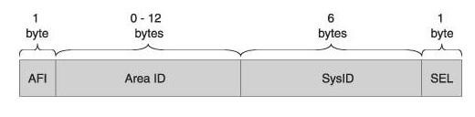
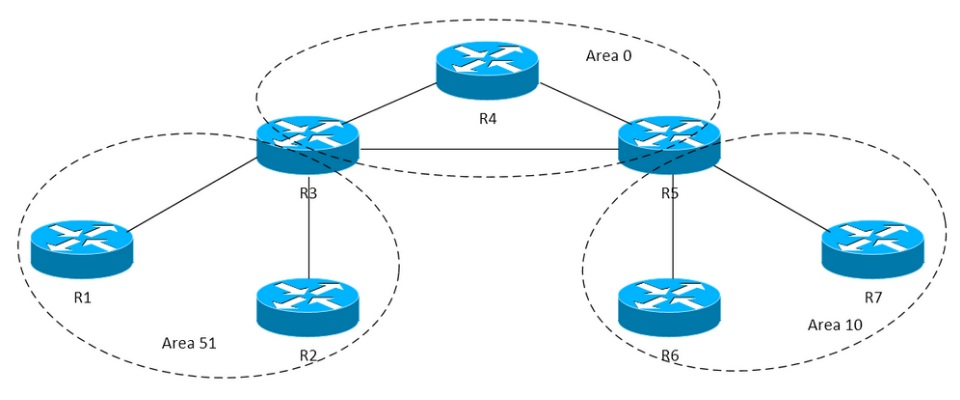
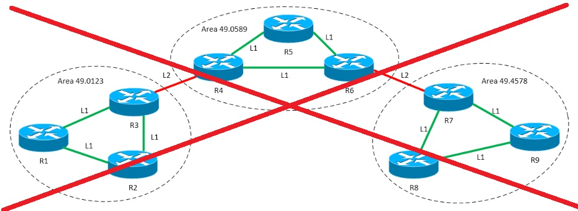

title: IS-IS

# Протокол IS-IS


Disclaimer:

```bash
Говорят, что протокол IS-IS является запрещенным протоколом динамической маршрутизации на территории РФ... 
```

## Определение/Назначение

```bash
"IS-IS (Intermediate System to Intermediate System)" - link-state протокол динамической маршрутизации.
```
Алгоритм выбора оптимального маршрута строится по Алгоритму Дейкстры, какой используется и в протоколе [OSPF](https://icebale.readthedocs.io/en/latest/networks/protocols/OSPF/).

## История протокола

История протокола IS-IS уходит своими корнями в то время, когда еще протокол ip не захватил и не монополизировал Layer 3 модели OSI и были и другие реализации протоколов, к таковым относиться и протокол IS-IS...

По этому можно сказать, что протокол IS-IS "не от мира сего", т.е. не от мира протокола ip...

IS-IS работает поверх канального уровня модели OSI, поэтому он не привязан к конкретному протоколу сетевого уровня. 
Также IS-IS не использует протокол IP для доставки сообщений, содержащих информацию о маршрутизации (LSA и прочее).

!!!warning "Важная информация"
			Другими словами, (весьма крамольная мысль с точки зрения современного сетевого стека протоколов) для IS-IS протокола не нужна ip связность между его участниками...

Протокол IS-IS разработан Digital Equipment Corporation как составляющая часть DECnet Phase V. Он был стандартизирован ISO в 1992 году как ISO 10589 для взаимодействия между сетевыми устройствами, которые обозначались как Промежуточные Системы (в противовес конечным устройствам). Основная цель разработки IS-IS - маршрутизация пакетов средствами, входящими в набор протоколов ISO OSI - CLNS.


## Терминология

СLNP (Connection Less Network Protocol) - бесконтактный сетевой протокол - это дейтаграммный протокол передачи данных, функционально очень похожий на протокол IP.

### Адресация в СLNP



NET идентификатор:

```bash
- "AFI" (Authority and Format Identifier) - является частью номера области, хотя постоянно изображается отдельно. 
  Подавляющее большинство реализаций IS-IS на маршрутизаторах имеют это поле, равным 49. 
  Адреса, у которых AFI был равен 49, относились к классу локальных.

- "Area ID", номер области, к которой принадлежит маршрутизатор. Это поле переменной длины.

- "System ID" - это идентификатор маршрутизатора. У каждого маршрутизатора в топологии он должен быть уникальным, 
  поскольку именно по System ID маршрутизаторы "узнают" друг друга при осознании топологии. 
  В OSPF аналогом System ID является Router ID (однако он имеет другой формат).
```

### Дизайн сети IS-IS vs OSPF

В отличии от сети OSPF, где маршрутизатор может находиться одновременно в нескольких обоастях (OSPF AREA), т.к. раздел области идет по интерфейсу.




В сети IS-IS разделение происходит областей происходит по маршрутизатором целиком т.е. маршрутизатор не может быть одновременно в разных областях.


Cуществует два типа доменов IS-IS (на самом деле в теории их 3):
- L1 - соседство, которое формируется между маршрутизаторами в одной области 
- L2 - соседство, которое формируется между маршрутизаторами одной области, так и между разными областями.

Такие два уровня взаимодействий позволяют выделить три типа маршрутизаторов в IS-IS домене:
Маршрутизаторы L1 - это те устройства, у которых все взаимодействия с другими маршрутизаторами происходят на 1 уровне.
Маршрутизаторы L2 - это те устройства, у которых все соседства организованы на 2 уровне.
Маршрутизаторы L1/L2 - это устройства, поддерживающие взаимодействия обоих уровней.


!!!warning "Примечание" 
			На самом деле есть еще домен типа L3 который осуществляет маршрутизацию между различными доменами. 
			В IP-сетях за это отвечает протокол BGP, а в OSI — IDRP (Interdomain Routing Protocol). 
			Маршрутизация L3 не поддерживается маршрутизаторами Cisco.


### Тонкости дизайна
С точки зрения дизайна протокола нижеследующий дизайн не может быть рабочим для IS-IS.



Требование IS-IS, заключающееся в том, что всё множество L2 взаимодействий между маршрутизаторами должно быть непрерывным.

По сути аналогом OSPF Backbone (Area 0) является не какая-то конкретная area с каким-то номером, а все множество соседств L2 между отдельными маршрутизаторами. Именно это множество L2 соседств формирует backbone или ядро сети, к которому подключаются остальные части топологии (или остальные area), внутри которых могут быть сформированы соседства уровня 1. В этом контексте маршрутизаторы L1/L2 можно назвать примерным аналогом ABR в OSPF.

 На маршрутизаторе через один интерфейс можно сформировать соседства обоих уровней. То есть маршрутизатор может на одном и том же интерфейсе сформировать и соседство уровня 1, и L2 соседство. С точки зрения протокола IS-IS, это вполне себе штатное поведение. 


## Настройки


## Литература

- [1. XGURU IS-IS](http://xgu.ru/wiki/IS-IS)
- [2. IS-IS Википедия](https://ru.wikipedia.org/wiki/IS-IS)


