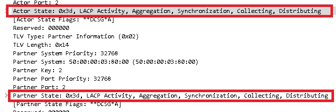
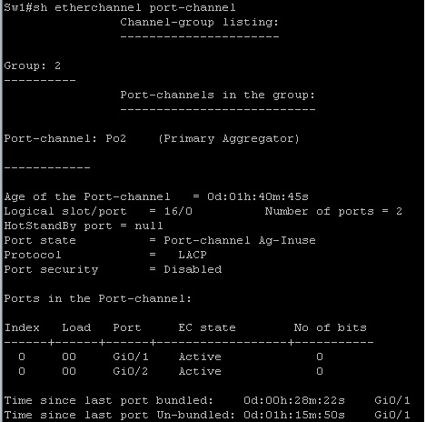
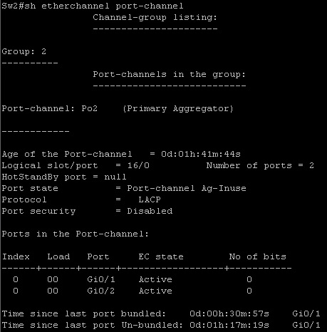
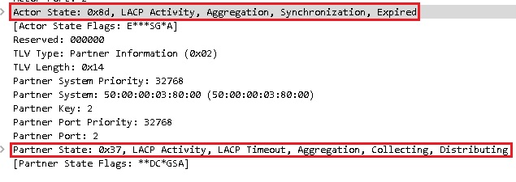
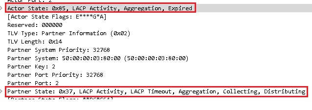
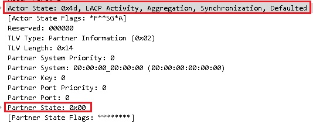

title: LAG

# LAG - link Aggregation
## Определение/Назначение
Технология предназначенная, для агрегации каналов, т.е другими словами объединение нескольких физических портов в один логический.

Существует своя реализация LAG на оборудовании Nexus - VPC  (Virtual Port Channel), про ее работу постараюсь написать отдельную статью, т.к. это достаточно большая и отдельная тема...

Descrambler:
```bash
LAG 
```

## Общий принцип работы:
Технология LAG может работать в 2-х режимах: 

- Static - статический режим работы, это когда между двумя сторонами линка, объедененного а LAG нет никакой сигнализации о доступности второй стороны. Статический режим, п.э. имеет большой неостаток в этой связи, т.е. он не видит ошибки или какую либо проблему на канале, а включает линк в LAG и отключает линк из LAG на основании его физической доступности, т.е. если линк в "Up-е", то он всегда будет в LAG-e, если линк в "Down-е", то только это будет причиной исключения его из LAG-а. Соответственно, если с одной стороны порт является участником LAG-a, а с другой нет не будет служить основанием для исключения его с другой стороны LAG-a, если там он прописан как участник LAG-а. Соответственно такое поведение ведет к блекхолингу трафика, т.е. одна сторона думает, что все "ок"" и отправляет кадры в порт, который по сути может быть не настроен с другой стороны.
Чтобы избежать подобных проблем внутри LAG-a используется протоколы сигнализации состояния канала LACP/PAgP.

PAgP - проприетарный протокол cisco, по сути на данный момент практически нигде не используется, п.э. про него говорить не буду...

- LACP - Link Aggregation Control Protocol. А во LACP "король" LAG-a...

Попробую рассказать про него на основе моей очень простой лабы:


Интерфейсы, участвующие в LAG, ну и соответственно в LACP тоже:
```bash
Sw1: 
 - G0/1 - mac-address 5000.0003.0001
 - G0/2 - mac address 5000.0003.0002
Sw2: 
 - G0/1 - mac-address 5000.0005.0001
 - G0/2 - mac-address 5000.0005.0002
```


Во-первых структура самого протокола весьма "ветвистая"


Для понимания работы достаточно понять общий принцип:
1. При установлении соединения протокол LACP использует в качестве DST mac-address 01:80:c2:00:00:02, а в качестве SRC mac-address указывает ("виртуальный") наименьший из mac адресов своих интерфейсов, в моем случае это со стороны Sw1 5000.0003.0001 и соответственно со стороны Sw2 5000.0005.0001.
2. Наиболее значащими полями являтся "Actor State" - "собственное" состояние LACP и "Partner State" - состояние LACP партнера (что собственно следует из название поля).
3. Соединенные между собой порты работающие по LACP обмениваются информационными сообщениями LACP.
   В нормальном состоянии поля "Actor State" и "Partner State" имеют значение 0x3d



При этом можно посмотреть состояние портчана на обоих соседях






4. При потери связности с партнером LACP проходит стадии









После этого такой линк исключается из LAG-a:


## Литература

- [1. Агрегирование каналов](http://xgu.ru/iki/%D0%90%D0%B3%D1%80%D0%B5%D0%B3%D0%B8%D1%80%D0%BE%D0%B2%D0%B0%D0%BD%D0%B8%D0%B5_%D0%BA%D0%B0%D0%BD%D0%B0%D0%BB%D0%BE%D0%B2)
- [2. Протокол агрегирования каналов: Etherchannel](https://habr.com/ru/post/334778/)

Пример дампа rip в wireshark можно посмотреть [здесь](https://icebale.readthedocs.io/en/latest/networks/wireshark.collection/lacp1.pcapng)
