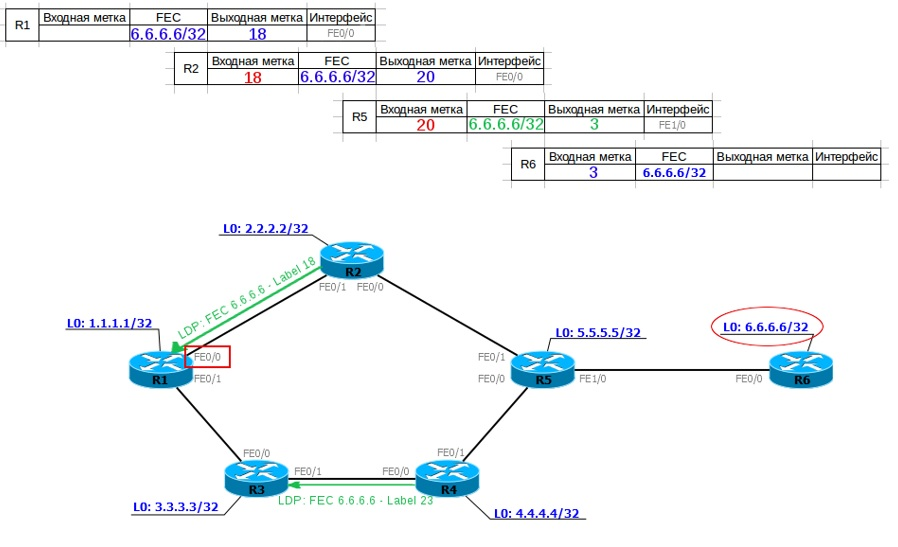
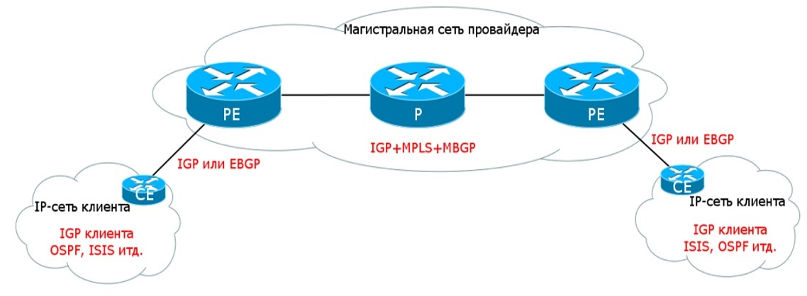
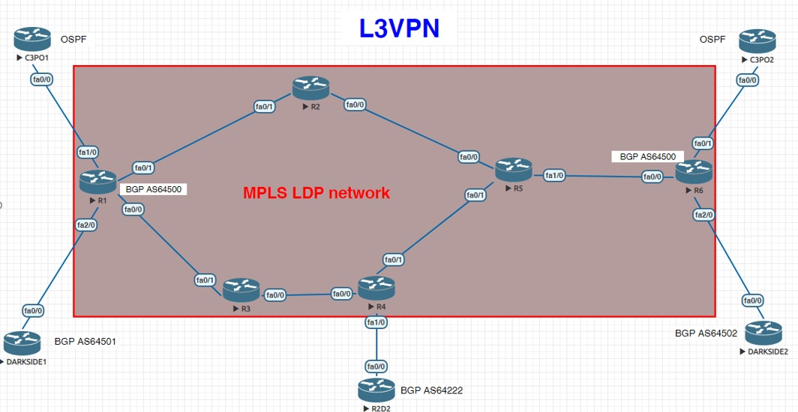
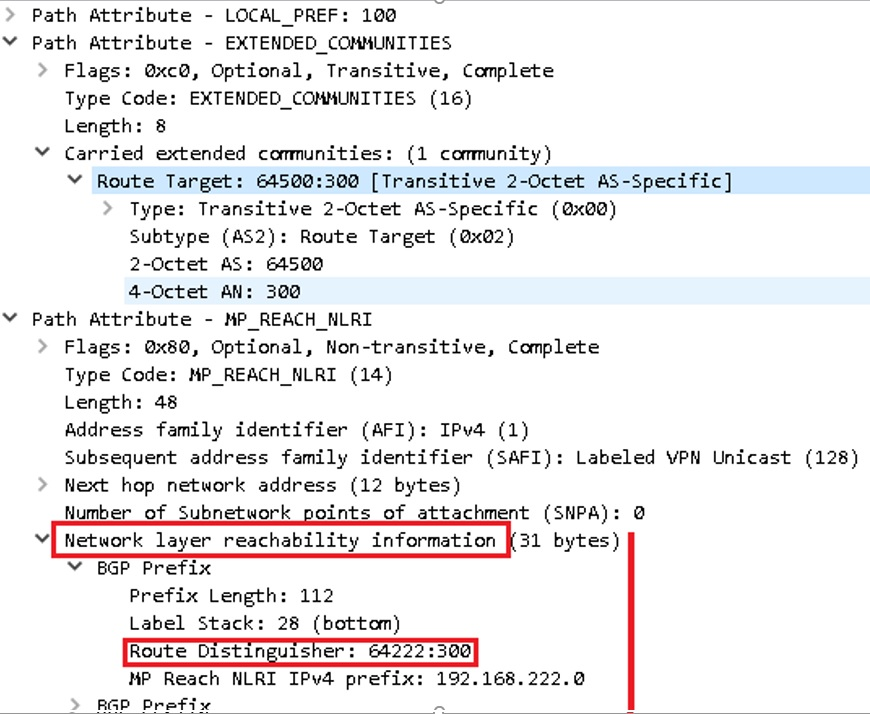
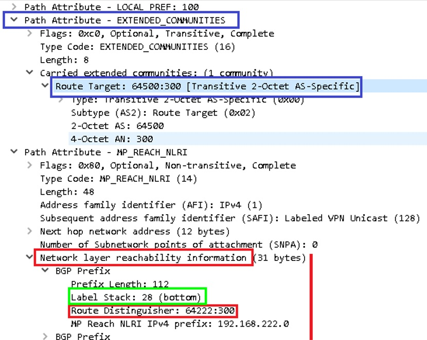
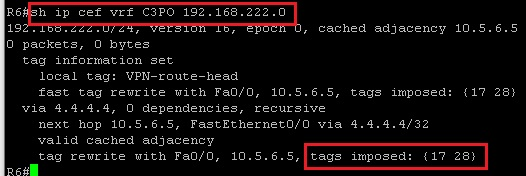
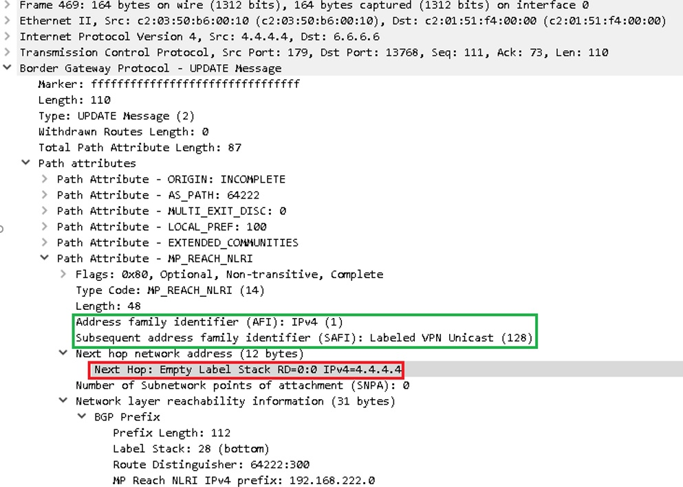
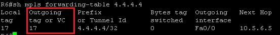

title: MPLS 

# MPLS 

MPLS и не только.
Зависовки на тему…


## Нарратив:
- [1. Базовые представления о сети MPLS](https://linkmeup.ru/blog/154.html)
	- 1.1. Принцип работы
	- 1.2. Протокол LDP
	- 1.3. Протокол RSVP-TE
- [2. L3VPN](https://linkmeup.ru/blog/204.html)
	- [2.1. MPLS L3VPN и доступ в Интернет](https://linkmeup.ru/blog/248.html)
- [3. L2VPN](https://linkmeup.ru/blog/261.html)
	- 3.1. xconnect (точка-точка)
	- 3.2. VPLS (точка-многоточка)
    - 3.3. Мартини драфт
	- 3.4.	Компелла драфт
- [4.1. EVPN](https://linkmeup.ru/blog/264.html)
- [4.2. EVPN Multihoming](https://linkmeup.ru/blog/301.html)  
- [5. Inter-AS](https://habr.com/ru/post/302600)
- [6. MPLS TE](https://linkmeup.ru/blog/302.html)
	- 6.1. Использование протоколов Link State (ISIS, OSPF) для передачи информации о TE.
- 7. MPLS SR
	- 7.1. Использование протоколов Link State (ISIS, OSPF) как замена сигнальных протоколов LDP/RSVP-TE

Disclaimer 1:
```bash
Для усвоение вышеперечисленного материала планирую записывать сюда вольный пересказ этих статей 
с дальнейшим описанием реализации данного функционала на практике… 

Хочу сказать огромное спасибо Маратам за цикл статей СДСМ!!! )
```

Disclaimer 2:
```bash
Когда сетевые инженеры достигли совершенства в протоколах динамической маршрутизации, 
то им стало скучно и они решили, что почему бы им не стать на секундочку hardware инженерами 
и не запилить виртуальные коммутаторы и маршрутизаторы.

Так и появился MPLS...

P.S. Благо, что новые номера AFI и SAFI преспокойно добавляются в BGP... )))
```

Итак, как говорит один мой друг: "Погнали"! )


## 1. Базовые представления о сети MPLS

### Терменология/Определения:

Терминологии много и она несколько сдублирована по определениям - главно не кольцануть тут! )

```bash
"LSR – Label Switch Router" – маршрутизаторы, оперирующие метками, которые передают пакеты на основании меток, 
т.е. маршрутизаторы сети MPLS (P, PE)
```

```bash
"Intermediate LSR" они же "P" (Provider) – маршрутизаторы, "молотилки" трафика в MPLS. 
Ничё не умеют, кроме переписывания меток(swap) и перекладывания(forward) пакетов из порта в порт.
```

```bash
"PE – Provider Edge (Engress LSR, Ingress LSR)" – инициируют изначально разбегание новых меток по сети MPLS 
при появления новых FEC.
По сути на PE сосредоточен весь интеллект работы сети MPLS…
```

```bash
"Ingress LSR (тоже PE)" - входной маршрутизатор сети MPLS – 
назначает первоначальную метку для пакета (Push Label) в сети MPLS. 
```

```bash
"Engress LSR (тоже PE)" - выходной маршрутизатор сети MPLS – 
снимает метку для пакета (Pop Label) в сети MPLS и отправляет 
на конечный маршрутизатор абона CE  - Customer Router
```

```bash
"LER – Label Edge Router" – (Ingress LSR, Engress LSR. Они же PE – Provider Edge)
```

```bash
"CE – Client Edge" – клиентский маршрутизатор (на нем уже нет MPLS)
```

Роли P-PE могут меняться и зависят исключительно от начальной и конечной точки LSP.


```bash
"LSP – Label Switch Path" – путь переключения меток от источника к получателю 
от Ingress LSR до Egress LSR – т.е. это по сути последовательность коммутаторов.
Другими словами LSP - это однонаправленный путь, т.е. путь «туда», 
может не совпадать от пути «оттуда». 
LSP – строится всегда от Egress LSP в сторону Ingress LSP
```

Пример LSP


```bash
"FEC – Forwarding Equalence Class" – это эквивалентные классы трафика, 
которые форвардятся использую один и тот же путь в сети MPLS (LSP).
```

!!! warning "Важно!"
			FEC – является ключевым понятием в MPLS – это определения для трафика одного класса, 
			который проходит через коробку по определенному пути, т.е. кадры, 
			пришедший с меткой условно-говоря «20» являются кадрами одного FEC 
			и будут переправлены в определенный инт, и данным кадрам будет навешана определенная метка, 
			которая заранее скалькулировалась именно для данного FEC.
			Тут, в нашем случае FEC – ip адрес назначения в таблице маршрутизации.


Для примера: 

имеется 2 типа класса трафика FEC - web и VoIP, соответственно для каждого из этих типов будет разные маршруты.  

для web –  будет длинный, но более широкий путь по полосе,  

для VoIP (критичного к задержкам) – короткий, но более узкий по полосе. 

Исходя из этой вводной будет сформировано 2 разных LSP (Label Switched Path) 

(т.е. будут разные метки на LSR для этих двух типов, разным FEC…

```bash
"LIB – Label Information Base" – аналог RIB для IP. 
В LIB указано, какую метку менять на какую и в какой интерфейс отправить 
(рекурсивна, так же как и RIB)
```

```bash
"LFIB – Label Forwarding Information Base" – аналог FIB для IP, находится уже на "Data plane", 
например физически на ASIC-ах линейной карты.
```

### Структура заголовка MPLS

Размер заголовка MPLS – 32 bits


```bash
"Label" = 20bit = 2^20= 1048576 – всего меток в MPLS
```

```bash
"TC – Traffic Class" - аналог DSCP в IP  = 3bit =2^3=8 значений
```

```bash
"S – Bottom of Stack" – дно стека меток. Если рано «1» - то больше меток нет, если «0» то есть еще метки дальше
```

```bash
"TTL – Time To Live" – полный аналог IP TTL – 8bit=2^8=255
```

В заголовке MPLS может быть несколько меток, тогда это выглядит следующим образом:


MPLS заголовок вставляется между L2 и L3 уровнями, п.э. его условно называют протокол 2,5 уровня.


### Методы распространения меток:

!!!warning "Принципиальный момент" 
			для понимания механизма работы MPLS необходимо знать, что метки распространяются 
			от получателя трафика к отправителю, т.е. от Engress LSR к Ingress LSR 
			и никак не наоборот!!!

#### 1.	DU vs DoD – отправка соседям инфы про метки для новых FEC

```bash
"DU - Downstream Unsolicited" - как только LSR узнает про новый FEC он тут же 
рассылает всем соседям метки про новые FEC. 
(напоминает механизм PIM SM в мультикасте)
```
```bash
DoD – Downstream on Demand – рассылает метки про новые FEC, только по запросу от соседей.
```

#### 2. Ordered Control vs Independent Control 

```bash
"Ordered Control" – последовательная отправка инфы, про новые FEC метки, 
когда уже пришла инфа от Egress LSR про метку для данного FEC.
```

```bash
"Independent Control" – подход, когда инфа про новые FEC пересылается неупорядоченно 
даже если не дошла метка для данного FEC со стороны Engress LSR
```

Подведу итог по первому и второму пункту:
```bash 
т.е. "DU-vs-DoD" – это про отправки метки без запроса и по запросу от соседа,
а "OC-vs-IC" – это про отправки меток дожидаясь или не дожидаясь 
метки про данный FEC от соседа со стороны Egress LSR 
```


#### 3.	Liberal Label Retention Mode  vs  Conservative Label Retention Mode

```bash
"Liberal Label Retention Mode" - Хранит метки для небестовых FEC.
```

```bash
"Conservative Label Retention Mode" - Не Хранит метки для небестовых FEC
```

### Оптимизация работы с метками PHP

```bash
"Penultimate Hop Popping (PHP)" – отбрасывание метки на предпоследнем прыжке – 
оптимизация работы MPLS (чтобы не передавать лишний раз метку если известно, что дальше будет последний, 
т.е. Egress LSR в пути следования пакета).
Тут как раз «палится» метка - 3: Implicit Null. Фиктивная метка, которая используется 
для оптимизации процесса передачи пакета MPLS на Egress LSR. 
Эта метка может анонсироваться, но никогда не используется в заголовке MPLS реально.
```


## Протоколы передачи меток (LDP/RSVP-TE)

### LDP 

"LDP – Label Distribution Protocol"
Ищет соседей – путем отправки Hello UDP пакета на мультикаст адрес 224.0.0.2, порт 646 при TTL=1
Если соседи найдены устанавливает с ними соседство через TCP port 646, TTL=255 Initailization
Keepalive – по TCP установленными соседями. Информация о метках передается в сообщении Label Mapping Message

У Марата в статье все расписано и понятно про LSP – не вижу смысла дублировать это тут?

Вкраце – "LSR" он же "PE" «понимает», что он стал Egress LSR для нового FEC. Тогда он ставит для своего локального FEC входящую метку «3» - Implicit Null и передает данную метку соседу, сосед добавляет исходящую метку для данного FEC «3» и назначает входящую метку для данного FEC и т.д. по всем участникам LSP.

В результате получается вот такое (бесстыже стырено у Марата) :)




#### Выводы по LDP:
```bash
1.	Данный протокол никак напрямую не использует протоколы IGP 
    (работает в этом плане по принципу PIM)
2.	Не имеет резервных путей
3.	При смене топологии пересчитывается 
    (сначала сходится IGP, потом уже LDP)
```


!!!warning "Остался вопрос по LDP:"
			если на промежуточный LSR прийдет одна и та же метка 
			от двух разных соседей (других LSR) про разные FEC, 
			то проиcходит перегенерация меток на Engress LSR?


### RSVP-TE

"RSVP-TE" – протокол назначения меток с учетом Traffic Enginering-а, когда в канал закладывается еще и гарантированная полоса. 

Такой функционал достигается за счет использования расширений в «Link State» протоколах ISIS и OSFP, с помощью которых распространяется информация о доступной полосе на пути следования пакета LSP для определенного FEC.

Для ISIS - дополнительные TLV.

Для OSPF – opaque LSA (LSA9,10,11) – scope. Opaque LSA – как следует из названия не прозрачно для процесса LS для маршрутизации и 
соответственно их нет в OSPF Database.

На основании «opaque LSA» формируется TED – Traffic Engineering Database – и ее для своих нужд уже пользует протокол RSVP TE.
```bash
"LSA Type 9" — link-local scope
"LSA Type 10" — area-local scope
"LSA Type 11" — AS scope
```

Т.о. данные о полосах RSVP-TE берет из расширений протоколов ISIS или OSPF, необходимая TE для построения LSP.

Такие как: характеристиками линий, интерфейсов и т.д.


## L3VPN

```bash
"L3VPN" – функционал на базе сети MPLS, обеспечивающий прозрачную маршрутизацию для клиента, 
между его филиалами через сеть вышестоящего провайдера.
```

Рассмотрим такую схему (прости Марат)…




### Постановка задачи:

Имеется две точки присутствия клиента в сети провайдера задача провайдера организовать маршрутизацию между этими точками с условием изоляции данного трафика от остальных сетей. 

Для решение данной задачи используется технология L3VPN

Общий принцип такой:
```bash
1.	Клиент передает данные о своих сетях провайдеру 
через один из протоколов маршрутизации ISIS, OSPF, BGP
2.	Провайдер изолирует и передает данные на другую точку присутствия клиента.
```

Для решения данной задачи используется сеть MPLS, отдельные VRF для точек присутствия клиента и через интеграцию посредством протокола MBGP например в секции «vpnv4 unicast» (AFI=1/SAFI=128) передаются от PE точки входа в PE точки выхода (от Ingress PE до Engress PE).

На входе от клиента в сеть провайдера пакету добавляется дополнительная метка - сервисная, которая будет идентифицировать пакет при выходе из сети MPLS – куда данный пакет в какой VRF форвардить. 

Верхняя метка добавляется как обычно транспортная, которая «пушится» (push) на входящем «PE», «свапается» (swap) на «P» маршрутизаторах сети MPLS и «попается» на выходном «PE».


#### "Живой" пример L3VPN: 




Описание схемы:

```bash
R1,R2,R3,R4,R5,R6 – маршрутизаторы сети провайдера
Имеются 3 клиента: C3PO, DARKSIDE, R2D2
C3PO1(CE) – подключен в R1(PE)
C3PO2(CE) – подключен в R6(PE)

DARKSIDE1(CE) – подключен в R1(PE)
DARKSIDE2 (CE) – подключен в R6(PE)

R2D2 (CE) – подключен в R4(PE)

C3PO и DARKSIDE – не имеют доступа друг к другу
R2D2 и DARKSIDE – не имеют доступа друг к другу
C3PO и R2D2 –имеют связность друг с другом (маршруты ликаются чз взаимный DT import)

C3PO передает маршруты провайдеру по OSPF 
DARKSIDE и R2D2 передает маршруты провайдеру по BGP 
В сети провайдера IGP - ISIS, MPLS - LDP
BGP vpnv4 настроен на R1,R4,R6.

Соответственно для C3PO мы редистрибъютим маршруты между OSPF клиента и BGP провайдера
```

Теперь поподробнее как всё это работает...

На PE создаются VRF, на которых определятся:
```bash
1.	"RD – Router Destignisher" – поле, определяющее уникальность префикса 
    в секции vpnv4 и не более того, чтобы не спутать с другими префиксами таких же сетей,
    например:
      64222:300 192.168.222.0 (формат для примера ASN:XXXX)
        Передается в пакете BGP UPDATE Message  

RD передается: в атрибуте «MP_REACH_NLRI» в секции «NLRI», в разделе «BGP Prefix»
```




```bash
2.	"RT – Router Target" – это по сути BGP community для данного префикса, 
на основании которого идет фильтрация на конечном PE 
(т.е. - в какую VRF данный префикс импортировать). 

формат, такой же как и у RD – ASN:XXXX
Передается в пакете «BGP UPDATE Message»
В атрибуте «EXTENDED_COMMUNITIES»
```



!!!warning "Принципиальный момент:"
			 вместе с префиксом в NLRI передается сервисная метка для данного VRF «Label Stack: 28», 
			 таким образом пакет, отправленный для сети 192.168.222.0 из соответствующего VRF 
			 сразу маркируется сервисной меткой. 
			 И с CEF данного VRF-а сразу вешаются 2 метки (17 и 28). 
			 Tag 28 – это сервисная метка, переданная по BGP, 
			 а 17 – назначенная R6 по LDP.  
			 Примечание: сервисная метка, тоже назначается LDP, только на источнике, т.е. на R4.





В качестве nexthop выступает 4.4.4.4 




До 4.4.4.4 у R6 стоит метка "17"




**Всё совпадает и сходится… )**

Получается что в CEF VRF C3PO до 192.168.222.0/24 сразу падает две метки одна сервисная «28», которая передается через BGP 

и транспортная метка «17», которая берется из общей LFIB как метка для FEC 4.4.4.4…

Еще немаловажный момент: для VRF можно указать несколько RT на импорт, тогда при совпадении RT префиксы будут «ликаться» из соседних VRF.

В нашем примере на R4 создан VRF для R2D2, который имеет связность с R3PO

```bash
R4#
ip vrf  R2D2
  rd 64222:300
  route-target export 64500:300
  route-target import 64500:300 – "это RT «родное» для R2D2"
  route-target import 64500:100 – "это RT C3PO"
```

соответствующим образом настраивается протокол BGP, в частности туда вводится секция vpnv4 – это как раз 
L3VPN(AFI=1 – ipv4,  SAFI=128 – Labeled VPN unicast)
данные параметры можно увидеть в скринах из wireshark – обведены зеленым цветом.

Вот собственно и вся «магия» в L3VPN

### Подведем итоги по L3VPN 

Что надо, чтобы работал  L3VPN:
```bash
1.	Должна быть сеть MPLS (LDP или RSVP-TE – без разницы)
2.	Клиент должен передавать анонсы своих сетей через один из протоколов (ISIS, OSPF, BGP) – 
ответочка поднимается на стороне PE.
Если клиентский протокол не BGP, то в него и из него нужно редистрибьютить сети клиента.
3.	На PE с обоих сторон настраивается:
- VRF для данного клиента, туда заносятся RD и RT
- В BGP добавляется секция vpnv4, а также  ipv4 для VRF
```
Конфиги прилагаются… )

<details><summary>R1</summary>
<p>

```bash
R1!
!
hostname R1
!
ip vrf C3PO
 rd 64500:100
 route-target export 64500:100
 route-target import 64500:100
 route-target import 64500:300
!
ip vrf DARKSIDE
 rd 64501:100
 route-target export 64501:100
 route-target export 64500:200
 route-target import 64501:100
 route-target import 64500:200
!
!
interface Loopback0
 ip address 1.1.1.1 255.255.255.255
 ip router isis
!
interface FastEthernet0/0
 ip address 10.1.3.1 255.255.255.0
 ip router isis
 duplex auto
 speed auto
 mpls ip
 no cdp enable
!
interface FastEthernet0/1
 ip address 10.1.2.1 255.255.255.0
 ip router isis
 duplex auto
 speed auto
 mpls ip
 no cdp enable
!
interface FastEthernet1/0
 ip vrf forwarding C3PO
 ip address 192.168.1.2 255.255.255.0
 duplex auto
 speed auto
 no cdp enable
!
interface FastEthernet2/0
 ip vrf forwarding DARKSIDE
 ip address 192.168.1.2 255.255.255.0
 duplex auto
 speed auto
!
router ospf 2 vrf C3PO
 router-id 1.1.1.1
 log-adjacency-changes
 redistribute bgp 64500 subnets
 network 192.168.0.0 0.0.255.255 area 0
!
router isis
 net 10.0000.0000.0001.00
!
router bgp 64500
 no synchronization
 bgp router-id 1.1.1.1
 bgp log-neighbor-changes
 neighbor 4.4.4.4 remote-as 64500
 neighbor 4.4.4.4 update-source Loopback0
 neighbor 6.6.6.6 remote-as 64500
 neighbor 6.6.6.6 update-source Loopback0
 no auto-summary
 !
 address-family vpnv4
  neighbor 4.4.4.4 activate
  neighbor 4.4.4.4 send-community both
  neighbor 6.6.6.6 activate
  neighbor 6.6.6.6 send-community both
 exit-address-family
 !
 address-family ipv4 vrf DARKSIDE
  neighbor 192.168.1.1 remote-as 64501
  neighbor 192.168.1.1 activate
  no synchronization
 exit-address-family
 !
 address-family ipv4 vrf C3PO
  redistribute ospf 2 vrf C3PO
  no synchronization
 exit-address-family
!
mpls ldp router-id Loopback0 force
!
```
</p>
</details>

<details><summary>R2</summary>
<p>

```bash

!R2#
!
hostname R2
!
interface Loopback0
 ip address 2.2.2.2 255.255.255.255
 ip router isis
!
interface FastEthernet0/0
 ip address 10.2.5.2 255.255.255.0
 ip router isis
 shutdown
 duplex auto
 speed auto
 mpls ip
 no cdp enable
!
interface FastEthernet0/1
 ip address 10.1.2.2 255.255.255.0
 ip router isis
 duplex auto
 speed auto
 mpls ip
 no cdp enable
!
router isis
 net 10.0000.0000.0002.00
!
ip forward-protocol nd
!
!
ip http server
no ip http secure-server
!
no cdp run
!
!
!
!
mpls ldp router-id Loopback0 force
!
```
</p>
</details>

<details><summary>R3</summary>
<p>

```bash

!R3#
!
hostname R3
!
interface Loopback0
 ip address 3.3.3.3 255.255.255.255
 ip router isis
!
interface FastEthernet0/0
 ip address 10.3.4.3 255.255.255.0
 ip router isis
 duplex auto
 speed auto
 mpls ip
 no cdp enable
!
interface FastEthernet0/1
 ip address 10.1.3.3 255.255.255.0
 ip router isis
 duplex auto
 speed auto
 mpls ip
 no cdp enable
!
router isis
 net 10.0000.0000.0003.00
!
ip forward-protocol nd
!
!
ip http server
no ip http secure-server
!
no cdp run
!
!
!
!
mpls ldp router-id Loopback0 force
!
```
</p>
</details>

<details><summary>R4</summary>
<p>

```bash

!R4#
!
hostname R4
!
ip vrf R2D2
 rd 64222:300
 route-target export 64500:300
 route-target import 64500:300
 route-target import 64500:100
!
interface Loopback0
 ip address 4.4.4.4 255.255.255.255
 ip router isis
!
interface FastEthernet0/0
 ip address 10.3.4.4 255.255.255.0
 ip router isis
 duplex auto
 speed auto
 mpls ip
 no cdp enable
!
interface FastEthernet0/1
 ip address 10.4.5.4 255.255.255.0
 ip router isis
 duplex auto
 speed auto
 mpls ip
 no cdp enable
!
interface FastEthernet1/0
 ip vrf forwarding R2D2
 ip address 192.168.222.2 255.255.255.0
 duplex auto
 speed auto
 no cdp enable
!
router isis
 net 10.0000.0000.0004.00
!
router bgp 64500
 bgp router-id 4.4.4.4
 bgp log-neighbor-changes
 neighbor 1.1.1.1 remote-as 64500
 neighbor 1.1.1.1 update-source Loopback0
 neighbor 6.6.6.6 remote-as 64500
 neighbor 6.6.6.6 update-source Loopback0
 !
 address-family ipv4
  neighbor 1.1.1.1 activate
  neighbor 6.6.6.6 activate
  no auto-summary
  no synchronization
 exit-address-family
 !
 address-family vpnv4
  neighbor 1.1.1.1 activate
  neighbor 1.1.1.1 send-community both
  neighbor 6.6.6.6 activate
  neighbor 6.6.6.6 send-community both
 exit-address-family
 !
 address-family ipv4 vrf R2D2
  neighbor 192.168.222.1 remote-as 64222
  neighbor 192.168.222.1 activate
  no synchronization
 exit-address-family
!
mpls ldp router-id Loopback0 force
!
```
</p>
</details>

<details><summary>R5</summary>
<p>

```bash

!R5#
!
hostname R5
!
interface Loopback0
 ip address 5.5.5.5 255.255.255.255
 ip router isis
!
interface FastEthernet0/0
 ip address 10.2.5.5 255.255.255.0
 ip router isis
 duplex auto
 speed auto
 mpls ip
 no cdp enable
!
interface FastEthernet0/1
 ip address 10.4.5.5 255.255.255.0
 ip router isis
 duplex auto
 speed auto
 mpls ip
 no cdp enable
!
interface FastEthernet1/0
 ip address 10.5.6.5 255.255.255.0
 ip router isis
 speed auto
 full-duplex
 mpls ip
 no cdp enable
!
interface FastEthernet2/0
 no ip address
 shutdown
 duplex auto
 speed auto
!
router isis
 net 10.0000.0000.0005.00
!
mpls ldp router-id Loopback0 force
!
```
</p>
</details>


<details><summary>R6</summary>
<p>

```bash

!R6#
!
hostname R6
!
ip vrf C3PO
 rd 64500:100
 route-target export 64500:100
 route-target import 64500:100
 route-target import 64500:300
!
ip vrf DARKSIDE
 rd 64502:200
 route-target export 64502:200
 route-target export 64500:200
 route-target import 64502:200
 route-target import 64500:200
!
interface Loopback0
 ip address 6.6.6.6 255.255.255.255
 ip router isis
!
interface FastEthernet0/0
 ip address 10.5.6.6 255.255.255.0
 ip router isis
 duplex auto
 speed auto
 mpls ip
 no cdp enable
!
interface FastEthernet0/1
 ip vrf forwarding C3PO
 ip address 192.168.2.2 255.255.255.0
 duplex auto
 speed auto
 no cdp enable
!
interface FastEthernet2/0
 ip vrf forwarding DARKSIDE
 ip address 192.168.2.2 255.255.255.0
 duplex auto
 speed auto
 no cdp enable
!
router ospf 2 vrf C3PO
 router-id 6.6.6.6
 log-adjacency-changes
 redistribute bgp 64500 subnets
 network 192.168.0.0 0.0.255.255 area 0
!
router isis
 net 10.0000.0000.0006.00
!
router bgp 64500
 no synchronization
 bgp router-id 6.6.6.6
 bgp log-neighbor-changes
 neighbor 1.1.1.1 remote-as 64500
 neighbor 1.1.1.1 update-source Loopback0
 neighbor 4.4.4.4 remote-as 64500
 neighbor 4.4.4.4 update-source Loopback0
 no auto-summary
 !
 address-family vpnv4
  neighbor 1.1.1.1 activate
  neighbor 1.1.1.1 send-community both
  neighbor 4.4.4.4 activate
  neighbor 4.4.4.4 send-community both
 exit-address-family
 !
 address-family ipv4 vrf DARKSIDE
  neighbor 192.168.2.1 remote-as 64502
  neighbor 192.168.2.1 activate
  no synchronization
 exit-address-family
 !
 address-family ipv4 vrf C3PO
  redistribute ospf 2 vrf C3PO
  no synchronization
 exit-address-family
!
mpls ldp router-id Loopback0 force
!
```
</p>
</details>

<details><summary>C3PO1</summary>
<p>

```bash

!C3PO1#
!
hostname C3PO1
!
interface Loopback0
 ip address 10.10.10.10 255.255.255.255
!
interface FastEthernet0/0
 ip address 192.168.1.1 255.255.255.0
 duplex auto
 speed auto
 no cdp enable
!
interface FastEthernet0/1
 no ip address
 shutdown
 duplex auto
 speed auto
!
router ospf 1
 router-id 10.10.10.10
 log-adjacency-changes
 network 10.10.10.10 0.0.0.0 area 0
 network 192.168.0.0 0.0.255.255 area 0
!

!C3PO2#
!
hostname C3PO2
!
interface Loopback0
 ip address 20.20.20.20 255.255.255.255
!
interface FastEthernet0/0
 ip address 192.168.2.1 255.255.255.0
 duplex auto
 speed auto
 no cdp enable
!
interface FastEthernet0/1
 no ip address
 shutdown
 duplex auto
 speed auto
!
router ospf 1
 log-adjacency-changes
 network 20.20.20.20 0.0.0.0 area 0
 network 192.168.0.0 0.0.255.255 area 0
!
```
</p>
</details>

<details><summary>DARKSIDE1</summary>
<p>

```bash

!DARKSIDE1#
!
hostname DARKSIDE1
!
interface Loopback0
 ip address 11.11.11.11 255.255.255.255
!
interface FastEthernet0/0
 ip address 192.168.1.1 255.255.255.0
 duplex auto
 speed auto
 no cdp enable
!
interface FastEthernet0/1
 no ip address
 shutdown
 duplex auto
 speed auto
!
router bgp 64501
 bgp log-neighbor-changes
 neighbor 192.168.1.2 remote-as 64500
 !
 address-family ipv4
  redistribute connected
  neighbor 192.168.1.2 activate
  no auto-summary
  no synchronization
 exit-address-family
!

!DARKSIDE2#
!
hostname DARKSIDE2
!
interface Loopback0
 ip address 22.22.22.22 255.255.255.255
!
interface FastEthernet0/0
 ip address 192.168.2.1 255.255.255.0
 duplex auto
 speed auto
 no cdp enable
!
interface FastEthernet0/1
 no ip address
 shutdown
 duplex auto
 speed auto
!
router bgp 64502
 bgp log-neighbor-changes
 neighbor 192.168.2.2 remote-as 64500
 !
 address-family ipv4
  redistribute connected
  neighbor 192.168.2.2 activate
  no auto-summary
  no synchronization
 exit-address-family
!
```
</p>
</details>

<details><summary>R2D2</summary>
<p>

```bash

!R2D2#
!
hostname R2D2
!
!
interface Loopback0
 ip address 222.222.222.222 255.255.255.255
!
interface FastEthernet0/0
 ip address 192.168.222.1 255.255.255.0
 duplex auto
 speed auto
 no cdp enable
!
interface FastEthernet0/1
 no ip address
 shutdown
 duplex auto
 speed auto
!
router bgp 64222
 bgp router-id 222.222.222.222
 bgp log-neighbor-changes
 neighbor 192.168.222.2 remote-as 64500
 !
 address-family ipv4
  redistribute connected
  neighbor 192.168.222.2 activate
  no auto-summary
  no synchronization
 exit-address-family
!
```
</p>
</details>


