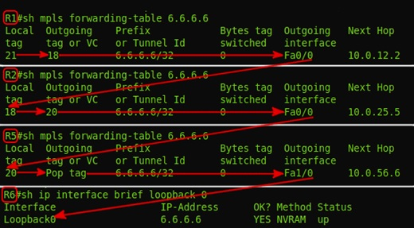

title: MPLS 

# MPLS 

MPLS и не только.
Зависовки на тему…


## Нарратив:
- [1. Базовые представления о сети MPLS](https://linkmeup.ru/blog/154.html)
	- 1.1. Принцип работы
	- 1.2. Протокол LDP
	- 1.3. Протокол RSVP-TE
- [2. L3VPN](https://linkmeup.ru/blog/204.html)
	- [2.1. MPLS L3VPN и доступ в Интернет](https://linkmeup.ru/blog/248.html)
- [3. L2VPN](https://linkmeup.ru/blog/261.html)
	- 3.1. xconnect (точка-точка)
	- 3.2. VPLS (точка-многоточка)
    - 3.3. Мартини драфт
	- 3.4.	Компелла драфт
- [4.1. EVPN](https://linkmeup.ru/blog/264.html)
- [4.2. EVPN Multihoming](https://linkmeup.ru/blog/301.html)  
- [5. Inter-AS](https://habr.com/ru/post/302600)
- [6. MPLS TE](https://linkmeup.ru/blog/302.html)
	- 6.1. Использование протоколов Link State (ISIS, OSPF) для передачи информации о TE.
- 7. MPLS SR
	- 7.1. Использование протоколов Link State (ISIS, OSPF) как замена сигнальных протоколов LDP/RSVP-TE

Disclaimer 1:
```bash
Для усвоение вышеперечисленного материала планирую записывать сюда вольный пересказ этих статей 
с дальнейшим описанием реализации данного функционала на практике… 

Хочу сказать огромное спасибо Маратам за цикл статей СДСМ!!! )
```

Disclaimer 2:
```bash
Когда сетевые инженеры достигли совершенства в протоколах динамической маршрутизации, 
то им стало скучно и они решили, что почему бы им не стать на секундочку hardware инженерами 
и не запилить виртуальные коммутаторы и маршрутизаторы.

Так и появился MPLS...

P.S. Благо, что новые номера AFI и SAFI преспокойно добавляются в BGP... )))
```

Итак, как говорит один мой друг: "Погнали"! )


## 1. Базовые представления о сети MPLS

### Терменология/Определения:

Терминологии много и она несколько сдублирована по определениям - главно не кольцануть тут! )

```bash
"LSR – Label Switch Router" – маршрутизаторы, оперирующие метками, которые передают пакеты на основании меток, 
т.е. маршрутизаторы сети MPLS (P, PE)
```

```bash
"Intermediate LSR" они же "P" (Provider) – маршрутизаторы, "молотилки" трафика в MPLS. 
Ничё не умеют, кроме переписывания меток(swap) и перекладывания(forward) пакетов из порта в порт.
```

```bash
"PE – Provider Edge (Engress LSR, Ingress LSR)" – инициируют изначально разбегание новых меток по сети MPLS 
при появления новых FEC.
По сути на PE сосредоточен весь интеллект работы сети MPLS…
```

```bash
"Ingress LSR (тоже PE)" - входной маршрутизатор сети MPLS – 
назначает первоначальную метку для пакета (Push Label) в сети MPLS. 
```

```bash
"Engress LSR (тоже PE)" - выходной маршрутизатор сети MPLS – 
снимает метку для пакета (Pop Label) в сети MPLS и отправляет 
на конечный маршрутизатор абона CE  - Customer Router
```

```bash
LER – Label Edge Router – (Ingress LSR, Engress LSR. Они же PE – Provider Edge)
```

```bash
CE – Client Edge – клиентский маршрутизатор (на нем уже нет MPLS)
```

Роли P-PE могут меняться и зависят исключительно и начальной и конечной точки LSP.


```bash
"LSP – Label Switch Path" – путь переключения меток от источника к получателю 
от Ingress LSR до Egress LSR – т.е. это по сути последовательность коммутаторов.
Другими словами LSP - это однонаправленный путь, т.е. путь «туда», 
может не совпадать от пути «оттуда». 
LSP – строится всегда от Egress LSP в сторону Ingress LSP
```

Пример LSP



```bash
"FEC – Forwarding Equalence Class" – это эквивалентные классы трафика, 
которые форвардятся использую один и тот же путь в сети MPLS (LSP).
```
!!! warning "Важно!"
			FEC – является ключевым понятием в MPLS – это определения для трафика одного класса, 
			который проходит через коробку по определенному пути, т.е. кадры, 
			пришедший с меткой условно-говоря «20» являются кадрами одного FEC 
			и будут переправлены в определенный инт, и данным кадрам будет навешана определенная метка, 
			которая заранее скалькулировалась именно для данного FEC.
			Тут, в нашем случае FEC – ip адрес назначения в таблице маршрутизации.


Для примера: имеется 2 типа класса трафика FEC - web и VoIP, соответственно для каждого из этих типов будет разные маршруты.  

для web –  будет длинный, но более широкий путь по полосе,  

для VoIP (критичного к задержкам) – короткий, но более узкий по полосе. 

Исходя из этой вводной будет сформировано 2 разных LSP (Label Switched Path) 

(т.е. будут разные метки на LSR для этих двух типов, разным FEC…

```bash
"LIB – Label Information Base" – аналог RIB для IP. 
В LIB указано, какую метку менять на какую и в какой интерфейс отправить 
(рекурсивна, так же как и RIB)
```

```bash
"LFIB – Label Forwarding Information Base" – аналог FIB для IP, находится уже на "Data plane", 
например физически на ASIC-ах линейной карты.
```

### Структура заголовка MPLS

Размер заголовка MPLS – 32 bits


```bash
"Label" = 20bit = 2^20= 1048576 – всего меток в MPLS
```

```bash
"TC – Traffic Class" - аналог DSCP в IP  = 3bit =2^3=8 значений
```

```bash
"S – Bottom of Stack" – дно стека меток. Если рано «1» - то больше меток нет, если «0» то есть еще метки дальше
```

```bash
"TTL – Time To Live" – полный аналог IP TTL – 8bit=2^8=255
```

В заголовке MPLS может быть несколько меток, тогда это выглядит следующим образом:


MPLS заголовок вставляется между L2 и L3 уровнями, п.э. его условно называют протокол 2,5 уровня.


### Методы распространения меток:

!!!warning "Принципиальный момент" 
			для понимания механизма работы MPLS необходимо знать, что метки распространяются 
			от получателя трафика к отправителю, т.е. от Engress LSR к Ingress LSR 
			и никак не наоборот!!!

#### 1.	DU vs DoD – отправка соседям инфы про метки для новых FEC

```bash
"DU - Downstream Unsolicited" - как только LSR узнает про новый FEC он тут же 
рассылает всем соседям метки про новые FEC. 
(напоминает механизм PIM SM в мультикасте)
```
```bash
DoD – Downstream on Demand – рассылает метки про новые FEC, только по запросу от соседей.
```

#### 2. Ordered Control vs Independent Control 

```bash
"Ordered Control" – последовательная отправка инфы, про новые FEC метки, когда уже пришла инфа от Egress LSR про метку для данного FEC.
```

```bash
"Independent Control" – подход, когда инфа про новые FEC пересылается неупорядоченно даже если не дошла метка для данного FEC со стороны Engress LSR
```

Подведу итог по первому и второму пункту:
```bash 
т.е. "DU-vs-DoD" – это про отправки метки без запроса и по запросу от соседа,
а "OC-vs-IC" – это про отправки меток дожидаясь или не дожидаясь метки про данный FEC от соседа со стороны Egress LSR 
```


#### 3.	Liberal Label Retention Mode  vs  Conservative Label Retention Mode

```bash
"Liberal Label Retention Mode" - Хранит метки для небестовых FEC.
```

```bash
"Conservative Label Retention Mode" - Не Хранит метки для небестовых FEC
```

### Оптимизация работы с метками PHP

```bash
"Penultimate Hop Popping (PHP)" – отбрасывание метки на предпоследнем прыжке – 
оптимизация работы MPLS (чтобы не передавать лишний раз метку если известно, что дальше будет последний, 
т.е. Egress LSR в пути следования пакета).
Тут как раз «палится» метка - 3: Implicit Null. Фиктивная метка, которая используется 
для оптимизации процесса передачи пакета MPLS на Egress LSR. 
Эта метка может анонсироваться, но никогда не используется в заголовке MPLS реально.
```


## Протоколы передачи меток (LDP/RSVP-TE)

### LDP 

"LDP – Label Distribution Protocol"
Ищет соседей – путем отправки Hello UDP пакета на мультикаст адрес 224.0.0.2, порт 646 при TTL=1
Если соседи найдены устанавливает с ними соседство через TCP port 646, TTL=255 Initailization
Keepalive – по TCP установленными соседями. Информация о метках передается в сообщении Label Mapping Message

У Марата в статье все расписано и понятно про LSP – не вижу смысла дублировать это тут?

Вкраце – "LSR" он же "PE" «понимает», что он стал Egress LSR для нового FEC. Тогда он ставит для своего локального FEC входящую метку «3» - Implicit Null и передает данную метку соседу, сосед добавляет исходящую метку для данного FEC «3» и назначает входящую метку для данного FEC и т.д. по всем участникам LSP.

В результате получается вот такое (бесстыже стырено у Марата) :)


#### Выводы по LDP:
```bash
1.	Данный протокол никак напрямую не использует протоколы IGP 
    (работает в этом плане по принципу PIM)
2.	Не имеет резервных путей
3.	При смене топологии пересчитывается 
    (сначала сходится IGP, потом уже LDP)
```


!!!warning "Остался вопрос по LDP:"
			если на промежуточный LSR прийдет одна и та же метка 
			от двух разных соседей (других LSR) про разные FEC, 
			то проиcходит перегенерация меток на Engress LSR?


### RSVP-TE

"RSVP-TE" – протокол назначения меток с учетом Traffic Enginering-а, когда в канал закладывается еще и гарантированная полоса. 

Такой функционал достигается за счет использования расширений в «Link State» протоколах ISIS и OSFP, с помощью которых распространяется информация о доступной полосе на пути следования пакета LSP для определенного FEC.

Для ISIS - дополнительные TLV.

Для OSPF – opaque LSA (LSA9,10,11) – scope. Opaque LSA – как следует из названия не прозрачно для процесса LS для маршрутизации и 
соответственно их нет в OSPF Database.

На основании «opaque LSA» формируется TED – Traffic Engineering Database – и ее для своих нужд уже пользует протокол RSVP TE.
```bash
"LSA Type 9" — link-local scope
"LSA Type 10" — area-local scope
"LSA Type 11" — AS scope
```

Т.о. данные о полосах RSVP-TE берет из расширений протоколов ISIS или OSPF, необходимая TE для построения LSP.

Такие как: характеристиками линий, интерфейсов и т.д.


