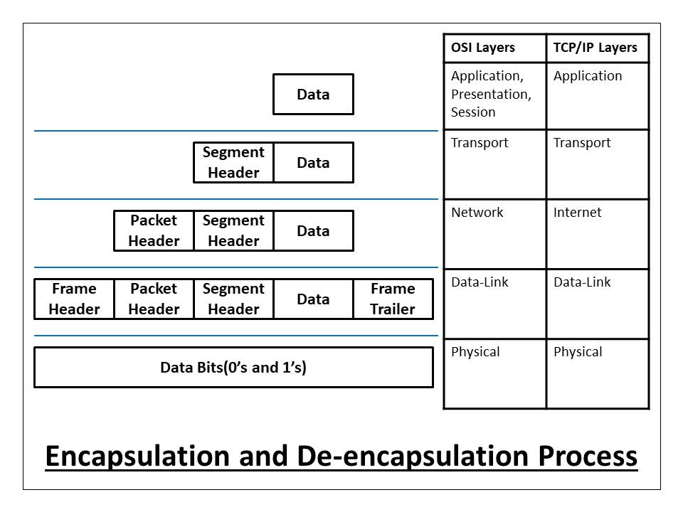
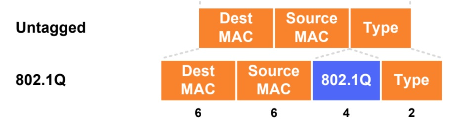
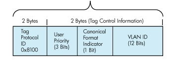
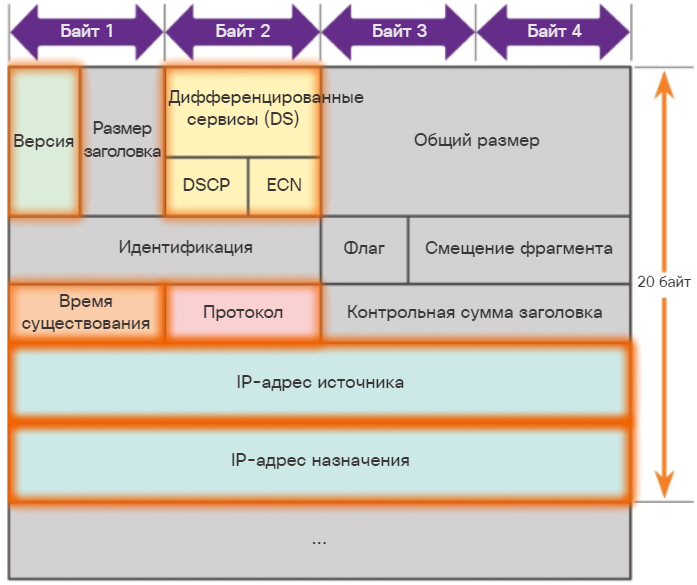

title: OSI model

# Анатомия семиуровневой модели OSI

## 7ми уровневая модель OSI


PDU (Protocol Data Unit)
на каждом уровне есть своя единица измерения 

### L1 - физический уровень (Physical Layer)
электический или оптический сигнал

### L2 - канальный уровень (Data Link Layer)_
PDU - кадр (frame)

Заголовок кадра может быть увеличен за счет использования vlan



#### VLAN
Стандарт 802.1Q — добавляет 4 байта



### L3 - сетевой уровень (Network Layer)
PDU - пакет (packet)

20 bytes - заголовок пакета (L3)



### L4 - транспортный уровень (Transport Layer)
PDU - сегмент,датаграмма (segment, datagram)

Может содержать сегменты tcp, udp 

### L5-L7
По сути, в стеке протоколов tcp/ip уровни L5-L7 объединились в некий один уровень "application"
будь то протоколы: http/https, ftp, smtp, ssh и пр...

- L5 - сеансовый уровень     (Session Layer)
  PDU - данные (data)  

- L6 - уровень представления (Presentation Layer)
  PDU - данные (data)  

- L7 - уровень приложения    (Application Layer)
  PDU - данные (data)  


## Ethernet кадр в общем случае состоит(инкапуслирует в себе) из следующего:
```bash
- L2    14   bytes = DMAC(6) + SMAC(6) + type(2)  - заголовок кадра  
- L3    20   bytes = ...+ SA + DA +... - заголовок пакета 
- L4    20   bytes = заголовок сегмента (L4) Если у нас tcp,upd,icmp
- L5-L7 xxxx bytes = payload - полезная нагрузка, которую передаю протоколы уровня "приложений", 
  такие как http, https, ftp, smtp и пр..
```


Пример протокола [icmp](https://icebale.readthedocs.io/en/latest/networks/protocols/ICMP/) в представлении OSI модели
Пример протокола [arp](https://icebale.readthedocs.io/en/latest/networks/protocols/ARP/) в представлении OSI модели