title: OSPF

# Протокол OSPF


Disclaimer:

```bash
произвольная трактовка алгоритма Дейкстры...

...Бесконечного спектакля
Быть свидетелем немым
И узорами пентакля
Очарованным... (ц) Пикник
```

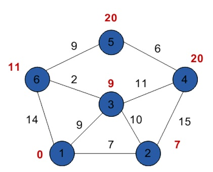


Протокол OSPF (Open Short Path First) - link-state протокол динамической маршрутизации.

Общий принцип работы протокола заключается в том, что его участники обмениваются между собой состояниями своих линков и сетями, которые находятся за ними.
Таким образом каждый участник протокола OSPF имеет в конечном счете информацию о всей топологии сети и уже в соответствии с этой информацией выбирает оптимальные маршруты к известным ему сетям по алгоритму Дейкстры (Short Path First - SPF). 

!!!note "Замечание"
		Один из маршрутизаторов каждой области обязательно входит в так называемую "Backbone" область. Уточню, что вышесказанное про топологию сети относится только к той области, в которую входит сам маршрутизатор. Информация об областях, не связанных напрямую передаются через корневую-Backbone (AREA 0) область, по сути как префиксы в дистантно-векторном протоколе без привязки к топологии соседней области.

## Определения/терминология

В протоколе OSPF имеется множество определений и терминов. Принцип работы тесно связан с пониманием терминологии.
Без погружения в терминологию практически невозможно понять детали его работы.
Итак, разберу их здесь:

1. LSA (Link State Advertisement) - анонсы, которыми обмениваются соседи. В данных сообщениях передается информация о линках и находящимися за ними сетями.
   LSA существует множества типов, которые передают информацию как внутри области так и между областями. Их типы опишу отдельным разделом.
2. LSDB (Link State DB) - Link State DB - База данных, которая формируется на основании информации от LSA


## Версии OSPF v2, v3
```bash
  OSPF v2 - работает только с ipv4
  OSPF v3 - работает как с ipv4, так и с ipv6 - прописывается в разных address family - прям как в BGP! :)
```

## Алгоритм работы

Алгоритм работы в общем случае строится на установлении "соседских" отношений между маршрутизаторами OSPF и обмен информацией о линках и маршрутах, находящихся за ними.

Изначально каждый маршрутизатор при инициализации протокола OSPF выбирает себе Router ID (RID). RID можно указать в в ручном режиме или в автоматическом режиме, тогда в качестве RID выбирается значение самого большого ip адреса активного интерфейса. Для упрощения траблшутинга как best-practice в качестве RID указывается вручную ip адрес loopback интерфейса.

### Выбор DR/BDR 

Выборы DR/BDR в броадкаст домене происходит посредством указания приоритета на интерфейсе маршрутизатора "ip ospf priority" (для cisco).
Приоритет по умолчанию на интерфейсе равен 1. Нулевое значение приоритета, означает что интерфейс не может быть DR - это состояние называется DRother. Если приоритеты на интерфейсах одинаковые, то в качестве DR выбирается маршрутизатор с большим RID.

Таким же образом выбирается после выбора DR происходит выбор BDR. 

Информация о приоритете OSPF на интерфейсе и RID передаются в "Hello" сообщениях.

Опишу алгоритм установления соседства тоже для броадкаст домена.

Для работы протокола OSPF используется протокол ip, где в качестве протокола следующего уровня используется protocol 89.

 


### Cтруктура OSPF 

Структура сообщения OSPF состоит из:
```bash
- OSPF Header - перечислю наиболее значимые:
  - Message Type здесь указывается тип сообщения следующей секции:
	  - Hello packet   = 1 
	  - DB Description = 2
	  - LS Request     = 3
	  - LS Update      = 4
	  - LS Acknowledge = 5
	- Source OSPF Router - это как раз RID
	- Area ID

- Далее в зависимости от типа идет соответствующий пакет.
```

!!!Note "Важно"
		Роль DR (BDR) является свойством интерфейса, а не свойством всего маршрутизатора, п.э. если интерфейсы маршрутизатора находится в разных OSPF Area то он может в разных областях быть в разных ролях...


### Виды сообщений OSPF/Структура сообщений OSPF

```bash
- Hello - сообщения, которыми обмениваются для установления "соседских" отношений. 
```

Каждый маршрутизатор изначально передает сообщение Hello на мультикаст ip адрес 224.0.0.5.

Структура протокола OSPF на примере OSPF Hello:

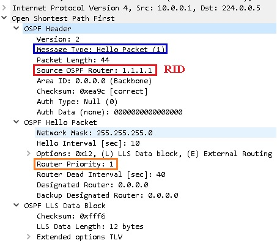

В нашем случае это OSPF Hello packet 
```
- OSPF Hello packet 
 - Указывается сетевая маска
 - Приоритет
 - DR  - если таковой уже выбран
 - BDR - если таковой уже выбран
```

В вариант сообщения Hello, когда известны активные соседи (это важно для перехода в состояние TWO-WAY)

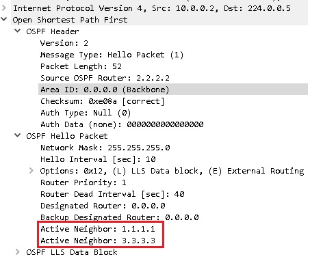

```bash
- DataBase Description (DBD, оно же DD) - краткое описание LSA в LSDB, обмениваются для того, 
  чтобы сообщить друг другу о той информации что им известно в кратком виде 
  и в дальнейшем иметь возможность запростить уточняющую, подробную информации, 
  по недостающей у них информации.
```

пример DBD структура

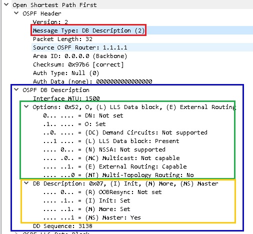

пример DBD структура с общей информацией об известных LSA

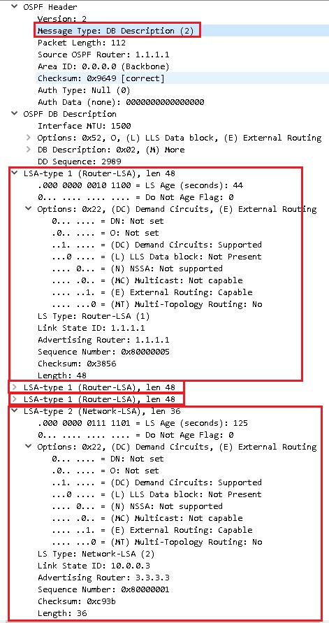

Соответственно получив информацию об LSA в DBD пакете участники OSPF запрашивают и получают недостающие у них в LSDB детальные данные об LSA

```bash
- Link-State Request (LSR) - После обмена DBD сообщениями, с помощью LSR маршрутизаторы запрашивают 
  у соседа недостающую информацию.
```

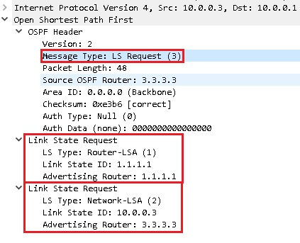

пример запроса информации об LSA 1 (RID 1.1.1.1) и LSA 2 (RID 3.3.3.3)

```bash
- Link-State Update (LSU) -  В ответ на LSR, который ему прислал сосед, маршрутизатор отправляет LSU, 
  с полным описанием информации, которой не хватает у соседу.
```

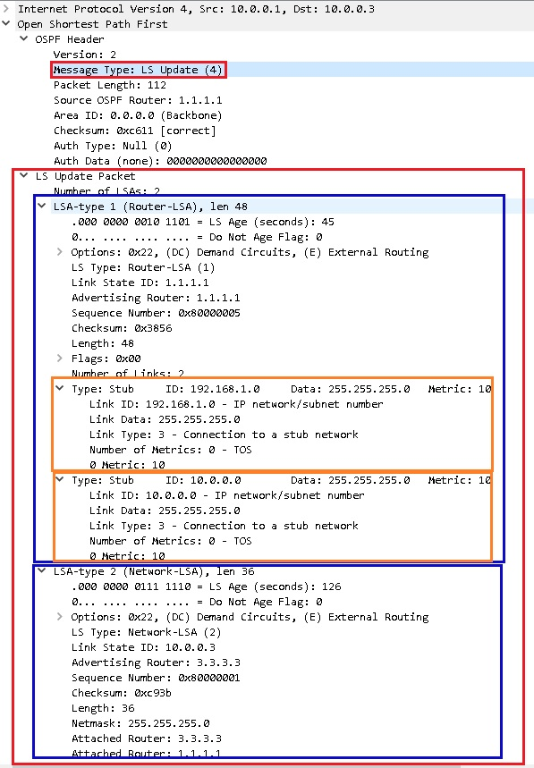

пример ответа на запрос информации об LSA 1 (RID 1.1.1.1) и LSA 2 (RID 3.3.3.3)

```bash
- Link-State Acknowledgment (LSAck) - После получения LSU от соседа, 
  маршрутизатор отправляет подтверждение, что он получил информацию.
```

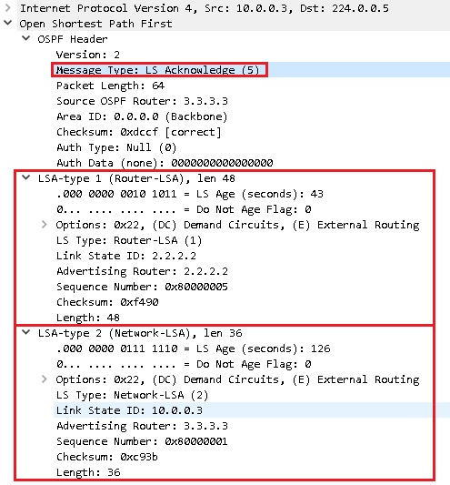

пример подтверждения получения информации об LSA 1 (RID 1.1.1.1) и LSA 2 (RID 3.3.3.3)


Для Broadcast сред, таких как например, Ethernet для уменьшения нагрузки на сеть из участников OSPF домена выбираются маршрутизатор с ролью
DR (Destignated Router) и BDR (Backup Destignated Router), с которыми каждый маршрутизатор OSPF домена устанавливает "соседство", и которые по сути передают и распространяют всю информацию о OSPF домене всем участникам OSPF домена.

#### Отношения соседства (adjacency)
Для того, чтобы машрутизаторы стали соседями необходимо, чтобы в сообщениях hello совпали следующие таймеры:
```bash
- У маршрутизаторов должны совпадать сеть и маска сети.
- Hello Interval - частота отправки сообщения Hello
- Router Dead Interval - период времени, по прохождению которого, сосед считается недоступным, 
  если не было Hello 
- Area ID — должны быть в одной области.
- Authentication — должен совпадать пароль для аутентификации и тип аутентификации, 
  если используется аутентификация.
- Stub area flag — не обязательный флаг, который устанавливается на всех маршрутизаторах, 
  которые принадлежат тупиковой зоне (stub area)
```

## Состояния установки соединения OSPF
```bash
1. DOWN - начальное состояние обнаружения соседей.
2. INIT -  состояние, в котором находится маршрутизатор, 
   отправивший своему соседу сообщение Нello и ожидающий ответного Hello
3. TWO-WAY - при получении ответных Hello маршрутизатор должен увидеть в них свой RID в списке соседей. 
   Если это так, то он устанавливает отношения и переходит в состояние TWO-WAY 
4. EXSTART - определяются DR/BDR и готовятся к обмену DBD
5. EXCHANGE - маршрутизаторы посылают друг другу пакеты DBD с информацией о сетях, 
   содержащихся в их собственной LSDB
6. LOADING - Если маршрутизатор видит, что части маршрутов нет в его LSDB, 
   он посылает сообщение LSR с перечислением тех сетей, по которым он хочет  получить дополнительную информацию.  
   Пока маршрутизатор находится в ожидании ответа в виде LSU сообщений, он пребывает в состоянии Loading.
7. FULL STATE -  Когда маршрутизатор получил всю информацию и LSDB синхронизирована маршрутизаторы 
   переходят в состояние FULLY ADJACENT.
```

После этого начинается расчет по алгоритму Дейкстры (SPF) и наполнения маршрутной информацией RIB.

### типы LSA
```bash
- LSA 1 - "Router LSA" - Маршрутизатор OSPF использует пакеты LSA Type 1 
  для описания своих собственных интерфейсов, а также передает информацию 
  о своих соседях маршрутизаторам в той же области. 
  Эти LSA распространяются каждым маршрутизатором,
  там содержится описание всех каналов маршрутизатора и стоимость (cost) каждого канала. 
  Распространяются только в внутри области.
```

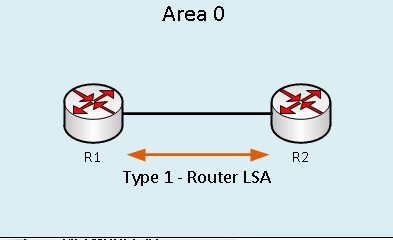


```bash
- LSA 2 - "Network LSA" -  Распространяется DR в сетях со множественным доступом. 
  В LSA содержится описание всех маршрутизаторов присоединенных к сети, включая DR. 
  Распространяются только внутри области. 
```

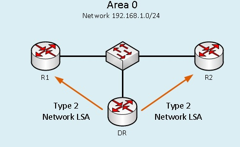

```bash
- LSA 3 - "Network Summary LSA" — генерируются с помощью пограничных маршрутизаторов ABR 
  и содержат суммарное сообщение о непосредственно подключенной к ним области 
  и сообщают информацию в другие зоны, к которым подключен ABR.
  Пакеты LSA Type 3 отправляются в несколько зон по всей сети.
```

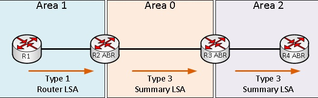


```bash
- LSA 4 "ASBR Summary LSA" - это LSA, которые объявляют присутствие автономного пограничного маршрутизатора 
  ASBR в других областях.
  Объявление распространяется пограничными маршрутизаторами. ASBR Summary LSA отличается от Network Summary LSA 
  тем, что распространяется информация не о сети, а о пограничном маршрутизаторе автономной системы.

  На схеме, когда R2 (ABR) принимает пакет LSA Type 1 от R1, он создаст пакет LSA Type 4 (Summary ASBR LSA),
  который передает маршрут ASBR, полученный из Area 1, и вводит его в Area 0. 
  Хотя пакеты LSA Type 4 используются ABR для объявления маршрута ASBR через их зоны, 
  он не будет использоваться самим ASBR в пределах его локальной зоны (Area 1); 
  ASBR использует LSA Type 1 для информирования своих соседей (в данном случае R2) в своих сетях.
```

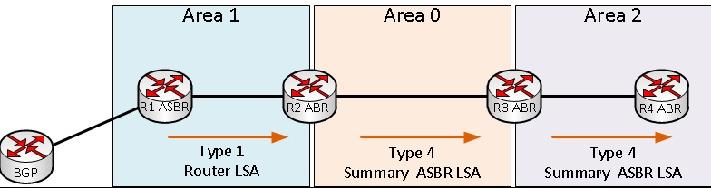

```bash
- LSA 5 - "AS External LSA" - генерируются ASBR для передачи внешних перераспределенных маршрутов 
  в автономную систему (AS) OSPF. Типичным примером LSA Type 5 будет внешний префикс 
  или маршрут по умолчанию (default router), как показано на схеме.
```

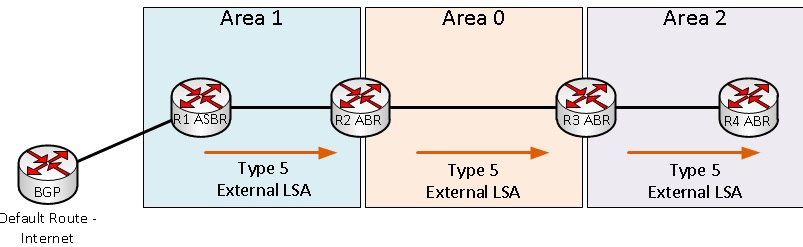

```bash
- LSA 6 - "Group Membership LSA" были разработаны для протокола Multicast OSPF (MOSPF), 
  который поддерживает многоадресную маршрутизацию через OSPF. 
  MOSPF не поддерживается Cisco и не пользуется широкой популярностью.
```

```bash
- LSA 7 - "AS External LSA for NSSA" — объявления о состоянии внешних каналов автономной системы в NSSA зоне 
 (в NSSA  блокируется распространение LSA Type 5). 
 Это объявление может передаваться только в NSSA зоне. 
 На границе зоны пограничный маршрутизатор преобразует type 7 LSA в type 5 LSA.
```

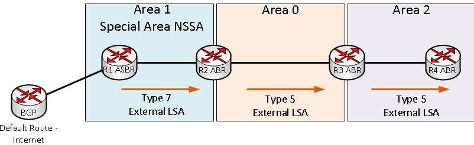

  На схеме ABR R2 переводит LSA Type 7 в LSA Type 5 и рассылает его в сеть OSPF.

```bash
- LSA 8 - в OSPFv2 (IPv4) называются внешними атрибутами LSA и используются 
  для передачи атрибутов BGP через сеть OSPF, в то время как адреса BGP передаются через LSA Type 5 пакеты, 
  однако, эта функция не поддерживается большинством маршрутизаторов. С OSPFv3 (IPv6), 
  LSA Type 8 переопределяется для передачи информации IPv6 через сеть OSPF.
- LSA 9 - Opaque MPLS TE - непрозрачные для OSPF анонсы, т.е. не участвуют в OSPF.
- LSA 10 - Opaque MPLS TE - непрозрачные для OSPF анонсы, т.е. не участвуют в OSPF.
- LSA 11 - Opaque MPLS TE - непрозрачные для OSPF анонсы, т.е. не участвуют в OSPF.
```

### Роли маршрутизаторов в сети OSPF
```bash
- DR - "Designated Router" - Выделенный маршрутизатор в броадкаст сетях, для информирование об изменений DRD, 
  а также общения со всеми маршрутизаторами области 
- BDR - "Backup Designated Router" - Резервный Выделенный маршрутизатор в броадкаст сетях, 
  для информирование об изменений DRD, а также общения со всеми маршрутизаторами области 
- IR - "Internal Router" - маршрутизатор, который всеми интерфейсами находится внутри одной области OSPF
- ABR - "Area Border Router" - маршрутизатор, у которого интерфейсы находятся в нескольких смежных областях, 
  в т.ч. и смежные с AREA 0
- ASBR - "AS Border Router" - маршрутизаторы, являющиеся шлюзами между протоколом OSPF 
  и любым другим протоколом динамической маршрутизации.
  Как правило таковыми на практике оказываются пограничные маршрутизаторы сети.
```

### Типы областей

Типы областей Stub, NSSA, TSA задаются в конфигурации вручную для того, чтобы не принимать/отдавать лишние LSA, т.о. уменьшения/оптимизации информацию в LSDB.

Пример для  оборудования cisco Stub area
```bash
router ospf 100
	network 192.168.14.0.0 0.0.0.255 area 0
	network 192.168.15.0.0 0.0.0.255 area 2
	area 2 stub
```
Описание типов областей.
```bash
- "Backbone Area (BA)" - основная область OSPF, которая по сути соедитняет между собой все осстальные области.
- "Standart Area" - обычная зона, которая принимает и отправляет обновления, суммарнеые и внешние маршруты.
- "Stub Area" - тупиковая зона - не принимает информацию о внешних маршрутах для автономной системы, 
  но принимает маршруты из других зон. Если маршрутизаторам из тупиковой зоны необходимо передавать информацию 
  за границу автономной системы, то они используют маршрут по умолчанию. 
  В тупиковой зоне не может находиться ASBR.
- "Totally Stub Area (TSA)" - полностью тупиковая зона - не принимает информацию о внешних маршрутах 
  для автономной системы и маршруты из других зон. 
  если маршрутизаторам необходимо передавать информацию за пределы зоны, то они используют маршрут по умолчанию
- "Not So Stub Area (NSSA)" - Работает по тем же принципам, что и Stub Area единственное отличие в том, 
  что в NSSA зоне может находиться ASBR. 
  Внешние маршруты других зон также заменены на маршрут по умолчанию. 
  Также определяется дополнительный тип LSA — LSA type 7. В NSSA зоне может находиться ASBR.
```

## Настройки/Таймеры/Способы фильтрации/Тюнинг 

### Таймеры протокола
```bash
- "HelloInterval" — Интервал времени в секундах, по истечении которого 
    маршрутизатор отправляет следующий hello-пакет с интерфейса.
    Для широковещательных сетей и сетей точка-точка значение по умолчанию, как правило, равно 10 секундам. 
    Для нешироковещательных сетей со множественным доступом значение по умолчанию — 30 секунд.
- "RouterDeadInterval" — Интервал времени в секундах, 
    по истечении которого сосед будет считаться "мертвым" (dead). 
    Этот интервал должен быть кратным значению HelloInterval. 
    Как правило, RouterDeadInterval равен 4 интервалам отправки hello-пакетов, то есть 40 секундам.
- "Wait Timer" — Интервал времени в секундах, по истечении которого маршрутизатор выберет DR в сети. 
    Его значение равно значению интервала RouterDeadInterval.
- "RxmtInterval" — Интервал времени в секундах, по истечении которого маршрутизатор повторно отправит пакет, 
    на который не получил подтверждения о получении (например, Database Description сообщение 
    или Link State Request сообщение). 
    Это интервал называется также Retransmit interval. Значение интервала — 5 секунд.
```


## Типы маршрутов OSPF в RIB

При настройке OSPF для работы с одной зоной, в таблице маршрутизации (команда show ip route) все маршруты обозначались буквой «O». При многозонных конфигурациях возможны следующие типы маршрутов:
```bash
- "O" – маршруты, посчитанные на этом маршрутизаторе используя полученные LSA типа 1 и LSA типа 2.
- "O IA" – это маршруты, переданные в зону из другой зоны маршрутизатором, 
   находящимся в роле ABR, но относящиеся тем не менее к OSPF домену.
- "O E1" и "O E2" – внешние по отношению ко всему домену OSPF маршруты. 
   Например, статический маршрут по умолчанию, редистрибутированный на ASBR будет отмечен как "O E2".
```

## Способы фильтрации в OSPF

### 1. Фильтрация между областями OSPF
Возможна только на маршрутизаторах границах области, таких как ABR и ASBR, это фильтрация LSA 3 (Network Summary LSA).
Фильтрация осуществляется с помощью префикс листов (prefix list)

Фильтрация LSA третьего типа говорит маршрутизатору не анонсировать сети из одной области в другую, тем самым закрывая доступ к сетям, которые не должны отображаться в других областях.

Для настройки фильтрации применяется команда 

**area area-num filter-list prefix prefix-list-name {in | out}**

в интерфейсе конфигурации OSPF. Как видно, здесь применяются списки префиксов или prefix-list, о которых мы говорили в предыдущей статье. Маршрут не анонсируется если попадает под действие deny в списке префиксов.

Камнем преткновения в данной команде являются ключевые слова in и out. Эти параметры определяют направление фильтрации в зависимости от номера области, указанного в команде area are-num filter. А работают они следующим образом:

```
Если прописано слово in, то маршрутизатор предотвращает попадание указанных сетей в область, 
номер которого указан в команде.

Если прописано слово out, то маршрутизатор фильтрует номера сетей, исходящих из области, 
номер которого указан в команде.
```

#### Пример фильтрации между областями OSPF:

```bash
Для примера рассмотрим два маршрутизатора (R1 и R5) из моей лабы:

R1 - это ABR маршрутизатор, находящийся в двух областях бекбон области (Area 0) 
     и смежной с ней областью Area 5
R5 - марпшрутизатор польностью находящийся в Area 5
```

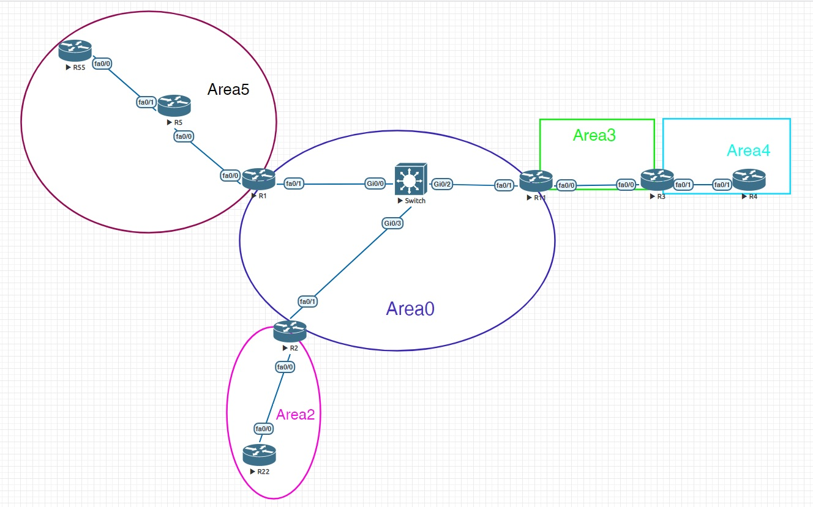


До фильтрации имеется наличие LSA type 3 в LSDB

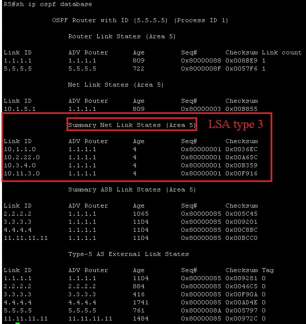


Таблица маршрутизации на R5 изначально выглядит следующим образом:

```bash
"IA - OSPF inter area" - как раз обозначает маршруты переданные в LSA 3.
```

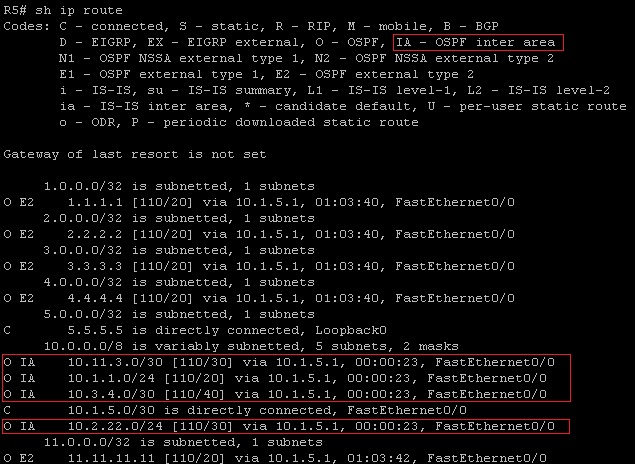

После применения фильтра (фильтровать все LSA 3) на ABR маршрутизатор R1
```bash
R1#

ip prefix-list FILTER-FOR-AREA-5 seq 5 deny 0.0.0.0/0 le 32
!
router ospf 1
 router-id 1.1.1.1
 log-adjacency-changes
 area 5 filter-list prefix FILTER-FOR-AREA-5 in
 redistribute connected subnets
 network 10.1.1.0 0.0.0.255 area 0
 network 10.1.5.0 0.0.0.255 area 5

```

После фильтрации в LSDB на R5 уже нет LSA type 3 

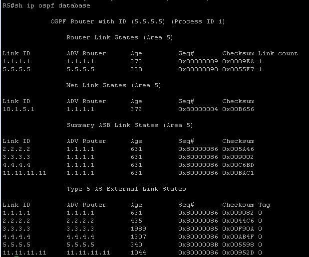

Таблица маршрутизации на R5 после фильтрации выглядит следующим образом:

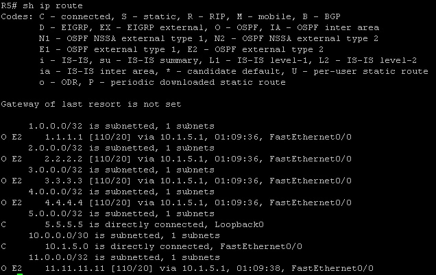


Фильтрация префиксов в LSA 3 не всегда эффективна и не всегда то что нужно, п.э. используются фильтры внутри области на конкретных маршрутизаторах.

Подробные примеры приведены [тут](https://wiki.merionet.ru/seti/28/filtraciya-marshrutov-v-ospf/)

### 2. Фильтрация внутри области OSPF

Применяется команда **distribute-list**.

Она просто не добавляет указанный маршрут в таблицу маршрутизации, но в базе OSPF LSDB маршрут до сети будет.

!!!warning "Важное замечание"
						При настройки distribute-list в OSPF нужно учесть следующие аспекты:
						Команда distribute-list требует указания параметров in | out, 
						но только при применении in фильтрация будет работать.
						Для фильтрации команда может использовать ACL, prefix-list или route-map.
						Можно также добавить параметр interface interface-type-number, 
						чтобы применить фильтрацию для конкретного интерфейса.


### Пример настройки distribute-list на оборудовании cisco

```bash
R5#
!
ip prefix-list FILTER-11.11.11.11 seq 5 deny 11.11.11.11/32
ip prefix-list FILTER-11.11.11.11 seq 10 permit 0.0.0.0/0 le 32
!
router ospf 1
 router-id 5.5.5.5
 log-adjacency-changes
 redistribute connected subnets
 network 10.1.5.0 0.0.0.255 area 5
 distribute-list prefix FILTER-11.11.11.11 in
```

#### До применения фильтра

Таблица RIB на R5 до применения фильтра

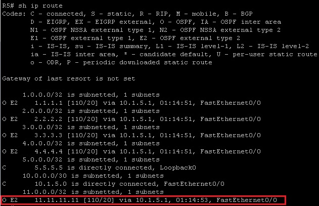


#### После применения фильтра

Таблица RIB на R5 после применения фильтра

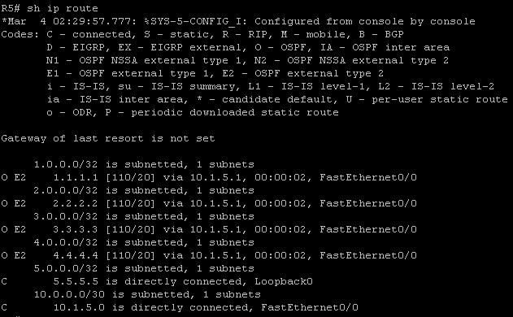


Таблица RIB OSPF на R5


OSPF LSDB

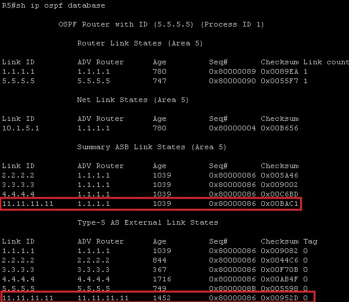

**Выводы:**
```bash
Как видно в LSDB и RIB OSPF информация о префиксе 11.11.11.11/32 присутствуют, 
но за счет применения фильтра в основной RIB информации о сети 11.11.11.11/32 нет.
```

## OSPF Loop prevention
 
  https://www.networkworld.com/article/2348778/my-favorite-interview-question.html
 
 Весьма неплохое объяснение общей концепции работы протокола 
 + объяснение каверзного вопроса, который очень любят задавать на собесе: 
 "Как в OSPF протоколе осуществляется защита от петель?"

Ответ на этот вопрос весьма прост, но для его ответа надо понимать фундаментальные моменты работы протокола:
Изначально внутри области каждый маршрутизатор знает полностью ее топологию и строит оптимальный граф по алгоритму Дейкстры (SPF),
в котором нет по определению петель. Весь вопрос в том, что при принятии маршрутов от соседних областей OSPF работает как дистантно-векторный протокол и тут гипотетически могут возникнуть петли... 
! Но вопрос решается именно архитектурным решением самого протокола OSPF: информация об областях не связанных напрямую передается только через "Backbone AREA", таким образом в самой "AREA 0" формируются лучшие маршруты до смежных с ней областей, без петель и именно эта информация и передается через ABR в каждую область, что предотвращает созданию петель в OSPF.


## Литература

- [1. XGURU OSPF](http://xgu.ru/wiki/OSPF)
- [2. СДСМ часть.6](https://linkmeup.ru/blog/1195/)
- [3. Википедия OSPF](https://ru.wikipedia.org/wiki/OSPF)
- [4. ВАЖНОЕ ПРО OSPF LSA](https://wiki.merionet.ru/seti/15/vazhnoe-pro-ospf-lsa/)
- [5. Руководство по проектированию OSPF](https://www.cisco.com/c/ru_ru/support/docs/ip/open-shortest-path-first-ospf/7039-1.html)
- [6. My Favorite Interview Question](https://www.networkworld.com/article/2348778/my-favorite-interview-question.html)
- [7. Inter-Area Loop Prevention in OSPF Petr Lapukhov 4xCCIE/CCDE](https://cdn2.hubspot.net/hubfs/3985396/Blog/Loop-Prevention-in-OSPF.pdf)
- [8. CHEAT SHEETS](https://drive.google.com/file/d/0B-5kZl7ixcSKcHNyR0czaVhxczA/edit?resourcekey=0-3LITQw_S6wSJIxcnrR6ZJg)
- [9. Конфигурирование и проверка работы продвинутых функций протокола OSPF](https://wiki.shibaev.info/index.php?title=%D0%9A%D0%BE%D0%BD%D1%84%D0%B8%D0%B3%D1%83%D1%80%D0%B8%D1%80%D0%BE%D0%B2%D0%B0%D0%BD%D0%B8%D0%B5_%D0%B8_%D0%BF%D1%80%D0%BE%D0%B2%D0%B5%D1%80%D0%BA%D0%B0_%D1%80%D0%B0%D0%B1%D0%BE%D1%82%D1%8B_%D0%BF%D1%80%D0%BE%D0%B4%D0%B2%D0%B8%D0%BD%D1%83%D1%82%D1%8B%D1%85_%D1%84%D1%83%D0%BD%D0%BA%D1%86%D0%B8%D0%B9_%D0%BF%D1%80%D0%BE%D1%82%D0%BE%D0%BA%D0%BE%D0%BB%D0%B0_OSPF)
- [10. Принципы работы OSPF для нескольких зон](http://ciscotips.ru/multiarea-ospf)
- [11. ФИЛЬТРАЦИЯ МАРШРУТОВ В OSPF](https://wiki.merionet.ru/seti/28/filtraciya-marshrutov-v-ospf/)
- [12. Алгоритм Дейксты](https://prog-cpp.ru/deikstra/)


Пример дампа в wireshark можно посмотреть [здесь](https://icebale.readthedocs.io/en/latest/networks/wireshark.collection/ospf.pcapng)

Пример дампа в wireshark в лабе R1 f0/0 можно посмотреть [здесь](https://icebale.readthedocs.io/en/latest/networks/wireshark.collection/ospf-laba-r1-int-f0-0.pcapng)

