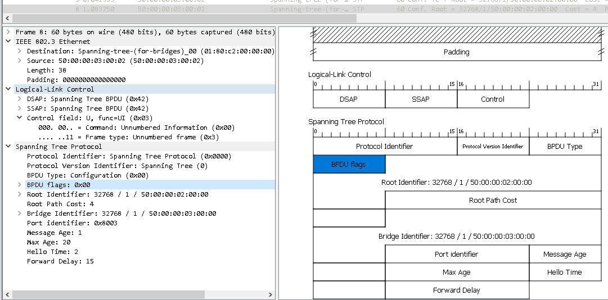
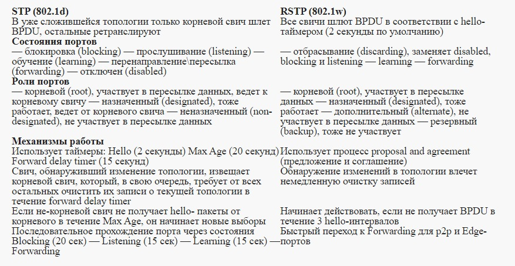

title: STP

# STP - Spining Tree Protocol
## Определение/Назначение
Протокол предназначен для защиты от петель L2 при подключение резервных/избыточных линков между коммутаторами. 

Descrambler:
```bash
Если в сети используется протокол STP или его собратья (RSTP,MSTP,PVST, PVST+), 
то это значит, что дизайн сети неправильный!
!!!И НУЖНО СРОЧНО МЕНЯТЬ ДИЗАЙН СЕТИ!!!

P.S. Прости Марат... Лаконичнее тебя тут в некоторых местах просто невозможно написать, 
     п.э. местами идет просто копипаст твоей статьи "СДСМ STP"... :)
```

## Общий принцип работы:
В основу работы протокола поставлен принцип построения древовидного графа с единым корнем.
Таким образом, строится топология, которая по определению не имеет петель.
Избыточные порты, которые не участвуют в топологии этого дерева, являются резервными и в случае 
выпадания какого либо порта из топологии дерево перестраивается и задействует резервные порты, 
для создание нового древовидного графа с единым корнем.

Коммутаторы обмениваются между собой BPDU (Bridge Protocol Data Units).
BPDU бывают 2х видов:
```
- Configuration BPDU - конфигурационные BPDU, которые передают информацию 
  о портах и ретранслируются остальными, 
  по итогу на основе этой информации принимается решение о выборе режима работы портов.
 
- TCN BPDU (Topology Change Notification BPDU) - BPDU, 
  которые информирую об изменении топологии STP.
```

Так как никаких отношений соседства устройства по STP между собой не устанавливают, то
они шлют BPDU каждые 2 секунды на мультикаст MAC адрес 01-80-c2-00-00-00, который прослушивают все коммутаторы со включенным STP.

Configuration BPDU содержат поля:
```
- Bridge ID - идентификатор отправителя
- Root Bridge ID - идентификатор корневого свича 
- Root Path Cost - стоимость маршрута до корневого свича
- Port ID - идентификатор порта, из которого отправлен данный пакет

```

Структура STP:



### Алгоритм работы протокола STP
Сначала выбирается так называемый корневой мост/свич (root bridge). Это устройство, которое STP считает точкой отсчета, центром сети; все дерево STP сходится к нему. Выбор базируется на таком понятии, как идентификатор свича (Bridge ID). 
**Bridge ID это число длиной 8 байт, которое состоит из Bridge Priority**
**(приоритет, от 0 до 65535, по умолчанию 32768 + номер vlan или инстанс MSTP, в зависимости от реализации протокола), и MAC-адреса устройства.**

В начале выборов каждый коммутатор считает себя корневым, о чем и заявляет всем остальным с помощью BPDU, в котором представляет свой идентификатор как ID корневого свича. При этом, если он получает BPDU с меньшим Bridge ID, он перестает хвастаться своим и покорно начинает анонсировать полученный Bridge ID в качестве корневого. В итоге, корневым оказывается тот свич, чей Bridge ID меньше всех.

!!!warning "Важный момент" 
			При дефолтовых настройках root bridge коммутатором становится коммутатор с самым маленьким MAC-адресом, а соответственно и самым старым коммутатором в сети.
			Соответственно при таком раскладе весь трафик между ветвями графа будет проходить через root bridge коммутатор, что будет вести как правило к потери производительности сети, с силу "древности" такого коммутатора.
			во избежании проблем является выставления приоритета в ручном виде. 


#### Роли портов
После того, как выбрался "root bridge"  каждый из остальных коммутаторов должен найти **один, и только один порт**, который будет вести к корневому, такой порт называется корневым портом **root port**. 
Чтобы понять, какой порт лучше использовать, каждый некорневой коммутатор определяет стоимость маршрута от каждого своего порта до корневого свича. Эта стоимость определяется суммой стоимостей всех линков, которые нужно пройти кадру, чтобы дойти до корневого свича. В свою очередь, стоимость линка определяется по его скорости (чем выше скорость, тем меньше стоимость). Процесс определения стоимости маршрута связан с полем BPDU “Root Path Cost” и происходит так:
```bash
- Корневой свич посылает BPDU с полем Root Path Cost, равным нулю
- Ближайший свич смотрит на скорость своего порта, куда BPDU пришел, и добавляет стоимость согласно таблице
  Скорость порта	Стоимость STP (802.1d)
  10 Mbps	100
  100 Mbps	19
  1 Gbps	4
  10 Gbps	2
- Далее этот второй коммутатор посылает этот BPDU нижестоящим коммутаторам, но уже с новым значением Root Path Cost, и далее по цепочке вниз
```
Далее выбираются назначенные (Designated) порты. Из каждого конкретного сегмента сети должен существовать только один путь по направлению к корневому коммутатору, иначе это петля. Designated (назначенным) портом выбирается тот, который имеет лучшую стоимость в данном сегменте. У корневого свича все порты — назначенные.
И вот уже после того, как выбраны корневые и назначенные порты, **оставшиеся блокируются**, таким образом разрывая петлю.

Соответственно роли портов могут быть:
```
- Root
- Designated
- Blocked
```

### Состояние портов

Существует 5 различных состояний:
```bash
 1. blocking (блокировка): блокированный порт не шлет ничего. Блокированный порт, тем не менее, 
                         слушает BPDU (чтобы быть в курсе событий, это позволяет ему, когда надо, 
                         разблокироваться и начать работать)
 2. listening (прослушивание): порт слушает и начинает сам отправлять BPDU, кадры с данными не отправляет.
 3. learning (обучение): порт слушает и отправляет BPDU, а также вносит изменения в CAM- таблицу, 
                        но данные не перенаправляет.
 4. forwarding (перенаправление\пересылка): порт и посылает\принимает BPDU, и с данными оперирует, 
                                          и участвует в поддержании таблицы mac-адресов. 
                                          То есть это обычное состояние рабочего порта.
 5. disabled (отключен): состояние administratively down, отключен командой shutdown. 
```

Чтобы ускорить выход порта клиента в рабочее состояние (4) минуя 1-3 применяют настройку на порту "portfast".
Соответственно, так делают только на портах, смотрящих в конечные хосты, а не в соседние коммутаторы конечно.

## Разновидности протокола

### PVST, PVST+ (Per-VLAN Spanning Tree)
Проприетарные протоколы cisco

STP довольно старый протокол, он создавался для работы в одном LAN-сегменте. 
А что делать, если мы хотим внедрить его в нашей сети, которая имеет несколько VLANов?
Стандарт 802.1Q, о котором мы упоминали в статье о коммутации, определяет, каким образом вланы передаются внутри транка. Кроме того, он определяет один процесс STP для всех вланов. BPDU по транкам передаются нетегированными (в native VLAN). Этот вариант STP известен как CST (Common Spanning Tree). Наличие только одного процесса для всех вланов очень облегчает работу по настройке и разгружает процессор свича, но, с другой стороны, CST имеет недостатки: избыточные линки между свичами блокируются во всех вланах, что не всегда приемлемо и не дает возможности использовать их для балансировки нагрузки.
Cisco имеет свой взгляд на STP, и свою проприетарную реализацию протокола — PVST (Per-VLAN Spanning Tree) — которая предназначена для работы в сети с несколькими VLAN. В PVST для каждого влана существует свой процесс STP, что позволяет независимую и гибкую настройку под потребности каждого влана, но самое главное, позволяет использовать балансировку нагрузки за счет того, что конкретный физический линк может быть заблокирован в одном влане, но работать в другом. Минусом этой реализации является, конечно, проприетарность: для функционирования PVST требуется проприетарный же ISL транк между свичами.
Также существует вторая версия этой реализации — PVST+, которая позволяет наладить связь между свичами с CST и PVST, и работает как с ISL- транком, так и с 802.1q. PVST+ это протокол по умолчанию на коммутаторах Cisco.


### RSTP (Rapid Spanning Tree Protocol)
Для ускорения работы STP придумали RSTP



В RSTP остались такие роли портов, как корневой и назначенный, а роль заблокированного разделили на две новых роли: Alternate и Backup. Alternate — это резервный корневой порт, а backup — резервный назначенный порт. Как раз в этой концепции резервных портов и кроется одна из причин быстрого переключения в случае отказа. Это меняет поведение системы в целом: вместо реактивной (которая начинает искать решение проблемы только после того, как она случилась) система становится проактивной, заранее просчитывающей “пути отхода” еще до появления проблемы. Смысл простой: для того, чтобы в случае отказа основного переключится на резервный линк, RSTP не нужно заново просчитывать топологию, он просто переключится на запасной, заранее просчитанный.

### MSTP (Multiple STP)
Идея протокола MSTP проста, что нет необходимости запускать свой процесс STP для каждого влана, а можно объединить группу вланов и привязать ее к определенному STP процессу. Таким образхом имеем экономию рессурсов, а также можно и управлять трафиком по полосам, объединяя и настраивая соответстввующим образом группы влан и выбирая разные root-bridge коммутаторы для STP.


## Литература

- [1. СДСМ STP](https://linkmeup.ru/blog/1192/)

Пример дампа rip в wireshark можно посмотреть [здесь](https://icebale.readthedocs.io/en/latest/networks/wireshark.collection/stp.pcapng)
