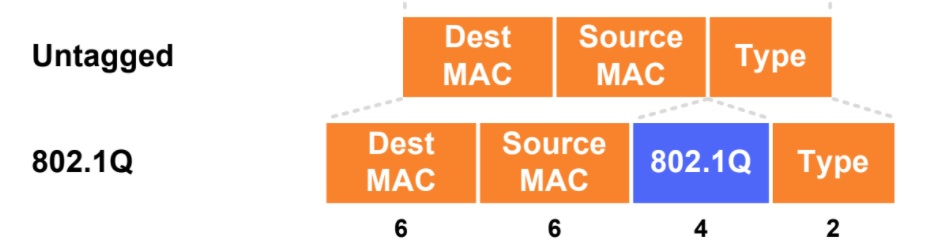

title: Frame Ethernet


# Анатомия кадра Ethernet

Попробую описать как это выглядет с указанием уровней OSI

## 7ми уровневая модель OSI


## Ethernet II
```bash
14 bytes = DMAC(6) + SMAC(6) + type(2)  - заголовок кадра  (L2)
+
20 bytes = ...+ SA + DA +... - заголовок пакета (L3)
+
Если у нас tcp,upd,icmp
20 bytes - заголовок сегмента (L4) 
+
payload - L4 - L7 
```

### L2
Заголовок кадра может быть увеличен за счет использования vlan



#### VLAN
Стандарт 802.1Q — добавляет 4 байта


### L3
20 bytes - заголовок пакета (L3)


	
### L4-L7
Payload
[xxxx] bytes - payload (L4-L7)


## Пример icmp протокола:
### Echo-Request


#### L2
```java
 type: 0x800 - IPv4
```


#### L3

```java
 protocol: 1 - ICMP
```


#### L4-L7
```java
Type: 8  - Echo ping (request)
Code: 0
```


### Echo-Reply


#### L2
```java
 type: 0x800 - IPv4
```


#### L3
```java
 protocol: 1 - ICMP
```


#### L4-L7
```java
Type: 0  - Echo ping (reply)
Code: 0
```


Пример icmp дампа в wireshark можно посмотреть [здесь](https://icebale.readthedocs.io/en/latest/networks/wireshark.collection/icmp-ping.pcapng)