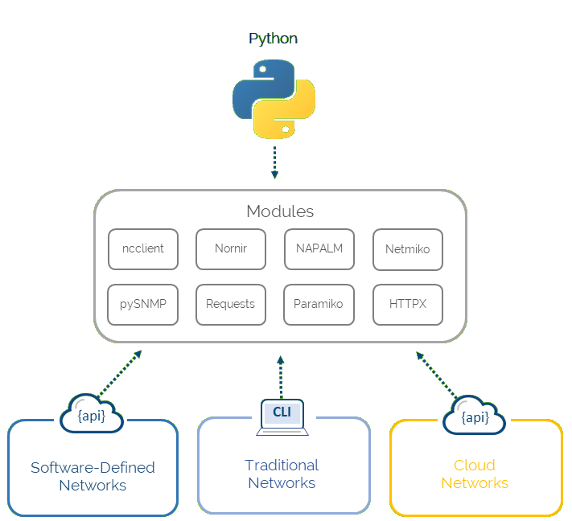

title: Network Automation
# Модель Автомаизации сети с помощью Python  



## Connection Managment:

```bash
	-Paramico
	-Netmico
	-Scrapli
```

## Templates:
```bash
	-Jinja2 
```

## Parsing:

```bash
	-TextFSM
	-NTC templates
	-PyATS & Genie
```

## Configuration:
```bash
	-NAPALM (python library)
	-Ansible (comprehensive automation framework)
	-Nornir (automation framework)
```